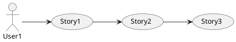
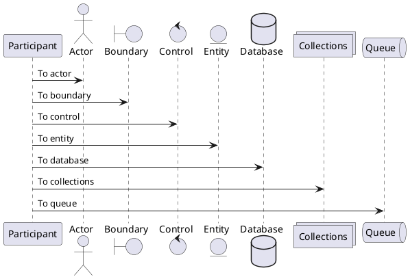
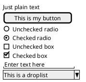
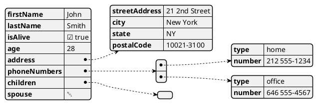

# Create a .NET PlantUML Markdown Render Extension 


It's been a while since I've posted some Markdown Monster content, so I thought I'd share a fun feature I recently added to my [Markdown Monster editor](https://markdownmonster.west-wind.com/). In the process I'll highlight a useful library and service that is [PlantUML](https://www.plantuml.com/), and how you can add  support for it in your own C# code, or use a custom **RenderExtension** in Markdown Monster or elsewhere to pre-process Markdown for PlantUML diagrams. Although this code discusses a Markdown Monster and custom blog implementation, the code I show is mostly generic and can be used easily with your own .NET code.

I arrived here, because a number of people requested preview rendering support for PlantUML in Markdown Monster. I previously hadn't heard much about PlantUML and so my initial reaction was not to since it's kind of niche. But I got several other requests in short order and so I took a look at how PlantUML integration would work. Turns out it's fairly easy to integrate with minimal external dependencies (unlike Mermaid or nomnoml) as it generates fully self-contained image output.


##AD##


## What is PlantUML
[PlantUML](https://www.PlantUML.com/) is a diagramming tool, and as the name suggests primarily produces [UML related diagrams](https://plantuml.com/) but there are a number of other useful diagrams types you can create as well, including visualizations for JSON, YAML, and RegEx and Deployment, Network, Gannt and MindMap charts. Similar to tools like Mermaid or nomnoml, but more focused and with an easier server based usage model, it allows for embedding of diagrams as `png` or `svg` images into your text.

The tool is server based, and it works by sending a markup expression that in return generates image content that can be embedded into an `` tag. There are no further dependencies or other libraries - just ready to use images that are embedded into HTML. 

All the work with PlantUML happens on the server that converts encoded PlantUML markup into an image. There's a public PlantUML server you can use,  or you can also run PlantUML on your own either as a Java Server application or via Docker image. Regardless of mode you're interacting with a very simple HTTP GET API that expects an encoded version of PlantUML markup.

Here's what some of the PlantUML diagrams look like:

> <small>*Note: markup sample text blocks have an extra space inserted before the ` ```plantuml` code directive for rendering purposes in the post. Remove the the space in your actual Markdown markup.*</small>

### Use Case




````markdown
 ```plantuml
@startuml
skinparam monochrome true
left to right direction
User1 --> (Story1)
(Story1) --> (Story2)
(Story2) --> (Story3)
@enduml
```
````
---

### Sequence Diagram



````markdown
 ```plantuml
@startuml
participant Participant as Foo
actor       Actor       as Foo1
boundary    Boundary    as Foo2
control     Control     as Foo3
entity      Entity      as Foo4
database    Database    as Foo5
collections Collections as Foo6
queue       Queue       as Foo7
Foo -> Foo1 : To actor 
Foo -> Foo2 : To boundary
Foo -> Foo3 : To control
Foo -> Foo4 : To entity
Foo -> Foo5 : To database
Foo -> Foo6 : To collections
Foo -> Foo7: To queue
@enduml```
````

---




````markdown
 ```plantuml
@startsalt
{
  Just plain text
  [This is my button]
  ()  Unchecked radio
  (X) Checked radio
  []  Unchecked box
  [X] Checked box
  "Enter text here   "
  ^This is a droplist^
}
@endsalt
```
````

----

### Classes

```plantuml
class Customer {
    + Name : string <<get>> <<set>>
    + Age : int <<get>> <<set>>
}
class ClassA {
    + ClassA(users:IList<User>)
}
class ClassB {
    + {static} DefaultUser : User <<get>>
    + Users : IList<User> <<get>>
    + ClassB(users:IList<User>)
}
class "IList`1"<T> {
}
ClassA --> "DefaultUser" User
ClassA --> "Users<User>" "IList`1"
```

````markdown
 ```plantuml
class Customer {
    + Name : string <<get>> <<set>>
    + Age : int <<get>> <<set>>
}
class ClassA {
    + ClassA(users:IList<User>)
}
class ClassB {
    + {static} DefaultUser : User <<get>>
    + Users : IList<User> <<get>>
    + ClassB(users:IList<User>)
}
class "IList`1"<T> {
}
ClassA --> "DefaultUser" User
ClassA --> "Users<User>" "IList<User>"
```
````

---

### Json




````markdown
 ```plantuml
@startjson
{
  "firstName": "John",
  "lastName": "Smith",
  "isAlive": true,
  "age": 28,
  "address": {
    "streetAddress": "21 2nd Street",
    "city": "New York",
    "state": "NY",
    "postalCode": "10021-3100"
  },
  "phoneNumbers": [
    {
      "type": "home",
      "number": "212 555-1234"
    },
    {
      "type": "office",
      "number": "646 555-4567"
    }
  ],
  "children": [],
  "spouse": null
}
@endjson
```
````
The output generated can be in various formats:

* png - Image
* svg - drawing
* txt - ASCII Art (yes!)
* uml - links to the interactive editor on the PlantUML site

Here's what a full Url looks like:

```text
http://www.plantuml.com/plantuml/png/<encodedPlantUmlMarkup>
```

## Markdown and Custom Extensions
My use case is specifically for using PlantUML inside of Markdown text and for live preview and output generation in Markdown Monster and in various Markdown rendering Web applications. As I show at the end of this post - I also need it to render this output on my blog, which currently uses a custom Markdown rendering scheme that doesn't have support for PlantUML, and I'll discuss how to add it there using a similar mechanism to what I'll use for Markdown Monster and which is more generic and something you can plug into your own applications.

### Markdown
Markdown is a basic markup language that takes text based markup and turns it into HTML. It has a decent set of markup features tailored to representing common HTML constructs typically used for document based HTML layout. Markdown's most common uses are for articles, blog posts, documentation etc. - basically anything that creates document centric output. Markdown is not a good fit for fancy HTML layout as it lacks native constructs for styling or even CSS classes. Markdown is all about text and content, that can be flowed into existing document templates.

Markdown works great for text scenarios, but even there... the set of features is fixed and somewhat limited. There are a number of non-standard Markdown extension formats that are widely recognized and have in a way created a new standard, like GitHub Flavored Markdown (GFM), custom code blocks with syntax highlighting, annotations, generic attributes, media embedding etc. which all are not part of the base Markdown 'standard', but are widely supported by most platforms.

### Markdown Customization
Customization beyond that however is often **specific to the platform or tooling**. So Mermaid charts and PlantUML diagrams tend to be selectively supported by various platforms so you have to think about where your Markdown will end up. For example, GitHub now supports Mermaid as of late 2022, but it doesn't support PlantUML. GitLab supports both. BitBucket supports Mermaid, but not PlantUML and so on. So even if a tool like Markdown Monster adds support for PlantUML in its previewer and output generation, if it doesn't work on GitHub where your Markdown eventually ends up, it's not terribly useful. If I want to publish to GitLab or my blog which now supports PlantUML, it's very useful.

> **In short: Know your Target Markdown Platform** and ensure it supports the features you are using before committing to adding features that might not work where you deploy your final Markdown to.

## Creating PlantUML output
The image Url is a sent to a live PlantUML service that creates images on the fly via HTTP GET requests that contain the PlantUML markup in an encoded and compressed format. The online server is surprisingly fast - fast enough in fact to use it in live previews in Markdown Monster where you can type in the PlantUML code, and immediately see changed output reflected (within Markdown Monster's typing delay) in the HTML preview. 

In Markdown Monster, I capture the PlantUML markup with the common Markdown code syntax using ` ```plantuml` as shown above, and then using a `MarkdownRenderExtension` that transforms any of these ` ```plantuml` code blocks into an image HTML element that replaces the code block at render time.

The embedded PlantUML image that replaces the ` ```plantuml` code block looks like this:

```html

```

The Url in this case points to the PlantUML server that's online, and processes requests very quickly but there are some usage limits in place. If you plan to do high volume of requests you might want to run a local server instead so you don't get blocked for excessive volume. The PlantUML server rate blocking limits are more than reasonable for casual use, but if you're using server generated code in a Web application for many users, you might need to look at hosting your own PlantUML server.

PlantUML is an open source Java server application, so you can run the server natively or using a provided Docker image in a container on your own hosted server. 

* [Getting Started with the PlantUML server](https://PlantUML.com/starting)

### Oddball Encoding
PlantUML works via plain HTTP GET Urls that return a binary PNG or SVG result. The only tricky part about this process is an unconventional Url encoding scheme plus deflate compression to produce the encoding token that is sent in the Url.

I found an existing C# version by [Jason Deabill (GitHub)](https://github.com/incongruousm) of this encoder that is covered in this [blog post](https://gist.github.com/incongruousm/509ef8820532883f9899b6e980ef6503) and available as a gist:

<script src="https://gist.github.com/incongruousm/509ef8820532883f9899b6e980ef6503.js"></script>

The code produces just the encoded token, and you then append the base Url to use for an `` tag which again looks like this:

```html

```

## Markdown Monster and PlantUML
Over the last year or so several people have requested support for PlantUML and since it's pretty straight forward to get live rendering of a diagram using the PlantUML server, this is a nice feature that could be added to Markdown Monster with minimal effort.

There are other Markdown tools that also have support for PlantUML (including a VS Code addin), and Markdown Monster uses the same syntax using a custom 'code block' syntax that looks like this:

As mentioned the syntax for this looks like this, embedded into Markdown text:

````markdown
 ```plantuml
@startuml
skinparam monochrome true
left to right direction
User1 --> (Story1)
(Story1) --> (Story2)
(Story2) --> (Story3)
@enduml
```
````

In order to get this to work in Markdown Monster, it needs to:

* Check for the ` ```plantuml` code block
* Extract the PlantUML code block
* Encode the PlantUML code for the Url
* Create a fully qualified PlantUML Url
* Replace the code block with the image

Since this isn't a native Markdown feature, nor an add-in supported by the [MarkDig Markdown Parser](https://github.com/xoofx/markdig) that Markdown Monster uses, the easiest way to provide this functionality is to create a **MarkdownRenderExtension**.

### Markdown Monster MarkdownRenderExtensions
Markdown Monster has support for an `IMarkdownRenderExtension` interface that allows for the original Markdown or rendered HTML to be modified as it passes through the Markdown processing pipeline. You can pre-process the markdown before it is rendered, and post process the HTML after it's been rendered essentially replacing the input and output string, before the final rendered HTML is provided to the Previewer or for output generation to HTML or PDF. A Render Extension is implemented as a class that implements `IMarkdownRenderExtension` and that is then added to a RenderExtensions collection that is processed on every Markdown parsing request.

In the case of the PlantUML Render Extension the extension parses the inbound Markdown text, and replaces any ` ```plantuml` code blocks with the PlantUML `` HTML element.

### Creating a RenderExtension
MarkdownRenderExtensions generally are pretty simple text parsing affairs - they are meant to look either at the original Markdown pre-rendering or the rendered HTML post rendering, and extract some text and replace it with something else. It's a powerful, but simple tool to extend Markdown rendering process for custom formatting or content transformation, and the PlantUML extension is a perfect example of that as it transforms a PlantUML codeblock into an image. 

Markdown Monster ships with several internal render extensions for expanding FontAwesome icons, embedding Mermaid charts, embedding automatic Table of Contents and now for PlantUML diagram transformations. End users of the application can also create their own RenderExtensions by creating a Markdown Monster Addin and adding their own `IMarkdownRenderExtension` to `MarkdownRenderExtensionsManager.Current.RenderExtensions.Add(extension)`.

> It's important to understand that MarkdownRenderExtensions are Markdown Monster specific, so any feature implemented as a MarkdownRenderExtension is not guaranteed to work anywhere else but for MM's output rendering.
> 
> However, in the case of the PlantUML Render Extension, MM uses standard PlantUML Markdown syntax that is supported by various Git hosting platforms and tools, so while the render extension is not used by those platforms you get the same render output for PlantUML (as long as the Git hosting/rendering platform supports it). Notably GitHub **does not** support PlantUML directly, but GitLab does. Other tools that support PlantUML include VS Code and Notepad++ (via addins).

Since this addin ends up being a built-in Render Extension in Markdown Monster, I don't need to create a seperate addin (it's good to be king!), but I'll discuss briefly how to create a MM addin at the end. At this point I'll focus on the Render Extension code itself that showcases how to create the image URL and extract the markup.

The PlantUML `MarkdownRenderExtension` specifically uses a RegEx expression to find the ` ```plantuml` code blocks and replaces them with `` elements wrapped into a link that jumps to the PlantUML server to allow interactively editing the markup.

Here's the code:

```csharp
public class PlantUmlRenderExtension : IMarkdownRenderExtension
{
    private const string StartUmlString = "\n```plantuml";       
    private static readonly Regex plantUmlRegex = new Regex(@"(\n```plantuml[\S\s]).*?([\s\S]```)", RegexOptions.Singleline);
  
    public void BeforeMarkdownRendered(ModifyMarkdownArguments args)
    {
        if (string.IsNullOrEmpty(args.Markdown) ||
            !args.Markdown.Contains(StartUmlString))
            return;

        var markdown = args.Markdown;
        var matches = plantUmlRegex.Matches(markdown);
        foreach(var match in matches)
        {
            var origBlock = match?.ToString();
            var umlBlock = origBlock.TrimStart();
            if (umlBlock.StartsWith("```"))                
                umlBlock = umlBlock.Replace("```plantuml",string.Empty).Trim(' ', '`', '\n', '\r');

            var url = mmApp.Configuration.Markdown.PlantUmlServerUrl + PlantUmlTextEncoding.EncodeUrl(umlBlock);                                
            var html = $"";

            if (url.Contains("plantuml.com"))
            {
                var linkUrl = url.ReplaceMany(["/svg/", "/png/", "/txt/"], "/uml/");
                if (!string.IsNullOrEmpty(linkUrl))
                    html = $"<a href=\"{linkUrl}\" target=\"_blank\">{html}</a>";
            }

            markdown = markdown.Replace(origBlock, html);
        }
     
        args.Markdown = markdown;
    }

    public void AfterMarkdownRendered(ModifyHtmlAndHeadersArguments args)
    { }

    public void AfterDocumentRendered(ModifyHtmlArguments args)
    { }        
}
```
<small>**Listing 1** - extract PlantUML code blocks and replace with rendered diagram images </small>

This `MarkdownRenderExtension` implements on the `BeforeMarkdownRendered()` which receives the original Markdown text as input. The code walks through the Markdown and replaces the ` ```plantuml` code blocks with a raw HTML `` link. The image then gets rendered instead of the code block in the final output to produce the desired inline diagram.

##AD##

### Creating a Markdown Monster Addin for a MarkdownRenderExtension
Markdown Monster can be extended via Addins and if you want to create your own custom MarkdownRenderExtension in order to preview some custom markup, you can do so via a Markdown Monster addin.

* [Creating a Markdown Monster Addin](https://markdownmonster.west-wind.com/docs/_4ne0s0qoi.htm)
* [Creating a Markdown Monster Markdown Render Extension](https://markdownmonster.west-wind.com/docs/_5i30sba89.htm)

In summary creating an addin for .NET 8.0 involves:

```ps
dotnet new install MarkdownMonster.AddinProject.Template

# Create a folder for your project and change to it
md \projects\SampleAddin
cd \projects\SampleAddin

# Create the new Project - make sure the name ends in 'Addin'
dotnet new markdownmonsteraddin -n SampleAddin --company "West Wind Technologies"

# Build the project - should create a placeholder addin
dotnet build 
```

Once you've created the addin you can create a new RenderExtension class in the project:

```cs
public class SampleRenderExtension : IMarkdownRenderExtension
{
    // Inject markdown text into the bottom of the document
    public void BeforeMarkdownRendered(ModifyMarkdownArguments args)
    {
        // add some text at the end of the markdown
        args.Markdown += $"\n\n<small>generated by Sample Addin {DateTime.Now.ToString("d")}</small>\n\n";
    }

    // Add Headers for the `<head>` section of the template
    // and optionally modify the rendered Markdown HTML
    public void AfterMarkdownRendered(ModifyHtmlAndHeadersArguments args)
    {
    }

    // update the final HTML that involves HTML that is part of the template
    public void AfterDocumentRendered(ModifyHtmlArguments args)
    {
    }
}
```
<small>**Listing 2** - Creating a customer Render Extension in Markdown Monster</small>

To hook up this `SampleRenderExtension`, add it to the RenderExtensions collection in the Addin's `OnApplicationStart()` method:

```cs
public override async Task OnApplicationStart()
{
    // ... other generated stuff 
    
    MarkdownRenderExtensionsManager.Current.RenderExtensions.Add(new SampleRenderExtension());
}
```
<small>**Listing 3** - Adding a RenderExtension in a Markdown Monster Addin</small>

And that's all there's to it...

When the project builds, it's automatically built into the Addins folder so it should be locally usable, and you can [optionally publish the addin to the Addin repository](https://github.com/RickStrahl/MarkdownMonsterAddinsRegistry).

##AD##

## Final Thoughts: Implementing MarkdownRenderExtensions in Markdown for your own Applications
RenderExtension processing like this is easy to implement and it has many uses, but this is a **Markdown Monster specific feature**. Previewer and output generation works in MM, but - as I just realized, it didn't work on my Blog, which uses custom Markdown rendering and which **does not have support for PlantUML**. Ooops! :joy:

This is the point I highlighted earlier:

> Know where your Markdown ends up before committing to using a non-standard feature like PlantUML.

Since my blog is a custom implementation and uses custom Markdown rendering (using a the same engine as MM does, but without the MM specific extension model) I ended up implementing `IMarkdownRenderExtension` into my custom Markdown renderer. As it turns out that's relatively simple if you have a single point parsing implementation as I do (which incidentally is nearly the same as what I use in Markdown Monster and in `Westwind.AspNetCore.Markdown`).

I've added it now, and the reason you can see the expanded PlantUML diagrams from the top of the post rendered into the page is because of the new RenderExtension.

In case you want to do something similar in your own apps, here's the implementation and integration of `IMarkdownRenderExtension`:

```csharp
public interface IMarkdownRenderExtension
{
    void BeforeMarkdownRendered(ModifyMarkdownArguments args);

    void AfterMarkdownRendered(ModifyHtmlAndHeadersArguments args);

    void AfterDocumentRendered(ModifyHtmlArguments args);

}
// modify original Markdown text
public class ModifyMarkdownArguments
{
    public ModifyMarkdownArguments(string markdown = null, MarkdownDocument doc = null)
    {
        Markdown = markdown;
        MarkdownDocument = doc;
    }

    public string Markdown { get; set; }

    public MarkdownDocument MarkdownDocument { get; }
}

// modify rendered Html text
public class ModifyHtmlAndHeadersArguments
{
    public ModifyHtmlAndHeadersArguments(string html = null, string markdown = null, MarkdownDocument doc = null)
    {
        Html = html;
        Markdown = markdown;
        MarkdownDocument = doc;
    }

    public string Html { get; set; }

    public string Markdown { get; }

    public string HeadersToEmbed { get; set; }

    public MarkdownDocument MarkdownDocument { get; }
}

//  modify final rendered HTML (in template situations)
public class ModifyHtmlArguments
{
    public ModifyHtmlArguments(string html = null, string markdown = null, MarkdownDocument doc = null)
    {
        Html = html;
        Markdown = markdown;
        MarkdownDocument = doc;
    }

    public string Html { get; set; }

    public string Markdown { get; }

    public MarkdownDocument MarkdownDocument { get; }
}
```
<small>**Figure 2** - Implement your own RenderExtensions with pre and post Markdown render processing</small>

The arguments essentially pass in the `Markdown` or `Html` properties as string properties that can be modified and are then passed through the render pipeline.

I like to create an application wide `MarkdownRenderExtensionsManager` with a static `Current` property so i can globally access and add/remove/manage the applied Render Extensions for the application. 

```csharp
public class MarkdownRenderExtensionsManager
{
    
    /// <summary>
    /// Global application instance of the Extensions Manager
    /// </summary>
    public static MarkdownRenderExtensionsManager Current { get; }

    /// <summary>
    /// Active Render Extensions. You can add your own extensions on application startup
    /// </summary>
    public List<IMarkdownRenderExtension> RenderExtensions { get; set; } = new();

    static MarkdownRenderExtensionsManager()
    {
        Current = new MarkdownRenderExtensionsManager();
        
        // apply default extensions
        Current.RenderExtensions.Add( new PlantUmlRenderExtension() );
        Current.RenderExtensions.Add( new FontAwesomeIconsRenderExtension() );
    }
    
}    
```
<small>**Listing 3** - using a Singleton class via the `Current` prop to manage application wide Render Extension usage</small>

Next you need to hook the actual pre and post processing into your Markdown parsing pipeline. In my apps I use a Markdown Parser wrapper with a `Parse()` method where I can apply the `MarkdownRenderExtension` processing:

```csharp
public class MarkdownParserMarkdig : IMarkdownParser
{
    public static MarkdownPipeline Pipeline;

    public List<IRenderExtension> RenderExtensions { get; set;  } 

    public MarkdownParserMarkDig() 
    {
            if (Pipeline == null)
            {
                Pipeline = new MarkdownPipelineBuilder()
                //.UsePipeTables()
                //.UseAutoLinks()
                //.UseCitations()
                //.UseEmphasisExtras()
                //.UseDiagrams()
                .UseEmojiAndSmiley()                
                .UseAdvancedExtensions()
                .UseYamlFrontMatter()
                .Build();
            }

            RenderExtensions = new List<IRenderExtension>();
            RenderExtensions.Add(new PlantUmlRenderExtension());
    }
    
    public string Parse(string markdown)
    {
        if (string.IsNullOrEmpty(markdown))
            return string.Empty;
    
        // Markdown RenderExtension Handling
        foreach(var renderExtension in MarkdownRenderExtensionsManager.Current.RenderExtensions)
        {
            var args = new ModifyMarkdownArguments(markdown);
            renderExtension.BeforeMarkdownRendered(args);
            markdown = args.Markdown;
        }
    
        var html = Markdown.ToHtml(markdown, Pipeline);
        html = HtmlUtils.SanitizeHtml(html);
        html = ParseFontAwesomeIcons(html);
    
        // Rendered Html RenderExtension Handling
        foreach (var renderExtension in MarkdownRenderExtensionsManager.Current.RenderExtensions)
        {
            var args = new ModifyHtmlAndHeadersArguments(html, markdown);
            renderExtension.AfterMarkdownRendered(args);
            html = args.Html;
        }
    
        return html;
    }
```
<small>**Listing 4** - Hooking up custom Render Extension processing. Just add additional extensions as needed.</small>

My Markdown parser simply has a `Parse()` method which in this case calls into `Markdig.ToHtml()` to render the Markdown to HTML. The class wrapper is used to support multiple classes and also to configure MarkDig and which features of its pipeline you want to use when parsing.

With all of this in place I can now apply any Render Extension like the PlantUML version shown in **Listing 1**.

A bonus feature in the future might be to build a PlantUML **MarkDig extension**. When I have some time I might look into that, but it's a bit more work than the simple `PlantUmlRenderExtension` mechanism shown here. Oh and I think I need to add MarkdownRenderExtension support to my existing Markdown libraries. But I leave that for another day :smile:

## Resources
* [Getting Started with the PlantUML server](https://PlantUML.com/starting)
* [Westwind.AspNetCore.Markdown]()

<div style="margin-top: 30px;font-size: 0.8em;
            border-top: 1px solid #eee;padding-top: 8px;">
    
    this post created and published with the 
    <a href="https://markdownmonster.west-wind.com" 
       target="top">Markdown Monster Editor</a> 
</div>