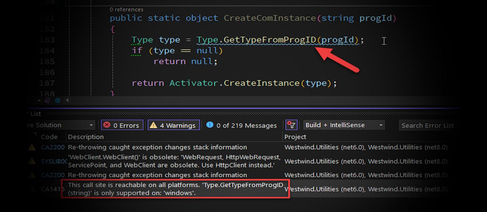
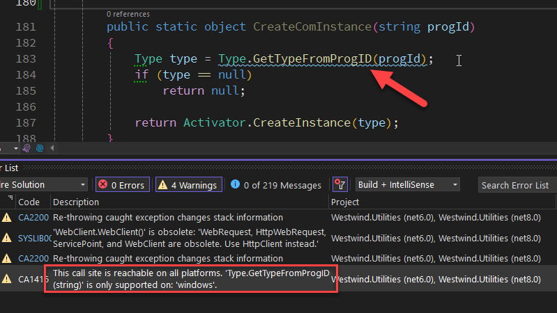
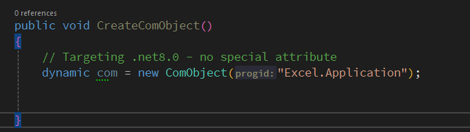
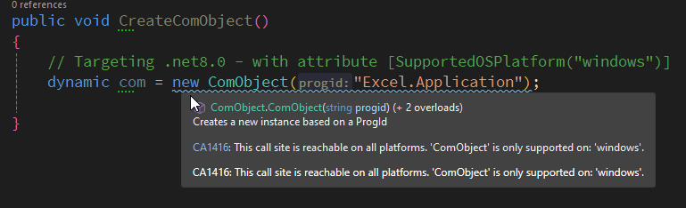
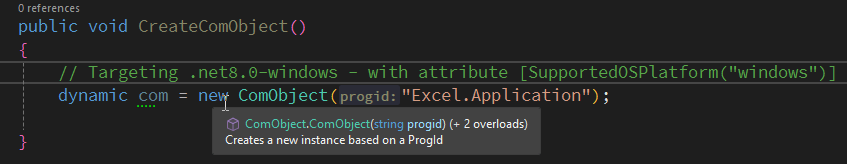

# Windows Specific Classes and Methods in CrossPlatform .NET



If you build libraries for .NET Core, you always have to take into account that they can be used cross-platform. If you're like me and have many older libraries scattered with a few methods and classes that are Windows specific from the Windows only times of .NET, you are probably finding out that the compiler warns you about using Windows specific functionality in newer versions of .NET Core, unless you're using the Windows specific runtime (ie. something like `net8.0-windows`).

If you use a non-platform-specific runtime you'll get an error message like this:



> ##### @icon-info-circle The C# Compiler gets more strict
> These messages are relatively new as the C# sharp compiler is  getting more vigilant about throwing up warnings about obsolete, insecure or platform specific code, that used to pass unflagged, but now is now tagged as a warning. I noticed a big uptick of warnings to obsolete code (like old Crypto providers, WebClient usage, or platform specific code for example) in .NET 7.0 and even more so in 8.0.

The message is a warning, and the code will continue to compile and run as it is. Of course, if you try to call `Type.GetTypeFromProgId()`, which is a Windows COM object related method, at runtime from another platform it will blow up with a `PlatformNotSupported` exception.

In most use cases this probably isn't a problem as it's unlikely you're going to be calling a function that requires Windows specific behavior from non-Windows environments, but this can still burn you if a component internally uses Windows specific features.

##AD##

There are a few ways you can try to make your own Windows specific code more visible and make it so it is flagged in a way that it's much harder to not accidentally use Windows specific code in other platforms and also... to avoid excessive compiler warnings.

## Ignoring Compiler Warnings
The first option is the least desirable as it doesn't really do anything more than sticking your head in the sand by ignoring the specific compiler warning:

```csharp
#pragma warning disable CA1416
            Type type = Type.GetTypeFromProgID(progId);
#pragma warning restore CA1416
```

and voila - no more error from that particular code. 

You can specify `#pragma` commands around any block of code from a single line to the entire code file. You can also ignore errors on the project level by including the error in the `<NoWarn>` list:

```xml
<PropertyGroup>
  ...
  <NoWarn>CA1416</NoWarn>
</PropertyGroup>
```

If you go this route I would recommend using the location specific version, so that you have an easy way to find these issues in the future, and perhaps address them so that they can work in a cross platform way.

This 'fix' of course only placates the compiler as the runtime issue remains, along with **no indication to the consumer of the library** to avoid calling this method on non-Windows platforms. If it gets used on non-Windows platforms, your app will blow up when the code is called.

## Specifying a Specific Platform with [SupportedOSPlatform]
Another option is to explicitly provide a `[SupportedOSPlatform]` attribute:

```csharp
[SupportedOSPlatform("windows")]
public static object CreateComInstance(string progId)
{
    Type type = Type.GetTypeFromProgID(progId);
    if (type == null)
        return null;

    return Activator.CreateInstance(type);
}
```

You can apply this at the method or class level.

One problem with this: It only works on .NET Core 6.0+ - it does not work for `net472` or `netstandard2.0` which are two other targets I frequently use. You don't really need it for `net472` (or other NETFX targets), but if you are multi-targeting your library you still run into the issue of the attribute not being available for that platform.

So in order to make this work when multi-targeting for lower platforms, you can use the following instead:

```csharp
#if NET6_0_OR_GREATER
[SupportedOSPlatform("windows")]
#endif
public class ComObject : DynamicObject, IDisposable
{
}
```

This works to let people know at compile time, that unless you're using the specific  platform-specific runtime, this code won't work.

What is a platform specific version of the runtime? Here's a Windows specific runtime declaration:

```csharp
<TargetFramework>net8.0-windows</TargetFramework>
```

which compiles that code above with no warnings because it is the platform we're asking for in the method. But if we compile for `net8.0-maccatalyst` you'd see a compiler warning.

The non-platform specific runtime version of course is:

```csharp
<TargetFramework>net8.0</TargetFramework>
```

which compiles with a warning because the compiler now doesn't know what runtime is targeted.

The attribute makes it so you **see the error only if you are compiling for a platform target that doesn't support the platform specified**, while with no attribute **always see a platform usage warning**.

> ##### @icon-warning Platform Specific Runtimes and General Purpose Libraries
> One thing to be aware of is that if you use a platform specific version of the runtime in a lower level library, it'll require that same platform specific version up the package/reference chain. For this reason, you generally want to avoid using a platform specific runtime in a general purpose library, even if it contains a few platform specific operations.  
>  
> This is precisely the scenario I'm working with in `Westwind.Utilities`, where I have a couple of Windows specific methods, but don't want to force the assembly to use the `-windows` specific runtime.

##AD##

**No Attributes - .NET 8.0 (ie. x-plat)** 



Note that you get no warning in the IDE - the assumption is this code will run. Not ideal...

**[SupportedOSPlatform] Attribute - .NET 8.0 (ie. x-plat)** 



Because we're using a platform agnostic runtime, you now get a compiler warning that lets you know there's a potential issue. The warning is definitely useful here.

**[SupportedOSPlatform] Attribute - net8.0-windows (ie. specific platform)** 



If targeting the Windows specific version then there's no error and no hint - as you would expect. 

This is the most likely use case for functionality like this in the first place.

**[SupportedOSPlatform] Attribute - net8.0-windows (ie. specific platform)** 


This gives essentially the same error as the non-specific runtime that doesn't match the specific platform. So if you use `net8.0-maccatalyst` this is what you would see.

## Separate Windows Specific Code into a separate Library
I came about all this because of the Windows specific code in my [Westwind.Utilities](https://github.com/RickStrahl/Westwind.Utilities) library. As of version 5.0 I (finally) separated **most** of the Windows specific libraries and stuck it into a separate package  `Westwind.Utilities.Windows`. 

Besides making it clearer what is supported for Windows only, this also removes a number of dependencies for the 'generic' version of the base library. For .NET Core a number of libraries are required in order to provide Windows specific features, Windows Auth, Registry access, COM Interop etc. By separating out these features, the base library footprint also shrinks a little which is always welcome.

But even with this separation, there are a few Windows specific functions left in the core library, like a couple of the old configuration APIs and some COM reflection based functions. 

For the configuration interfaces that use registry access they are marked with:

```cs
#if NETFRAMEWORK   // .NET Framework only
...
#endif
```

so they actually don't show up in .NET Core or .NET Standard. 

Note, there's no standard way to check for full framework but you can easily add  it in your project file like this:

```xml
<PropertyGroup Condition=" '$(TargetFramework)' == 'net462'">
   <DefineConstants>NETFRAMEWORK</DefineConstants>
</PropertyGroup>
```

The remainder use `[SupportedOSPlatform]` to warn off cross-platform use, but these tend to be functions that really only make sense on Windows (like COM object access in `ReflectionUtils`).

##AD##

## Which Approach?
to summarize there are a few choices:

* `#pragma` to ignore errors
* `[SupportOSPlatform]`
* `#if NETFRAMEWORK`
* Separate into separate library/assembly/package

The ideal solution is to separate into a separate library/package/assembly but that's simply not always possible, because you may have multiple dependencies going both ways that can preclude a simple lift and shift scenario. But if possible specific components like a COM interface or some registry based configuration code this is the best way to keep your libraries clean of Windows specific code.

Since that may not always be possible if you have code that's tightly integrated into the code in your main library, you can use `[SupportedOSPlatform]` for what remains. If you do this it's important to make the code that holds that attribute as small as possible to minimize side effects.

For legacy code the `#if NETFRAMEWORK` exclusion might be all you need to completely remove the Windows specific code from libraries that are used in non-Windows environments. Lots of stuff just doesn't make sense on newer .NET platforms so you can just cut it out completely and leave it in place for legacy applications that run on full framework, leave it for that and yank for the new stuff.

Ignoring platform warnings with `#pragma` directives is not a good idea, but it's often a quick fix that is facilitated by easy refactorings from VS and R#. It's highly convenient but recommended only as a quick fix.


<div style="margin-top: 30px;font-size: 0.8em;
            border-top: 1px solid #eee;padding-top: 8px;">
    
    this post created and published with the 
    <a href="https://markdownmonster.west-wind.com" 
       target="top">Markdown Monster Editor</a> 
</div>