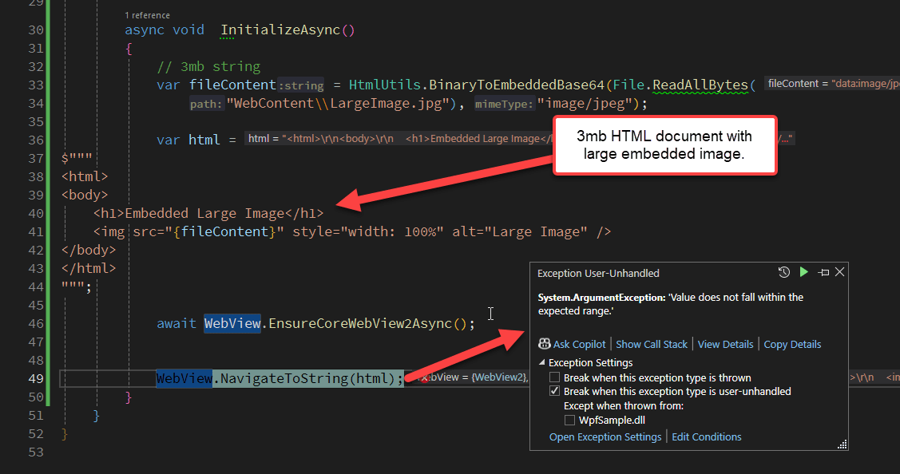

# Work around the WebView2 NavigateToString() 2mb Size Limit


The Microsoft WebView2 control has an issue with navigating to string content that exceeds 2 megabytes. 

This is a nasty, but [documented limitation of the WebView2.NavigateToString() method](https://learn.microsoft.com/en-us/dotnet/api/microsoft.web.webview2.core.corewebview2.navigatetostring?view=webview2-dotnet-1.0.2478.35). Nasty because if you use this API you're unlikely to look at the documentation to figure our there's a size limitation. Nasty too because, 2mb tends to be fairly large for plain HTML content, so likely you're not going to notice an issue right away. But if you create or generate pages self-contained pages that contain embedded resources (ie. `data:` sources) - as is often the case in Desktop Applications - it's quite easy to hit the 2mb limitation. 

This issue [comes up frequently](https://github.com/MicrosoftEdge/WebView2Feedback/issues/4251)  and it's been acknowledged by Microsoft as something that might... maybe... be changed in the future as this feels like a weird arbitrary limitation, especially in light of one of the workarounds I'll mention in this post.

What this means that you can't reliably use `NavigateToString()` if you are sending generic HTML documents that may vary in size or may contain embedded binary content like images or embedded objects like PDF files. With binary files encoded as base64 it's really easy to overrun 2mb of encoded string content in a hurry.

##AD##

## What does the Failure look like?
Here's an example that demonstrates the issue. The following code loads an HTML page that is dynamically generated as a string and then attempts to navigate it. The content contains a large (2mb+) embedded image:



It produces a non-helpful **Value does not fall in the expected range**  error, which **doesn't  give any indication** that we've hit the 2mb size limit of this functionality.
 
## Workarounds
Luckily there there are few workable workarounds:

* Copy to file and navigate to a file Url
* Assign content via injected JavaScript code

### Dump to File and Navigate to File Url
As a general rule the `WebView2` control works with Urls, so it's better to navigate to an actual Url - or file Url -  rather than to a string. This is the way the browser is supposed to work, so that's generally the preferred approach. `NavigateToString()` is more of a convenience feature, but one especially handy for many preview scenarios where content is generated on the fly.

Since file Urls work, it's pretty simple to dump the HTML content out to a temporary or reused file that can then be navigated:

```csharp
private void OpenFromStringFile_Click(object sender, RoutedEventArgs e)
{
    // data: url - 3mb string (from Westwind.Utilities)
    var fileContent = HtmlUtils.BinaryToEmbeddedBase64(File.ReadAllBytes(
        "WebContent\\LargeImage.jpg"), "image/jpeg");

    var html =
        $"""
         <html>
         <body>
             <h1>Embedded Large Image</h1>
             
         </body>
         </html>
         """;

    NavigateToStringFile(html);
}

void NavigateToStringFile(string html) 
{
    // Make sure the file goes to a WRITABLE location
    var file = Path.Combine(Path.GetTempPath(), "MyApp_RenderedHtml.html");
    File.WriteAllText(file, html);
    WebView.Source = new Uri(file);
}
```

Contrary to what you might think, file creation is very fast and testing the code, there is no significant  performance difference to loading even a large file from disk or loading it from a string either using `NavigateToString()` natively (on small enough files) or with the `ExecuteScript()` method described below. In fact the file based approach is slightly faster than either of those.

As a bonus, the file based approach doesn't require any async timing for WebView initialization or document load on startup as it relies on `Source` navigation that works regardless of whether the control is initialized yet or not.

> Even with `Source` navigation, I still recommend explicitly creating a custom `CoreWebViewEnvironment` with a dedicated environment folder for each application with explicit `InitializeAysnc()` functionality, to ensure you're using a private WebView environment that's not affected by global settings. Take a look at my [previous WebView posts](https://weblog.west-wind.com/posts/2021/Jan/14/Taking-the-new-Chromium-WebView2-Control-for-a-Spin-in-NET-Part-1#initializing-the-webbrowser) to see how that's done.

The main drawback of using a temporary file is: Having to manage the file. You need to make sure **the file is written in a location that's writable** - typically the **Temp** folder or perhaps a location in your application's `%appdata%` if you use one already. For example, in [Markdown Monster](https://markdownmonster.west-wind.com/) I have a `%appdata%\Markdown Monster\temp` folder that is used for various temporary output files including temporary render files for previews of various kinds.

You also should clean up the file at some point if you are writing to a system shared location.  For a single, re-used file you might want to check for and delete it when the application shuts down. For uniquely named files you might consider creating a folder for these files and then nuking the entire folder when the app shuts down.

##AD##


### Navigating to a String with Script Embedding
If you don't want to deal with files, there's another option that works with strings and uses browser scripting to assign the document content. You can do this by:

* Navigating to `about:blank` to clear the browser and get an empty document
* Injecting and replacing with a new document with `document.write()`

The `about:blank` navigation is important as it ensures that you have a document to replace. `about:blank` is an internal URL that also happens to render very quickly so that you don't need to wait for it to load - it's available just about immediately so there's no need to muck around with a `Content_Loaded` handler.

Here's what this looks like in code (in this case I'm using my WebViewHandler wrapper class with a new method where `WebBrowser` is the WebView instance):

```cs
/// <summary>
/// This navigates to a string of HTML content. Unlike the native function
/// this version supports large strings larger than 2000 bytes, but it
/// has overhead as it assigns via an interop command.
/// </summary>
/// <param name="html"></param>
/// <returns></returns>
public virtual async Task NavigateToString(string html)
{   
    WebView.Source = new Uri("about:blank");

    string encodedHtml = JsonConvert.SerializeObject(html);
    string script = "window.document.write(" + encodedHtml + ")";

    await WebView.EnsureCoreWebView2Async();  // make sure WebView is ready
    await WebView.ExecuteScriptAsync(script);         
}
```

This code works by using `ExecuteScriptAsync()` to replace the entire empty document with the new one. Note that we have to encode the document HTML into a JSON literal so that we can build an executable bit of code. This can end up being **a very large, single line of code** that is executed but it works!

`ExecuteScriptAsync()` requires that you have an initialized WebView and a loaded document. The call to `await WebView.EnsureCoreWebView2Async()` ensures that the control has been properly initialized and is ready to perform navigation operations. This function **does not** guarantee that the document is loaded, only that the WebView is initialized. However, because `about:blank` is very small and  an internal resource it loads extremely fast and is always loaded by the time the `ExecuteScriptAsync()` call is made. 

And voila - this works too effectively provide `NavigateToString()` functionality. Yay!

It's kind of surprising that Microsoft doesn't use something like this for its own `NavigateToString()` implementation which would essentially remove the 2mb limitation. And they could probably optimize the string transfer to avoid the JSON conversiona as well.

But alas, you can implement your own or even better create an extension method:

```csharp
namespace Microsoft.Web.WebView2.Wpf
{
    public static class WebView2Extensions
    {
        public static async Task NavigateToStringSafe(this WebView2 webView, string html)
        {
            webView.Source = new Uri("about:blank"); // force an empty document

            string encodedHtml = JsonConvert.SerializeObject(html);
            string script = "window.document.write(" + encodedHtml + ")";

            await webView.EnsureCoreWebView2Async();  // make sure WebView is ready
            await webView.ExecuteScriptAsync(script);
        }
    }
}
```

You can also find it as part of my [WebViewHandler class](https://github.com/RickStrahl/Westwind.WebView/blob/master/Westwind.WebView/Wpf/WebViewHandler.cs) in the [Westwind.WebView library](https://github.com/RickStrahl/Westwind.WebView) and NuGet package.

##AD##

## Summary
Both of these approaches work to navigate using an HTML string as input. The [Westwind.WebView.WebHandler](https://github.com/RickStrahl/Westwind.WebView/blob/master/Westwind.WebView/Wpf/WebViewHandler.cs) class in the [Westwind.WebView library](https://github.com/RickStrahl/Westwind.WebView/) includes `NavigateToString()` that uses the latter approach and so makes it universally available as long as you're using the WebView Handler.

## Resources
* [NavigateToString() documentation](https://learn.microsoft.com/en-us/dotnet/api/microsoft.web.webview2.core.corewebview2.navigatetostring)
* [Westwind.WebView Library](https://github.com/RickStrahl/Westwind.WebView)
* [WebView2.NavigateToStringSafe() in Westwind.WebView](https://github.com/RickStrahl/Westwind.WebView/blob/master/Westwind.WebView/Wpf/WebView2Extensions.cs)
* [Explicit WebView2 Control Initialization](https://weblog.west-wind.com/posts/2021/Jan/14/Taking-the-new-Chromium-WebView2-Control-for-a-Spin-in-NET-Part-1#initializing-the-webbrowser)

<div style="margin-top: 30px;font-size: 0.8em;
            border-top: 1px solid #eee;padding-top: 8px;">
    
    this post created and published with the 
    <a href="https://markdownmonster.west-wind.com" 
       target="top">Markdown Monster Editor</a> 
</div>