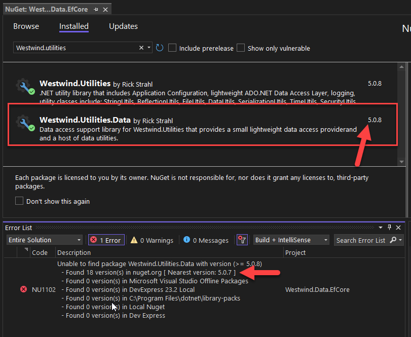
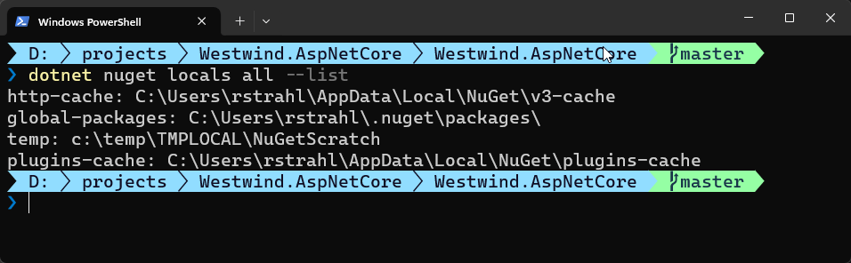

# Nuking Local NuGet Package Sources to show newly Published Packages


I've run into this scenario way too many times as a NuGet package creator:

* I update a NuGet Package
* I publish it to NuGet Package Store
* I wait a few minutes
* I open another project
* I try to update and compile with the new Package Version

Sometimes it seems it only takes a few minutes for packages to *'refresh'* and show up in the new project. But at other times - maddeningly - it seems to take **forever** to refresh the updated package, and no amount building or restoring fixes this issue in an obvious way.

## Scenario
Case in point - today I published an update to my Westwind.Utilities library, which consists of 3 separate packages. All 3 were published roughly at the same time for a new coordinated version update. I then opened another project that depends on these packages - about 10 minutes later.  2 of the packages loaded no problem, but one of them decided it wasn't going to work.

I got the notification email and Visual Studio even shows the updated package version in the Visual Studio UI, but when building I get this lovely error:

  
<small>**Figure 1** - NuGet Version mismatch: VS UI shows the updated version but the build still fails!</small>

At this point even `dotnet restore --force` doesn't work. Instead I ended up having to wait for the package to - magically - update in the package store **after 30+ minutes**. 

##AD##

## The `nuget locals` Command
I know there's a command to refresh the local NuGet cache, but I couldn't for the life of me remember what it was. Incidentally even with me posting nobody on X/Twitter responded with the command, as is often the case for simple answers. Someone usually knows.

So I was looking and of course by the time I managed to find it, it was too late - the package had refreshed. :angry:

The command to clear the caches is a NuGet command that also works through `dotnet nuget`, but it's not widely advertised and not easy to find unless you know what you're looking for in the first place. I certainly didn't remember to search for `locals` in the NuGet command (I looked for Refresh NuGet Sources variations none of which turned up this command).

The nuclear option to force all local NuGet package sources to reload is:

```ps
dotnet nuget locals all --clear
```

or using `nuget.exe` directly:

```ps
nuget locals -clear all
```

A more judicious approach that only nukes downloaded packages, not the framework ones should be sufficient:

```ps
dotnet nuget locals --clear http-cache
```

`--clear all` removes all local packages - including .NET Runtime packages, so this is literally the nuclear option and it can make subsequent builds **very** slow. Make sure you **don't do this if you have slow Internet connection**. 

`--clear http-cache` reloads all non-framework downloaded packages, and in most cases this is what's causing any problems you might run into. In most cases this option should be sufficient. If that fails go to `--clear all`.

There are couple of other combinations of local caches you can clear:

  
<small>**Figure 2** - Local Cached Package Stores you can clear </small>  

> Note that regardless of this command, NuGet takes at least **a few minutes** to publish a package to the feed. At minimum wait for the confirmation email that you get from NuGet after a few minutes after to confirm that your package has been published on the feed. 

## Summary
It's frustrating to run into this issue, especially since it is often inconsistent. But there's a drastic solution available in the .NET NuGet local all command, at least, if you have the bandwidth and speed to deal with the fallout of having to re-download all your packages.

I am leaving this here so that I can find it more easily in the future.


<div style="margin-top: 30px;font-size: 0.8em;
            border-top: 1px solid #eee;padding-top: 8px;">
    
    this post created and published with the 
    <a href="https://markdownmonster.west-wind.com" 
       target="top">Markdown Monster Editor</a> 
</div>