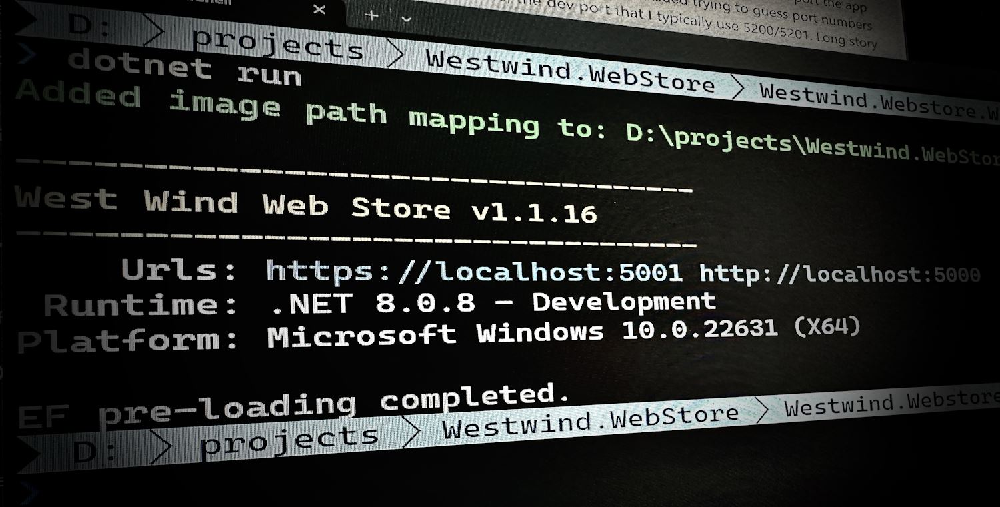
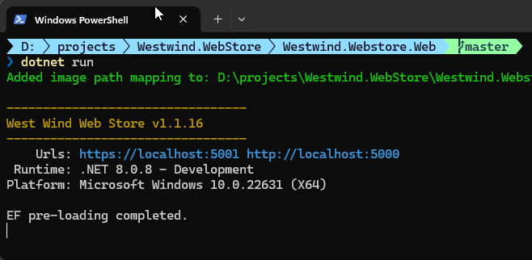
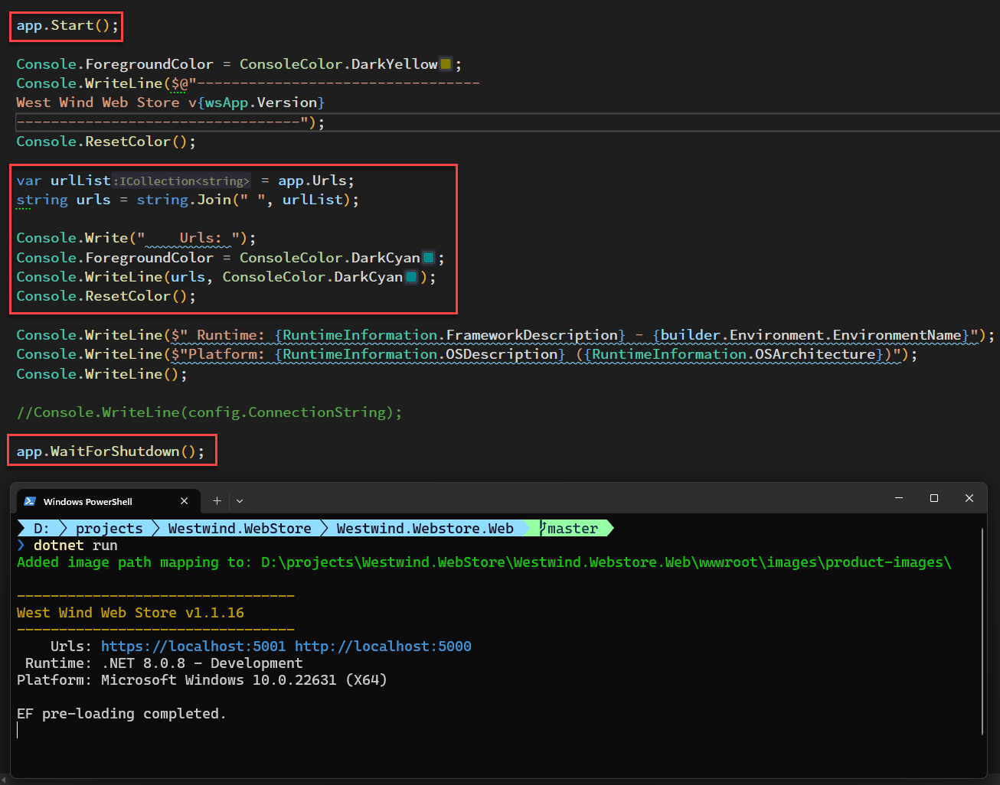
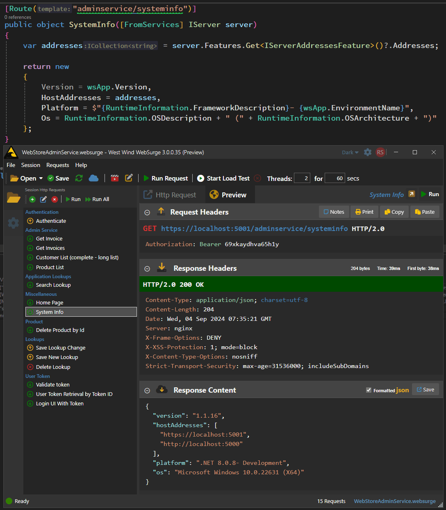
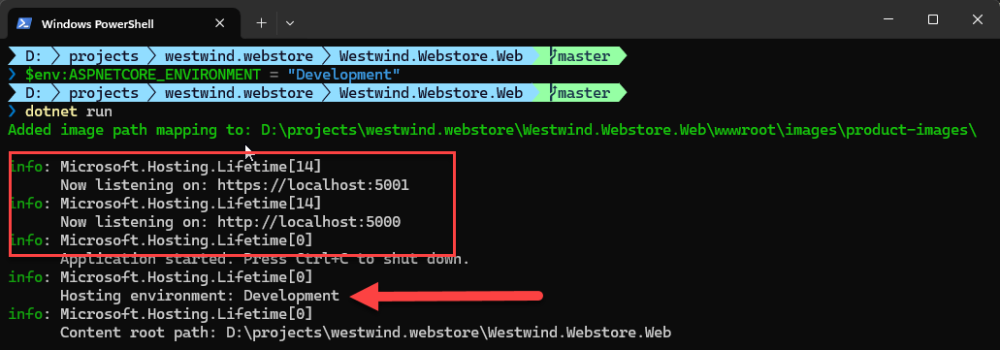

# Getting the ASP.NET Core Server Hosting Urls at Startup and in Requests



Today I was helping out a customer with their ASP.NET core application that wasn't starting up on a live server, hosted in IIS. Not uncommon in a first install, and when this happens I often resort to starting the app directly using Kestrel first, rather than trying to debug startup problems through the IIS system context and hunting down errors in the unwieldy event log.

To do this I can simply run the `.exe` file of the project (or `dotnet run` if the SDK is installed) and 90% of the time it's easy to track down issues this way especially if running in debug mode.

## Which Port am I Hosting?
But in this case there was a problem: We couldn't figure out which port the app was running on. 😄 A lot of hilarity (NOT!) ensued trying to guess port numbers - the default port of 5000, the dev port that I typically use 5200/5201 plus a few others. Long story short none of those ports worked.

...because... it turns out the developer had changed the default startup Url in code and so the server started a custom port that neither of us would have guessed - until we looked at the source code. 

##AD## 

Wouldn't it be nice if we could display that Url somewhere **reliably**? As it turns we can do that with some startup code, but it's not what I would call easily discoverable, and there are different ways that work at different times in the ASP.NET lifecycle.

Now, you can override the startup Urls via command line and environment options, but in this case even that didn't work because of the explicit override. But for most scenarios explicitly using `--urls "<urlList>"` or `--https_ports` works to override the Url.

> ##### @icon-info-circle Overiding Hosting Urls on Startup
> FWIW there are million ways to specify startup Urls, and I'm going to refer you to [Andrew Lock's in depth post that shows 8 ways to set the hosting Urls](https://andrewlock.net/8-ways-to-set-the-urls-for-an-aspnetcore-app/).


## Getting the Server Urls at Runtime is not Easy
Looking in the source code solved the problem, but that shouldn't be necessary and really what I want in all of my apps is a **reliable way that shows me the actual startup urls that are being used** and display them on startup as part of an application banner.

I'm a big fan of writing out some useful startup information that tells me the startup Urls, platform and environment at minimum. Something like this:

  
<small>**Figure 1** - Showing a startup banner that includes the startup hosting Urls </small>

Specifically I want to see those startup Urls and I want to see them consistently regardless of whether I'm running in dev with Launch Profiles or environment variables or whether the Urls were set in code. 

Besides providing valuable information on what port to use, it's also nice to have the Urls right there during development, because you can click on them to open the browser from the terminal, which is handy.

## Lots of ways, but use the Right Way!
So the task at hand is to get the Hosting Urls as part of the startup code in `program.cs` so that it can be written out as part of a start up banner as shown in **Figure 1**.

[I have actually written about this topic before](https://weblog.west-wind.com/posts/2021/Nov/09/Add-an-ASPNET-Runtime-Information-Startup-Banner) *(updated now)* and in that previous post I mentioned a different approach that works in most cases, but **didn't work in this case**:

```cs
// in program.cs -  DON'T USE THIS  
var urls = builder.WebHost
                  .GetSetting(WebHostDefaults.ServerUrlsKey)?
                  .Replace(";", " "); // make clickable
```

This code works only with **assigned Urls** from Launch Profile, explicitly assigned urls from the command line (--urls) or environment variables. **It does not work with the default url, or urls that are explicitly assigned in the WebBuilder startup.**  Because this solution returns the **assigned Urls** not the actual Urls, the values can be returned before the server starts running but after the Urls have been assigned.  But again - this only works if the Urls were explicitly assigned via configuration in some way, **so it's not a 100% reliable solution**.

To reliably retrieve the actually running Urls rather than the assigned values, you have to make sure the  app has started running. Once it's running `app.Urls` is set with a string collection that you can read and it reflects the actual Urls that have been assigned and are live.

So how do we do that? We have to make sure we access `app.Urls` after `app.Start()` has been fired:

  
<small>**Figure  2** - Capturing Hosting Addresses on Startup</small>

This code works in all situations, but it requires that you not use the conventional `app.Run()` command, but instead use explicit `app.Start()` and `app.WaitForShutdown()` to execute your server event loop. The code to retrieve the host Urls must then live somewhere between these two statements. Effectively you have to put the Url retrieval code towards the very end of your startup code after the server has been started.

Here's the code for the complete code for the startup banner in **Figure 2**:

```cs
// at the bottom of program.cs
// app.Run()    // can't use this

// use this instead
app.Start();

Console.ForegroundColor = ConsoleColor.DarkYellow;
Console.WriteLine($@"---------------------------------
West Wind Web Store v{wsApp.Version}
---------------------------------");
Console.ResetColor();

var urlList = app.Urls;
string urls = string.Join(" ", urlList);

Console.Write("    Urls: ");
Console.ForegroundColor = ConsoleColor.DarkCyan;
Console.WriteLine(urls, ConsoleColor.DarkCyan);
Console.ResetColor();

Console.WriteLine($" Runtime: {RuntimeInformation.FrameworkDescription} - {builder.Environment.EnvironmentName}");
Console.WriteLine($"Platform: {RuntimeInformation.OSDescription} ({RuntimeInformation.OSArchitecture})");
Console.WriteLine();

app.WaitForShutdown();
```

This appears to work for all scenarios and always returned the Urls regardless on how they were set. Yay!

##AD##

## Retrieving Host Urls in a Request
You can also retrieve the host urls inside of a request by requesting a `IServerAddressesFeature` from an `IServer` instance and then requesting the feature and the addresses:

```csharp

public object SystemInfo([FromServices] IServer server)
{
    var addresses = server.Features.Get<IServerAddressesFeature>()?.Addresses;   
    ...
}
```

which looks like this:

  
<small>**Figure 3** - Returning addresses as part of a request.</small>

You can grab `IServer` from dependency injection either via method (used here) or ctor injection.

For completeness sake, you can also use this same `IServer` approach in the Startup code: 

```cs
app.Start();

var server = app.Services.GetService(typeof(IServer)) as IServer;
var addrs = server.Features.Get<IServerAddressesFeature>()?.Addresses;

...

app.WaitForShutDown();
```

Like `app.Urls` this code also works only after `app.Start()` has fired, and given that `app.Urls` is simpler and gets you the same result, there's no good reason to use that code. Stick to `app.Urls` there.

## Addendum: ASP.NET Core Debug Information 
As [@Thomas pointed out](#4570637) in the comments, ASP.NET Core apps print out the hosting ports **if Information logging** is enabled. 

Assuming you are running the Development environment you can see the ports listed at startup:

  
<small>**Figure 4** - Debug log output displays hosting Urls, but requires special config you likely wouldn't use in production.</small>

You can switch environments via the command with:

```ps
$env:ASPNETCORE_ENVIRONMENT =  "Development"
dotnet run
```

Actually, the host port logging is triggered by the logging settings for `"Microsoft.Hosting.Lifetime" = "Information"` and you can also adjust those directly in the local `appsettings.json` without making other environment changes:

```json
{
  "Logging": {
    "LogLevel": {
      "Default": "Warning",
      "Microsoft": "Error",
      
      // this!!!
      "Microsoft.Hosting.Lifetime": "Information"      
    }
  }
  ...
}  
```    

Both of these work in a pinch if you're hunting for ports, but it's not a consistent solution as you're unlikely to run an application in `Development` or have `Information` logging enabled in a production app.

## Summary
While it's easy to set hosting Urls with many different ways to specify them, getting them back out at runtime is a little more tricky as there are specific rules that need to be followed. Specifically you can only reliably get the the hosting addresses **after the server has been started** and you have to use the magically undiscoverable references of `Iserver.Features` to extract the `IServerAddressesFeature` to retrieve the addresses at runtime. Well, once you know, you know, and now you know :smile:

## Resources

* [Andrew Lock: 8 ways to set the URLs for an ASP.NET Core app](https://andrewlock.net/8-ways-to-set-the-urls-for-an-aspnetcore-app/)
* [Back to Basics: Add an ASP.NET Runtime Information Startup Banner](https://weblog.west-wind.com/posts/2021/Nov/09/Add-an-ASPNET-Runtime-Information-Startup-Banner)


<div style="margin-top: 30px;font-size: 0.8em;
            border-top: 1px solid #eee;padding-top: 8px;">
    
    this post created and published with the 
    <a href="https://markdownmonster.west-wind.com" 
       target="top">Markdown Monster Editor</a> 
</div>