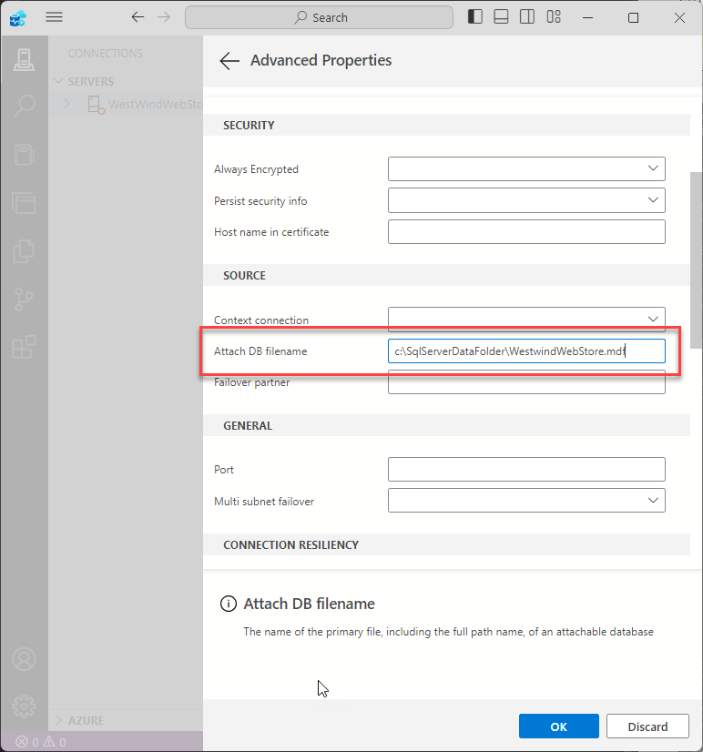

# Using SQL Server on Windows ARM


I recently picked up a Windows ARM device in the form of a [Samsung Galaxy Book 4](https://www.samsung.com/us/computing/galaxy-books/galaxy-book4-edge/buy/galaxy-book4-edge-14-qualcomm-snapdragon-x-elite-512gb-sapphire-blue-np940xma-kb1us/) with a SnapDragon X Elite chip. Best Buy had a sale going for $799 at the time, and so I 'snapped' one up. 

I've been wanting to get my hands on an ARM machine to check how some of my Windows applications run on an ARM device and how well these machines work as mainline Windows machine. While I didn't intend this to be my main machine, from testing and using it as a portable machine away from my big laptop, the verdict is in: Most things work very well without any changes.

##AD##

## Everything works - except SQL Server!
When I picked this machine up and started installing my typical developer and productivity workload on it, I was expecting a lot of stuff to not work or work badly through emulation.  

### Just about everything works!
I've been **pleasantly surprised in that just about everything works** - either via many native ARM applications that are now becoming available, or via the built in and *'not bad at all'* x64 emulation. I even was able to run some old legacy Visual Basic and FoxPro 32 bit applications without any hiccups.

Even more exciting is the fact that my own desktop .NET Applications run natively in ARM mode without any issues whatsoever. This is advertised by Microsoft, but it's still something else to see it actually running on live hardware without any issues!

### Some minor Problems
But there are a few things that don't work well - older versions of SnagIt for example don't want to capture windows correctly and my audio software was having problems keeping the external audio interface connected. Mostly edge cases, but be aware there are somethings - especially hardware or low level windows stuff - that can have problems. 

#### Networking Issues
Also there's something really funky going on with the network card or drivers - whenever this machine comes on the WiFi network it takes forever to connect and when it does it's very slow at first. While this is happening other network clients also are struggling to connect. The problem seems to be that DNS is not responding but all of my machines on the network are configured using the exact same setup. It's possible this has to do with syncing of some sort, but even after a week with this machine everything should be up to date and the network issues persist.

#### Performance - Good but not anything to get excited about
The one let down is that performance is not quite as impressive as ~~advertised~~ hyped. Microsoft and Qualquom have been promoting how well these machines perform, but I don't think this particular machine lives up to that hype.

The most noticable thing is that there's quite a bit of lag when launching applications. All sorts, but especially .NET applications. On my x64 laptop my .NET apps launch very fast (even largish WPF apps), but on the ARM machine it literrally takes several seconds just to get to the banner screen that gets thrown up before the app really starts running. Other apps including native apps and utilities too have similar lag.

My first thought was that perhaps this is related to Defender doing something funky and because this thing came with Windows Home there aren't a lot of options for disabling it. But this feels almost like there's some sort of runtime/processing engine starting up before the actual applications are running. 
Note **these are native ARM apps** and I would expect something like this for emulated apps, but not for native ones. 

Performance overall feels at best like a mid-level laptop, certainly not something that would replace a higher end developer I7/I9 laptop for me. Even AI operations which is what these machines were supposed to be best at are only marginally better for local AI processing compared to my I9 and low-midrange nVidia card equipped laptop do.

In summary - overall I think the machine's behavior and performance is better than I expected, but not anywhere ready as a replacement for high end laptop, both in terms of performance and compatibility.

But probably to be expected from a v1 type of release. I still think this is impressive and given the discounted pricing for this machine it seems like a pretty good value. At full price though - not so much. 

### .NET Applications - Just Run Natively!
As mentioned what is quite impressive is that all of my .NET apps, - including a several complex Windows Desktop applications - ran without even recompiling, natively under ARM64. [Markdown Monster](https://markdownmonster.west-wind.com/) and [West Wind WebSurge](https://websurge.west-wind.com/) both run **without any changes** and I have yet to find any problems on ARM. All of my Web apps also 'just run natively'  under ARM64 and I have yet to see any errors or operational differences. That's impressive - especially for the desktop apps which use a ton of P/Invoke and native code in addition to raw .NET code. And it all... just... works!


### Full Versions of SQL Server won't install on ARM
But... there is one thing that did not work without a major headache: Getting SQL Server to run locally on the ARM machine. And yes, I need a local SQL Server instance because I want to take this machine with me to beach where I have no connectivity  in my time between sessions on the water. 😄

So... SQL Server it turns out, can't be installed as full version on an ARM device. The installer refuses to go forward past the initial install screens if you try to install SQL Server Express, Developer, Standard or Enterprise on the ARM device. 

Argh!

In the end there are solutions, but none of them were what I would call smooth sailing.

* ~~Running SQL Server Linux Docker Images~~
* [LocalDb v16](#what-works-localdb---v16-or-latest-version)
* [Using unsupported SQL Server Installer Hacks](#what-works-localdb---v16-or-latest-version)

### SQL Server on Docker - no luck for me
I also didn't have much luck with running a local Docker image of SQL Server for Linux. The Docker images Microsoft provides are for AMD64 architecture (ie. x64 based) and Docker would not start those images on this ARM device. Apparently this works on Macs, but not on Windows (go figure).

Microsoft has an [Azure SQL Edge](https://learn.microsoft.com/en-us/azure/azure-sql-edge/disconnected-deployment) image that uses the same version Microsoft is running on Azure which is a subset of the full SQL Server engine and that image supports arm64. However, while that version starts, I couldn't get this image to open TCP/IP ports correctly to connect to it - it always failed with various errors related to the port mapping of -p 1433:1433.

For me this **did not work** - I didn't get a running instance from this Docker image setup:

```powershell
docker run --cap-add SYS_PTRACE -e 'ACCEPT_EULA=1' -e 'MSSQL_SA_PASSWORD=superseekrit1' -p 1433:1433 --name azuresqledge -d mcr.microsoft.com/azure-sql-edge
```

No idea how to debug the TCP/IP port issue, so I gave up. I suspect the issue is the same as I found with LocalDb and the custom installers, which is that installation on ARM apparently doesn't work with TCP/IP. It probably would work using Named Pipe ports, but again I didn't want to spend time on how to get that configured.

*(if you have any ideas on making the SQL Server Docker Images works please leave comment)*

## What works: LocalDb - v16 (or latest version!)
After a lot of digging and some help from an X discussion I managed to get LocalDb to work locally. LocalDb is a minimal, non-service version of SQL Server that can be started from the Terminal. It also installs with Visual Studio if you install ASP.NET payloads. 

LocalDb is an x64 application, but apparently it **can run** on the ARM64 platform. However I still ran into a problem initially, due to an older version that wasn't compatible with my SQL2022 databases.

[@peymen34](https://x.com/peymanr34)'s suggestions are what got me over the hump by suggesting to ensure the latest version of LocalDb was installed.

<blockquote class="twitter-tweet" data-theme="dark"><p lang="en" dir="ltr">Did you try LocalDB 2022? v15.0 is 2019 right?</p>&mdash; Peyman (@peymanr34) <a href="https://twitter.com/peymanr34/status/1849320974925050029?ref_src=twsrc%5Etfw">October 24, 2024</a></blockquote> <script async src="https://platform.twitter.com/widgets.js" charset="utf-8"></script>

The solution for me was to [install the latest version of LocalDb ](https://learn.microsoft.com/en-us/sql/database-engine/configure-windows/sql-server-express-localdb?view=sql-server-ver16#installation-media) which currently is v16 and which supports up to SQL2022.

The process to get here is by no means easy. Microsoft has no direct documentation of this process, and a lot of information that is in Blogs and SO posts is outdated. Further, unintuitively TCP/IP connections do not work - the only thing that works is Named Pipes which adds further complications in requiring custom per startup port names.

### Setting up LocalDb
So here's what you need to do to make LocalDb work on an ARM machine:

* **Get the latest version of LocalDb**     
*(v16 for Sql2022 requires download, v15 for SQL2019 installs with Visual Studio)*
* **Start LocalDb Engine**
* **Figure out your Connection Info**
    * Connect with Named Pipes
    * Connect to an attached .mdf file

### Install latest LocalDb
If you installed Visual Studio, you'll have LocalDb v15 installed  which supports SQL Server 2019 or older. If your database file is newer (SQL2022 as I do) then **you need to install an updated version of LocalDb** from here:

* [SQL Server Express LocalDb](https://learn.microsoft.com/en-us/sql/database-engine/configure-windows/sql-server-express-localdb?view=sql-server-ver16#installation-media)  

Yeah, the naming is confusing as it looks like you're installing SQL Server Express. And yes, this is the SQL Server Express installer, but that installer also **includes the LocalDb installer** and so you go through most of the SQL Express setup - but without actually installing Express.

##AD##

What you want to do here is:

* **Download the installer**
* **Start the installer**
* **Choose **Custom****
* **Go through all the options as if installing SQL Server Express**
* **On the final Feature Selection Page**
   * **Uncheck all SQL Express Options**
   * **Check only LocalDb Option**


This ends up installing only LocalDb which is a relatively small installed compared to SQL Express.
    
### Start LocalDb Engine from Terminal
LocalDb is a manually started executable so you have to run it to start it up and capture the **Named Pipe Address** to connect to it.

> On ARM it looks like TCP/IP connections for SQL are not working and you have to use Named Pipes. You can capture the Named Pipe Address the server uses once the server has been started.

First check to see what instances are available:

```ps
# Show instances
SqlLocalDb info

# Display Info including version about specific instance
SqlLocalDb info "MsSqlLocalDb"
```

Make sure the version is what you want. v15 is SQL2019, v16 is SQL2022 and so on (if you're reading this a few years from now).

If for some reason after installing you don't have an instance with the latest version, you can add a new instance with a specific version number like this:

```ps
# Create instance with specific version
SqlLocalDb create "MsSqlLocalDb2022" 16.0.1000.6

# Display info
SqlLocalDb info "MsSqlLocalDb2022"
```

> #### @icon-info-circle Delete Instances to Reset LocalDb Version
> Since I mucked around with these instances so much, I ended up resetting by deleting all the LocalDb instances including the default instance, and then rebooted. After the reboot a default instance (`MsSqlLocalDb`) showed up with the last installed version (ie. v16) and so that's what I use now.
 
Assuming you have the right instance and version you can then start it with:

```powershell
SqlLocalDb start "MsSqlLocalDb"
```

Finally you need to capture the Named Pipe Address displayed by the output from running the `info` command on the instance:

```powershell
SqlLocalDb info "MsSqlLocalDb"
```

This time around the **Instance Pipe Name** will display and you can copy this value to your clipboard.

Here's what all of this looks like when executing in the Terminal:


Ok, the server's running.

##AD##

### Connecting to a Database
To connect to a database you'll need two things:

* The Named Pipe Server Connection address
* The file path to the `.mdf` file you want to open.

To test, I recommend you first connect in a Data Tool like Azure Data Studio, SSMS or DataGrip. I'm going to use Azure Data Studio here.

Start by pasting the Named Pipe Connection into the **Server** text box:


Also make sure you set the encrypt option to optional (`encrypt=false` on a connection string) since the latest SQL drivers default to `true` and will fail if the server is not using encryption.

Next, click on Advanced and add the file path in **Attach DB Filename**:



### LocalDb Connection String
If you want to do connect to the database in code you can do that with a connection string that looks like this:

```cs

var connStr = @"server=np:\\.\pipe\LOCALDB#270C6261\\tsql\query;" +
@"AttachDbFilename=c:\SqlServerDataFolder\WestwindWebStore.mdf;" +
"integrated security=true;encrypt=false";

var sql = new SqlDataAccess(connStr);
sql.OpenConnection().Dump();
sql.ErrorMessage.Dump();

var custs = sql.QueryList<Customer>("select LastName, Company from customers where entered > @0", DateTime.Now.AddDays(-14));
custs.Count.Dump();
```	

And that works! Yay!

> Note: If you manually start the server each time the Named Pipe connection string will change each time, so you will have to adjust your connection string each time.
>
> *LocalDb is supposed to autostart when you connect, but that only works if you're using  TCP/IP connection string (ie. `server=(LOCALDB)\MsSqlServerLocalDb`) which for me unfortunately did not work.*


## Unofficial SQL Server Express and Developer Installer Builds
There's another option that was mentioned to me on X and in the comments, which allows you to install SQL Server Express or Developer on an ARM machine. These are unofficial modifications of the standard SQL Server installers that bypass the explicit restrictions for installing on ARM.

You can find them here:

* [MSSQLEXPRESS-M1-Install](https://github.com/jimm98y/MSSQLEXPRESS-M1-Install)

This GitHub repository consists of a set of `.bat` files that you can run to install a particular version of SQL (SQL Express and Developer 2019 and 2022 at time of writing) or a packaged set of installer files that run the installer directly. 

You can use the `.bat` files if you want to customize the install (like the admin account used), otherwise use the `.msi` installer.

### Not smooth Sailing, but it worked in the End
I initially had issues with this installation, the first 2 times I installed the installer failed at the last steps. The SQL Service was installed but it would not start. Ironically when I was trying to uninstall the failed install (there isn't one!) the install completed properly and the SQL Server started properly as a service.

It also took me a bit to connect to the server with Windows Authentication. The server is set up with Administrator admin access when installed and I was not able to connect with my default Windows Home Administrator account.

> ##### @icon-warning Administrator Reqiurements
> I had to **explicitly Run As Administrator** in Azure Data Studio in order to be able to connect to the server and start configuration using the default install settings which uses Windows Authentication for server access.
> 
> This is new to me - assuming my account is an Administrator account I was always able to log on to SQL with explicit RunAs Administrator. But here it was required. If anybody can explain why the difference, please leave a comment. Other difference: Windows Home on the ARM vs. Pro on my other machines both using local accounts.

In summary it was a pain to use this but I'm glad that this works as now I can at least run with a standard configuration.

The one advantage of the full SQL Developer over LocalDB install is that the service is always running, can use a default instance (for consistency across machines) & Windows Auth, and it works with TCP/IP. 

That said the LocalDb install seems a bit less intrusive and leaner.

## Summary
If you think this is a lot of effort to get SQL Server to run on a Windows ARM device - you're not alone. Microsoft certainly should make this a lot easier with:

* Documentation on options for running SQL Server on Windows ARM
* Easy direct links to LocalDb Downloads plus docs
* Heck, Visual Studio installing LocalDb 2022 instead of LocalDb 2019 
* Full versions of SQL Server that can install and run under ARM (in emulation)

Clearly SQL Server **can run** on ARM in emulation, so there's no good reason but corporate politics to not make those installers work or have custom installers for ARM. If a tiny GitHub repo can do it, certainly Microsoft can.

It also doesn't help that Visual Studio installs an outdated version of LocalDb that doesn't support the latest version of SQL Server. It would have saved me a lot of wasted time to know that I needed a newer version of LocalDb to connect to a newer database. Heck I didn't even know offhand that you could update LocalDb. It took somebody poking me on X to point that out.

All of this is a pain in the ass to find, then figure it all out to get it to run. And even then it's not optimal in any way shape or form. But it does work and you can run a local instance of SQL Server and for development this setup is more than adequate.

Regardless of complexity and discovery overhead, I'm glad that this solution works, but it's hard to say that this a *simple solution* 😂

## Resources

* [SQL Server Express LocalDb Download](https://learn.microsoft.com/en-us/sql/database-engine/configure-windows/sql-server-express-localdb?view=sql-server-ver16#installation-media)  
* [Azure Sql Edge Docker Image](https://hub.docker.com/r/microsoft/azure-sql-edge)
* [Azure Data Studio](https://azure.microsoft.com/en-us/products/data-studio/)
* [MSSQLEXPRESS-M1-Install Github Repo (customized SQL Server installer for ARM)](https://github.com/jimm98y/MSSQLEXPRESS-M1-Install)