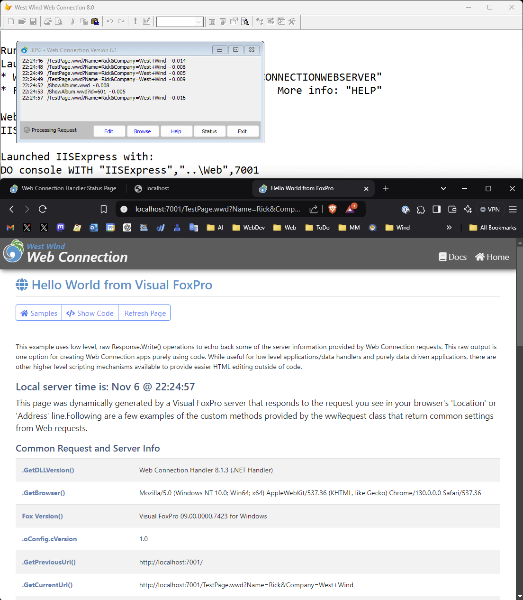

# FoxPro Running on a Windows ARM Device

I recently picked up a Windows ARM device in the form of a [Samsung Galaxy Book 4](https://www.samsung.com/us/computing/galaxy-books/galaxy-book4-edge/buy/galaxy-book4-edge-14-qualcomm-snapdragon-x-elite-512gb-sapphire-blue-np940xma-kb1us/) with a SnapDragon X Elite chip. Best Buy had a sale going for $799 at the time, and so I 'snapped' one up. 

I was pleasantly surprised that almost all of my Windows applications run without issues. This is true for both .NET and FoxPro applications as  far as my own apps are concerned, and just about anything else in my typical Windows application and tools collection.

## FoxPro and Web Connection
One of the things I was really curious about was whether FoxPro applications would work. After all FoxPro is a 32 bit application (ie. not x64) and it's based on 30 year old Windows code.

In fact, to test out FoxPro operation under ARM I tried the following from scratch:

* Install Visual FoxPro and SP2-HF3
* Copy over my Web Connection Dev folder from my main laptop

Then proceeded to  fire up FoxPro in my dev folder and ran:

```foxpro
Launch()
```

which in my setup launches the Web Connection .NET Core Web Server. 

To my delight, **everything fired right up and ran on the very first try** - without any changes whatsoever:


<small>*Full disclosure: I did already have the [.NET 8.0 SDK installed](https://dotnet.microsoft.com/en-us/download/dotnet/8.0) in order for the .NET Core server to run*</small>

The Web Connection FoxPro server runs fine under ARM in x64 emulation mode, but surprisingly performance is very good. Since this is a Windows Home machine full IIS  is not an option, but I was able to set up IIS Express on this machine and it too **just works** on the first try:



IIS Express runs in x64 emulation but that's also not a problem and performance seems to be on par with the .NET Core version. That performance of emulation is almost on par with the native .NET Core server's ARM binary is almost more impressive than the .NET server running without any changes at all.

Neither the native .NET Core server or the Web Connection Module under IIS Express feel laggy and request hits are in a the 5-10ms range which is a only little slower than what I see on my i9 development laptop (trending towards the higher end of the range on ARM vs. lower end on I9).

Earlier also fired up West Wind Html Help Builder, which is a FoxPro desktop application running with a FoxPro runtime installation and it also worked without any issues. That app does a lot of oddball things with FoxPro UI, ActiveX controls, the WebBrowser control and native Win32 calls. Yet it just runs without any issues. 

Pretty cool!

## Everything works - except SQL Server!
When I picked this machine up and started installing my typical developer and productivity workload on it, I was expecting a lot of stuff to not work or work badly through emulation.  It turns out I was wrong! Mostly!

### Just about everything works!
I've been pleasantly surprised in that just about everything works - either via many native ARM applications that are now becoming available, or via the built in and *'not bad at all'* x64 emulation. 

There are a few things that don't work well - older versions of SnagIt for example don't want to capture system windows correctly and my audio software was having problems keeping the external audio interface connected. Mostly edge cases, but be aware there are somethings - especially hardware or low level windows stuff - that can have problems. 

The one let down is that performance is not quite as impressive as was ~~advertised~~ hyped. It feels like there's quite a bit of lag, especially during application startup initially. Performance overall feels at best like a mid-level laptop, certainly not something that would replace a higher end developer I7/I9 laptop for me, which I had expected given the promotional hype. Even local AI operations using Ollama which is what these machines were supposed to be best at are only barely better for local AI processing compared to my I9 and low-midrange nVidia card equipped laptop do.

### .NET Applications - Just Run Natively!
What is quite impressive though is that all of my .NET apps, - including a several complex Windows Desktop applications - ran without even recompiling, natively under ARM64. [Markdown Monster](https://markdownmonster.west-wind.com/) and [West Wind WebSurge](https://websurge.west-wind.com/) both run **without any changes** and I have yet to find any problems on ARM. All of my Web apps also 'just run' under ARM64 and I have yet to see any errors or operational differences. That's impressive - especially for the desktop apps which use a ton of P/Invoke and native code in addition to raw .NET code. And it... just... works!

### The one thing that was problematic: SQL Server
The only real issue I ran into was SQL Server, which does not have an installer from Microsoft that works with Windows ARM.

There are two workarounds that [I discuss in a separate post on my main blog](https://weblog.west-wind.com/posts/2024/Oct/24/Using-Sql-Server-on-Windows-ARM):

* Using LocalDb with Named Pipes
* Using a hacked installer to install SQL Express or SQL Developer

If you need to work with a local copy of SQL Server [check out the post](https://weblog.west-wind.com/posts/2024/Oct/24/Using-Sql-Server-on-Windows-ARM) that goes into greater detail.

## Summary
So, the good news is ARM devices have a lot going for it. There are now many native ARM applications available - most mainstream applications have ARM specific versions or can run under ARM. Most .NET applications can automatically run natively on ARM if they are compiled for `AnyCPU` mode.

For those apps that don't have native support x64 Emulation is surprisingly good and fairly fast. Frankly I'm not sure that I can really tell the difference from emulation to native - emulated apps seem a little slow to start up, but once running the emulation seems as fast as I would expect for this machine's processing power (ie. a mid-level business laptop).

In summary ARM device compatibility is much better than I expected and performance is about on par what I thought it would be, but a bit below the expectations that were hyped up for ARM devices.

All of this is great news for FoxPro it extends the lifetime of FoxPro just a little longer yet... who would have thunk it?

<div style="margin-top: 30px;font-size: 0.8em;
            border-top: 1px solid #eee;padding-top: 8px;">
    
    this post created and published with the 
    <a href="https://markdownmonster.west-wind.com" 
       target="top">Markdown Monster Editor</a> 
</div>