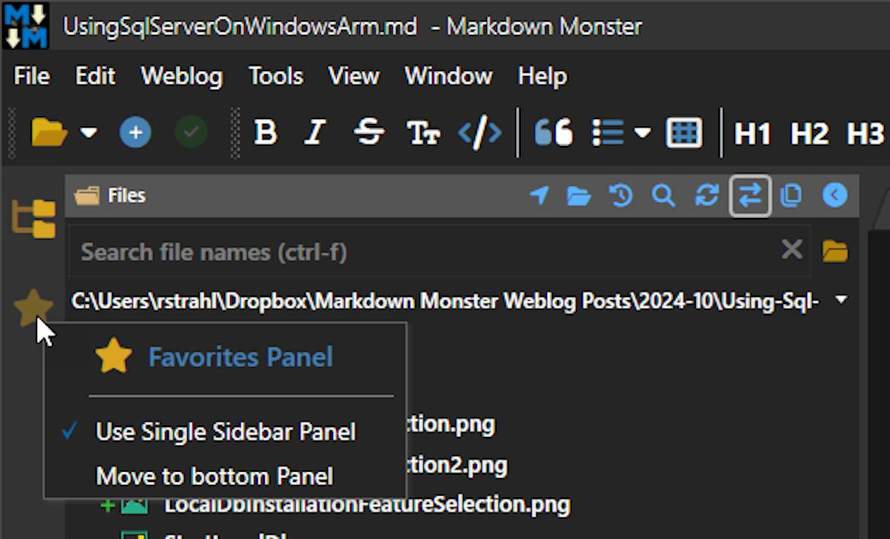

# Getting the Current TabItem when the Tab is not selected in WPF



This is a quick reminder to self on how to retrieve a TabItem from a WPF TabControl **when the tab is not currently selected** because I run into this quite frequently and the flail around trying to remember how to get non-selected items on any list control including tab controls.

## Hovered Tab vs Selected Tab
The issue is that WPF doesn't have a direct mechanism to retrieve a TabItem that the cursor is over if it's not actually selected. Hovering is not selecting and so `SelectedItem` and the 'Hovered Item' are two very different thing and WPF is adverse to the latter :smile:
WPF only lets you retrieve an item directly via the various `Selected...` properties like `SelectedItem`, `SelectedValue`, `SelectedIndex` etc. all of which only work off the item that is selected... which may be different from the item that the mouse is currently hovering over.

The most common scenarios for retrieving the hovered item are:

* Popping up a context menu
* Showing a Tooltip

Both of these are context sensitive operations and that's exactly why they need more than what the `Selected...` properties can provide.

Hovered selections are not that common, but when you need it you need it!

### An Example of Hovered Tabs
Here's an example that demonstrates this exact setup in [Markdown Monster](https://markdownmonster.west-wind.com/) for manipulating Sidebar panels on the (icon only) tab control on the left:

  
<small>**Figure 1** - A Sidebar of tabs, that allows selection of tabs that are not selected to show an appropriate context menu</small>

The icon tabs on the left can be accessed with the context menu even when the tab is not active. You can see that the right tab is selected as the context menu shows the tab name and icon along with the context options.  I've run into similar scenarios with context menus, and tooltips that need to pop up over non active icons - the idea of being able to select the tab 

## ContextMenu Opening Event Handling
Tab Controls are a pain in the ass in WPF because they have a very peculiar way of what is considered a tab. For some operations only the header is considered as a tab, but for others the entire tab including it's body/content size is considered.

So in the above scenario I need to capture the currently hovered tab. I started with just using the selected item:

```csharp
private void LeftSidebar_ContextMenuOpening(object sender, ContextMenuEventArgs e)
{
    var src = sender as TabControl
    var tab = src?.SelectedItem;
    
    if (tab == null) return;
}    
```

For many situations this is probably all that you need. If you are working only off selected tabs then this code works totally fine. 

In the case of my Sidebar example though the above would cause a problem: If I hover over the favorite tab when the Folder Browser is actually active, the context menu that pops up shows the Folder Browser as the context item - Not what I want.

### Fix it: OringalSource and Parent Hierarchy 
So, to find a non-active tab item is a bit less obvious. You can start by looking at the original source element that the context menu event is initiated from using `e.OriginalSource`. You then walk up the parent hierarchy to check if you have a `TabItem` (a `MetroTabItem` in my case) in the list of parents. 

Here's what this looks like:

```csharp
private async void LeftSidebar_ContextMenuOpening(object sender, ContextMenuEventArgs e)
{
    var src = e.OriginalSource as FrameworkElement;
    if (src == null) return;

    var tab = WindowUtilities.FindAncestor<MetroTabItem>(src);
    if (tab == null) return;

    // now pop up the menu with the TabItem as context
    var context = new LeftSidebarContextMenu(tab);
    await context.OpenContextMenu();
    e.Handled = true;
}
```

The key here is a small utility function `WindowUtilities.FindAncestor<T>()` which is used to walk up the control hierarchy to see if there's a matching control of the provided generic type - in this case a `MetroTabItem` (a TabItem subclass from [MahApps.Metro](https://mahapps.com/)). 

Here's what that method looks like:

```csharp
/// <summary>
/// Finds a type of element in the parent chain of an element
/// </summary>
/// <typeparam name="T">Type of Element to find</typeparam>
/// <param name="currentControl">control to start from</param>
/// <returns></returns>
public static T FindAncestor<T>(DependencyObject currentControl)
    where T : DependencyObject
{
    do
    {
        if (currentControl is T) return (T) currentControl;

        currentControl = VisualTreeHelper.GetParent(currentControl);
    } while (currentControl != null);

    return null;
}
```

`FindAncestor<T>` is quite useful for many similar operations - you can use a similar approach to find non-selected TreeView or ListView items for example. 

## Summary
It's a simple and pretty old trick, but it's one of those things that I at least always forget and curse when I need to get access to the actual item, and not the selected item. I'm always naively thinking there should be a native way on control to get this, but... no! 

 The trick of looking at the original source control and then walking up the tree, looking for specific types of controls is useful here for find the TabItem, but it's also useful for most other Items Controls. For me at least, this is not the thing that I reach for and so this post serves as a reminder and placeholder so I can quickly jog my memory in the future.
  If you found your way here via search, it probably saved you a few cycles as well...
 
<div style="margin-top: 30px;font-size: 0.8em;
            border-top: 1px solid #eee;padding-top: 8px;">
    
    this post created and published with the 
    <a href="https://markdownmonster.west-wind.com" 
       target="top">Markdown Monster Editor</a> 
</div>