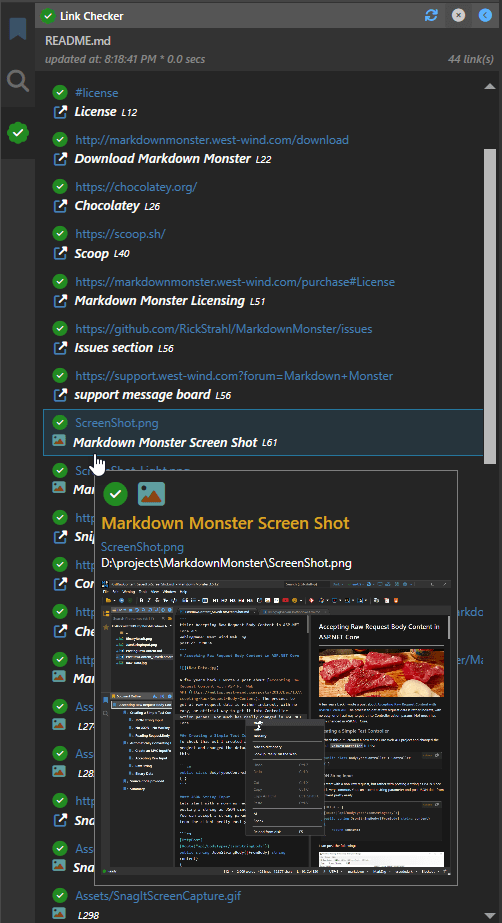
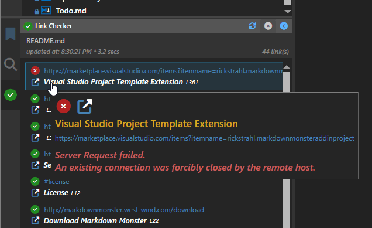

# Back to Basics: Using the Parallel Library to Massively Boost Loop Performance


A few days ago I posted a [quick note on X](https://x.com/RickStrahl/status/1870959837443657896) about a specific use case of using the Parallel library in .NET to **massively optimize a link look up operation** in Markdown Monster with very little code. That tweet turned out to be surprisingly popular, so I decided to do a follow up post to describe the specific scenario and talk about using the Parallel library to speed up loop operation.

<blockquote class="twitter-tweet" data-theme="dark"><p lang="en" dir="ltr">Always nice to get an easy win: Switching to a Parallel loop with literally a couple of lines of code and getting massive perf improvements.<br><br>Link checking one of my old blog posts with lots of links went from 20 seconds to 2.5 seconds. <a href="https://t.co/OSXqU2LaLx">pic.twitter.com/OSXqU2LaLx</a></p>&mdash; Rick Strahl (@RickStrahl) <a href="https://twitter.com/RickStrahl/status/1870959837443657896?ref_src=twsrc%5Etfw">December 22, 2024</a></blockquote> <script async src="https://platform.twitter.com/widgets.js" charset="utf-8"></script>

## Scenario: Link Checking Markdown Documents
The specific scenario I'm going to talk about is a Markdown link checker in my [Markdown Monster editor](https://markdownmonster.west-wind.com/) that collects all links in a Markdown document and then checks those links - both local and online - for validity. As you can imagine, larger documents can have a lot of links, so this link validation operation can be very time consuming and, using the original linear albeit `async` code,  it was in fact slow. However, after updating to using parallel code checking all links is drastically faster taking roughly the amount of time of the slowest link to process.

##AD##

Here's what the end result looks like with Parallelization:


You can see the link checks taking a few seconds here - prior to updating to parallel code the check was considerably slower. Link checking went from 25+ seconds for one of the pages with 52 links down to ~2.3 seconds - more than a 10x improvement! Talk about bang for your buck!

To make this even more enticing is that changing the code over from the original, linear `foreach()` processing to using `Parallel.ForeachAsync()` literally involved **changing two lines of code**, which netted this major performance improvement. The level of improvement obviously varies based on many factors including the number of links, how long they process and how long the longest request takes.

> ##### @icon-warning Choose Parellization Carefully!
> Note that **not every loop is a good candidate for parallelization** - you have to be very careful with state of the objects in the loop as each loop iteration winds up on a separate thread. Any state  that gets touched inside of the parallel loop should be treated as potentially thread unsafe. More on this later.

Because code is parallelized, it essentially takes roughly as long as the slowest request as all the http requests and local file lookups run simultaneously waiting for completion of them all. Well up to a point anyway as there are options to limit the level of parallelization set to 50 simultaneous operations.  More on that later.

FWIW, running many HTTP requests for me at least is a common scenario. Markdown Monster does this in a number of places - The Addin Manager for example, pulls detailed addin info from the Addin's GitHub site in the background while the list is being loaded and displayed in the Addin Manager.

## A very specific Example
So let's look at the code for the to get an idea of the before and after for linear and paralleized code.

The logic for this process involves multiple steps which is one of the reasons that the parallelization worked so easily.

* Parse out the links from the document (using [MarkDig's](https://github.com/xoofx/markdig) Document model)
* Loop through each link and check if it's valid
* Update each item's status properties 

The initial code did this sequentially. Even though the original code was checking links asynchronously for making the HTTP calls and reading file info, the code was still sequential, processing one link after the other.

I'll post only the relevant code here for this initial comparison and the full loop code afterwards to avoid confusing the implementation issue.

### for each Logic
Here's the original linear `foreach` code:

```csharp
public async Task ValidateLinks(List<LinkInfo> links, bool onlyChangedLinks = false, 
                                string docHtml = null)
{
    foreach(var link in links)
    {
        if (CancelLinkChecking)
            return;
            
        if (onlyChangedLinks &&  !link.HasLinkChanged && !link.IsLinkValid != null)
            continue;

        var url = link.Url;
        if (url.StartsWith("http://") || url.StartsWith("https://"))
        {
            var settings = new HttpClientRequestSettings
            {
                Url = url,
                HttpVerb = "HEAD",
                Timeout = 2000,
            };

            bool isSuccessStatus = false;
            using (var message = await HttpClientUtils.DownloadResponseMessageAsync(settings))
            {
                if(message != null)
                    isSuccessStatus = message.IsSuccessStatusCode;
            }
            
            link.isValid = isSuccessStatus;
            if (!link isValid)
                link.ErrorMessage = $"{(int)settings.ResponseStatusCode} {settings.ResponseStatusCode}";
        }
           
        // ... more code for # tags and files etc.
    }
}
```

The key pieces of this code are:

* A full list of links is passed in
* Loop runs through each link
* Does an async Http HEAD request (followed by GET if it fails (not shown here))
* `link` status is updated based on success or failure
* The list is then reloaded and re-bound to the UI

As mentioned although this code runs asynchronously it still runs requests one after the other because it can `await` each Http request, so it takes some time to chew through the entire list of links.

Here's what the result looks like:

Here's what the list looks like - note that it shows Http, local and also #hash link information:



Success status is shown via the success and fail icons and if an error occurs the error is displayed on the tooltip:



All the information on for each item comes from the `LinkInfo` instance that and the only pieces that are updated by the parallel code are `IsLinkValid` and `ErrorMessage`.

##AD##

### Parallel.ForEachAsync() Logic
Here's the same code using `Parallel.ForEachAsync()`. There are exactly 3 code changes from the original code - they are marked in the code:

```csharp
public async Task ValidateLinks(List<LinkInfo> links, bool onlyChangedLinks = false, 
                                string docHtml = null)
{
    // Changed
    await Parallel.ForEachAsync<LinkInfo>(links,
        new ParallelOptions {  MaxDegreeOfParallelism = 50 },                
        async (link, cancel) =>            
    {
        // changed
        if (CancelLinkChecking || 
            (onlyChangedLinks && !link.HasLinkChanged && !link.IsLinkValid != null) )
            return;

        var url = link.Url;
        if (url.StartsWith("http://") || url.StartsWith("https://"))
        {
            var settings = new HttpClientRequestSettings
            {
                Url = url,
                HttpVerb = "HEAD",
                Timeout = 2000,
            };
            link.IsLinkValid = null;

            bool isSuccessStatus = false;
            using (var message = await HttpClientUtils.DownloadResponseMessageAsync(settings))
            {
                if(message != null)
                    isSuccessStatus = message.IsSuccessStatusCode;
            }
            
            link.isValid = isSuccessStatus;
            if (!link isValid)
                link.ErrorMessage = $"{(int)settings.ResponseStatusCode} {settings.ResponseStatusCode}";
        } 
        
    }); // changed
}    
```


The key pieces of this code are:

* A full list of links is passed in
* Loop runs through each link but they run simultaneously
* Does an async Http HEAD request (followed by GET if it fails (not shown here))
* `link` status is updated based on success or failure

Using this code because the Http requests are executed simultaneously, the loop completes much faster as many Http requests are executed in parallel retrieving their data and updating each `link` instance.

Note that the list itself is never updated - only each individual item which is unique in the iteration is updated, so this code is ostensibly thread safe. This semi-immutable scenario is what made this transparent conversion from a linear `foreach`  to `Parallel.ForEachAsync()` possible without major code changes or any real worry about managing thread state.

### A few notes about Parallel Http Requests
As I mentioned Http requests are a common target of parallelization because Http requests are a relatively lengthy IO operation that lends itself well to background async operation. 

##AD##

#### Parellize, but not Too Much!
Parallizing is great for performance gain, but we also have to be aware that it can get out of hand if not kept in check, because  `Parallel`  operations by default have no limit on the level of parallelization. 

While I've had no problems on my desktop machine with over 100 links in documents, it's quite possible that some documents might have many hundreds of links to check. You wouldn't want to run 100's of simultaneous HTTP requests. .NET Core's `HttpClient` is actually capable and by default enabled to do this, but that's typically not what you want due to the resource and bandwidth usage that would incur. After a certain amount of open Http connections the benefit of more connections provides diminishing returns on better performance and only challenges resource and bandwidth usage on the host computer.

To address this problem, there are `ParallelOptions.MaxDegreeOfParallelism`. If you look at `Parallel.ForEachAsync()` code above you probably noticed this option is set to 50:

```csharp
await Parallel.ForEachAsync<LinkInfo>(links,
    new ParallelOptions {  MaxDegreeOfParallelism = 50 },                
    async (link, cancel) =>
```

This effectively throttles the number of simultaneous HTTP requests to 50... or so, because some requests may trigger a second request (more on that in the next section). Any additional iterations are queued and processed as active iterations complete processing.

If you don't know how big your list is going to be, it's always good idea to be explicit on how much parallelism you want to allow in order to avoid accidental runaway requests or processor usage. The default is -1 which allows unlimited parallel operations, which I'd argue is rarely a good idea.

#### HEAD Requests to check, GET Requests for Errors
My specific Http use case is to check an Http link for 'validity' meaning that it's not broken and returning a valid success status code. 

The most efficient way to get the server to return a minimal response is to request a `HEAD` request which as the name implies returns only the Http headers for a given request from the server. Requests typically still process on the server, but the result is not sent. Effectively it saves the server and client resources by not sending any response data. 

Most servers support `HEAD` requests and return the expected status headers, but as I was checking links, I found out that there are a surprising number of servers - especially from social media and developer sites from big vendor sites - that refuse to process `HEAD` requests. 

So, if `HEAD` requests fail with an error status code, I re-run the request with a  `GET` request and then update the link status based on the result of that. 

Although the code for this a is a little more verbose, it looks like the HEAD first, GET to re-check approach is much more efficient as it avoids sending actual response data. For most HTTP requests HEAD works, so it's a minority that requires the second GET retry.

> #### @icon-info-circle HttpClient Response Buffering 
> HttpClient and also TcpClient use internal response buffering so if you make a request that returns a response, the first buffer from the Response is pulled down even if you never actually read the Response stream. For HttpClient that buffer appears to be around 20kb, which is not insignificant.

The more complete HTTP processing code that includes the HEAD/GET logic looks like this:

```csharp
var url = link.Url;

if (url.StartsWith("http://") || url.StartsWith("https://"))
{
    var settings = new HttpClientRequestSettings
    {
        UserAgent = mmApp.Constants.WebBrowserUserAgent,
        Url = url,
        HttpVerb = "HEAD",
        Timeout = 2000,
    };
    link.IsLinkValid = null;

    bool isSuccessStatus = false;
    using (var message = await HttpClientUtils.DownloadResponseMessageAsync(settings))
    {
        if(message != null)
            isSuccessStatus = message.IsSuccessStatusCode;
    }

    // if HEAD fails try with GET
    if (settings.HasErrors || !isSuccessStatus)
    {
        settings = new HttpClientRequestSettings
        {
            UserAgent = mmApp.Constants.WebBrowserUserAgent,
            Url = url,
            HttpVerb = "GET",
            Timeout = 2000
        };
        
        // Westwind.Utilities.HttpClientUtils Http helper
        using (var message = await HttpClientUtils.DownloadResponseMessageAsync(settings))
        {
            isSuccessStatus = false;
            if (message != null)
                isSuccessStatus = message.IsSuccessStatusCode;
        }

        if (settings.HasErrors || !isSuccessStatus)
        {
            link.IsLinkValid = false;
            var status = string.Empty;
            if (!isSuccessStatus) // only set if the status code was actually set
            {
                status = $"{(int)settings.ResponseStatusCode} {settings.ResponseStatusCode}";
                if (settings.ResponseStatusCode == System.Net.HttpStatusCode.Unused)
                    status = "Server Request failed.";
            }
            string errorMessage = settings.ErrorMessage ;
            if (!string.IsNullOrEmpty(errorMessage))
                errorMessage = "\n" + errorMessage;
            link.ErrorMessage = $"{status}{errorMessage}";
        }
        else
            link.IsLinkValid = true;
        
    }
    else
        link.IsLinkValid = true;
```

The overall behavior of the code is the same, as the goal of the operation is to simply update the `link.IsLinkValid` and `link.ErrorMessage` properties as needed and then bind the list to the UI control in this case a WPF ListBox. The difference is that if the HEAD request fails the same request is retried as a GET and error information is collected and stored on `link` at this point.

## Parallel.ForEachAsync() or Task.WhenAll()
When I originally posted about this code several people asked why not use `Task.WhenAll()`? Functionally there are lots of similarities between these two, but to me `Parallel.ForEach` and `Parallel.ForEachAsync()` are easier to use and offer more control:

It's easier because you can just provide a delegate or Task with `Parallel` rather than having to build a list of Tasks and then wait for them to complete. 

```csharp
var li = new List<Task>();

Task task1 = Task.Run(() =>
{
   Task.Delay(1000).Wait(); // Simulate some work with delay
   Console.WriteLine("Task 1 complete");
});
li.Add(task1);

Task task2 = Task.Run(() =>
{
   Task.Delay(2000).Wait(); // Simulate some work with delay
   Console.WriteLine("Task 2 complete");
});
li.Add(task2);
Task task3 = Task.Run(() =>
{
   Task.Delay(1500).Wait(); // Simulate some work with delay
   Console.WriteLine("Task 3 complete");
});
li.Add(task3);

await Task.WhenAll(li);
```

You also can't control the level of parallelism as `Task.WhenAll()` will use the Task scheduler to determine how much code to run simultaneously although this method is much less likely to use too many resources as compared to unbound Parallel operations.

In the example above, Task.WhenAll() also wouldn't be quite as simple to convert to from a plain `foreach()` loop as you'd have to build the list of tasks.

Parallel is more convenient to use.


## Be careful: Parallel code has to be Thread Safe!
As should be obvious, parallel code can and usually runs on multiple threads simultaneously, so any code you write has to be very careful about what state it touches. Ideally you only want to change shared state on each item in the iteration that is passed in, as that guarantees that you're not updating code in unexpected ways that can run afoul of multi-thread access.

In my link checking code, without me planning it that way, that's exactly how it works:

* I first build the list by extracting Markdown Links from the document
* Then **update the list items** based on the link check result
* The list is then rebound to the UI in WPF

```csharp
// Retrieve the links from the Markdown document
var links = await LinkChecker.GetLinks(doc.CurrentText, noLinkCheck: true);

// Check to see if there are any links that have changed
if(force || LinkChecker.HasListChanged(links, oldLinks))
{                    
    // clear links in the Model Links list
    Links.Clear();
    
    if (LinkChecker.CancelLinkChecking)
        return;

    Loading = true;

    // Now go out and validate in parallel 
    // -- only updates the `links` collection items
    await LinkChecker.ValidateLinks(links, onlyChangedLinks: true);

    var list = links.OrderBy(link => link.SortOrder).ThenBy(links => links.Line).ToList();

    // add items back to the Model Links list (effectively rebinding the UI)
    foreach (var link in list)
        Links.Add(link);
}
```

IOW, the only shared state that is touched in this code are the individual list items which are passed into each iteration delegate. The only values that change in the parallel code are the status properties.

What you do not want do is update the list itself or try to access my application's WPF UI thread from within the parallel code as that would likely fail. 

So ideally you want to have your list provide all the state that needs to be updated so that only the items are updated. If necessary you can build special wrapper/container objects that provide additional data into the loop as long as those wrapper items are also thread safe.

Additionally this code also has logic to check for `HasListChanged()` to determine which links have already been checked, so editing or adding of links in the page can be done very quickly without having to re-check all the links. This is drastically faster yet to refresh the list while the user is typing while still getting an up to date link list!


## Complete code for the Parallel Iteration
The initial code I showed above is truncated a bit, to keep it somewhat focused. But for completeness sake here is the full List Validation method code:

```csharp
public async Task ValidateLinks(List<LinkInfo> links, bool onlyChangedLinks = false, 
                                string docHtml = null)
{
    if (string.IsNullOrEmpty(docHtml))
        docHtml = mmApp.Model.ActiveDocument?.RenderHtml();
    
    await Parallel.ForEachAsync<LinkInfo>(links,
        new ParallelOptions {  MaxDegreeOfParallelism = 50 },                
        async (link, cancel) =>            
    {
        if (CancelLinkChecking)
            return;
    
        if (onlyChangedLinks &&  !link.HasLinkChanged && !link.IsLinkValid != null)
            return;

        var url = link.Url;

        if (url.StartsWith("http://") || url.StartsWith("https://"))
        {
            var settings = new HttpClientRequestSettings
            {
                UserAgent = mmApp.Constants.WebBrowserUserAgent,
                Url = url,
                HttpVerb = "HEAD",
                Timeout = 2000,
            };
            link.IsLinkValid = null;

            bool isSuccessStatus = false;
            using (var message = await HttpClientUtils.DownloadResponseMessageAsync(settings))
            {
                if(message != null)
                    isSuccessStatus = message.IsSuccessStatusCode;
            }

            // if HEAD fails try with GET
            if (settings.HasErrors || !isSuccessStatus)
            {
                settings = new HttpClientRequestSettings
                {
                    UserAgent = mmApp.Constants.WebBrowserUserAgent,
                    Url = url,
                    HttpVerb = "GET",
                    Timeout = 2000
                };
                using (var message = await HttpClientUtils.DownloadResponseMessageAsync(settings))
                {
                    isSuccessStatus = false;
                    if (message != null)
                        isSuccessStatus = message.IsSuccessStatusCode;
                }

                if (settings.HasErrors || !isSuccessStatus)
                {
                    link.IsLinkValid = false;
                    var status = string.Empty;
                    if (!isSuccessStatus) // only set if the status code was actually set
                    {
                        status = $"{(int)settings.ResponseStatusCode} {settings.ResponseStatusCode}";
                        if (settings.ResponseStatusCode == System.Net.HttpStatusCode.Unused)
                            status = "Server Request failed.";
                    }
                    string errorMessage = settings.ErrorMessage ;
                    if (!string.IsNullOrEmpty(errorMessage))
                        errorMessage = "\n" + errorMessage;
                    link.ErrorMessage = $"{status}{errorMessage}";
                }
                else
                    link.IsLinkValid = true;
            }
            else
                link.IsLinkValid = true;

        }
        else if (url.StartsWith('#'))
        {
            link.IsLinkValid = docHtml.Contains("id=\"" + url?.TrimStart('#') + "\"");
        }
        else if (url.StartsWith("mailto:", StringComparison.OrdinalIgnoreCase) ||
                 url.Contains("ftp://", StringComparison.OrdinalIgnoreCase))
        {
            /* ignore */
        }
        // File Links
        else
        {
            link.IsLinkValid = false;
            try
            {
                string path = null;
                if (!string.IsNullOrEmpty(BasePath))
                {
                    var uri = new Uri(url, UriKind.RelativeOrAbsolute);
                    if (!uri.IsAbsoluteUri)
                        path = System.IO.Path.Combine(BasePath, url);
                    else
                        path = uri.LocalPath;
                }
                else
                    path = url;
                
                link.IsLinkValid = System.IO.File.Exists(path);
            }
            catch { /*ignore */ }
        }
    });
}
```
##AD##

## Summary
The Parallel library has been around for some time, but I think it's underappreciated for optimizing easpecially IO heavy operations like many Http requests. The library functions are relatively easy to use, although you have to be aware of potential multi-threading pitfalls. However, if you can manage your state updates well, and specifically only update items that are passed in, it offers a nearly seamless alternative to linear `foreach()` or `for()` loops that can be converted with just a few lines of code.

In Markdown Monster I have several other use cases that use Parallel. Some examples include the Addin Manager that pulls detailed Addin descriptions from their respective GitHub sites in the background, and the AI Image generator that run multiple AI requests for image generation at the same time. Each of these greatly benefit from Parallel operation and they work in a similar manner updating one specific 'data item' from a list iteration.

Nothing new, but for me at least it's good to be reminded to think of the Parallel library, or even `Task.WhenAll()` in more scenarios to optimize simultaneous IO operations.

## Resources
* [Parallel Class Documentation](https://learn.microsoft.com/en-us/dotnet/api/system.threading.tasks.parallel?view=net-9.0)
* [Task.WhenAll() Documentation](https://learn.microsoft.com/en-us/dotnet/api/system.threading.tasks.task.whenall?view=net-9.0)
* [Westwind.Utilities.HttpClientUtils Http Helper (Github)](https://github.com/RickStrahl/Westwind.Utilities/blob/master/Westwind.Utilities/Utilities/HttpClientUtils.cs)