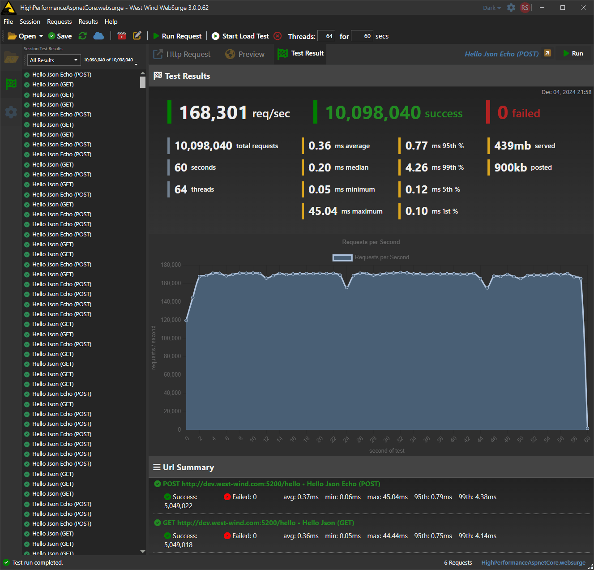
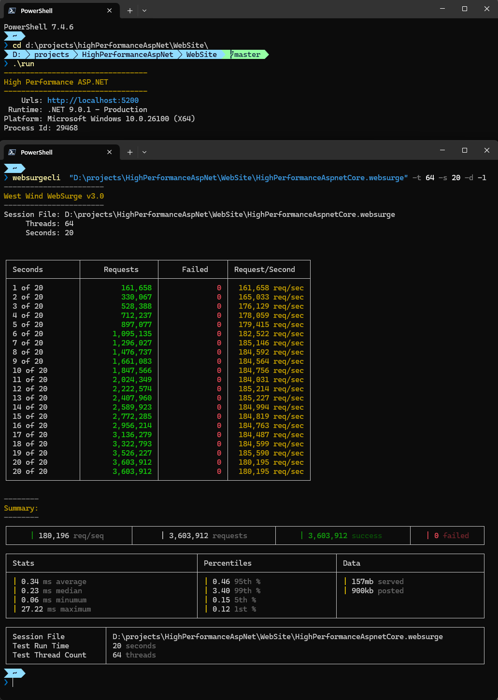
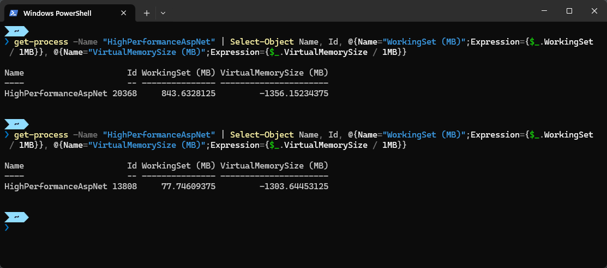

# Comparing Raw ASP.NET Request Throughput across Versions: 8.0 to 9.0 Edition


Whenever a new release of .NET comes out, I run a comparison test of versions using some of my own load testing tools and in this  post I look at .NET 8.0 to 9.0. These posts tend to be a bit rambling with observations of what I'm seeing with .NET 9.0 in my own applications for the new release along with some numbers from my yearly comparison test runs.

## You're Stressing me out!
For testing I use a couple of as-simple-as-it-gets ASP.NET JSON endpoints - both for minimal APIs and ASP.NET Controllers - and fire local Web load tests against them purposefully trying to put max stress on the server (and client) capacity. 

**This is by no means a very scientific process**, and these tests certainly don't reflect any real-world scenarios.  But they actually serve a couple of very useful purposes, at least for me:

* Shows performance throughput of .NET high load ASP.NET app
* Shows performance throughput of a high load .NET client 
* Shows relative performance to previous .NET versions on the same hardware over the years

The numbers by themselves are not especially meaningful as they are dependent on the environment - although they are pretty impressive for running on a laptop. What I'm after is comparing performance across multiple versions of .NET.

The tests are super simple and they're [on GitHub](https://github.com/RickStrahl/HighPerformanceAspNet) if you want to run them yourself. Realistically you can run any code that makes sense to you in these server endpoints, but these tests are geared towards simply returning a simple JSON http response for GET and POST requests.

You'll also need some sort of load testing tool - I'm using my own [West Wind WebSurge](https://websurge.west-wind.com/) which makes setting up the tests very easy. A [WebSurge Session requests file](https://github.com/RickStrahl/HighPerformanceAspNet/blob/master/WebSite/HighPerformanceAspnetCore.websurge) and an [.http file](https://github.com/RickStrahl/HighPerformanceAspNet/blob/master/WebSite/HighPerformanceAspnetCore.http) are also included in the project.

Ideally you'd want to test these requests independently, on their own hardware, but in my case I'm running it all on a decently powered high midrange laptop (I9 13th gen, 32gb, fast disks).

**The goal isn't to do per se benchmarks on .NET.** Rather it's to do a high level comparison of running the same applications on the same hardware on different versions of .NET. It doesn't give deep insight on what things work better, but it gives me a rough idea of how the new version of .NET performs across two important scenarios for me.

### Why run it all Local?
I run locally because that's how I can - on my personal setup - generate **by far** the most requests. I've also run these tests over the network with multiple load testing client machines, but even the combined machines don't come close to what I can generate on the same machine. More on that later.

Since the stack is end to end .NET that gives a pretty good idea what can be expected in best case scenarios in terms of performance improvements.

##AD##

## Some general .NET 9.0 Notes coming from .NET 8.0
As a side note I will say that .NET 9.0 subjectively 'feels' more snappy for two reasons:

* Startup speed seems noticeably improved for both Web and Desktop apps    
Apps just pop up much quicker on cold and warm starts. Web apps respond quicker to first requests.
* Overall performance feels more snappy especially in my desktop apps
* Memory footprint of .NET 9.0 apps is significantly reduced

Well... as it turns out there might be something wrong with my 'feelings' :smile: The results of the tests below actually show a mixed bag of performance, with .NET 9.0 being roughly on par with 8.0 and even a tiny bit slower - as a trade-off of considerably lower memory usage. 

## Tests
Before I get into the results, first I should mention how I'm set up for these tests.

This year I only used a single machine the same I9 laptop I used last year:

* MSI GE68HX 
* I9, 13th gen
* 32gb, Fast 7,000mb/sec drive

### How I run the Server
To run the server I compile the Web application, publish it and then run out of the publish folder with a release build.

In addition I set up the machine for optimal operation:

* Turn Defender completely off 
* Docker off (can affect network throughput) - preferably reboot
* Make sure to run `http://` not `https://` requests (10-15% perf hit!)
* Fresh startup for both Web and Desktop app
* Run a couple of warm up requests to get the server primed
* WebSurge test run with 2 seconds of warm-up requests

The tests below show times from my original .NET 9.0.0 tests. I had this post written in December, but decided to wait for the first service release (9.0.1 released on 1/15/2025). I re-ran all tests and the results were roughly identical, so I left the original screen shots and numbers in place. The new numbers are really close to the previous test - not enough to matter all under/over 1% divergence. The consistency is great as it points to a consistent environment setup and also that .NET itself is staying stable for each of the minor version updates.


### API Code
As I pointed out in previous posts, the code for these tests is purposefully extremely simplistic and literally **meant to return the simplest API responses possible**. Essentially the request does only request routing, Json serialization and response handling. Nothing else, just plain throughput.

I use one GET and one POST request for both of these.

**Minimal APIs**

```csharp
app.MapGet("/hello", () =>
{
    return new { name = "Rick", message = "Hello World" };
});
app.MapPost("/hello", (RequestMessage model) =>
{
    return new { name = model.Name, message = model.Message };
});
```

**Controller**

```csharp
[ApiController]
[Route("[controller]")]
public class ClassicController : ControllerBase
{
    [HttpGet("hello")]
    public object Hello()
    {
        return new { name = "Rick", message = "Hello World" };
    }

    [HttpPost("hello")]
    public object Hello(RequestMessage model)
    {
        return new { name = model.Name, message = model.Message };
    }
}
```

These requests are are not meant to be real world examples, but are precisely meant to stress the raw throughput of each framework for the most basic thing you can do. It's also not meant to do the absolute fastest thing that can be done - like writing out a string. The point of this exercise is to compare the raw throughput for each framework on each version of .NET. You can use any kind of result that makes sense to you, but a basic API response is a good 'minimal' baseline for what I typically work with.

Any application that hits a database will run **a lot less throughput** than these tests. Just to give you an idea, adding a simple PostGres DB read request bumped the throughput from 160k requests down to less than 15k requests a second. At these load levels you're going to run into DB contention issues and that's likely where the overhead comes from. So, it's all about choosing the right scenario that makes sense for you.

That's why with this code here, I'm going for the minimum thing possible, while still returning something somewhat a little realistic in the form of a JSON result.

### Running the Server
For these simple tests I run Kestrel directly from the command line by first publishing the project to a folder and then running the generated executable out of that deployment folder.

This is done to make sure the app is running in fully deployed mode and by default runs in production:

```ps
dotnet publish HighPerformanceAspNet.csproj -o ../Publish -c Release
../publish/HighPerformanceAspNet --urls http://dev.west-wind.com:5200
```

> #### Using `http://` for better Throughput
> Note I'm running the `http://` url rather than the default `https://` url (I did initially). Turns out running `http://` can generate ~13% more requests on the local machine as this affects both the client and server apps for encoding and decoding the TLS requests.


## Test Runs
As said the results of these test runs are a little surprising in that .NET 8.0 barely edges out .NET 9.0 in these tests consistently:

### .NET 9.0 Minimal APIs

  
<small>**Figure 1** - .NET 9.0 Minimal Api Test Results</small>

### .NET 9.0 Controllers


<small>**Figure 2** - .NET 9.0 Controller Results</small>


### .NET 8.0 Minimal APIs

  
<small>**Figure 3** - .NET 8.0 Minimal Api Results </small>

### .NET 8.0 Controllers

  
<small>**Figure 4** - .NET 8.0 Controllers Results</small>

Yup - it actually looks like .NET 9.0 is slightly **slower** than .NET 8.0.

Here are the summarized results running through the UI:

**WebSurge UI**

| Framework    | .NET 9.0 | .NET 8.0 | .NET 7.0 |
|--------------|---------:|---------:|---------:|
| Minimal APIs | 164,250  | 168,250  | 160,250  |
| Controllers  | 151,750  | 160,750  | 150,500  |


WebSurge can also run non-UI tests from the command line and these tests tend to be a bit more efficient as they don't have to deal with the overhead of even minimal UI updates.

  
<small>**Figure 5** - Running tests with the WebSurge CLI is a bit more efficient yet. </small>

Here are the same sessions run through the command line which improves these scores a bit more but with roughly the same ratios between .NET versions:

**WebSurge CLI**

| Framework    | .NET 9.0 | .NET 8.0 | .NET 7.0 |
|--------------|---------:|---------:|---------:|
| Minimal APIs | 180,000  | 189,000  | 161,200  |
| Controllers  | 173,500  | 183,250  | 150,500  |


### Testing over the Network? Not as Efficient!
For all the tests above when running these load tests, both the client and the server are running on the same machine, so the two processes are competing for CPU resources. While running these tests the WebSurge application/CLI actually uses more CPU resources than the server code.

Seems very sub-optimal, but for these high volume tests it turns out it is the way to pump the most requests into these tests - by a long shot.

That's because the tests are set up to just continuously keep spitting requests at the server on many simultaneous threads without any delays (ie. not a user scenario which would entail delay between requests). The throughput achieved here is mostly due to the fact that local network speed is nearly instant as there's no network infrastructure overhead. 

To compare I also wanted to see how much load testing I could do over my local 10gb network connection and using a single computer I was barely able to crack 60k requests/sec. With two machines I got into the 90k range between the two of them which is still only a little more than half of what the local test could do. Try as I might I was not able to boost the throughput beyond those numbers even with a third machine added which seems to suggest that either the network is getting saturated or there's some throttling on the incoming network connection on the laptop running a client version of Windows 11.

In other words, although running everything on the same box seems inefficient, it actually turns out to be way more efficient than what I could achieve with networked Web requests for these do-nothing requests.

Keep in mind that that equation changes once you start doing real work on requests, and the request per seconds come way down to the reality of real world requests. At that point the network likely is not the bottleneck but it'll be the CPU utilization and it makes much more sense to hit the server over the network. Not in this case though!

### .NET Resource Usage Improvements
Resource usage was another surprise, this time in the form of a pleasant one for .NET 9.0: Resource usage is significantly lower for .NET 9.0 compared to 8.0.

The following shows resource usage of the Kestrel app process - 8.0 top, 9.0 bottom.

  
<small>**Figure 6** - Memory Resource for .NET 8.0 (top) and .NET 9.0 (bottom) shows 9.0 using much less memory.</small>

This uses the following command to look for the running EXE and grab the working set (in Powershell):
```ps
get-process -Name "HighPerformanceAspNet" | Select-Object Name, Id, @{Name="WorkingSet (MB)";Expression={$_.WorkingSet / 1MB}}, @{Name="VirtualMemorySize (MB)";Expression={$_.VirtualMemorySize / 1MB}}
```

Since the requests are very focused and there are literally just 2 of them, no matter at what time in the test cycle this is run - during or after - for both .NET 9.0 and 8.0 the memory values stayed rock steady - as they should.

The resource usage for .NET 9.0 is considerably lower - more than 10x. I would love to try this on some of my production apps, but unfortunately most have been moved over to 9.0 and can't easily go back to 8.0 due to dependencies that require a matched version of .NET (looking at you EF Core you bastard!). I do have a few internal apps that are still on 8.0 and switching them to 9.0 showed significant reduction in Working Set/Private memory usage - not 10x but in the 2x -3x range which is still significant!

### .NET 9.0: `<GarbageCollectionAdaptationMode>0</GarbageCollectionAdaptationMode>`
.NET 9.0 has changed has some new adaptive memory and garbage collector features that affect performance. The default configuration that I used for tests above is optimized for resource preservation at the cost of a slight performance trade off.

James High on BlueSky pointed out that there's a configuration flag for this via the `<GarbageCollectionAdaptationMode>0</GarbageCollectionAdaptationMode>` setting which overrides the new behavior and uses the 'greedier' garbage collector. 

<blockquote class="bluesky-embed" data-bluesky-uri="at://did:plc:f3r4zn3bn3cwpqmfvwfg7vpp/app.bsky.feed.post/3lgbo24fa5s2u" data-bluesky-cid="bafyreig5f44ispbxqkeipyfsyybiv3y7dzgqgt7u77bdyr4i7rrfmimghi"><p lang="en">If you ever have time, it would be interesting to re-test .NET 9 with &lt;GarbageCollectionAdaptationMode&gt;0&lt;/GarbageCollectionAdaptationMode&gt; since &quot;DATAS&quot; is now the default for .NET 9. I think the recommendation is to disable it as above if throughput is important at the expense of memory.</p>&mdash; James High (<a href="https://bsky.app/profile/did:plc:f3r4zn3bn3cwpqmfvwfg7vpp?ref_src=embed">@jhigh2000.bsky.social</a>) <a href="https://bsky.app/profile/did:plc:f3r4zn3bn3cwpqmfvwfg7vpp/post/3lgbo24fa5s2u?ref_src=embed">January 21, 2025 at 10:13 AM</a></blockquote><script async src="https://embed.bsky.app/static/embed.js" charset="utf-8"></script>

So as suggested I recompiled the project with that flag set to 0 and re-ran the tests. Performance was indeed slightly faster and swapping back and forth I was able to get 164k requests with the setting at 0, vs. 160k with the setting at 1 which is the default. This more or less mimics the same difference the between .NET 8.0 and 9.0.

Not surprisingly the memory behavior for .NET 9.0 without the new memory optimizations and with, showed similar results to my test comparisons between .NET 8.0 and 9.0 above. And again it's a whopping 10x+ less memory!


The memory behavior seems to be directly related to this feature flag, so at the cost of a slight trade off in performance the memory resource usage is drastically improved. Well worth the perf trade-off! 

You'll want to test this with your own applications once they've warmed up and running in their 'stable' mode and compare between the two modes. I imagine you'd always want to use the default setting since the perf gain is pretty small.

##AD##

### UI vs. CLI Client: More difference than expected
It's interesting here that the differences between UI and CLI are also quite substantial. The desktop UI application does minimal UI updates during test runs: once a second it writes out fairly static string to the HUD display on the bottom of the screen, for the running counter displayed as a status on the window. Other than that nothing. Yet... there's nearly a 10% difference in the performance numbers between the UI and the CLI client - so there's a lot of overhead just for having the UI up and running a Window control loop etc.

### 9.0 UI vs 8.0 UI
For kicks I also re-ran these tests with the last version of WebSurge that runs on .NET 8.0. Performance of the .NET 9.0 client improved by about 8% on repeated runs. 

This seems to suggest that there's more improvement that occurred for client side applications, and that matches up with my experience.

For my desktop applications I've noticed:

* Much improved startup speed
* Slightly snappier UI interactions

These things are hard to quantify because they are very 'touchy feely', but I run my apps a lot and so I have a pretty good feel for when things speed up... or slow down. With client apps the .NET 9.0 upgrade seems to have more of a noticeable impact than on server operations. 

For WebSurge I also wonder if improvements with the UTF-8 string handling and in HttpClient have an effect on the improved performance since that's the meat of usage.

With the 8% improvement it's worth mentioning that  **the ratio between the .NET 8.0 and 9.0 applications stayed roughly the same** as shown with the main test shown earlier.

This seems to suggest the following:

* The ASP.NET Server is roughly the same or very slightly **slower** than .NET 8.0 in these tests
* The WPF .NET 9.0 client is ~8% **faster** than the 8.0 client


##AD##

## Summary
No matter which way you look at it, the results that .NET 9.0 (and 8.0 and even 7.0 before it) puts in here in terms of performance on a freaking laptop are pretty amazing: 180k requests/second on a laptop? Yeah that's wild even if the requests are minimal! 

.NET's performance trajectory has been on a steep upward trend and in this release that trajectory has leveled out a bit. Which is OK as far as I'm concerned especially given the huge perf improvements in .NET 8.0. I for one also appreciate the continued stability and a smooth update path between versions and .NET 9.0 with minimal to no changes required. Out of the 10 apps  (desktop and ASP.NET Server apps) I've updated to date, only 1 required some very minor changes.

I imagine at some point we may reach a limit to the major optimizations that are available for new versions. Or at least they will get incrementally less impactful as the low hanging fruit have been picked with performance. It looks like we might be getting close to that. So we probably should curtail our expectations going forward.

More so than performance, this .NET 9.0 release seems have focused on reducing resource usage, and again the gains there are impressive where I've seen resource usage cut by more than 3x for a few Web applications and closer to 5x with a couple of desktop applications. You've seen the example I showed for the ASP.NET server app which shows more than 10x memory reduction, but that's a bit of an outlier due to the simplicity of the example. 

As to the impact of lower resource usage: For my WebSurge load testing client the memory reduction actually has a huge impact as it captures test results into memory - the lower memory footprint allows much more traffic to be captured. Also the Http results are incurring a much lower memory impact in-flight than in previous version, reducing running memory usage on the client. For WebSurge this is a big win in 9.0!

Add all that up and .NET 9.0 is another great release of improvements and best of all most of the improvements require no changes from the developer. Recompile and benefit! It doesn't get much better than that! :smile:

## Resources

* [Server Code on GitHub]()
* [West Wind WebSurge Load Tester](https://websurge.west-wind.com)
* [Last Years Post - .NET 7.0 - 8.0](https://weblog.west-wind.com/posts/2024/Mar/08/Comparing-Raw-ASPNET-Request-Throughput-across-Versions)