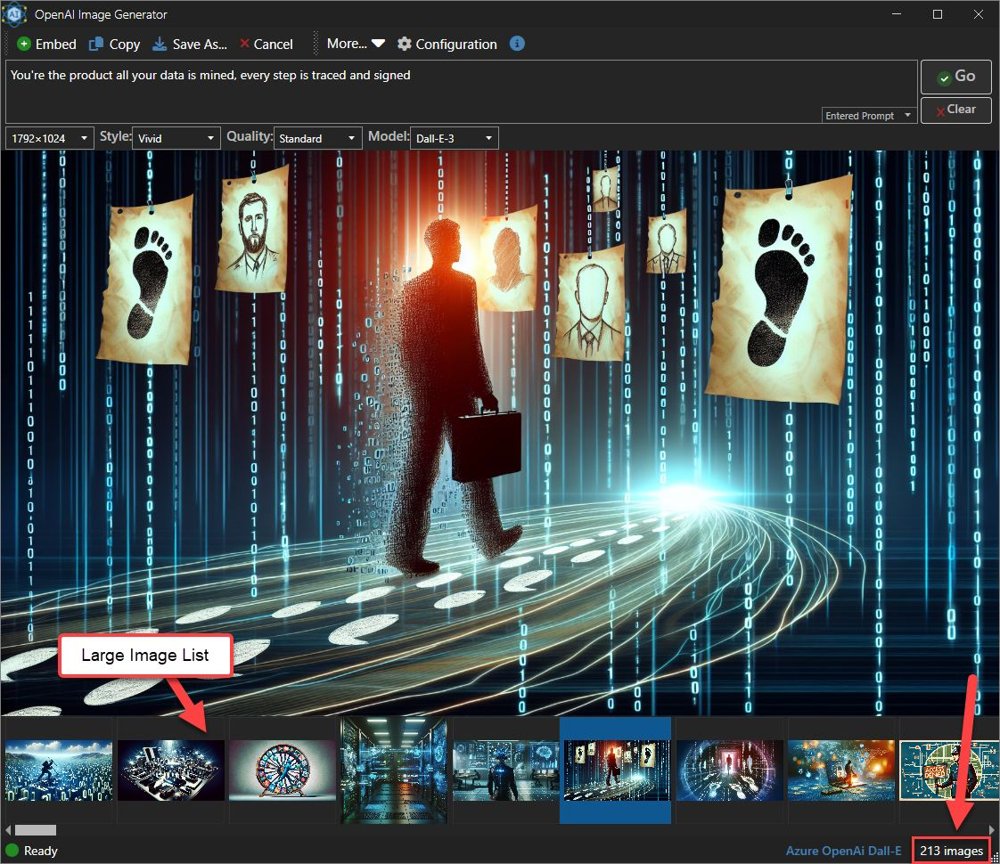
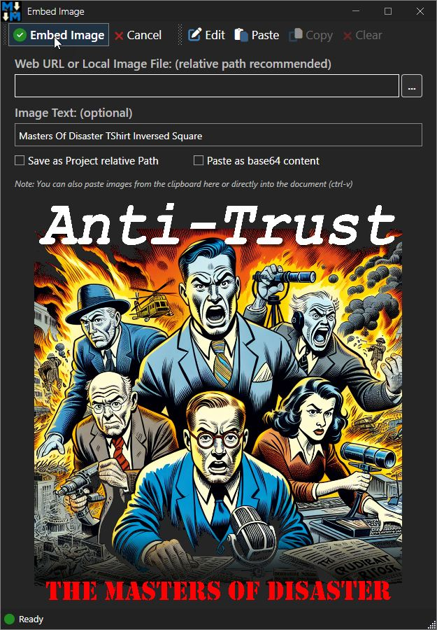

# Clipboard Data and Wpf ImageSource Conversions


I've written previously about [image formatting issues with the clipboard data in WPF](https://weblog.west-wind.com/posts/2020/Sep/16/Wrestling-with-Clipboard-Images-in-WPF) and for the most part what I discussed in that post has been working just fine. 

Recently however I started noticing some issues with some of my clipboard pasting code in [Markdown Monster](https://markdownmonster.west-wind.com/) producing what appears to be corrupted images when displaying in an ImageSource control. The following is an image captured from [Techsmith's SnagIt](https://www.techsmith.com/snagit/) and then opened in Markdown Monster's Image dialog:

  
<small>**Figure 1** - Something's not quite right here: Shades of a badly tuned broadcast TV in the 70's :smile: </small>

The image is sort of there, but it's obviously missing color, it's offset by a bunch with part of it missing, mis-sized  and... well, it looks like an old, mis-tuned broadcast service TV image. It's an interesting effect, but not what that image should look like.

What's happening in this code is that the image is copied to the clipboard from SnagIt and then picked up by the form when it loads from the clipboard and loaded into an `Image` control via an `ImageSource` bitmap. 

##AD##

## That Nasty WPF ImageSource Control
It should be simple: `Clipboard.GetImage()` should just return you an ImageSource and that should be the end of it. Unfortunately, more times than not, that doesn't 'just' work. Anything a little off in the image and `System.Windows.Clipboard.GetImage()` fails. Either it outright crashes or worse - it returns a result, but the resulting ImageSource doesn't actually render in the image control, which means your code has no way to really know that the image failed.

Turns out `Windows.Forms.Clipboard.GetImage()` works much more reliably, but it can't do transparency in `.png` images, which may be important.

So, in order to be able to handle all the use cases, I have been using a `ClipboardHelper` class with  wrapper functions that look at the clipboard and explicitly extract the bitmap data first, and then create a new `ImageSource` from that bitmap data. That seems to be much more reliable and it support opacity. The first article goes into a lot of detail about how this works and also talks a bit about all the crazy clipboard formats you can run into and have to deal with if you're interested. 

For this post, I'll show the complete, updated code for getting an `ImageSource` or `Bitmap` from the clipboard at the end of the post.

### Image Formatting: Bitness
I've been using this helper class for a long time and it's been working for me for some time, except for the problem shown in **Figure 1** that only occurs occasionally, but is coming up more and more recently. After a bit of sleuthing in the code I was able to track this down to the conversion code that's converting the clipboard bitmap image data into an ImageSource to display in the WPF Image control. The bitmap itself appears to be fine as I checked the actual byte data and wrote it out to file. The file image looked perfectly fine.

So the issue is Bitmap to ImageSource conversion - which has always been the messy part of this entire process. 

There are a number of ways to do this conversion:

* Dumping the image into a byte stream and assigning loading the image source from that
* Dumping to file and loading the image source from that
* Using low-level locking of the actual image data and loading the image source from that

I'd been using the latter, because the in-place memory usage and unsafe code combination are wicked fast compared to any other approaches - like 3-4 faster, plus it doesn't require copying the bitmap buffer of a potentially large image into a second block of memory.

The original code was [retrieved from Stack Overflow](https://stackoverflow.com/a/30729291) and I used it as is  because to be honest I only had a vague idea what that code was actually doing. At the time I noticed some of the hardcoded values and thought about that being a problem but in a bit of testing I didn't see any issues with images from a variety of sources.

Here's the original SO code:

```csharp
public static BitmapSource BitmapToBitmapSource(Bitmap bmp)
{
    var bitmapData = bmp.LockBits(
           new Rectangle(0, 0, bmp.Width, bmp.Height),
           ImageLockMode.ReadOnly, bmp.PixelFormat);

    var bitmapSource = BitmapSource.Create(
        bitmapData.Width, bitmapData.Height,
        bmp.HorizontalResolution, bmp.VerticalResolution,
        PixelFormats.Bgr24, null,
        bitmapData.Scan0, bitmapData.Stride * bitmapData.Height, bitmapData.Stride);

    bmp.UnlockBits(bitmapData);

    return bitmapSource;
}
```

You'll notice in there that the `PixelFormats.Bgr24` is hard coded. This will work most of the time but if the image is stored in 32 bit format you get - variable results. Oddly it works some of the time even with 32 bit images, but some images consistently failed with the image behavior shown in **Figure 1**. The reason I've been seeing more of the errors likely is due to more software using the higher 32 bit depth.

To get around this hard coded pixelformat, we can add a conversion routine that translates pixel formats between the System.Drawing and System.Windows values. The code shows both directions but only the first is from System.Drawing to System.Windows is actually used:

```csharp
public static System.Windows.Media.PixelFormat ConvertPixelFormat(System.Drawing.Imaging.PixelFormat systemDrawingFormat)
{
    switch (systemDrawingFormat)
    {
        case PixelFormat.Format32bppArgb:
            return PixelFormats.Bgra32;
        case PixelFormat.Format32bppRgb:
            return PixelFormats.Bgr32;
        case PixelFormat.Format24bppRgb:
            return PixelFormats.Bgr24;
        case PixelFormat.Format16bppRgb565:
            return PixelFormats.Bgr565;
        case PixelFormat.Format16bppArgb1555:
            return PixelFormats.Bgr555;
        case PixelFormat.Format8bppIndexed:
            return PixelFormats.Gray8;
        case PixelFormat.Format1bppIndexed:
            return PixelFormats.BlackWhite;
        case PixelFormat.Format16bppGrayScale:
            return PixelFormats.Gray16;
        default:
            return PixelFormats.Bgr24;
    }
}

public static System.Drawing.Imaging.PixelFormat ConvertPixelFormat(System.Windows.Media.PixelFormat wpfFormat)
{
    if (wpfFormat == PixelFormats.Bgra32)
        return PixelFormat.Format32bppArgb;
    if (wpfFormat == PixelFormats.Bgr32)
        return PixelFormat.Format32bppRgb;
    if (wpfFormat == PixelFormats.Bgr24)
        return PixelFormat.Format24bppRgb;
    if (wpfFormat == PixelFormats.Bgr565)
        return PixelFormat.Format16bppRgb565;
    if (wpfFormat == PixelFormats.Bgr555)
        return PixelFormat.Format16bppArgb1555;
    if (wpfFormat == PixelFormats.Gray8)
        return PixelFormat.Format8bppIndexed;
    if (wpfFormat == PixelFormats.Gray16)
        return PixelFormat.Format16bppGrayScale;
    if (wpfFormat == PixelFormats.BlackWhite)
        return PixelFormat.Format1bppIndexed;

    return PixelFormat.Format24bppRgb;
}
```

And with that we can now fix the image `Bitmap` to `ImageSource` conversion:

```csharp
public static BitmapSource BitmapToBitmapSource(Bitmap bmp)
{
    var bitmapData = bmp.LockBits(
           new Rectangle(0, 0, bmp.Width, bmp.Height),
           ImageLockMode.ReadOnly, bmp.PixelFormat);

    var pf = ConvertPixelFormat(bmp.PixelFormat);

    var bitmapSource = BitmapSource.Create(
        bitmapData.Width, bitmapData.Height,
        bmp.HorizontalResolution, bmp.VerticalResolution,
        pf, null,
        bitmapData.Scan0, bitmapData.Stride * bitmapData.Height, bitmapData.Stride);

    bmp.UnlockBits(bitmapData);

    return bitmapSource;
}
```

The image display now works correctly for anything I'm throwing at it. Here's the image rendering correctly in the Image dialog in Markdown Monster:

  
<small>**Figure 2** - Properly captured image after fixing the Pixelmode conversion.</small>

Note that this method requires unsafe code (for the `LockBits` call) so this may or may not be usable everywhere. If you need a version that works with safe code only  you can use the following which uses an intermediary Memory stream:

```csharp
public static BitmapSource BitmapToBitmapSourceSafe(Bitmap bmp)
{
    using var ms = new MemoryStream();
    
    bmp.Save(ms, ImageFormat.Png);
    ms.Position = 0;
    
    var bitmap = new BitmapImage();
    bitmap.BeginInit();
    bitmap.CacheOption = BitmapCacheOption.OnLoad; // Load image immediately
    bitmap.StreamSource = ms;
    bitmap.EndInit();
    bitmap.Freeze(); // Make the BitmapImage cross-thread accessible

    return bitmap;
}
```

### Performance
This code is reliable but it's **considerably slower** (2-4 times slower depending on how many images you load) and also loads another copy of the image data for each image. 

Note that there are a number of other ways to do this: Dumping to disk, traversing the Bitmap buffer with .NET safe code (which apparently is also fairly slow).

I'm using this method in Markdown Monster in a number of places and for single images displayed the slower processing and memory usage is not a problem. However, I also use if for an image list that displays a history of AI Image generated which contains potentially hundreds of images that are loaded asynchronously and the performance difference there is enormous:


<small>**Figure 3** - In a large list of images load performance matters - so the faster algorithm using unsafe code ends up being 3-4 times faster.</small> 

The image slider on the bottom contains a large number of images that are loaded asynchronously in the background, but even though they are loading in the background the initial hit of the UI activating is as much as 4 times slower with the MemoryStream code than using the LockBits code.

### Putting it all Together: Getting an Image or ImageSource off the Clipboard
I went into great detail about clipboard image retrieval [in the previous post](https://weblog.west-wind.com/posts/2020/Sep/16/Wrestling-with-Clipboard-Images-in-WPF) and some of the issues you need to deal with. I'm not going to rehash all of it here, but if you're interested there's tons of detail of why this can be such a pain in the ass. 

The short version is: The Windows.Forms Clipboard works great, but it can't do transparency. The native WPF clipboard is super flakey with some image types. 

The wrappers I show here make it very easy to retrieve Clipboard data safely and quickly and as reliably as possible. At this point I've thrown a huge number of different image types at the updated code and I've not had any failures other than a few out memory errors with very large images.

There are two functions:  
  
* GetImage()
* GetImageSource()

as well as the previously shown methods:

* BitmapToBitmapSource()
* ConvertPixelFormat()

The whole thing to retrieve an ImageSource and a Bitmap Image first, looks like this:

```csharp
// ClipboardHelper.GetImageSource()
public static ImageSource GetImageSource()
{
    if (!Clipboard.ContainsImage())
        return null;

    // no try to get a Bitmap and then convert to BitmapSource
    using (var bmp = GetImage())
    {
        if (bmp == null)
            return null;

        return WindowUtilities.BitmapToBitmapSource(bmp);
    }
}

// ClipboardHelper.GetImage()
public static Bitmap GetImage()
{
    try
    {
        var dataObject = Clipboard.GetDataObject();

        var formats = dataObject.GetFormats(true);
        if (formats == null || formats.Length == 0)
            return null;

        #if DEBUG   // show all formats of the image pasted
        foreach (var f in formats)
            Debug.WriteLine(" - " + f.ToString());
        #endif

        // Use this first as this gives you transparency!
        if (formats.Contains("PNG"))
        {
            using MemoryStream ms = (MemoryStream)dataObject.GetData("PNG");
            ms.Position = 0;
            return (Bitmap)new Bitmap(ms);
        }
        if (formats.Contains("System.Drawing.Bitmap"))
        {
            return (Bitmap)dataObject.GetData("System.Drawing.Bitmap");                    
        }
        if (formats.Contains(DataFormats.Bitmap))
        {
            return (Bitmap)dataObject.GetData(DataFormats.Bitmap);                    
        }

        // just use GetImage() - 
        // retry multiple times to work around Windows timing
        BitmapSource src = null;
        for (int i = 0; i < 5; i++)
        {
            try
            {
                // This is notoriously unreliable so retry multiple time if it fails
                src = Clipboard.GetImage();
                break;  // success
            }
            catch
            {
                Thread.Sleep(10);  // retry
            }
        }

        if (src == null)
        {
            try
            {
                Debug.WriteLine("Clipboard Fall through - use WinForms");
                return System.Windows.Forms.Clipboard.GetImage() as Bitmap;
            }
            catch
            {
                return null;
            }
        }
            
        return WindowUtilities.BitmapSourceToBitmap(src);
    }
    catch
    {
        return null;
    }
}
```

The code looks for a few known formats that can be directly converted from the raw clipboard data and those are immediately returned. Note that some formats are already in Bitmap format while others like `PNG` are a binary stream that has to be loaded and assigned to a Bitmap. 

The first check is for PNG because we want to try and capture the transparency of the raw PNG image. Note that for PNG we read the stream and create a bitmap from it.

Next, both `Bitmap` or `System.Drawing.Bitmap` formats are actually stored in the raw .NET Bitmap  format and directly cast to that type. That would seem to be the easiest path, but these images unfortunately don't support opacity and that's why `PNG` is processed first.

You're likely to see Bitmap formats from .NET applications or applications that have some .NET support, but non-.NET applications likely won't have these clipboard formats set and likely provide raw image data.

In those cases, the code falls back to the default WPF Clipboard behavior and call `Clipboard.GetImage()`. If that call fails it will delay briefly and try again a few times. There's a well known timing bug in the Windows Clipboard API that can cause the clipboard to not be ready to retrieve data right as you request it, and retrying often can get the image. In fact, the  Windows.Forms.Clipboard functionality does that automatically and internally, but for WPF it needs to be explicitly coded.

If the WPF `GetImage()` fails after several tries, the code then falls back to Windows Forms `GetImage()` operation. Which is very likely to pick up anything else regardless of format.

Prior to the Windows Forms fallback I was running into frequent clipboard pasting failures with images, and the fallback catches those cases that WPF can't handle or is too finicky about. While it may miss opacity, at least it will return something (and opacity is rarely an issue).

Note that there might still be scenarios where the WPF GetImage() is called - succeeds, but doesn't produce an ImageSource that renders. This is unfortunate because there appears to be no good way to detect this failure. An ImageSource is returned and it has data, but it just doesn't render.


##AD##

Overall I find that these days most images are covered by PNG and one of the Bitmap formats, with only a few odd calls ending up in the WPF GetImage() logic.

With this code  in place, I now have proper working images from any source and including transparency:

  
<small>**Figure 4** - Example of a captured 32bit image with transparency.</small>

Yay!

## Summary
WPF Image Clipboard operations have been notoriously difficult to work with, but with this circuitous workaround described in this post, that first loads a bitmap and then an ImageSource from that, it's possible to load the vast majority of images reliably. For those that still fail, the fallback to `Windows.Forms.Clipboard` usually captures the rest.

If you don't need to capture transparent images, you can bypass all this madness and simply use `Windows.Forms.Clipboard.GetImage()` with a `try/catch` block around it. This works almost universally and is by far the easiest. For the rest, the code described here can be easily packaged into an application and shipped inline as part of a ClipboardHelper class.