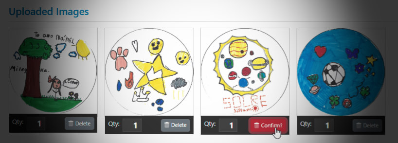
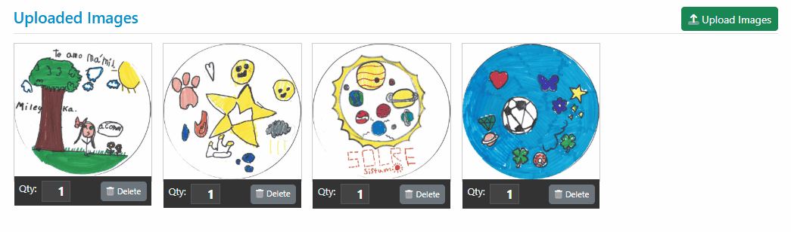

# Inline Confirmations in a JavaScript UI



Confirmation dialogs or modal popups can be annoying in HTML applications. What if you could instead use an inline UI to confirm an operation? In this post I describe a simple way you can use an inline UI to confirm an operation that can be easily implemented with a few lines of code and a couple of binding directives.

I recently ran into an app that was using a nice and simple UI to handle confirmation of deletions by using a dual interface for the confirmation prompt - a button - to both start and confirm a delete operation. I've seen this in passing in the past, but today I was actually working on some similar code and I went ahead implemented it. It's a surprisingly simple solution both in terms of the UI interactivity and what it takes to implement.

##AD##

## My Scenario
I've been working on an application that deals with image uploads that need to be managed by uploading and potentially deleting images. For deleting images, I applied the inline confirmation button approach instead of using `confirm()` dialog or some sort of modal popup which is always a pain in the ass.

What I ended up with is this:

  
<small>**Figure 1** - An inline confirmation prompt to delete files is quick, slick and unobtrusive.</small>
 
 You can play around with a [simplified CodePen version](https://codepen.io/rstrahl/pen/yyLVweL) of the above here:
 
 [Inline Delete Button Confirmation CodePen](https://codepen.io/rstrahl/pen/yyLVweL)

 I love the simplicity of this approach and the fact that you don't have to click around, but can simply click and click again to confirm. It's a much smoother UI as opposed to a modal interface. On the downside, this simple button transformation UI doesn't leave room for a message, but that could be handled easily with a separately rendered UI widget that displays the confirm prompt along with a message.

The concept is simple enough - you click the button and then are prompted to confirm the operation - in this case deleting of the image. So rather than immediately deleting the image the button (or other confirmation UI) is updated. The delete operation is deferred and instead the first click triggers a state change that displays the confirmation UI. The click on the confirmation button then performs the actual operation.

If you wait too long - 5 seconds in this case - the button reverts back to it's original state.

### Implementation with VueJs
The example in **Figure 1** uses VueJs in an embedded Vue component in the middle of an otherwise server rendered form. The image management component handles the upload, quantity adjustments and deletion of the images that are uploaded.

### Html and VueJs expressions
The image component essentially has a list of images that are being displayed and rendered using Vue bindings. They are server rendered and then displayed in a loop, but that's an implementation detail in this particular hybrid page implementation.

The server side code that renders the list:

```html
@{
    // C# Server Side Razor rendered client variables
    var scriptVars = new ScriptVariables
    {
        ClientObjectName = "page",
        UseCamelCase = true
    };
    scriptVars.Add("imageList", Model.Fundraiser.UploadedImages
                                .Select(i=> new { i.Id, i.Notes, i.ContentType, i.Filename, i.Quantity, i.Approved, i.FundraiserId, i.Reviewed }));
    scriptVars.Add("fundraiserId", Model.Fundraiser.Id);
}
<script>
    // this creates `page = { imageList: [], fundRaiserId: "xxxxx" }` 
    // bound to the Vue model
    @scriptVars.ToHtmlString();   
    var vueData = {};
</script>
```

The key items in the rendered output are the image loop container (a flexbox list), and the delete button as shown below:

```html
<div v-for="image in images" :key="image.id" class="flex-item">
   
   <div class="action-box">
        ...
        <!-- the Delete Button that doubles as a confirm propmpt -->
        <button 
                type=button v-on:click="deleteImage(image)"
                class="btn btn-sm  float-end" 
                v-bind:class="{ 'btn-danger': image.deleteConfirm, 
                                'btn-secondary': !image.deleteConfirm }">
            <i class="fad fa-trash-alt me-1" ></i>
            <span v-if="!image.deleteConfirm">Delete</span>
            <span v-if="image.deleteConfirm">Confirm?</span>
        </button> 
   </div>
</div>          
```

The image list data contains a state field called `deleteConfirm` which by default is `false` - actually the server doesn't render it so initially it's missing. 

If you look at the `<button>` you see that the `deleteConfirm` is used to dynamically style the button using the default secondary color if `false` or the danger color when `true`. Likewise the text is displayed as `Delete` or `Confirm` depending on the state of `deleteConfirm`. In effect, the single button is transformed in place based on the state of `deleteConfirm`. 

As mentioned, you don't have to do this with a single button, but instead you could create two buttons or a button and some other widget and conditionally display one or the other for each state.

> Note: The original data retrieved from the server doesn't have to contain the deleteConfirm. Due to JavaScript's handling of `null` and truthiness the above expressions using the null conditional operation (ie. `image.deleteConfirm`) works as non-truthy value even when `deleteConfirm` is not present. 

### JavaScript Code (VueJs)
Using a reactive framework like Vue, the code to toggle between the two modes is now almost trivial as it only needs to toggle the `image.deleteConfirm` prop:

```js
// image instance passed from Html
deleteImage(image) {
    if (!image.deleteConfirm)  
    {
        image.deleteConfirm = true;  // now displays confirm UI
        setTimeout(()=> image.deleteConfirm = false, 5000); // clear in 5 secs
        return;
    }
    
    // ... delete the image here
}    
```

And that's just about it.


##AD##

## Summary
I really like this simple UI implementation as it's nice and unobtrusive in the user's work flow. You can avoid nasty `confirm()` dialogs, or having to code up some sort of modal confirmation box. 

Assuming you are using a reactive framework, the code for this is minimal as you can assign the value and update the UI conditionally. It's a bit more work if you don't use a reactive framework as you have to manually update each of the UI components - in that case it's probably easier to use two separate components that you can just toggle  respectively.

The in-place implementation requires literally a single add-on property and a few binding attributes on the button that conditionally draw the button in the right mode. You take this a little further too, by actually creating a more complex inline UI that displays and hides the button instead. This might be useful if you have to display a message, rather than a simple `Confirm?` prompt I'm using here. 

I know I'll be using this approach in a lot more places in the future in my own apps...