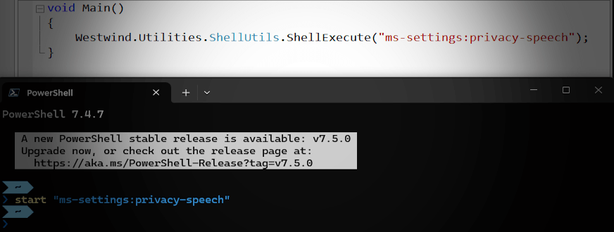
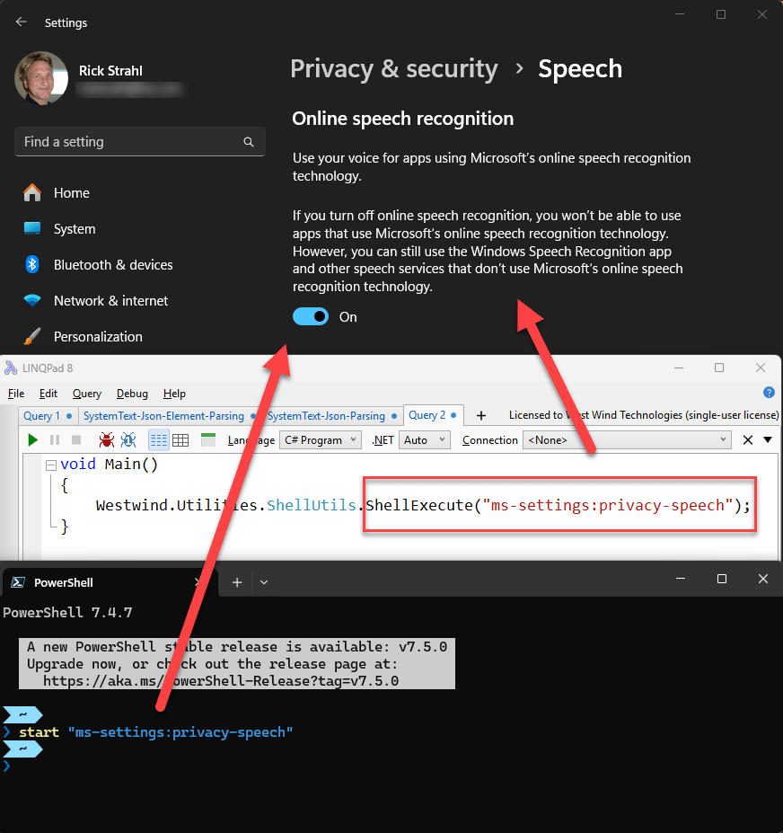

# Accessing Windows Settings Dialogs from Code via Shell Commands



I was unaware of this: You can access Windows configuration dialogs via an `ms-settings:` shell command via command Uri that works with:

* Shell Commands in your applications (`ShellExecute()` or `Process.Start()`)
* `start` (command) and `start-process` (powershell) from a terminal
* From within a browser

Commands look like this:

  
<small>**Figure 1** - You can directly access specific Windows Settings commands through `ms-settings:` shell commands</small>


What's nice is they pop up directly on the appropriate configuration setting. This is especially useful for application that require that certain feature or system functions are enabled.

##AD##

For example, here I'm prompting to allow for Microphone access, so the Speech Recognition features in Markdown Monster can be used to dictate text. If the app tries to start the audio system and it fails to load, I can then pop up the dialog to get the user to try and fix the permissions.

```csharp
try
{
    await EnsureCompiledAsync();
    _ = _recognizer.ContinuousRecognitionSession.StartAsync();
    _isDictating = true;
}
catch (Exception ex) when (ex.Message.Contains("privacy"))
{               
````   // Open the settings page for speech recognition
   Westwind.Utilities.ShellUtils.ShellExecute("ms-settings:privacy-speech");                
}
```

There are a number of ways you can activate these handlers.

## Terminal Activation
From a PowerShell Terminal prompt:

```ps
# DOS tool (executable)
start "ms-settings:privacy-speech"

# Powershell command
start-process "ms-settings:privacy-speech"
```

From Windows WSL terminal you can use:

```bash
explorer.exe ms-settings:privacy-speech
```

## Code Activation
In code you can use anything that supports shell commands which includes `ShellExecute()` and `Process.Start()`:

```cs
Process.Start("ms-settings:privacy-speech");

ShellUtils.ShellExecute("ms-settings:privacy-speech");
ShellUtils.GoUrl("ms-settings:privacy-speech");
```

All of these use the Windows `ShellExecute()` API which is the underlying tooling that runs these commands.


You can jump to most of the available Windows configuration settings directly and there's a list of the available links here:

* [ms-settings Command Reference](https://learn.microsoft.com/en-us/windows/apps/develop/launch/launch-settings-app#ms-settings-uri-scheme-reference)

If you follow the links in that MS Article it also takes you to some other interesting Uri Scheme handlers that are built into windows and allow accessing many Windows features without having to explicitly launch executables. 

## Protocol Handler/Uri Scheme Shell Activation
The `ms-settings:` moniker is what's known as a **Protocol Handler** (Web lingo) or **Uri Scheme** (Windows lingo),  which is a globally registered 'command handler' that is registered machine wide and triggered by the URL prefix through a shell command or a Url in the browser. The trigger prompts opening of the associated application - in this case it's the Windows Setting app, with the key taking you to the specific feature.  You've seen this for other apps like Zoom or Teams, or even in custom applications like Markdown Monster which allow opening the editor from within a Web Browser.

To give you an idea how you can utilize this in your own application take a look at [how the Markdown Monster Desktop application integrates a Protocol Handler](https://markdownmonster.west-wind.com/docs/Recipes/Open-from-Browser-with-markdownmonster-Protocol-Handler.html) to open and interact with documents from a Web browser.

##AD##

## Summary
This is obviously not something that you use everyday, but it's pretty nice to have a simple solution to quickly jump to various system settings. Security in applications affects so many different aspects of applications and it's really useful to directly send your users to the exact configuration settings that need to be set.

## Resources

* [ms-settings Command Reference](https://learn.microsoft.com/en-us/windows/apps/develop/launch/launch-settings-app#ms-settings-uri-scheme-reference)