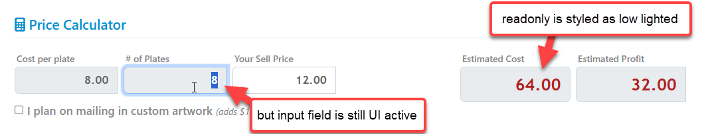

# Making Html Input Controls Truly ReadOnly


Although HTML has support for `readonly` control content, the behavior is not really well implemented in Web browsers. `readonly` displays some minimal alternate styling (which you can customize via CSS), but even then the behavior you get is still not optimal because the control is still selectable and stills shows a focus rectangle:

If you just use something like this:

```html
<input type="text" readonly class="image-quantity" />
```

You get a result like this in a text box (here in a list of images):

  
<small>**Figure 1** - The default `readonly` behavior on input controls leaves controls still selectable and show a focus rectangle, even though the text can't be edited.</small>

You can see that the textbox is still selectable with the mouse and you can still tab into it. It still behaves like an edit control, except you can't change the value which is pretty annoying to users. 

Some frameworks like Bootstrap do default styling for `readonly` so you see read only fields that display differently with greyed out or low-lighted content. Here's Bootstrap's default version of that:

  
<small>**Figure 2** - Default readonly styling often only addresses the display, not the UI activation behavior even though you can't edit the input.</small>

That's good enough for a visual indicator, but unfortunately - as before - the field is still UI enabled, so you can click on it or tab into it to get a focus rectangle. To the user it still looks like the field is editable, even though it is not!

##AD##

## readonly vs. disabled? Do you really want readonly?
Html has both `readonly` and `disabled` attributes which from UI and behavior perspectives have many overlapping functionalities and behaviors. `disabled` actually disables field input and so that would solve our focusability issue. But there are also behavioral differences: Most importantly, **`disabled` controls don't post back their value to the server**, while `readonly` controls do.

So if focus is the only concern, the simplest solution to this problem is to use `disabled` on the control like this:

```html
<input type="text" disabled class="image-quantity" />
```

Now the input field becomes non-accessible altogether without any focus from mouse or keyboard.

> If both `readonly` and `disabled` are present on a control, it's still considered disabled and doesn't post back to the server. The only reason you'd do this is to get styling features of both attributes. *Not recommended for the confusion this creates*.

The official differentiation between `readonly` and `disabled` is defined like this:

> "*The difference between disabled and readonly is that read-only controls can still function and are still focusable, whereas disabled controls can not receive focus and are not submitted with the form and generally do not function as controls until they are enabled.*"  
> &nbsp; &nbsp; &nbsp;<small>[MDN Documentation](https://developer.mozilla.org/en-US/docs/Web/HTML/Attributes/readonly#attribute_interactions)</small>

More specifically:

* A `readonly` input **is submitted** but cannot be modified by the user.
* A `readonly` input control **is still selectable** but cannot be modified by the user.
* A `disabled` input **is not submitted** and cannot be modified by the user.
* A `disabled` input control **is not selectable** and cannot be modified by the user.


Bottom line: I would argue that in most cases where you think you need `readonly`, you probably want to use `disabled` instead. I can't see why you'd ever want the hybrid UI behaviors of `readonly` that still allow you to focus. The only realistic use case I see for `readonly` is if you indeed need to post the readonly fields back to the server.

For client side code this doesn't matter as you can always assign values to input controls via code or bindings.

So `disabled` might be the better choice, but if you're like me, that probably isn't your first thought - especially when you're thinking about input controls that run in a dual state. Hey I have control that takes input in one mode, and not in another - `readonly` seems the natural choice. No - in most cases `disabled` is likely the better choice.

## Fixing Focus: CSS Styling and Html Attributes
Ok, so assuming you do want to stick with `readonly` we can still fix `readonly` UI behavior to behave similar to the default `disabled` behavior of no UI focus, but it takes a little extra effort.

By default HTML base style sheets or frameworks like Bootstrap or Material provide low lighting formatting for ReadOnly controls. But if you do custom control styling like I'm doing in **Figure 1** that default read-only styling mostly goes out of the window. In **Figure 1** the same styling applies regardless of `readonly` status of the control.

Thankfully you can override the styling relatively easily with CSS like this to provide better read only behavior:

```css
 .image-quantity[readonly]
 {
     border: none;            
     opacity: 0.7;
     pointer-events: none;
 }
```

There are plenty of visual tricks you can use to show disabled content, from grey backgrounds, to opacity or removing content altogether. I like opacity as in indicator both for read only and disabled content.

The `pointer-events` attribute is one that's easy to overlook - it's what prevents you from UI activating with a mouse so a click on the field will not activate it.

This CSS gets us most of the way:

* Displays low-lighted to show the read only behavior
* Doesn't allow for clicking into the control to set focus

That's a big improvement!

### Fixing Tab Focus
We're not done yet though. There's one more thing that affects the control's focus: Using Tab selection in the page which lets you use keyboard navigation of editable controls. `readonly` input controls are still included in the default tab order and while you generally don't tab into fields, if you're in a nearby field and tab or arrow through you may still end up on that field with focus at some point.

There's a workaround for this issue  as well: You can use the `tabindex` attribute on Html Input controls to control how tab focus and tab ordering is handled:

```html
<!-- no tab focus -->
<input type="text" readonly tabindex="-1" class="image-quantity" />

<!-- Default tab ordering  -->
<input type="text" readonly tabindex="0" class="image-quantity" />

<!-- Specific Tab ordering  -->
<input type="text" readonly tabindex="5" class="image-quantity" />
```

The default is `0` which uses automatic tab ordering which is in the order the controls appear on the page. Set at `0` readonly controls still receive tab focus, unfortunately. 

You can also provide specific tab ordering where higher numbers are accessed later in the tab order. This really only works well if you apply it to all controls, which isn't always easy to do especially in component based applications where a page is made up of many components and the tab order isn't clear cut unless you very deliberately use a numbering scheme appropriate for each component/page.

Finally the most important value for this post: `-1` removes the control completely from the tab ordering sequence so you can't tab into the field.

### Put it Together in Html
So now we have what we want via:

* Low Lighted CSS styling
* Disabled pointer events with  `pointer-events: none`
* No tab order access via `tabindex="-1"`

```css
 .image-quantity[readonly]
 {
     border: none;            
     opacity: 0.7;
     pointer-events: none;
 }
 
 <input type="text" readonly 
        tabindex="-1" 
        class="image-quantity" />
```

If you want to be more generic about it you can also apply the CSS globally so it applies to all input controls:

```css
input[readonly], textarea[readonly]
{
     opacity: 0.7;
     pointer-events: none;
}
```

> Note that `readonly` only applies on text input controls like `input` and `textarea`, not on other controls like `select` or `button`. For those controls `disabled` is likely the better Html attribute to use. Kind of a head scratcher especially for `select` where `disabled` won't post back the value.

### Put it together with Conditional Rendering in VueJs
To put this into the practical context of the example I show in **Figure 1**, let's look at an application implementation that uses dynamic assignment as part of a VueJs client that sits on a Razor page that eventually posts back to the server. So in this case the post back is required in order to make the backend model work correctly.

In the Vue model,  `readonly` display state is determined by an `isReadOnly` property that is triggered as part of the application depending on operating mode. Basically while in production mode you can change the quantities, once the order is submitted it's read only.

The relevant logic binding both the `readonly` style and the `tabindex` Html attribute is:

```html
<style>
 .image-quantity {
     width: 2.3em;
     font-size: 1.3em;
     padding: 0 0.4em
 }
 .image-quantity[readonly]
 {
     border: none;            
     opacity: 0.7;
     pointer-events: none;
 }
</style>
...
<input v-model="image.quantity"
            v-on:change="updateQuantity(image)"
            v-bind:readonly="isReadOnly"
            v-bind:tabindex="isReadOnly ? -1 : auto"
            class="number image-quantity"  />
</div>
```

The rendered plain Html looks like this:

```html
<input readonly="readonly" tabindex="-1" class="number image-quantity">
```

And that now works:


with an unselectable input box. You can still select the text via text selection, but there's no focus rectangle or other highlighting other than the text selection highlight.


> #### @icon-info-circle Binding Disabled and ReadOnly in Razor TagHelpers
> `readonly` or `disabled` are odd Html attributes in that they support dual syntax either as a single word 'switch' (if it's present it's true, otherwise false)  or as an assignment value like `readonly="readonly"`.
> 
> Razor TagHelper binding only seems to work with logical binding and the syntax has to resolve to `readonly="@true"`. For expressions make sure to wrap the expression with brackets like this:
> 
> ```html
> <input type="number" 
>    asp-for="Fundraiser.EstimatedPlates"
>    readonly="@(fundraiser.Status != FundraiserStatus.None)"    
> />
> ```

##AD##

## Summary
If you want to get input controls that can be accessed by users you have a couple of options:

* Use `disabled` if you can and don't need to submit to the server
* Use `readonly` and apply CSS styling with `pointer-events: none` and Html `tabindex="-1"`

It sure would be nice if default CSS style sheets and even those in some CSS frameworks handled readonly fields better out of the box. At minimum a framework like Bootstrap should probably have a global rule that includes the `pointer-events: none`:

```css
input[readonly], textarea[readonly]
{
    ...
    pointer-events: none;
}
```

to at least disallow clicking into the field. That still leaves tabbing but that can't be fixed with CSS. Heck it would be nice if tab behavior could also be controlled via CSS. But alas it's W3C :smile:.

As with so many things in Html and CSS there are plenty of solutions to overlooked behaviors like this, it's finding in non-obvious and often disconnected places, that's the hard part.

And it's also the reason for posts about basic topics like this: It lets me find this information in a well-known place in the future. Maybe some of you find it useful too.

## Resources

* [readonly Html Attribute](https://developer.mozilla.org/en-US/docs/Web/HTML/Attributes/readonly)
* [disabled Html Attribute](https://developer.mozilla.org/en-US/docs/Web/HTML/Attributes/disabled)
* [pointer-events style](https://developer.mozilla.org/en-US/docs/Web/CSS/pointer-events)
* [tabindex attribute](https://developer.mozilla.org/en-US/docs/Web/HTML/Global_attributes/tabindex)