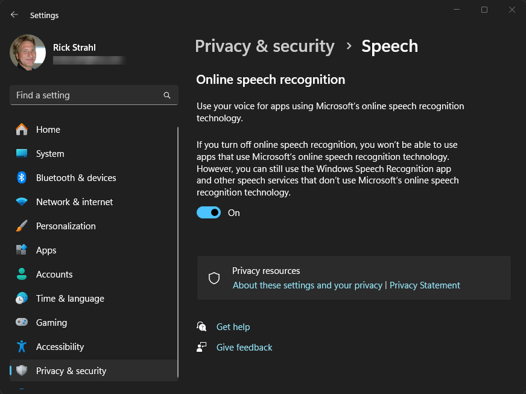
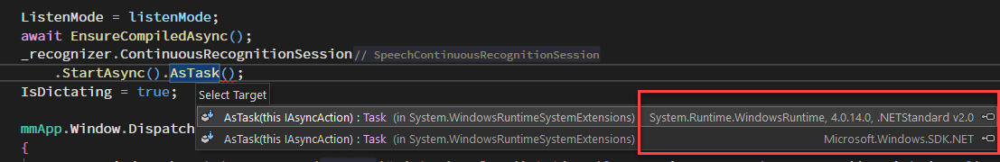
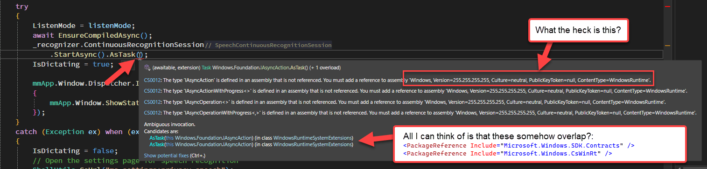

# Using Windows.Media SpeechRecognition in WPF


Windows has a pretty capable SpeechRecognition engine built-in via Windows Media services. In .NET these features are accessible via the Windows SDK (WinSdk) that expose these Windows features to .NET applications. The SDK features succeed the old System.Speech functionality which has a very similar interface, but which uses a much inferior speech recognition engine.

In this post I get specific about using the Windows Media speech recognition and show  a small wrapper class that makes it easy to use Speech Recognition in your application along with some examples of my specific integration in Markdown Monster.


The other big issue I'll cover here relates to using the WinSdk in WPF and specifically using the Windows.Media feature many of which require the old WinRT runtime. Those components were not ported to more the more modern runtime and this further complicates accessing SDK features from .NET and I'll talk in some detail about that because it caused me a lot of pain trying to get these features integrated into my application properly.

##AD##

## Using the Windows.Media.SpeechRecognizer in a WPF application
We'll be using the `Windows.Media.SpeechRecognition.SpeechRecognizer` class which is part of both the Windows SDK. Because this component is an old Windows component that was created during the ill-fated and under powered WinRT/UWP period of Windows, it also requires a second dependency on the WinRT runtime.

This translates to two required NuGet packages:

```xml
<!--  Windows 10 SDK Runtimes  -->
<PackageReference Include="Microsoft.Windows.SDK.Contracts" Version="10.0.22621.2" />
<PackageReference Include="Microsoft.Windows.CsWinRt" Version="*" />
```

> #### @icon-info-circle Windows SDK Requirements
> The SDK.Contracts package reference maps to a Windows release version. `10.0.22621` references the original version of Windows 10 so basically all of Windows 10 and 11 are covered. The higher you go with the SDK versions the higher the required Windows version. Recent SDKs are Windows 11 only for example. For Speech Recognition the 22621 works and works with all versions of Windows 10 and 11.
>
> During development you also need to make sure that you have the matching version of the Windows SDK installed on your machine, as the compiler pulls references during compilation from the installed SDK. You can install Windows SDK with the Visual Studio installer in **Individual Components** or Windows Desktop Development payload.

## Creating an easily reusable Class
With the dependencies out of the way let's build a component that:

* Starts Listening for speech
* Stops Listening
* Shuts down on idle  (important!)
* Handles and fixes up dictation results

The usage is very simple and looks something like this:

```csharp
// during application startup
if (mmApp.Configuration.EnableVoiceDictation)
    VoiceDictation = new VoiceDictation();

// Commands 
public CommandBase StartListeningCommand { get; set; }
void Command_StartListening()
{
 StartListeningCommand = new CommandBase((parameter, command) =>
 {
     Model.Window.VoiceDictation?.StartAsync().FireAndForget(); // async
 }, (p, c) => true);
}

public CommandBase StopListeningCommand { get; set; }
void Command_StopListening()
{
 StopListeningCommand = new CommandBase((parameter, command) =>
 {
     Model.Window.VoiceDictation?.Stop();
 }, (p, c) => true);
}
```

The idea is that you'll want to trigger listening for dictation via some event - likely a keyboard hotkey or menu option - and a command is useful for re-use. In Markdown Monster this ties to hotkeys (F4 to start and ESC to stop), menu options and Command Palette operations.

## Breaking down the VoiceDictation Class
I'm going to break down the code in the VoiceDictation class to point out things that you need to watch out for.

If you just want to look at the complete source code (with a few application specific details that relate to UI) you can jump directly to the full source for the class here:

* [Complete VoiceDictation Class Code (gist)](https://gist.github.com/RickStrahl/9b250c8bff67edd26b79e614b16955eb)

Keep in mind the code has a few small UI related dependencies in it that you need to remove or replace with your own equivalents. These are all support features that aren't required.

If you want to find out more, keep reading...

### Construction and Initialization
The VoiceDictation class is meant to run for the duration of my particular application so it's always ready. As such it's basically tied to the the main Model of the application which sticks around for the lifetime of the entire application running. 

The reason for this is two fold:

* Initialization is not very quick
* You can't have overlapping audio engine operations

In essence, you really want **only one instance of the speech engine going at once**. Since speech tracking is completely asynchronous it's possible that you may not have full control over when the engine stops or is 'done' as there are timeouts and potentially issues with the audio engine. You just want to make sure there's only a single instance that you work off of.

To get started here's the base class definition with a little bit of initialization code:

```csharp
public class VoiceDictation
{
    private SpeechRecognizer _recognizer;
    private bool _isCompiled;
    private bool _isDisposed;
    
    public bool IsDictating { get; private set; }
 
    public VoiceDictation()
    {
        if (string.IsNullOrEmpty(mmApp.Configuration.VoiceDictationLanguage))
            _recognizer = new SpeechRecognizer();
        else
            _recognizer = new SpeechRecognizer(new Language(mmApp.Configuration.VoiceDictationLanguage));

        _recognizer.Constraints.Add(dictation);
        _recognizer.ContinuousRecognitionSession.ResultGenerated += ContinuousRecognitionSession_ResultGenerated;
        _recognizer.ContinuousRecognitionSession.AutoStopSilenceTimeout = TimeSpan.FromMinutes(1);
        _recognizer.ContinuousRecognitionSession.Completed += ContinuousRecognitionSession_Completed;

        Keyboard.AddKeyDownHandler(mmApp.Window, KeydownHandler);
    }
    
    private void KeydownHandler(object sender, KeyEventArgs e)
    {
        if (!IsDictating && e.Key == Key.F4)
           StartAsync().FireAndForget();
        else if (IsDictating && e.Key == Key.Escape)
           Stop();
    }
    
    ...   
}    
```

A few interesting things here. The Speech recognition engine by default works with the currently active Windows language (CurrentUiCulture). The language used can be specified via the `SpeechRecognizer()` constructor from an IETF language value (ie. `en-US`, `de-DE` or `fr`). In Markdown Monster this value is configurable so you can switch languages on the fly and updating the configuration automatically triggers the VoiceDictation engine to be recreated with the new language.

```csharp
// config value
public string VoiceDictationLanguage
{
    get => _voiceDictationLanguage;
    set {
        if (value != _voiceDictationLanguage)
        {
            _voiceDictationLanguage = value;
            if (mmApp.Window?.VoiceDictation != null)
                mmApp.Window.VoiceDictation = new VoiceDictation();
        }

    }
}
```

Next you want to hook up these two events:

* **ResultGenerated**  
Whenever the engine has completed parsing dictated text, this method is fired. This happens when you stop speaking for a short period, or when you shut down the listener via the `Stop()` operation.

* **Completed**  
Always fired at the very end of a listening operation. Use this to detect when the session times out due to no speech input. You can set the timeout via the `AutoStopSilenceTimeout` which I have set to 1 minute.

##AD##

## Starting and Stopping Dictation
Before you can start recording the engine needs to 'compile' the specified listener for the given configuration and language. This is a one time operations, but because the operation is `async` I don't want to fire it from the constructor where I can't easily control completion. You don't want to start listening before the engine is ready.

Instead this method is fired only once from within `StartAsync()` so that we can properly `await` the initialization. The code then calls `StartAsync` on the recognizer that starts the actual listening operation. Subsequent calls then run straight through to `StartAsync()` and fire up a bit quicker.

`StartAsync()` is pretty straight forward then:
```csharp
public async Task StartAsync(DictationListenModes listenMode = DictationListenModes.EscPressed)
{
    if (IsDictating)
        return;

    try
    {
        await EnsureCompiledAsync();

        var action = _recognizer.ContinuousRecognitionSession.StartAsync();  
        // Runtime .AsTask() doesn't work here
        await AsTask(action);
                        
        IsDictating = true;

        mmApp.Window.Dispatcher.Invoke(() =>
        {
            mmApp.Window.ShowStatusProgress($"Listening for dictation ({_recognizer.CurrentLanguage.AbbreviatedName}). ESC to stop.");
        });
    }
    catch (Exception ex) when (ex.Message.Contains("privacy"))
    {
        IsDictating = false;
        // Open the settings page for speech recognition
        ShellUtils.GoUrl("ms-settings:privacy-speech");
    }       
}

 private async Task EnsureCompiledAsync()
 {
     if (!_isCompiled)
     {
         var action = _recognizer.CompileConstraintsAsync();  // Runtime .AsTask() doesn't work here
         await AsTask<SpeechRecognitionCompilationResult>(action);
         _isCompiled = true;
     }
 }
```

A couple of things of note: 

The class keeps track of the current state via `IsDictating` which is turned on in `StartAsync()` and turned off in `Stop()`. This is important both for internally knowing when dictation can be started again, as well as externally for the application so it can properly show options on the Menu for enabling `Start` and `Stop` operation menu choices.

### Windows Speech Features: Make sure they are enabled
It's important that Speech recognition has the Windows Speech Recognition features enabled. If not enabled, the `StartAsync()` call to the recognizer fails with a specific error. If it is a Privacy Features error we know that the privacy settings are not enabled, and we can jump  directly to the Windows configuration topic with:

```csharp
Process.Start("ms-settings:privacy-speech");
```

which gives you:



The `ms-setting:` hack is a useful hack - you can activate most windows feature dialogs/settings directly from code in this way using nothing more than a  `ShellExecute()` operation - it also works from a browser by the way as this is a Url . Here's a link to various [things you can access with `ms-settings`](https://learn.microsoft.com/en-us/windows/apps/develop/launch/launch-settings-app#ms-settings-uri-scheme-reference).

### Async but not Async?
Next, notice that native Windows speech engine operations are all async, but unfortunately they don't use standard `Task` based async results. Instead, the SpeechRecognizer uses WinRT types like `IAsyncAction` and `IAsyncOperation` etc. These types are incompatible with standard `System.Threading.Tasks.Task` and require a helper extension methods to make them properly awaitable using standard .NET code used in WPF. 

The WinRT runtime and the SDK provide `.AsTask()` methods, but because of the dueling references for both the SDK and WinRT runtimes, `.AsTask()` is not directly accessible via code (I've tried but had no luck). Instead I had to rely on Reflection to get this to work.

The way **this should work** (and it probably does in a WinRT/UWP/WinUI application) is this:

```csharp
// this does not work in WPF
var action = _recognizer.ContinuousRecognitionSession.StartAsync().AsTask();
```

but it does not work in my WPF app with both SDK and WinRT references:



The workaround - that took me some time to figure out - involves having to create a custom `.AsTask()` method on the `VoiceDictation` class, that uses Reflection to access the SDK specific version indirectly which works in WPF:

```csharp
var action = _recognizer.ContinuousRecognitionSession.StartAsync(); 
await AsTask(action);
```        

The code for this is pretty ugly and I'll have more on this later. For now just know that all async operations use this custom `AsTask()` method instead of the native extension methods that I was unable to resolve at compile/link time.

Initially when I couldn't get these methods to work,  I just ignored the task results, but I found that especially for the `CompileConstraintsAsync()` awaiting the result is critical or you may end up listening before the engine is ready. I ended up using `Task.Delay()` which helped but results in wasteful wait time.  Awaiting is also important in case there are exceptions as background threads otherwise crash silently, which, as I found out, definitely can destabilize the audio engine - not just in my app, but on the whole system. Initially - without the custom await logic I added later - I had to frequently reset the Speech Recognition engine by turning off the feature and turning it back on.

Back in the code, the `Stop()` method is similar to the `StartAsync()` method:

```csharp
public void Stop()
{
    mmApp.Window.Dispatcher.Delay(220, async () =>
    {
        if (_recognizer.State != SpeechRecognizerState.Idle)
        {
            try
            {
                var action = _recognizer.ContinuousRecognitionSession.StopAsync();   // .AsTask() doesn't work here
                await AsTask(action);

                mmApp.Window.ShowStatusSuccess("Stopped listening...");
                IsDictating = false;
            }
            catch (Exception ex)
            {
                mmApp.Window.ShowStatusError($"Listening engine not stopped: {ex.Message}");
            }
        }
        else
        {
            IsDictating = false;
            mmApp.Window.ShowStatusSuccess("Stopped listenings...");
        }
    });
}
```

The method delays a bit in order to account for pre-mature exits when being too overeager to be done recording 😄. There's a slight delay internally for the recognizer to feed the voice data as text already captured and the short delay accounts for that so that text doesn't get cut off. When I started dictating I found that I was very often truncating the text - the short delay prevents that.

Another thing is that you don't want to stop the engine when it's already idle. In theory this should never happen because when the engine automatically goes idle due to a no-speaking timeout, the `Completed` event should capture that and shut down the listening engine. For those odd cases we want to ensure that `IsDictating` is **always** cleared on the cancel action.

The `Completed` event is a pretty simple one that simply checks if we're still in dictation mode and if so stopping on the timeout operation:

```csharp
private void ContinuousRecognitionSession_Completed(SpeechContinuousRecognitionSession sender, SpeechContinuousRecognitionCompletedEventArgs args)
{
    if (IsDictating)
    {
        Stop();
    }
}
```

Note this is **not the event that handles results** it simply is a sort of `finally` operation that we can  use to capture the cases where the engine decides to stop listening or timing out. But this event fires also when manually stopping and after a result has been generated, but in both of those cases `IsDictating` should already have been set to `false` so the `Stop()` call isn't duplicated. You want to avoid stopping when the engine is already stopped.

This covers the start and stop operations.

### Speech Recognition
But what we're really interested in is the actual speech results, which are captured in the `ResultGenerated()` event handler:

```csharp
private async void ContinuousRecognitionSession_ResultGenerated(SpeechContinuousRecognitionSession sender, SpeechContinuousRecognitionResultGeneratedEventArgs args)
{
    if (args.Result.Status != SpeechRecognitionResultStatus.Success ||
        !mmApp.Configuration.EnableVoiceDictation)
        return;
        
    var text = args.Result?.Text;
    if (string.IsNullOrEmpty(text))
        return;

    // for UI access we need a Dispatched thread
    await mmApp.Window.Dispatcher.InvokeAsync(async () =>
    {
        var ctrl = Keyboard.FocusedElement;
        if (ctrl != null)
        {
            if (ctrl is TextBox tb)
            {
                int caretIndex = tb.SelectionStart;
                tb.Text = tb.Text.Insert(caretIndex, text);
                tb.SelectionStart = tb.SelectionStart + text.Length;
                tb.SelectionLength = 0;
                return;
            }
            return;
        }

        var editor = mmApp.Model?.ActiveEditor;
        if (editor == null)
            return;

        if (text.Trim().Equals("stop recording", StringComparison.OrdinalIgnoreCase))
        {
            Stop();
            return;
        }

        text = await FixUpDictatedText(text, editor);
        await editor?.SetSelectionAndFocus(text);
    });
}
```

This code first makes sure we have a valid response and if we do, it uses a Dispatcher to ensure we can access the UI thread which we need to do to dump the captured text either into an active text control on the Window, or in my specialized case inside of the Markdown editor. 

For a textbox control that has focus, the text is just pushed directly into the textbox.

### Spacing Punctuation and Keywords
For the editor, there's a bit more fix up of the result text that handles a few custom keywords and commands in the `FixupDictatedText()` method:

```csharp
private async Task<string> FixUpDictatedText(string text, MarkdownDocumentEditor editor)
{
    var lineText = await editor.GetCurrentLine() ?? string.Empty;
    var selPoint = await editor.GetSelectionRange();

    lineText = lineText.Substring(0, selPoint.StartColumn);
    string trimLine = lineText.TrimEnd();

    if (text.Length > 1 && (text.EndsWith('.') || text.EndsWith('?') || text.EndsWith('!') || text.EndsWith(',')))
    {
        text += " ";
    }

    if (text.Trim().Equals("space", StringComparison.OrdinalIgnoreCase) && !lineText.EndsWith(' '))
        text = " ";

    if (text.Trim().Equals("line break", StringComparison.OrdinalIgnoreCase) ||
        text.Trim().Equals("return", StringComparison.OrdinalIgnoreCase))
        text = "\n";


    // Capitalize the first character of the text if the last character of the current line is a sentence terminator
    var firstChar = text[0];
    if (string.IsNullOrWhiteSpace(trimLine))
    {
        /* Beginning of the line: do nothing.  */
    }
    else if (text == "." || text == "?" || text == "!")
    {
        return text;
    }
    else if (trimLine.EndsWith('.') || trimLine.EndsWith('!') || trimLine.EndsWith('?'))
    {
        text = firstChar.ToString().ToUpper() + text.Substring(1);
    }
    else
    {
        text = firstChar.ToString().ToLower() + text.Substring(1);
    }

    // Add a space if the last character of the current line is not a space
    if (!string.IsNullOrWhiteSpace(lineText) && !lineText.EndsWith(' '))
    {
        text = " " + text;
    }
    
    return text;
}
```

This code handles a few things that are not immediately obvious when you start with voice recognition: The voice engine doesn't know about your context, so whenever a result is generated it's generated as its own self-contained block of text. This means that more often than not the text doesn't handle leading spacing between blocks correctly. Instead, you end up having words run together or with no spaces between a period and the first word of the next sentence.

The code above tries to fix most scenarios by looking at the insertion point and taking a shot at fixing up the newly added text based on the last sentence/block. For example, the code checks whether we are after a sentence is finished with a period, question mark or exclamation point and if so the new text  insert text is padded with a leading space. If you stopped in the middle of a sentence a space is also added so that new text never runs off the previous word.

The base Windows engine understands punctuation like `period`, `comma`, `question mark` etc. and that's very useful. But it doesn't know about **space** or **return** etc. But it's pretty straight forward to implement these keywords in code **as long as they come in as distinct** results of their own. 

The engine returns results when there's a pause in speaking or when the engine is stopped. So in order for single keywords like **space** or **return** or **stop recording** to work, a pause is first required - basically you wait for the previous text to show up in the editor and **then** you speak the next word(s).

Another useful word sequence is **Stop Recording** which stops recording. I end up using that a lot even though pressing `ESC` isn't exactly a chore.

##AD##

### Language specific Key Words are a problem
The problem with this - at the moment at least - is that these specific words are language specific. I'm checking for specific words in English, but when the user is using another language, any of these words probably get mangled into something else in another language. Not sure how to address that yet.

The language is determined when the speech engine is first started. By default the current system active Windows language is used when MM is started. In Markdown Monster I can override this via a configuration setting.

One sticky point is that the language is set when the Speech Recognition engine is first initialized:

```csharp
_recognizer = new SpeechRecognizer(new Language(mmApp.Configuration.VoiceDictationLanguage));
```

which means, switching languages basically involves reloading the speech engine completely. In MM this is handled via the configuration setting itself:


```csharp
/// <summary>
/// A language code that determines the language used for Voice Dictation
/// Examples: en-US, de-DE, fr-FR, es-ES
///
/// Default is empty which uses the active Windows language at MM startup.
/// </summary>
public string VoiceDictationLanguage
{
    get => _voiceDictationLanguage;
    set {
        if (value != _voiceDictationLanguage)
        {
            _voiceDictationLanguage = value;
            // reload the voice dictation with the new language
            if (mmApp.Window?.VoiceDictation != null)
                mmApp.Window.VoiceDictation = new VoiceDictation();
        }
    }
}
private string _voiceDictationLanguage;
```

This at least allows switching between languages on the fly.

## Windows SDK and WinRT Issues
As I mentioned at the beginning, these features are based on the Windows SDK which is a hefty dependency for a WPF (or WinForms) application. The SDK library alone is about 26mb with all dependencies including the WinRT we're looking at close to 30mb  deployed (~6mb size increase in the installer). If distribution size is a concern in your app, you might want to think twice about whether you want to integrate this functionality.

### Duplicated Types with identical Type Signatures
The other problems are that some of the WinSDK APIs and specifically the SpeechRecognition and Speech APIs are based on Windows RT which is ancient outdated tech. The APIs not the engine which is part of Windows. 

The result of that is that you need both a NuGet package reference to the `Microsoft.Windows.SDK.Contracts` and `Microsoft.Windows.CsWinRt`. The problem: There are overlapping types with **exactly the same type signatures that exist in these two assemblies**. The result of that is that there are dueling type references that - in some cases - cannot be resolved.

Here's the example I ran into with the `.AsTask()` method that's needed to turn WinRT async operations into Tasks a WPF app can await:



Because some of these methods are static extension methods there's no easy way to disambiguate the identical type names. I got part of the way using NuGet Aliases, and explicit type prefixes, but in the end I couldn't call these `.AsTask()` methods using standard .NET syntax.

Visual Studio can tell the difference when trying to navigate:


but in code there seems to be no good way to differentiate these methods.

After spending hours on this problem and a lot of back and forth with CoPilot which yielded only failure I gave and decided to go the Reflection route. Reflection allows me to start with the specific assembly and then pull out the specific type and call each method. 

In the end that worked but it's some really shitty code:

```csharp
MethodInfo _asTaskMethod = null;
MethodInfo _asTaskMethodGeneric = null;
Type _WindowsRuntimeSystemExtensionsType = null;

Task AsTask(object action)
{            
    if (_asTaskMethod == null)
    {
        try
        {
            if (_WindowsRuntimeSystemExtensionsType == null)
            {
                var assemblies = AppDomain.CurrentDomain.GetAssemblies();
                var assembly = assemblies
                    .FirstOrDefault(a => a.GetName()?.Name == "Microsoft.Windows.SDK.NET");
                var types = assembly.GetTypes();
                _WindowsRuntimeSystemExtensionsType = types.FirstOrDefault(t => t.FullName == "System.WindowsRuntimeSystemExtensions");
            }
            _asTaskMethod = _WindowsRuntimeSystemExtensionsType.GetMethod("AsTask", [typeof(IAsyncAction)]);
        }
        catch { }
    }

    if (_asTaskMethod == null)
        return Task.Delay(20);

    var t = _asTaskMethod.Invoke(null, [action]) as Task;
    if (t == null)
        return Task.Delay(20);

    return t;            
}

//await AsTask<SpeechRecognitionCompilationResult>(action);
Task AsTask<T>(object action)
{
    if (_asTaskMethod == null)
    {
        try
        {
            if (_WindowsRuntimeSystemExtensionsType == null)
            {
                var assemblies = AppDomain.CurrentDomain.GetAssemblies();
                var assembly = assemblies
                    .FirstOrDefault(a => a.GetName()?.Name == "Microsoft.Windows.SDK.NET");
                var types = assembly.GetTypes();
                _WindowsRuntimeSystemExtensionsType = types.FirstOrDefault(t => t.FullName == "System.WindowsRuntimeSystemExtensions");
            }
            var method = _WindowsRuntimeSystemExtensionsType.GetMethods()
                    .FirstOrDefault(m => m.Name == "AsTask" && m.IsGenericMethod && m.GetParameters().Length == 1);
            _asTaskMethodGeneric = method.MakeGenericMethod(typeof(T));
        }
        catch { }
    }

    if (_asTaskMethodGeneric == null)
        return Task.Delay(100);

    var t = _asTaskMethodGeneric.Invoke(null, [action]) as Task;
    if (t == null)
        return Task.Delay(100);

    return t;
}
```

I've never been so happy to get this code this shitty to work :smile:

The end result is that now I can call and await the async methods by using my wrappers:

```csharp
var action = _recognizer.ContinuousRecognitionSession.StartAsync();  
await AsTask(action); 
```

and 

```csharp
var action = _recognizer.CompileConstraintsAsync();  
await AsTask<SpeechRecognitionCompilationResult>(action);
```

Yay!

### Code Improvements
Yeah this class is pretty rough in that it is not well encapsulated and mixes some UI elements into the utility features. But it's very focused on a specific task which is handling editor insertion. I could abstract out the messages and add better isolated error handling but it's not really necessary at this point. I may do so in the future, but for now I'm happy enough that it works well.

## What about Win-H?
One thing I should mention is that Windows has built in support and tooling for capturing Speech to text in any application natively. If you can live with a non-integrated solution using `Win-H` to bring up the media recorder gives direct text input into any application without any sort of custom integration.

However, without the integration you end up with the problems I discussed in the article that text may not line up properly and it's a bit more awkward to start and stop recording. Direct application integration is a much better experience, but in a pinch `Win-H` works reasonably well without any code.

##AD## 

## Summary
I have to say I was surprised how well the Windows.Media SpeechRecognition actually works. It does a pretty damn good job interpreting text correctly, even if the mic was far off or if I was mumbling a bit. I've also tried different mics including the computer mic on a noise laptop and in most cases the recognition worked very well.

Compared to the old System.Speech engine I've used in the past the difference between the two is like night and day. It would be a heck of a lot easier and much more light weight using the old System.Speech engine, but the quality of the old engine is so bad that it's pretty much useless. The quality of the dictation capture that comes back makes even me think I might actually use this feature frequently. That's saying a lot from someone who's much more comfortable with written content than voice.

The APIs to integrate this functionality into your applications are very easy to use, but there are some roadblocks relating to the monolithic Windows SDK and WinRT dependencies. In Markdown Monster the SDK size is a real bummer, and the fact that the WinSDK and WinRT have overlapping identical types is a real headscratcher. But in the end it works so well, it's a compelling reason to put up with the problems. And now that I've taken the hit I suppose there are other SDK features that might be a good candidate to integrate with at a later point.

But, above all it sure would be nice if those Speech APIs (both for Speech output and Speech Recognition) could be cleaned up and ditch the WinRT dependency! I'm not holding my breath though.

## Resources
* [Complete VoiceDictation Class Code (gist)](https://gist.github.com/RickStrahl/9b250c8bff67edd26b79e614b16955eb)
* [`ms-settings://` - Available Configuration Monikers](https://learn.microsoft.com/en-us/windows/apps/develop/launch/launch-settings-app#ms-settings-uri-scheme-reference)