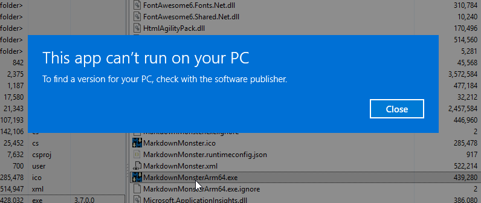
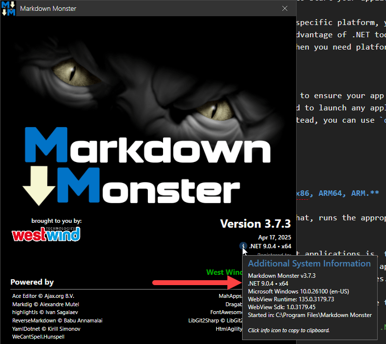
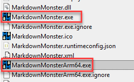
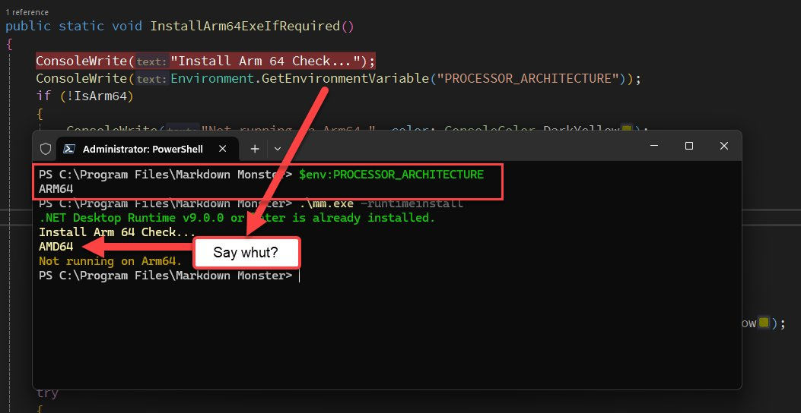
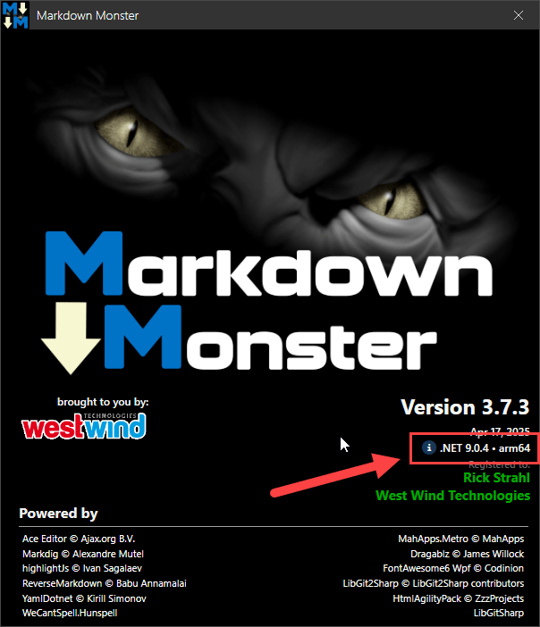

# The Strong ARM of .NET: Wrestling with x64 and Arm64 Desktop App Deployment


<small>*[𝅘𝅥𝅮	 The Strong Arm Of the Law - Saxon](https://open.spotify.com/track/4xwKkJTov5AaJqDmZVSzXn?si=5905b0df8acd42ac)*</small>

If you follow me at all, you've probably heard me talk about some of my travails related to making a .NET Windows Desktop application — [Markdown Monster](https://markdownmonster.west-wind.com) — run well on ARM-based systems. Since it is a .NET application, it should be very simple: .NET is cross-platform and **cross-architecture**, and ARM64 is among the supported targets for .NET binaries. So it should be straightforward to compile an application and have it work both on Windows x64 and Arm64, right?

Well... it works, but it's not anywhere as simple as I expected it to be to have the app run on both Windows x64 and Arm64 **natively**!

I'm coming at this specifically from the perspective of a Windows Desktop application distributed to many customers of all types with both x64 and Arm64 machines. And let's say that the road to getting this to work smoothly was a bumpy one, due to a bunch of weird and very unexpected behaviors in the runtimes and the compilation process.

In this post, I'll discuss some of the things I ran into and yhe workarounds I ended up implementing to create a deployable application that works out of the box on both Win-x64 and Win-arm64.

##AD##

## The Good News: Cross-Compilation is Seamless   
The good news is that in order to compile your application and have it work on ARM, very little is required: as long as you compile your application for `AnyCPU`, the compiled IL runtime code that is generated works on any platform and architecture, assuming you stick to code that works on the target platforms. In this case it's a Windows WPF application running on Windows, and there's technically no difference in API surface between x64 and Arm64. Since .NET compiles into IL byte code that is JIT compiled and executed at runtime, the platform is largely inconsequential. This is true in this scenario with x64 and ARM64 but it often also applies to other platforms like Mac and Linux.

Note that I'm talking about JIT compilation - AOT native compilation is different and doesn't work like this as that generates platform specific native binaries for everything. With AOT completely separate binaries are required for each platform and architecture.  In this post I'm not discussing AOT, and  discuss standard JIT runtime compiled code. This is what the cross-platform functionality of .NET is all about.

And it works surprisingly well without much initial effort... as long as you have the right launcher to start your application!

## The Bad News: Platform Specific Launchers  
For many common .NET application scenarios - specifically Web and Server apps - launchers are not important: If you're building a Web app deployed to a server, you don't need a dedicated launcher and you can use the `dotnet` command to launch an application instead. The `dotnet` command automatically figures out what runtime the compiled application is running under and asking for and loads that specific runtime. You can also explicitly specify a runtime to use. 

For server applications `dotnet` is perfect - you're not distributing the application, and you typically have some sort of script or directive or an AppHost in the case of IIS, that is launching the application in the first place. 

However, if you build a desktop application you generally want to use a platform specific launcher specific to your application, a binary that can be properly signed and won't trigger a potential Anti-Virus software or Windows' built in Run protection warning, as a generic tool like `dotnet` would. Desktop apps that are installed on client machines typically need an explicit launching binary to work as expected.

### Running with the dotnet Command: It just works!
If you're not building desktop deployed applications, the easiest way to ensure your app can launch properly on any platform is to use the .NET runtime's built-in `dotnet` command to launch any application without a platform-specific binary loader (i.e. a Windows EXE). Instead, you can use `dotnet <dllName>`:

```ps
dotnet `LiveReloadServer.dll`
```

**This works on any platform—from Windows to Mac to Linux, from x64, x86, ARM64, ARM.**

The `dotnet` launcher determines the current platform and, based on that, runs the appropriate shared runtime. It all works as you would expect it to.

> ##### @icon-lightbulb Tip: `dotnet` to run Apps Outside of their Published Platform
> If you have a .NET application that is published for a specific platform and is built with .NET, you can potentially get that app to run on another platform assuming the app is compatible with platform.
>
> For example I have a CLI utility called [LiveReloadServer](https://github.com/RickStrahl/LiveReloadServer) which has a Windows x64 distribution and is distributed for a shared runtime installation. The compiled EXE won't run on Arm64 (currently) or on a Mac or Linux, but I can run `dotnet LiveReloadServer.dll`  and **it will then work on these platforms** as long as the application is using a shared runtime. 

Likewise, tools shipped via `dotnet tool` automatically launch the platform-appropriate target and just work on any platform.

> `dotnet tool` is a great and underappreciated solution for publishing cross-platform .NET applications because it automatically works across platforms and architectures without having to worry about runtime installs or platform specific dependencies.

This fact makes `dotnet tool` a great distribution mechanism for small tools and CLI helpers — especially for developers.

Understand though that there are dependencies for `dotnet tool` and `dotnet <yourApp.dll>`:

* `dotnet tool` requires that the .NET SDK is installed
* `dotnet <yourApp.dll>` requires only the .NET Shared Runtime

### Built Platform Executables: Not so much!
If you build a Windows application targeted for `AnyCPU` you are effectively building an application (the DLL) that works on any CPU supported by .NET Runtimes, but the **launcher generated is built for a specific platform and architecture**. If you're building on an x64 system and you don't explicitly specify a `<PlatformTarget></PlatformTarget>` or you use `AnyCPU` (which is the default) the main `EXE` generated uses the current platform default. So if I built on Windows x64 I get x64 Launcher. Building on an arm64 machine I get Arm64 Launcher exe.

The .NET launcher EXE points at your main application DLL that needs to be launched. From what I can tell it doesn't care about specific versions, it only cares about the filename which has to match your compiled assembly name. The EXE and DLL generally have the same name, but if you rename the EXE, it still has to find the old assembly name DLL.

The launcher is not .NET code - it's a native binary, and it acts as a .NET AppHost that loads the .NET runtime. Because it's a native EXE it has a regular Windows PE header that identifies which platform it can run on. For x64 that means it can run on x64 and also on ARM. But on ARM it runs as x64 in Emulation mode which works fine but is slower than native Arm64 execution. If you build an Arm64 exe, it'll only run on an Arm64 installation. Trying to run it on x64 results in a hard fail:

  
<small>**Figure 1** - An ARM compiled application launcher on an x64 system fails to run.</small>

An x64 compiled launcher on an arm64 machine works, but the application then runs in x64 emulation mode:

  
<small>**Figure 2** - Running an x64 app on ARM results in the app running in x64 Emulation mode which is slow.</small> 

x64 emulation on ARM works and it's how many application run on ARM. It works and performance is not terrible but it's noticably slower than running in native Arm64 mode. More on that later.

In both cases on x64 and arm64 running:

```ps
dotnet markdownmonster.dll
```
runs the native versions regardless where the launcher was compiled. In other words:

> Using `dotnet <yourApp.dll>` the application is perfectly compatible for native x64 and arm64 and works fine on either platform, but the launcher EXEs are not!

## Fixing the Launcher Problem
Bottom line: If you want to have an application that works natively both on Windows x64 and Arm64 with an EXE launcher, **you need to have two separate executables**.

For Markdown Monster I settled on the following approach that I'll discuss here:

* Build the app two times - once for arm64 and once for x64
* Rename the arm64 exe to `MarkdownMonsterArm64.exe`
* At install time, check for platform 
* If arm64 swap the main Exe for the Arm64 exe

Let's go through it...

### Building for x64 and arm64 Targets
At minimum we need two executable launchers: One for the x64 and one for arm64. This can be accomplished by building the project with multiple targets - twice:

Here are the relevant project file directives:

```xml
<Project>
  <PropertyGroup>
      <PlatformTarget>AnyCPU</PlatformTarget>
      <!-- <PlatformTarget>arm64</PlatformTarget>-->
      <Version>3.7.3</Version>
      ...
  </PropertyGroup>  
  
  <PropertyGroup Condition="'$(PlatformTarget)' == 'arm64'">
    <!-- 
        Optional: Use a base version
        You only need this if you don't compile for ARM every time
    -->
    <Version>3.7</Version>
  </PropertyGroup>
  
  ...
   
  <Target Name="PostBuildArm" AfterTargets="PostBuildEvent" Condition="'$(PlatformTarget)' == 'arm64'">
      <Message Text="Executing PostBuildArm target" Importance="high" />
      <Exec Command="copy  &quot;$(TargetDir)MarkdownMonster.exe&quot; &quot;$(ProjectDir)MarkdownMonsterArm64.exe&quot;" />    
  </Target>
 
  <None Update="MarkdownMonsterArm64.exe">
     <CopyToOutputDirectory>PreserveNewest</CopyToOutputDirectory>
  </None>
</Project>
```

The idea is that the `PlatformTarget` is changed between `AnyCPU` and `arm64` for the appropriate build. Building this way produces identical output EXCEPT for the launcher EXE which are customized for the specified platform.

The `<Target>` at the bottom then copies the Arm64 exe to `MarkdownMonsterArm64.exe`. I actually copy this into my **project folder** rather than the build folder and set the file to **Copy if newer** which copies the file into the output directory on build. The reason for this is, so I don't have to build the arm64 exe every time. 

> Remember the launcher doesn't depend on specific versions so you can build your launcher once and continue to use it with newer versions of your project. I like to update the launcher with each minor version which doesn't change very frequently. There are probably 20 release builds within a minor version, and I only have to rev the minor version once for all those builds.

To build the two exe's you have a couple of options:

1. Build the project twice for each platform with multiple `dotnet build`  calls
2. Build once every minor (or major) version

#### Always Build two Exe's
To build every time for both targets run dotnet publish/build twice:

```ps
# as part of build script
dotnet publish ..\markdownmonster  -o .\publish -c Release /p:PlatformTarget=arm64
dotnet publish ..\markdownmonster  -o .\publish -c Release /p:PlatformTarget=AnyCPU
```

Make sure you build `arm64` first, since the last build will produce the final main EXE ie. `MarkdownMonster.exe`. Since the `arm64` only works on Arm64 you'll want to use the `AnyCPU` for the final build to ensure even if you forget to build and swap the Arm launcher the app will still run.

You want that to be the AnyCPU version so even if the files don't get swapped properly the app will run on all platforms.

#### Only Build For Minor/Major Version Updates
Compiling twice can be slow, so it might prudent to not recompile all the time. 

As mentioned previously, the Launcher is tied to the main DLL only by its assembly name, so there's no need to keep rebuilding the Arm64 launcher - you can reuse the same launcher over many versions. The main reason to recompile the launcher would only be update the version number.

I like to rev the Launcher on minor versions and for this scenario I just manually compile once with the `<PlatformTarget>arm64</PlatformTarget>` set, then set back to `AnyCPU`.

I then copy the EXE into my project directory and set it to `Copy only if newer` so it always gets copied into the output folder.

### Swap the Arm64 Exe During Install
The output folder after a build then looks like this:

  
<small>**Figure 3** - Distributing an application with both x64 and Arm64 Exes is required to run natively on either platform</small>

You might be Ok with having these two separate EXEs and running the appropriate one on each platform. Perhaps you can set up your Installer to create the appropriate shortcuts to link to the appropriate EXE.

For Markdown Monster this isn't the right choice, because people can and often do launch Markdown Monster from the command line. There's also an intermediary launcher that is used for this as well and having to add additional code in there to determine which EXE to run would increase complexity unnecessarily. 

So I chose to swap the EXEs during the Installation process on ARM swapping out the Main EXE with the Arm64 one.

##AD##
### Installer Helper
To do this I have an [Installer helper that I already use during installation to install the .NET Runtime](https://weblog.west-wind.com/posts/2023/Jun/21/Getting-the-NET-Desktop-Runtime-Installed-with-a-Custom-Runtime-Checker-and-Installer) if it's not present.

The helper is a tiny .NET Framework Console application that is called from the installer with a `-runtimeinstall` command line switch. The helper is a .NET framework app, because its main function is to check if the .NET Core Runtime that the app requires is installed. The .NET Core runtime may not be available yet, hence the `net472` target on the helper.

In this same Console app I added another operation that can hot-swap the Main EXE for the Arm64 EXE. Here's what that code looks like:

```csharp
[DllImport("kernel32.dll", SetLastError = true)]
static extern bool IsWow64Process2(IntPtr hProcess, out ushort processMachine, out ushort nativeMachine);
const ushort IMAGE_FILE_MACHINE_ARM64 = 0xAA64;

internal static bool IsArm64
{
    get
    {
        if (IsWow64Process2(Process.GetCurrentProcess().Handle,
                out ushort procArch,
                out ushort osArch))
        {
            if (osArch == IMAGE_FILE_MACHINE_ARM64)
                return true;
        }
        return false;
        
        // !!! This doesn't work on .NET 4.x
        //return RuntimeInformation.OSArchitecture == Architecture.Arm64;
    }
}


/// <summary>
/// Hotswap the Arm64 executable if running on Arm64.
/// </summary>
public static void InstallArm64ExeIfRequired()
{
    ConsoleWrite("Installing Arm64 Exe...");
    if (!IsArm64)
    {
        ConsoleWrite("Not running on Arm64.", color: ConsoleColor.DarkYellow);
        return;
    }

    var armExe = Path.Combine(Program.InstallDirectory, "MarkdownMonsterArm64.exe");
    var mainExe = Path.Combine(Program.InstallDirectory, "MarkdownMonster.exe");
    var x64ExeRenamed = mainExe.Replace(".exe", "x64.exe");

    if (!File.Exists(armExe))
    {
        ConsoleWrite("Arm64 Executable doesn't exist: " + armExe, color: ConsoleColor.DarkYellow);
        return;
    }

    try
    {

        if (!File.Exists(x64ExeRenamed))                     
            File.Copy(mainExe, x64ExeRenamed, true);
        File.Copy(armExe, mainExe, true);

        ConsoleWrite("Main Exe replaced with Arm64 Exe...", color: ConsoleColor: ConsoleColor.Green);
    }
    catch(Exception ex) 
    {
        ConsoleWrite("Error copying Arm64 Executable: " + ex.Message, ConsoleColor: ConsoleColor.Red);
    }
}
```

Note that I had to resort to calling a native function to reliably detect the Arm64 OS in a .NET 4.72 executable running on Arm. Neither `RuntimeInformation.OSArchitecture`:

```csharp
return RuntimeInformation.OSArchitecture == Architecture.Arm64;   // false even on arm64
```

nor the `PROCESSOR_ARCHITECTURE` environment variables are returning the correct state:

  
<small>**Figure 4** - The `PROCESSOR_ARCHITECTURE` Environment variable doesn't give you what you would expect: It's **Process specific** not machine specific.</small>

Apparently this returns a **Process specific value** and that value is fixed up for .NET Framework executables. IOW, it's not a global OS value which is confusing as hell - especially for the `OsArchitecture` value.

The native call to `IsWow64Process2()` works reliably however even though it's a little more effort.

So with the above code in an exe called `mm.exe` that is activated with `-runtimeinstall` parameters I then call this from [Inno Setup](https://jrsoftware.org/isinfo.php) installer script:

```ini
[Run]
Filename: "{app}\mm.exe"; Parameters: "-runtimeinstall -silent"; Description: "Checking for and installing the .NET Desktop Runtime..." 
```

And with that I now - finally - have a clean arm64 install out of the box where x64 gets a `AnyCPU` x64 EXE and ARM gets an arm64 EXE:

  
<small>**Figure 5** - And finally - a working native Arm64 application out of the box!</small>

Yay!


## Some general ARM Deployment Notes
Here are a couple of related notes about first deploying and running on Arm64.

### Which mode am I in?
What made this especially painful is the fact that for the longest time I actually thought I was running in native arm64 mode, when the app actually was running in Emulation mode. 

It's an easy mistake to make: If you compile to `AnyCPU`,  I wrongly assumed that the app would automatically run in native ARM mode. It  **certainly does run**, but it doesn't run in natively and instead runs in x64 Emulation.

It wasn't until quite a bit later when I started to actually display the `ProcessPlatformTarget` that I noticed the problem. And yeah, that was my fault because of a bad assumption that AnyCPU would 'just work' on ARM. It works, but it **doesn't work right**!

The process to get the app to automatically start up in the native modes on both platforms requiring to separate EXEs isn't exactly straight forward. There are other ways to do what I describe above using MsBuild, but no matter which way you do it, it involves multiple builds and some extra project build configuration steps.

### ARM vs x64 Emulation Performance
When I finally managed to properly run the application natively, the performance difference was quite striking compared to running in x64 Emulation. x64 Emulation startup is very laggy. It takes a couple seconds just to get to the logo screen. The app running too feels sluggish - usable but not snappy.

Running in native Arm64 mode the app pops up immediately on the logo screen. Navigating the UI is immediately responsive and the overall performance is on par to my main i9 laptop on my x64 laptop which is impressive given this is an $800 laptop.

The moral of the story: It's worth putting in the effort to make sure your app can **run natively on ARM** to get this improved performance. Your ARM users will thank you!


##AD##

## Summary
It's sad that getting an app to run seamlessly both on x64 and Arm64 has to be such a painful process.

This would be so much easier if .NET could produce an executable that could load either an x64 or ARM process. Or even have a `<PlatformTargets></PlatformTargets>` option that let you build for multipe targets. 

I suppose there's no simple way to get this behavior that would be similar to the way that the `dotnet` command can do it. `dotnet` does some fancy process load juggling to make it work transparently like it does, and that's not something that could be done in a single EXE. So it is what is.
  
In the end you'll need two EXEs and the best you can do for users is to make this process transparent to users by swapping files depending on the platform. It works and isn't that big of a deal to set up. As is usually the case the biggest hurdle is knowing what needs to be done to get there. I hope this post helps a bit on that front... Now go build something!