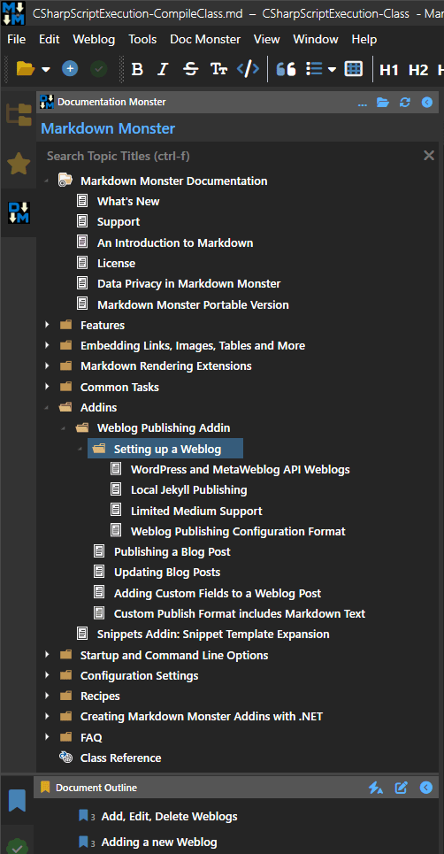

# Avoiding WPF Image Control Local File Locking


WPF image locking has tripped me up a lot in XAML applications: The WPF image control by default locks image files when directly linking to an image file on disk. When you simply bind or assign an image file, internally WPF uses a stream that is not closed and kept open. In some cases this doesn't matter, for example if your images are rarely or never updated.

But in some cases it does matter: In several of my applications I have **tons of icons** that get loaded into a TreeView control with the icons being related to user defined templates that can and often are updated. The locked files become a problem as these locked files can't be deleted. In one particular use case I update my templates by nuking the original folder, then re-creating the folder and copying the new templates which include the potentially updated icon images. With the default locking behavior that fails as the locked files - and the parent directory can't be deleted or copied over.

There may be other scenarios too - in some cases you might use a single image file that is updated by the application and needs to be redisplayed after the change when the image is rebound. 

If you can't update the image, none of that works. There are ways to make this work but unfortunately the default behavior is such that the file is locked. And as is often the case when you start building out a new control or form, you don't think about locking issues - that only comes to bite you later. And in those cases I usually spent a while flailing trying to remember exactly what settings have to be changed.

This blog post is meant to put this all into one place so my aging self can find and remember  more easily :smile:

##AD##

## Using the Image Control with an embedded BitmapImage
The first solution is a built-in one that works with XAML only. It's a little verbose but other than that very simple.

Rather than binding an image like this:

```xml
<Image Source={Binding TopicState.DisplayTypeIconFile} />
```

which binds directly to a file on disk as a string and locks the image file, you can bind to a Bitmap source on which you can control the cache behavior:

```xml
<Image Height="16">
    <Image.Source>
        <BitmapSource
            UriSource={Binding TopicState.DisplayTypeIconFile} 
            CacheOption="OnLoad"
     />
    </Image.Source>
</Image>
```

This loads the image into memory on bind and releases the underlying file stream which solves the locking issue. 

If you also need to ensure the image is refreshed you need to add:

```xml
<BitmapSource
    UriSource={Binding TopicState.DisplayTypeIconFile} 
    CacheOption="OnLoad"
    CreateOptions="IgnoreImageCache"
 />
```

This forces the image to reload every time the image is rebound. This is not great for performance so you should be careful with this and only use when necessary, as it adds overhead on each rebinding operation.

## More Generic: Using a Binding Converter as in Intermediary
Another way to do this is via an **Binding Converter** that handles this behavior and allows releasing the underlying cached images explicitly to force reloading of the images when the list is rebound.

The idea here is that you can use a converter on an image path. The advantage of the converter is that you have more control over the image creation process and you can do it consistently for many images using the same logic. It can also cache images so that reused images aren't reloaded.

For example, I like to cache images since in my app when I reuse tons of icons for complex tree views:

  
<small>**Figure 1** - A TreeView with many repeating images that are cached and reused</small>

The icons are cached, so that each unique icon is essentially loaded from a single `BitmapImage` instance, which saves resources and loads noticeably faster.

Here's what the image control using the converter looks like used in a XAML form:

```xml
<UserControl.Resources>
    <windows:LocalFileImageConverter x:Key="LocalFileImageConverter"/>
<UserControl.Resources>

...

<Image Height="16"
       Source="{Binding TopicState.OpenImageFilename,
                Converter={StaticResource LocalFileImageConverter}}" 
/>
```

### A LocalFileImageConverter Class
This converter takes a local file link as a string and turns into `BitmapImage`. If an image cannot be found a default image image is returned. This thing is specifically used for icon images in Markdown Monster and Documentation Monster. Images are cached so any given icon reference is reused if referenced multiple times as is the case in **Figure 1**.

```csharp
public class LocalFileImageConverter : IValueConverter
{
    public  static Dictionary<string, BitmapImage> CachedBitmapImages = new Dictionary<string, BitmapImage>();

    public static void ClearCachedImages()
    {            
        CachedBitmapImages = new Dictionary<string, BitmapImage>();
    }

    public object Convert(object value, Type targetType, 
                          object parameter, System.Globalization.CultureInfo culture)
    {
        string val = value as string;

        if (!string.IsNullOrEmpty(val))
        {
            val = ((string)value).ToLower();

            if (CachedBitmapImages.TryGetValue(val, out BitmapImage bi))
                return bi;
            
            try
            {
                using (var fstream = new FileStream(value.ToString(), FileMode.Open, FileAccess.Read, FileShare.Read))
                {
                    bi = new BitmapImage();
                    bi.BeginInit();
                    bi.CacheOption = BitmapCacheOption.OnLoad;
                    bi.StreamSource = fstream;                        
                    bi.StreamSource.Flush();
                    bi.EndInit();
                    bi.Freeze();

                    bi.StreamSource.Dispose();
                }
                CachedBitmapImages.Add(val, bi);                  
                return bi;
            }
            catch {
            }

            return AssociatedIcons.DefaultIcon;
        }
        //if (val != null)
        //    CachedBitmapImages.Add(val, null);
        return null;
    }

    public object ConvertBack(object value, Type targetType, object parameter, System.Globalization.CultureInfo culture)
    {
        throw new NotImplementedException("LocalFileImageConverter: Two way conversion is not supported.");
    }
}
```

#### Non-locking Image Loading
There are a couple of things of interest. The first is the image loading which is customized for non-cached loading that ensures that the image is not locked on disk:

```csharp
using (var fstream = new FileStream(value.ToString(), FileMode.Open, FileAccess.Read, FileShare.Read))
{
    bi = new BitmapImage();
    bi.BeginInit();
    bi.CacheOption = BitmapCacheOption.OnLoad;
    bi.StreamSource = fstream;                        
    bi.StreamSource.Flush();
    bi.EndInit();
    bi.Freeze();  // optional optimization
}
CachedBitmapImages.Add(val, bi);                  
return bi;
```

Note that this code explicitly flushes the stream and freezes the image. I found that in some situations not flushing caused the stream to stay open. The flush forces reading to the end. `Freeze()` optimizes image usage as it removes any binding hooks and checks. I suspect this has little effect since the BitmapImage isn't directly bound but it can't hurt to `Freeze`.

#### Clearing the Cache to Refresh Images
Another useful feature is that the cache can be cleared so that image can be refreshed explicitly. Each `BitmapImage` instance is stored in a cached static dictionary which is index by the path. So multiple images referencing the same path then reuse the same `BitmapImage` instance.

It's possible to clear the image cache to force all images to be reloaded from disk, or you can directly access the dictionary and remove an individual path and `BitmapImage`. The next time this image is rebound it reloads from disk. If the image has changed the updated image should render. Note that you have to trigger the refresh and potentially the rebind on the controls that are bound using the converter.

##AD##

## Summary
Loading images from disk is generally frowned upon in WPF. WPF prefers loading things from compiled in resources, but if you have user configurable files like custom icons or custom images, then external files are required to make that work. And in those scenarios it's especially important that files aren't locked when they need to be updated since these external files can and often are updated either individually as part of application operation, or as is in my case in a wholesale operation of updating templates.

The `<Image>`  and `<BitmapImage>` controls have some built-in support to avoid locking but it's pretty verbose and for me at least hard to remember. I personally prefer a converter that universally ensures that images are loaded and cached all in the same way.

This `LocalFileImageConverter` converter is an old tool, but at this point, I pretty much use this for any application that uses a TreeView or List control with icons. But it also works for other types of images that are loaded from disk... as long as I **remember**. Hopefully this post helps. 😄