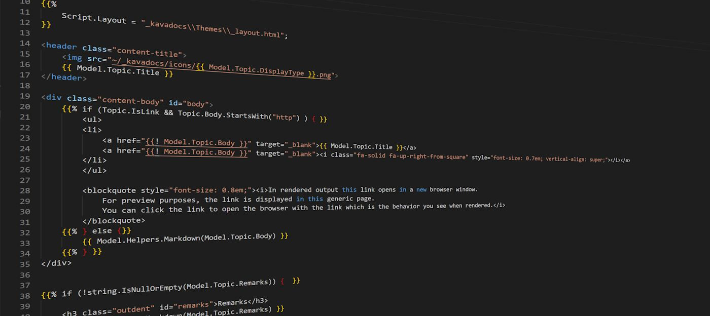
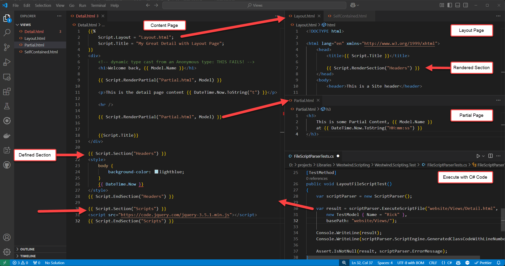
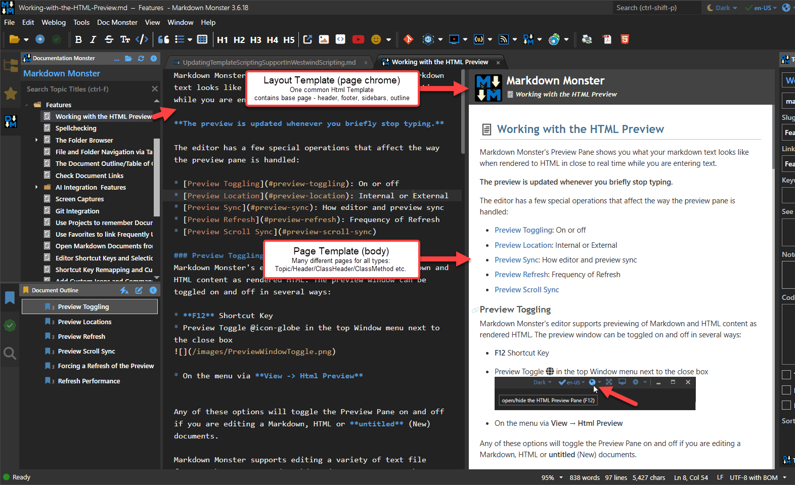

# Westwind.Scripting Templating Library: Adding Support for Layouts, Partials and Sections


This is a test of the emergency broadcast system. 

This is a test of the emergency broadcast system. I want to keep typing here and let you know that we have completed this input exercise successfully. I want to thank you for coming out and listening to this communication.

I'm finally breaking down and updating the C# scripting engine via the `ScriptParser` class in [Westwind.Scripting](https://github.com/RickStrahl/Westwind.Scripting) to support layout pages. I got fed up with trying to shoehorn other script engines (Razor and Liquid Templates) into my templating solutions. Razor especially (both hosted and internal) - after having gone down the wrong path several times now, and running into complications that were a pain to resolve and hack around. I've come to the conclusion the only way to use Razor effectively is as part of a full scale ASP.NET application. 

I  like the idea of having a fully self-contained solution that is easily portable and not dependent on the whims of some big scripting environment or beholden engine like Razor that also doesn't play very well outside of anything but . NET dev IDEs and actual ASP.NET project. I've been through this cycle one to many times :smile:

I've always had a small scripting library as part of my [Westwind.Scripting library](https://github.com/RickStrahl/Westwind.Scripting), which is a C# runtime compilation library plus a [ScriptParser Template Engine](https://github.com/RickStrahl/Westwind.Scripting/blob/master/ScriptAndTemplates.md) that provides basic C# Handlebars style templating. I created **Westwind.Scripting** originally 20 years ago, and it's gone through many, many iterations as the compiler technology in .NET has changed. A few years back I [updated the library to support the latest Roslyn compilation APIs](https://weblog.west-wind.com/posts/2022/Jun/07/Runtime-C-Code-Compilation-Revisited-for-Roslyn) and at the time also added a `ScriptParser` class for script template parsing and execution.

The `ScriptParser` works with Handlebars like syntax and raw C# code - the parser compiles code at runtime and executes it with support for just about all C# features via Handlebar tags. The latest Roslyn based version has been around for 5 years or so now, and the basic script engine had basic single template parsing support plus the ability to `RenderPartial()` to pull in external content from files.

In this latest iteration which is the focus of this post, **I added support for Layout pages and Sections** which provide a feature I'd been wanting to use for a long time. In the past I'd made do with content pages and partials to simulate this functionality - but it's tedious as you still end up copying a lot of code in each of the content pages. Layout pages fix most of that as you can have a single page with the page chrome with content pages only providing specific content. 

This is relevant to me as I'm creating documentation for a variety of topic types with each topic type using slightly different layout and features. Having a single page consolidating all the base page layout is much preferable than syncing up 20 different topic type templates.

So in the latest release of the `ScriptParser` there's now support for Layout Pages and Sections and in this post I'll talk a bit about scenarios when it makes sense to use a tool like this, and also of how it works and how it was built. 

I have integrated the new script engine into the new .NET solution now and it's been a joy to work with. For now this is an internal Add-in for Markdown Monster specifically set up for documentation creation and it's been a fun implementation to build. The application integration is a pretty real-world test case for the scripting engine, as I have some help documents that have thousands of topics and the engine handles that with ease (building Html output for ~4k documents in 5-7 seconds) as well as live previews that regenerate with every few keystrokes without any stutter.

The scripting via Handlebars is not as nice as Razor, but it provides full feature access to just about all C# features in templates. VS Code also manages the HandleBars syntax nicely, even though there's no syntax support for the embedded C# code. But the most useful feature is that the engine is easy to integrate and run: Most of the script compilation and execution logic is wrapped up in a single relatively short method. And because the code has no dependencies outside of the Roslyn compiler APIs it can be easily packaged even into a class library project in this case in the business layer of the application. 

So let's dive in.

If you want to jump to 'Just show me code!' head to the GitHub repo. The repo has all the info you need to get started quickly and if you want you can look at the source code or check out the tests that demonstrate much of the functionality.

* [Westwind.Scripting on GitHub](https://github.com/RickStrahl/Westwind.Scripting)
* [Template Script Expansion in Westwind.Scripting](https://github.com/RickStrahl/Westwind.Scripting/blob/master/ScriptAndTemplates.md)
* [Deep Dive on Westwind Scripting inner Workings](https://weblog.west-wind.com/posts/2022/Jun/07/Runtime-CSharp-Code-Compilation-Revisited-for-Roslyn)  <small>*(original release blog post)*</small>

Keep reading if you want to learn more about the why and how of the library. 

##AD##

## What is Westwind.Scripting and what do I use it for?
I have a number of desktop applications that require runtime scripting. One is a documentation solution, another is a data generator and a few others use both the dynamic execution and scripting for templating and application automation.

There are two parts to the library

* **C# Script Execution Engine**  
This is the basic C# execution engine that lets you compile and execute code. There are several ways you can do this, by either running a code snippet or method, or by creating a class that can be loaded and reused.

* **Script Template Engine**  
This template engine leverages the script engine to parse templates into C# code that's then executed by the script engine. Templates use Handlebars style templates which use `{{ expression }}` and `{{% codeBlock }}` tags to execute code inside of text templates. Templates can be executed from string or from file. 

### Script Templating Features
The template engine is the focus of this post and here are some of the features:

* String based template execution
* File based script execution 
* Support for Partials loaded from disk (both string and file scripts)
* Support for Layout and Section directives (file scripts only)
* Support for Layout Pages and Sections (for file only)
* Expressions and code blocks use raw C# syntax
* Familiar Handlebars syntax with C# code:
    * `{{ C# expression }}`
    * `{{% code block }}`    
       commands can be split across multiple lines, and any other content 
       block - literal text or expressions
    * `{{: html encoded Expression }}`
    * `{{! raw expression }}`
    * `{{@ commented block @}}`
* Code blocks can be use structured statements (for, while, if, using { } etc.)
* Script compiles to plain C# code at runtime
* Compiled code is very efficient 
* ScriptParser instance caches compiled output

`ScriptParser` is built on top of the `CSharpScriptExecution` class which is used for compilation and script execution. The parser class adds the ability to parse the Handlebars-style scripts into C# code that is then executed by the script engine. 

The parser has an internal `ScriptEngine` member, which allows full control over the script compilation and execution so you can add assemblies, get detailed error information, set compiler options etc.

### Use Cases
I use the dynamic execution feature in Markdown Monster for the Snippet Template Expansions and Commander Scripting Addins which both allow users to extend the functionality of Markdown Monster with [dynamic text expansions in Snippets addin](https://markdownmonster.west-wind.com/docs/_5gs0uc49h.htm), and [application automation via the Commander addin](https://github.com/RickStrahl/Commander-MarkdownMonster-Addin). The Snippets expansion uses the `ScriptParser` template expansion to mix text with expressions and code to produce embeddable text. The latter use pure code snippet execution to perform automation tasks.

Here's an example of the Snippets Addin in Markdown Monster, running user provided snippets:


I also use the ScriptParser to generate output for my internal documentation solution which creates a self-contained Web site for documentation (Examples: [here (product)](https://markdownmonster.west-wind.com/docs) and [here (product)](https://websurge.west-wind.com/docs/) and [here (generated class reference)](https://docs.west-wind.com/westwind.utilities/)). Html is generated from Templates for live previews in real time as you type and for final bulk output generation of the entire Documentation project. The process is blazing fast (4k+ topics generated in ~5-7 seconds in one project).

In short, it's proven very useful to me for a whole host of uses cases.

## Adding the Missing Feature: Layout/Master Pages
The original version of scripting library only supported single template execution meaning you could provide a string or file as a template to execute. The code in the template would be parsed and executed. In addition there was also support for `{{ Script.RenderPartial("partial.html") }}` to pull in additional scripts that are separately executed.


What's missing - compared to classic ASP.NET and Razor - has been Layout or Master pages that serve as a top level container into which content pages can render. While it's possible to achieve something similar with heavy use of partials, it's a lot easier to create a top level site layout and then render specific content into it. This is especially useful for any sort of documentation where the 'site' chrome never changes between pages except for the content and perhaps a few headers on the page. Layout pages make these types of layouts much simpler.

So the latest version of Westwind.Scripting now has support for this feature. Here's a screen cap that tries to put it all into a single shot:

  
<small>**Figure 1** - A test example that demonstrates Content, Partials, Layout and Sections in templates using Handlebars syntax. All files are .html files to facilitate editor syntax support.</small>

In practice here's what rendered output looks like for one of my documentation solutions (an internal addin for Markdown Monster at this point). Here the editor preview renders a merged Documentation template for an individual topic:


<small>**Figure 2** - An example of a rendered template using a Layout and Content page for a documentation solution.</small>

In this solution I have many different topic types: Topic, Header, ClassHeader, ClassMethod, ClassProperty, WhatsNew etc. Each of these are 'Content' pages which are `.html` files and each references the same **Layout** page that contains the page header and footer, and also the topic list sidebar and a current document outline (both hidden in the preview but visible for the published online pages). The Layout page has several defined sections for the page header and page footer - to add css and script on particular content templates if necessary and there are one or two partials used for some reusable list displays.

The point is simple: There are different types of templates that render slightly differing content, but they all need to render the exact same page chrome. The Layout page makes this easy.

```html
{{%
    Script.Layout = "_kavadocs\\Themes\\_layout.html";    
}}

<header class="content-title">
    
    {{ Model.Topic.Title }}
</header>

<!-- page content here  -->
```

Additionally because this is raw C# code, I can call from my model into my application's code to generate additional logic from within my application.

For example, I can add code here to format an inheritance tree display into my class header documentation topic:

```html
{{% if (!string.IsNullOrEmpty(Topic.ClassInfo.InheritanceTree)) { }}
    <small>
        {{ Model.Helpers.FormatInheritanceTree(Model.Topic) }}
    </small>
{{% } }}
```

`Helpers` in this case is a class that consolidates a handful of Html rendering functions that are application specific. But these types of insertion functions could be hosted anywhere including directly on the model for simpler implementations.

Nothing in all of this is particularly new: These concepts are heavily borrowing from Razor or ASP.NET classic pages or any other MVC style framework. The difference here though is that this isn't a framework - this is simply a template engine that has full support for C# so you can do whatever you want to, in any type of .NET application as it's a small lightweight implementation that relies only on the Roslyn compiler as a dependency.

### Not meant to replace Razor for Web Applications!
I want be clear: I'm not pitching this as a replacement for Razor or any other Web script engine. For pure .NET based Web applications that need scripting Razor is a great solution, especially when you pair it with editor tooling that provides the complex syntax coloring and auto-complete. I would never consider replacing Razor with this scripting engine for a Web application. I'd make an exception perhaps for an API that needs a one-off HTML page, or an HTML email confirmation but beyond that, there's no reason for an ASP.NET Web application to not use Razor Pages or MVC with Razor Views.

### Razor has major Shortcomings for Non-Web Apps
But... if you need to **integrate scripting or templating into a non-Web solution**, or even in a Web solution if you need to render output to a string, Razor is a pain in the ass, because it's closely coupled to ASP.NET and the required runtime dependencies. You need the ASP.NET Runtime to use it even in a Desktop or pure Console application. It's also not easy to host Razor in non-Web applications, and even if you use one of the wrapper libraries that support this, there are limitations in what works and some things work differently than the 'full' version of Razor in ASP.NET. 

Then there's also the hassle of editor support: As much as I like Razor, outside of a Visual Studio or Rider, Razor page code has shit for support in other editors (including Visual Studio Code) or even in Visual Studio if the Razor page is not part of a full ASP.NET project in which case you'll be inundated with compilation errors for missing references. Without proper syntax support and Intellisense, Razor is actually quite ugly to look at!

### So what do you use Westwind.Scripting for?
So the Script Parser tends to be used for offline applications and that's how I've been using it. Here are some use cases that I use it for today:

* Documentation Html Generation - templates with doc content mixed in (in Documentation Monster)
* String Template expansion in the Markdown Monster editor (Snippet Expansion Addin)
* Commander Markdown Monster Automation (Extensibility Scripting Addin)
* Mail Merge for software releases (offline)
* Non UI Text Merging in Web apps (think confirmations, emails etc.)  
<small>*(doable with Razor but it's a PITA)*</small>

## Show me the Code: How does it work?
The script parser works either strings as input (for single file templates and partials only) or with files. For Layout pages and partials to work you need to use files which have support for these other file based template integrations.

### String Template Rendering
For simple string based rendering here's what an example looks like:

```csharp
string script = @"
Hello World. Date is: {{ DateTime.Now.ToString(""d"") }}!

{{% for(int x=1; x<3; x++) { }}
{{ x }}. Hello World
{{% } }}

DONE!
";
var scriptParser = new ScriptParser();
var result = scriptParser.ExecuteScript(script, null);

// merged content as a string
Console.WriteLine(result);  

// Generated Class Code with Line Numbers
Console.WriteLine(scriptParser.ScriptEngine.GeneratedClassCodeWithLineNumbers);

// Error Information is available on the .ScriptEngine property
// which captures compilation and runtime errors
// ErrorType, ErrorMessage, ErrorException are available
Assert.IsNotNull(result, scriptParser.ScriptEngine.ErrorMessage);
```

The output from this is:

```text
Hello World. Date is: 3/31/2025!

1. Hello World
2. Hello World

DONE!
```

Pretty straight forward and simple. In this example the model is passed in generically and parsed as a `dynamic` value that is passed to the template code. If you'd rather pass the model using a fixed type you can use the `ExecuteScript<TModelType>()` overload. If you have a strong type the generic version is preferred as it gets around weird edge cases where dynamic might misinterpret types or null values.

If you look at the template code you see the `{{ expression }}` and `{{% codeBlock }}` tags. 

It breaks down like this:

```html
<!-- Opening code block -->
{{% for(int x=1; x<3; x++) { }}

<!-- literal text with expression expansions -->
<div>{{ x }}. Hello World</div>

<!-- closing for block -->
{{% } }}
```

Each block can have additional code however like this:

```html
{{% 
var sb = new StringBuilder();
for(int x=1; x<3; x++) 
{
    var output = x + ". Hello World";
}}

<!-- literal text with expression expansions -->
<div>{{ output }}...</div>

<!-- closing the for block -->
{{% 
    sb.Append(output);
} }}
```

Expressions expand inline and simply replace the expression value for the tag. They are expanded as string values - by default rendering using `ToString()`. 

Code blocks are raw bits of C# code and they expand as-is into the generated code. They also strip off the linefeed at the end of the block so generated text doesn't end up with extra line breaks. Code Blocks can be single line blocks as shown in the first example, or multi-line code blocks that combine multiple operations. When creating structured blocks (ie. `if` or `for` statements) with markup text between the start and end statements you need two code blocks for each part separated by the markup in between. Each of these blocks can contain additional code as shown in the second example.

> Bottom line: Expressions and Code blocks are simply embedded as-is into the generated code with any markup between embedded as string literals. 

### References and Namespaces
Because code gets compiled, the compiler needs to know what references are available to bind to so you have to ensure all the references used in your script code are explicitly added. Even though the code loads into the current process, the compiler knows nothing what references your host application is using, so all references have to be profided explicitly.

The script engine by default is created with commonly used .NET Core assemblies loaded so it works with common base C# code. But if you may have to load additional assemblies - including some core .NET libraries that are part of the runtime explicitly.

Here's how you add references and namespaces so the compiler can resolve your script code:

```csharp
var scriptParser = new ScriptParser();
scriptParser.AddAssembly(typeof(ScriptParserTests));  // from type
scriptParser.AddAssembly("./Westwind.Utilities.dll"); // from file

// Alternately load all of the hosts already loaded assemblies
scriptParser.ScriptEngine.AddLoadedReferences();  // load host process refs

scriptParser.AddNamespace("Westwind.Scripting.Test");
```

Namespaces can also be added in code:

```csharp
            string script = @"
{{%
    using Westwind.Utilities;
}}
From Westwind.Utilities: {{ StringUtils.Replicate(""Hello World "",2) }}
";
```

There's a lot more information on reference loading approaches provided in the previous article. It goes through all the options  including providing and passing a .NET Reference library.

### Take a look at Generated Code - no really!
The easiest way to understand how Literals, Expressions and Codeblocks work behind the scenes is to look at the generated code from script template above:

```cs
 1.  using System;
 2.  using System.Text;
 3.  using System.Reflection;
 4.  using System.IO;
 5.  using System.Net;
 6.  using System.Net.Http;
 7.  using System.Collections;
 8.  using System.Collections.Generic;
 9.  using System.Collections.Concurrent;
10.  using System.Text.RegularExpressions;
11.  using System.Threading.Tasks;
12.  using System.Linq;
13.  using Westwind.Scripting;
14.  
15.  namespace __ScriptExecution {
16.  
17.  public class _ihdrgmic
18.  { 
19.  
20.  
21.  public object ExecuteCode(params object[] parameters)
22.  {
23.  dynamic Model = parameters[0];
24.  ScriptHelper Script = new ScriptHelper() { BasePath = ""  };
25.  
26.  using( var writer = new ScriptWriter())
27.  {
28.  writer.Write("\r\nHello World. Date is: ");
29.  writer.Write(  DateTime.Now.ToString("d")  );
30.  writer.Write("!\r\n\r\n");
31.   for(int x=1; x<3; x++) { 
32.  writer.Write(  x  );
33.  writer.Write(". Hello World\r\n");
34.   } 
35.  writer.Write("\r\nDONE!\r\n");
36.  return writer.ToString();
37.  
38.  } // using ScriptWriter
39.  
40.  
41.  }
42.  
43.  
44.  } 
45.  }
```

You can see that script is basically broken down into 3 things:

* **Literal text**  
All non code text is treated as a literal. In the generated code literals are written out as properly encoded C# string literals which is why you see line breaks and other encoded text.

* **Expressions**  
Expressions are parsed and embedded - as-is - and written out as string values.

* **Code Blocks**   
Similar to expressions any code block code is written out as is, but there's some additional logic that tries to clean up line breaks after to avoid extra line breaks introduced by the code tags.

From a coding perspective the hardest part about all of this is the literal parsing - finding all the places and special cases where literals break and expressions or code starts. 

There are also different tag prefixes that need to be parsed:

* **{{: expression }}** - Explicitly Html Encoded 
* **{{! expression }}** - Always parsed as Raw Text - no encoding

Note that there's an option to automatically Html Encode all expression tags:

```csharp
scriptParser.ScriptingDelimiters.HtmlEncodeExpressionsByDefault = true;
```

which makes the `{{: expr }}` syntax redundant. 

### Error Handling
If compilation errors occur in the code the `.ScriptEngine.ErrorMessage` will have error information pointing at specific line numbers that can be used to debug the code. This can be super useful for scripting solutions: In Markdown Monsters Command Scripting Addin the errors and generated code are displayed so you can glance at the generated code and glean where the error occurred - in there I adjust the line numbers so they match up with the user provided code. 

There are two `.ScriptEngine.ErrorType` values: Compilation, Runtime which you probably want to handle differently. For compilation errors you'd potentially show the code or some variation of the code and potentially a specific line in the code. For runtime errors you likely want to catch the error and either display it or handle it in some generic way.

### File Template Rendering for More Features
If you want to render templates from disk, the base features work the same as with templates except you use `ExecuteScriptFile()`.

If you're calling a single self contained template it works exactly the same as `ExecuteScript()`


```csharp
var scriptParser = new ScriptParser();
var result = scriptParser.ExecuteScriptFile("website/Views/SelfContained.html", 
             new TestModel { Name = "Rick" });

Console.WriteLine(result);
Console.WriteLine(scriptParser.ScriptEngine.GeneratedClassCodeWithLineNumbers);
Assert.IsNotNull(result, scriptParser.ErrorMessage);
```

The template in this case is a self-contained Html page:

```html
{{%
  Script.Title = "Self Contained Page";
}}
<!DOCTYPE html>
<html lang="en" xmlns="http://www.w3.org/1999/xhtml">
<head>
    <meta charset="utf-8" />
    <title>{{ Script.Title }}</title>
</head>
<body>
  <h1>This is a self contained page!</h1>

  <p>Hello, {{ Model.Name }}</p>

  <p>This page is self contained and doesn't require any external resources to render.</p>

  {{ DateTime.Now.ToString("d") }}
</body>
</html>
```

### Content Page in MultiPage Layouts
But it gets more interesting if you are working with multi-page layouts where you have multiple pages that use a common theme layout. You can separate out Content pages and Layout pages the latter of which provide the site chrome that can potentially be customized through the model that is passed to it.

In this scenario you have:

* A Content Page that holds the current Page Content
* A Layout Page that is referenced from the Content Page
* Partial Pages loaded from either Content or Layout Pages

Let's start with the Content page. This page contains the relevant content that holds the current information to display. So in my documentation example, each topic renders as a Content page. The content page is the top level page that is referenced by the code that invokes the Template. The template then can optionally link a Layout page that provides the base layout which is then merged into the Content template as it's rendered and compiled. 

```csharp
var scriptParser = new ScriptParser();
scriptParser.ScriptingDelimiters.HtmlEncodeExpressionsByDefault = true;

var result = scriptParser.ExecuteScriptFile("website/Views/Detail.html",
                    new TestModel { Name = "Rick" },
                    basePath: "website/Views/");

Console.WriteLine(result);
Console.WriteLine(scriptParser.ScriptEngine.GeneratedClassCodeWithLineNumbers);

Assert.IsNotNull(result, scriptParser.ErrorMessage);
```

Here's the `Detail.html` content page - notice the `Script.Layout  = "detail.html"` at the top that links in the Layout page. The page demonstrates a lot of the different features of the templates all of which should look familiar if you've used Razor/Blazor or ASP.NET Pages.

```html
{{%
    // This code will execute at the top of the Layout page
    Script.Layout = "Layout.html";
}}
<div>
    <h1>Welcome back, {{ Model.Name }}</h1>

    
    {{ Script.RenderPartial("Partial.html", Model) }}

    <p>This is the detail page content {{ DateTime.Now.ToString("t") }}</p>

    {{% 
        string display = string.Empty;
        for(var i = 1; i <= 5; i++) {  
            // any C# code
            display = "Name " + i;
    }}
    {{ i }}. {{ display }}
    {{% } }}

    <h3>Inline Methods</h3>
    {{ Add(8,10)}}        
    {{%
        // Example of an inline function
        int Add(int a, int b)
        {
           return a + b;
        }
        writer.WriteLine(Add(5, 10));        
    }} 
  
    {{%
        var text = "This is & text requires \"escaping\".";
    }}

    Encoded: {{: text }}
    Unencoded: {{! text }}
    Default: {{ text }}

    {{%
        // write from within code blocks
        writer.WriteLine("Hello world, " + Model.Name);  // unencoded
        
        // write with HtmlEncoding
        writer.WriteHtmlEncoded( $"this text is basic {Model.Name}, but \"encoded\".\n" );
    }}
</div>

{{ Script.Section("Headers") }}
<style>
    body {
        background-color: lightblue;
    }
    <script> 
        var viewMode = { Name:"{{ Model.Name }}" };
    </script>
</style>
{{ Script.EndSection("Headers") }}

{{ Script.Section("Scripts") }}
<script src="https://code.jquery.com/jquery-3.5.1.min.js"></script>
{{ Script.EndSection("Scripts") }} 
```

### Layout Page
The Layout page is loaded via a code reference to `Script.Layout = "Layout.html";`. This code can appear **anywhere** in the code and it doesn't need to be in a `Section` block as shown in the example - the parser picks it up and finds the page. The page is referenced relative to the page it's called from - in this case in the same folder. 

The Layout Page and the Content page are actually merged into a single text document - or Html document in this case - when code is generated, so the Layout page has access to the same model that the main content page has access to. But keep in mind that any code that runs in Content page runs after the Layout page code has run. IOW, by the time the first code inside of the Content page, the Html header has already been rendered, so you can't set the title after the fact. You can work around this by using a Section in the layout page. 


```html
<!-- inject code here so it's available/set above Script.RenderContent() -->
{{ Script.RenderSection("StartDocument") }}
<!DOCTYPE html>

<html lang="en" xmlns="http://www.w3.org/1999/xhtml">
    <head>
        <title>{{ Model.Name }}</title>
   
        {{ Script.RenderSection("Headers") }}
    </head>
    <body>
        <header>This is a Site header</header>
        
        <!-- main content goes here -->
        {{ Script.RenderContent() }}

        <footer>
            <hr/>
            Site Footer here &copy; {{ DateTime.Now.Year}}
        </footer>

        {{ Script.RenderSection("Scripts") }}
    </body>
</html>
```


## Implementation
If you've gotten this far, following is an overview of the implementation of the scripting engine and the new Layout/Section functionality in particular. Once you have a reliable way to execute code that is provided by the Scripting engine in Westwind.Scripting, creating the template engine is actually relatively straight forward as it essentially becomes a code generation exercise.

The idea is pretty simple - you take a user provided template - either from string or from disk, and build an executable method out of it. You then build a class and load it and then execute the method. This is the same concept that Razor (and ASP.NET classic pages before that) use to execute code. If you've ever run into the Razor or ASP.NET error page and you drill into the source code you can see that the page code is basically a single method that has expansions for literal text, code expressions and code blocks.

The  `ScriptParser` in `Westwind.Scripting` takes that very same approach.


## Resources

* [Previous Post: Runtime Compilation with Roslyn and Building Westwind.Scripting]()