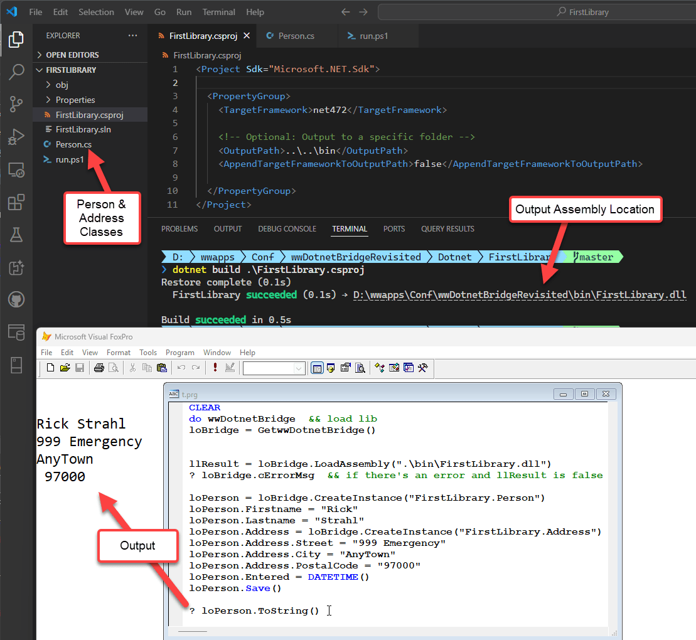
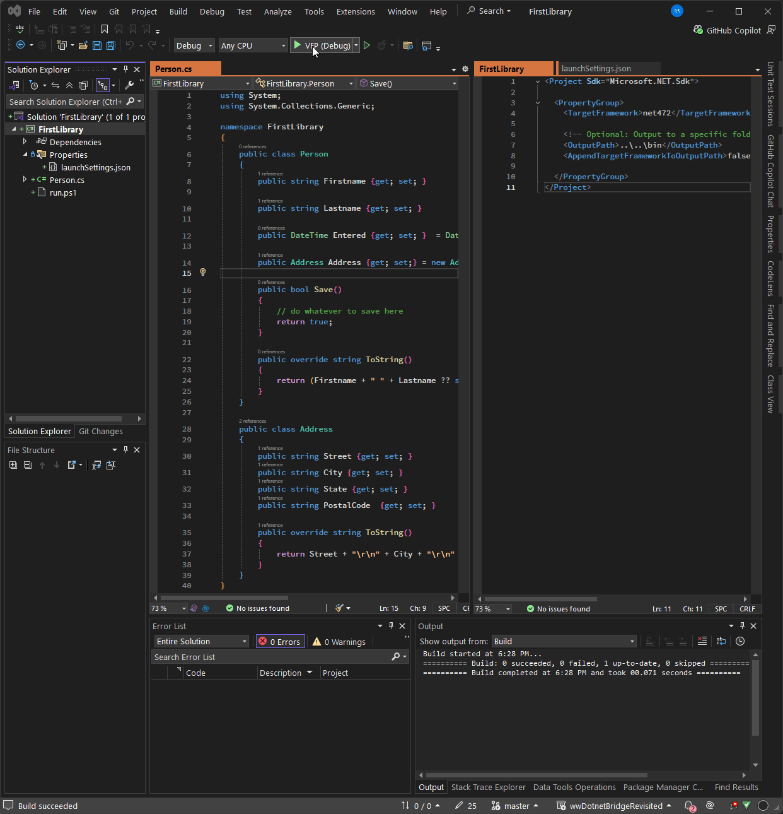
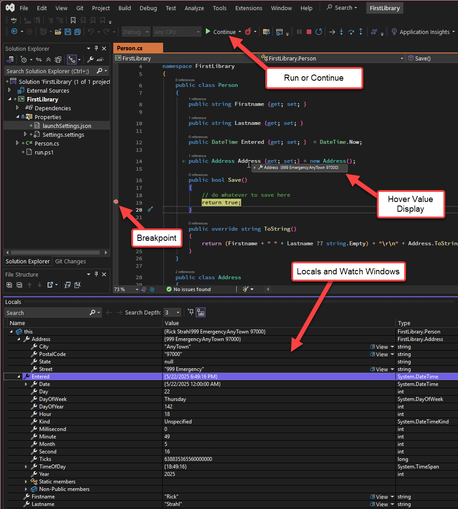

# Creating and Debugging .NET Assemblies for wwDotnetBridge and Visual FoxPro


If you're using [wwDotnetBridge](https://github.com/RickStrahl/wwDotnetBridge) with FoxPro it's quite likely that at some point you'll want to create your own .NET Dlls that interface with external .NET code. While wwDotnetBridge allows you to interface with .NET directly, the code you have to write can be quite tedious because for many things you have explicitly reference the intrinsic methods like `InvokeMethod()`, `SetProperty()`, `GetProperty()` to interact with data that is not compatible over straight COM. While most of these things can be done from FoxPro, the process of doing so is often verbose and in some cases requires multiple objects to be passed around. These intrinsic type scenarios are also relatively slow - compared to native code that is directly executed from .NET. At minimum every .NET call involves a COM call between FoxPro and .NET and when using the Intrinsic methods using Reflection in .NET. It's not horribly slow but compared to native .NET code directly called from .NET it's definitely slower.

Additionally using .NET natively gives you much easier discovery of what's available via the .NET IDE tools that provide rich Intellisense, code completion, CoPilot, Refactoring and easy code navigation. All of this adds up to a richer experience.

Now if you're making only one or two calls into a .NET library from FoxPro it's probably not worth creating a separate .NET component. But if you're making a lot of calls back and forth or the code is performance sensitive, then it may very well be worth your time to create a wrapper .NET compoent that you make one or two consolidated calls to and which then handles many .NET operations or entire component functionality.

I am a big fan of building wrapper components in .NET where you can pass a few key values of input to the wrapper from FoxPro using COM optimized types, and the wrapper then does the brunt of work using native .NET code. If you look at most West Wind components like `wwSmtp`, `wwFtpClient`, `MarkdownParser`, this is exactly how those components are built - there's a .NET class that exposes most of the functionality with a few very focused method calls that combine hundreds of .NET calls and a FoxPro front end abstraction that calls into the wrapper. This is by far my preferred way of exposing functionality from .NET libraries to FoxPro as it optimizes each platform for what it does best.

I know many of you old FoxPro dogs want to do everything in FoxPro, but one of the big advantages of wwDotnetBridge is that it lets you bridge the gap between FoxPro and .NET. It provides an easy on-ramp for experimenting and integrating .NET code into your own applications one piece of code at a time. Whether you implement a single .NET method that you call from FoxPro, a full class, or a whole complex API of components or business objects - you can choose your own pace. Because you're calling a library you can choose how modular you want to go. It's a practical way to create small islands of functionality outside of FoxPro that still can easily integrate with your FoxPro application transparently.

##AD##

## Creating your own .NET Components
So when you build a .NET component to interface with, you're going to create a **Library Project** in .NET. A .NET Class library is essentially library of potentially unrelated classes that doesn't have a 'startup' class. A library is a project without an entry point: It's not a Desktop or Web or Console project, but it's just one or more .NET types (classes, structs, enums etc.) that can be called directly from .NET or... from FoxPro using wwDotnetBridge. 

Any .NET class library that you create can be instantiated and called via wwDotnetBridge. IOW - you create a class in .NET, put it somewhere FoxPro can find it and call it with wwDotnetBridge:

```foxpro
do wwDotnetBridge  && load lib
loBridge = GetwwDotnetBridge()

llResult = loBridge.LoadAssembly("bin\MyFirstLibrary.dll")
? loBridge.cErrorMsg  && if there's an error and llResult is false

loPerson = loBridge.CreateInstance("MyFirstLibrary.Person")
loPerson.Firstname = "Rick"
loPerson.Lastname = "Strahl"
loPerson.Address = loBridge.CreateInstance("MyFirstLibrary.Address")
loPerson.Address.Street = "999 Emergency"
loPerson.Address.PostalCode = "97000"
loPerson.Entered = DATETIME()
loPerson.Save()
```

To create a minimal .NET project literally takes two files: A project file and a source code file that contains one or more classes  that can be called. If you need more classes or components you can add them to the same file or create new classes. The new .NET project system automatically picks up and compiles all source files it finds so it's easy to add functionality.

There are a number of ways to create a new project, but due to the fact that recent versions of Visual Studio and the `dotnet new` CLI don't include templates for new .NET Framework (net4.x) projects.

While you can use the tooling, but my preferred way of doing this is just creating the project file and the main class by hand (or [copying an existing project template from here](https://github.com/RickStrahl/swfox2024-wwdotnetbridge-revisited/tree/master/Dotnet/New%20Project%20net472%20Template)). 

There are two reasons for this :

* .NET Tools (Visual Studio and the dotnet CLI) don't support creating new .NET 4.x projects
* It's easy to copy a couple of files to disk

Although neither Visual Studio, the `dotnet` command line or VS Code support creating .NET Framework projects, you can definitely build them once created. They are just hiding .NET Framework projects because Microsoft is trying to push everyone to .NET Core.

However, I **highly recommend** that you create .NET Framework (.NET 4.x) projects rather than .NET Core projects for your components unless you have a pressing need for .NET Core features or you need to interface with another library that does not support .NET 4.x or .NET Standard 2.0 which both can be used with the built-in .NET Framework. 

The reason is simply that the .NET Framework is built-into Windows so there's nothing to install. You can create a .NET Framework project compile and run without any other requirements other than the tiny DLL created (plus any dependent assemblies your component references). .NET Core on the other hand requires that a compatible runtime is installed, which means you have to make sure that your application checks and deploys the right runtime. There's no such requirement for .NET Framework.

> If you build for .NET Framework chances are that you can also move the code to .NET Core easily by adding a second target, so this is not a 1-way street or you can multi-target and actually support both. Difference between them are slight especially if you stick to core functionality.


##AD##

### Creating a new Project 'by hand'
There are a number of ways of creating a .NET project, but here's what I do:

* Create a new folder
* Open Visual Studio Code in that folder initially (or any other editor)
* Create the following two Files in there (Project and first component)
* Use the command line tools to build and run to test the component

I do this even if I have Visual Studio installed. Why? As mentioned neither Visual Studio or the `dotnet new` CLI has support for .NET framework. While you can create a new project for `netstandard2.0` which is *close* to what you need - you need to make a few small changes to the project. So rather than screw around with this changing template and remove things that don't work,
I use either a template from disk or manually create the files and copy in the small bits of project and initial class code.

Start by creating creating a new folder for your project and opening an editor there:

```ps
# create and goto  directory
cd D:\wwapps\Conf\wwDotnetBridgeRevisited\Dotnet\FirstLibrary

# Open VS Code in folder mode
code .
```

Create two files:

* `FirstProject.csproj`
* `Person.cs`

Here's the project:

```xml
<!-- FirstLibrary.csproj -->
<Project Sdk="Microsoft.NET.Sdk">

  <PropertyGroup>    
    <TargetFramework>net472</TargetFramework>    

    <!-- Optional: Output to a specific folder. Relative or absolute -->    
    <OutputPath>..\..\bin</OutputPath>
    <AppendTargetFrameworkToOutputPath>false</AppendTargetFrameworkToOutputPath>
   
  </PropertyGroup>
</Project>
```

This sets the target .NET 4.72 or later and puts the output DLL into the specified folder. The folder is optional - if you don't specify it goes into a deep folder hierarchy below the project. Typically you don't want this.

Personally I like to put all my .NET assemblies either into my application's root folder (if there's only one) or `.\BinSupport` folder below it for many Dlls.

Next you need to create at least a single `.cs` source file with a class in it. I'll create the `Person` and `Address` classes I used in the previous example here:

```csharp
// Person.cs
using System;
using System.Collections.Generic;

namespace FirstLibrary
{
    public class Person
    {
        public string Firstname {get; set; }
        
        public string Lastname {get; set; }
        
        public DateTime Entered {get; set; }  = DateTime.Now;

        public Address Address {get; set;} = new Address();
        
        public bool Save()
        {
            // do whatever to save here
            return true;
        }

        public override string ToString()
        {
            return Firstname + " " + Lastname ?? string.Empty;
        }
    }

    public class Address
    {
        public string Street {get; set; }
        public string City {get; set; }
        public string State {get; set; }
        public string Zip  {get; set; }

        public override string ToString()
        {
            return Street + "\r\n" + City + "\r\n" + State + " " + Zip;
        }
    }
}
```

Next we need to build the project. You can open a Terminal (Powershell here) either in Visual Studio Code or directly on the command line in the project folder and then build the project.

```ps
dotnet build FirstLibrary.csproj
```

This builds the project into the output folder which happens to live below my FoxPro project folder as `.\bin`.

I can then call the and the component from FoxPro with:

```foxpro
CLEAR
do wwDotnetBridge  && load lib
loBridge = GetwwDotnetBridge()

llResult = loBridge.LoadAssembly(".\bin\FirstLibrary.dll")
? loBridge.cErrorMsg  && if there's an error and llResult is false

loPerson = loBridge.CreateInstance("FirstLibrary.Person")
loPerson.Firstname = "Rick"
loPerson.Lastname = "Strahl"
loPerson.Address = loBridge.CreateInstance("FirstLibrary.Address")
loPerson.Address.Street = "999 Emergency"
loPerson.Address.City = "AnyTown"
loPerson.Address.PostalCode = "97000"
loPerson.Entered = DATETIME()
loPerson.Save()

? loPerson.ToString()
```

Altogether it looks like this:



The above does:

* Builds the project and compiles into the app folder (..\..\bin)
* Open FoxPro
* Runs the test.prg file

Cool it works.

### Shutting down Visual FoxPro to Unload .NET Assembly
.NET and any components cannot be unloaded once loaded, so in order to update the DLL you have to shut down the host process, which in this case is Visual FoxPro (or your app EXE).

If you need to make any changes to the DLL code, you need to:

* Shut down Visual FoxPro (or EXE)
* Rebuild the .NET project
* Restart Visual FoxPro

To make this cycle a little easier I tend to create a small Powershell (or Command) script  that I can run from the terminal in the project folder:

```ps
# run.ps1
dotnet build .\FirstLibrary.csproj

if ($LASTEXITCODE -ne 0) {
    exit
}

$startdir = $pwd

Set-Location ..\..
& D:\programs\vfp9\vfp9.exe
Set-Location $startdir
```

This script handles building the project and launching VFP. It doesn't shut down FoxPro first - you'll have to do that manually, but building and starting up FoxPro is handled to make the launch a bit quicker than manually fumbling around to launch VFP in the right place.

All of this works fine and it's pretty low impact so far. No need to install anything beyond the .NET SDK and VS Code (or your editor of choice). 

But things could be a little more integrated. And that's where Visual Studio comes in.

If you want:

* A smoother build and run cycle
* Ability to debug your DLL
* Much better Intellisense, project navigation etc.

then using Visual Studio is a worthwhile upgrade to the dev process.

### Opening the Project in Visual Studio
Although I used Visual Studio Code (or no editor/IDE at all) to create the project originally, I can now also open this project in Visual Studio by opening the `FirstProject.csproj` from Explorer and selecting *Visual Studio* to open:

  
<small>**Figure 4** - Opening the project in Visual Studio lets you build and run more interactively</small>

From here you can build (right click *Build* or *Rebuild*) or you can *Debug* the project with the debugger using the green run button. 

In order for that to work we need one more file to configure how to 'launch' our Dll. Create a `launchsettings.json` file that contains the startup options (you can also do this from **Properties -> Debug -> Open Debug Launch Profiles Ui** but it's easier to create the file manually):

```json
{
  "profiles": {
    "VFP (Debug)": {
      "commandName": "Executable",
      "executablePath": "d:\\programs\\vfp9\\vfp9.exe",    
      "workingDirectory": "D:\\wwapps\\Conf\\wwDotnetBridgeRevisited\\Dotnet\\FirstLibrary"
    }
  }
}
```

This file specifies the path to the Visual FoxPro IDE (or if you prefer your application executable) and the folder that you want to start it in, which is your FoxPro project folder. From there you can then run your application or test program as I did in the example above.

### Debugging .NET Code: Visual Studio drives the Process
For debugging it's important to understand that you are driving the debugging process through Visual Studio/.NET rather than through your FoxPro application. Visual Studio launches FoxPro or your application, and you then run the code that eventually hits the .NET code that you have a breakpoint on. But Visual Studio is in control of the process and FoxPro is just the target that actually calls into .NET code you are debugging.

> Note that you can debug your own code .NET readily enough, but in most cases you can't debug external, system or third party .NET code unless debug information (`.pdb`) file is provided by the vendor. 

So, with the Launch profile configured we can now run the application in Debug mode. When running in Debug mode you can now set breakpoints in your code, and the debugger then stops on those breakpoints:

  
<small>**Figure 5** - Stopped on a breakpoint in the Visual Studio Debugger. </small>

When on a breakpoint you can examine values using the Locals and Watch windows, but you can also hover over any active values or properties to display their values. From there you can continue to step over code using all the standard over, into, out step operations you're familiar with.

Another nice feature: The debugger supports hot reload, which means you can make changes to some code while the app is running. If you've changed code that's already executed, you can move the execution pointer back to before the edit location and the code runs again with the newly compiled code. This can be a huge time saver when you're fixing code and trying to get it to work correctly.

This example doesn't use any external libraries, but if you were interfacing with other libraries things work exactly the same. Again - debugging is limited to your own code in most cases.

And that's it! With this you have all you need to build, run and debug your .NET components.

> VS Code also supports debugging and there's also a commandline debugger available. However, those debuggers only work with .NET Core and even then they don't work very well with an external process to attach to.

##AD##

## Summary
If you're using wwDotnetBridge it's a good idea to take advantage of .NET as best as you can by avoiding excessive .NET code written from FoxPro code using wwDotnetBridge functions. If you're writing copious amounts of wwDotnetBridge code in FoxPro it's time to think about offloading that code into a .NET class or component that you can abstract and call from FoxPro with a simpler and much less chatty interface.

Building .NET libraries is much easier than it used to be in days past, either using the no-IDE command line tooling, or if you want the IDE experience with a somewhat less intrusive Visual Studio installation. The tooling is drastically better and less intrusive to install than it used to be a few years ago.

By using .NET code for more complex tasks you can make development of your code easier, and also improve performance by avoiding a chatty COM interop interface calls for every member access. While performance of wwDotnetBridge both with native COM calls and Reflection intrinsic method calls, doing those calls directly in .NET is still considerably faster.

I highly recommend this approach on anything that exceeds a few lines of .NET code that you need to call from FoxPro. .NET code is compact and you can cram many different components into a single tiny DLL that you can ship with your application with little to no overhead. And since you're using wwDotnetBridge already anyway, having one extra DLL is not an issue.

Finally, by offloading some processing into .NET you have a chance to learn something new at your own pace. Because wwDotnetBridge interfaces deal with components you can create components large and small to move small chunks of your application to .NET that you can perhaps use in the future in other projects or if you decide to migrate in the future. 

## Resources

* [wwDotnetBridge Github Repository](https://github.com/RickStrahl/wwDotnetBridge)
* [wwDotnetBridge Revisited Article](https://www.west-wind.com/wconnect/weblog/ShowEntry.blog?id=57032)