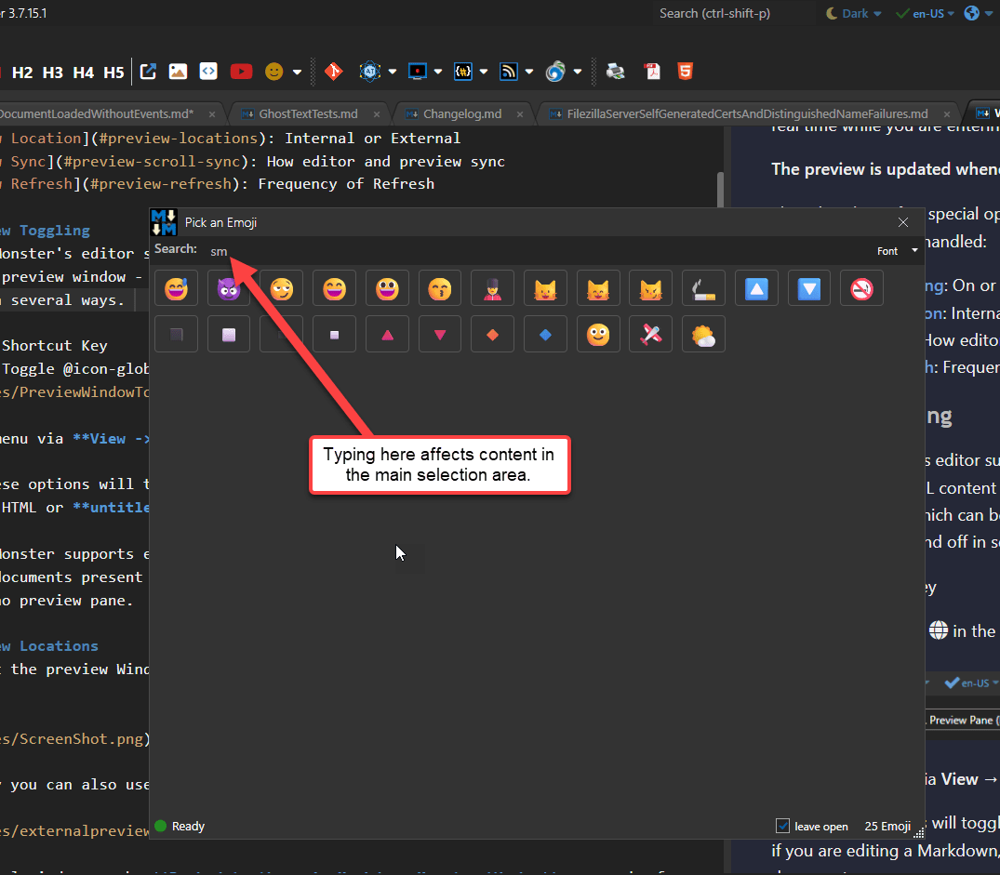

# WebView2: Waiting for Document Loaded


When building hybrid Web applications where .NET code interacts with WebView HTML content, one of the sticking points is the event based disconnect between loading a document, and then having to wait for the document to load into the control, and **then** starting to interact with the document via script code.

While there are events - `CoreWebView2.DOMContentLoaded` specifically - using an event handler is not always easy to work into application flow. 

It's easy to use the WebView control and **just display** a Url where you are essentially letting the browser complete the page load asynchronously in the background. Take something even as simple as the following when you want to pre-load some content into the HTML document:

```cs
WebView.Source = "http://localhost:5200/MyPage"

// BOOM!
await WebView.ExecuteAsync("alert('Document has loaded.')");
```

Yeah, dumb example, but you get the idea of what this tries to accomplish: Load a page and pop up an alert box over it when it loads.

But - the above code, simplistic as it is,  doesn't work, because the script is executed **before the page has completed loading**. That code **will fail**!

It's not very difficult to make this work but it takes a little bit of knowledge about the WebView and how it works and you have to implement events in order to make this work. Here's a rough outline of the code you'd need to make the above code actually work:


```cs
string envPath = Path.Combine(Path.GetTempPath(), "WpfSample_WebView");
var environment = await CoreWebView2Environment.CreateAsync(envPath);
await webBrowser.EnsureCoreWebView2Async(environment);

WebView.Source = "http://localhost:5200/MyPage"

WebBrowser.CoreWebView2.DOMContentLoaded += async (s, args) => {
    await WebView.ExecuteAsync("alert('Document has loaded.')");
}
```

> ##### @icon-warning Always specify a WebView Environment Folder
> Setting up an environment is optional but **highly recommended**! You'll want to make sure **you explicitly specify a WebView Environment folder** preferably in a Windows temp location that is application specific. 
>
> By default the environment folder is created in a folder below the application's startup root. In installed apps that folder is often non-writable and that will cause application failures due to permissions that you likely won't catch until installed users start complaining of issues. More on this in a minute.

This code is a bit verbose and not easy to remember off the top of your head. Additionally the flow is async and it routes into a single Event handler for `DOMContentLoaded()` - if you have many documents and operations that occur you're going to have to differentiate between them as part of the event handler code (ie. if `arg.Url.Contains()` checks or similar). 

Another problem with the event code is that the code fires completely asynchronously, and it's now up to you to communicate the updated status to your application. In a complex flow that means either setting and checking some sort of state or cancellation token, or... duplicating logic that fires in other places for the 'normal' linear flow that assumes the control is already loaded.

It's not exactly straight forward for anything but fire and forget requests or requests that perform a single fixed task. The problem is that this even logic essentially splits your logic into two separate paths, especially if you're updating content via Javascript without completely reloading the entire page and triggering a new page load in which case the event doesn't fire again.

In this post, I'll discuss a simple, but very useful async `WaitForLoaded()` helper method, that makes this easier by allowing you to `await` the document load operation which is much easier to work with in linear or timing sensitive workflows.

##AD## 

## Making this easier with WebView2Handler.WaitForDocumentLoaded()
The [Westwind.WebView](https://github.com/RickStrahl/Westwind.WebView) component is a behavior class that attaches to a WebView control and provides a number of useful enhancements that are aimed at making using the control easier.

It has many useful features:

* Smart automatic (but optional) WebView Environment creation
* Shared Environment for multiple controls in same application
* JavaScript Interop component
    * Easy JS function invocation with parameter encoding
    * Easy access to variables and properties
* Various different Navigation modes including forced Refresh
* Simple helper `WaitForDocumentLoaded()`
* Checking for Compatible WebView Runtime installs

## WaitForDocumentLoaded()
The pertinent feature for this post is `WaitForDocumentLoaded()` which lets you wait for the document to be ready to be accessed so you can safely interact with it via script code. As the name suggests this is an async method that waits for the document to be ready and it has an optional timeout that you can specify to abort if for some reason the page fails to load.

You can use Navigate -> Wait -> Process that makes it much easier to create multiple operations in a linear code manner, as opposed to the having a single event that has to figure out its own page routing.

To use this, first import the Westwind.WebView package into your project:

```ps
dotnet add package Westwind.WebView
```

Then to use it you add a property to your form or control that hosts the WebView control and pass in the WebView control:


```cs
// Window or  Control level Property
public WebViewHandler WebViewHandler {get; set; }

// Window/Control ctor - do this early on so the WebView is read ASAP
WebViewHandler = new WebViewHandler(WebView);
```

Then when you're ready to navigate - in your `Load()` handler or a button click:

```cs
// Note: Handler Method has to be async!
private async void EmojiWindow_Loaded(object sender, RoutedEventArgs e)
{
    // here or immediately after instantiation of WVH
   WebViewHandler.Navigate("http://localhost:5200/MyPage");
   
   if(!await WebViewHandler.WaitForDocumentLoaded(5000))
      throw new ApplicationException("Webpage failed to load in time...");
      
   await WebBrowser.ExecuteScriptAsync("alert('You have arrived')");
}
```

Note that you can also use the built-in JavaScript Interop helper that allows to call methods on a specified 'base' object - `window` by default. So instead of:

```cs
await WebBrowser.ExecuteScriptAsync("alert('You have arrived')");
```

you could use:

```cs
await WebViewHandler.JsInterop.Invoke("alert","You have arrived");
```

The JS Interop object automatically encodes parameters and their types so that they are safe to call Javascript code without having to manually encode strings. You can also subclass the `BaseJavaScriptInterop` class and add custom methods that wrap any JS calls that you make for easier isolation of the the Interop code.

There are lots of use cases for the WebViewHandler and you can [find out more on the Github page](https://github.com/RickStrahl/Westwind.WebView).

## How does it work?
I'll show how `WaitForDocumentLoadeded` works so you don't have to use the WebViewHandler, but there are a few moving parts and they are already integrated into the WebViewHandler class, so it's an an easy way to use this functionality.

The core method that on `WebViewHandler` looks like this <small>([full source on GitHub](https://github.com/RickStrahl/Westwind.WebView/blob/master/Westwind.WebView/Wpf/WebViewHandler.cs))</small>:

```csharp
/// <summary>
/// Checks to see if the document has been loaded
/// </summary>
/// <param name="msTimeout">timeout to allow content to load in</param>
/// <returns>true if loaded in time, false if it fails to load in time</returns>
public async Task<bool> WaitForDocumentLoaded(int msTimeout = 5000){
    if (IsLoaded)
        return true;

    if (IsLoadedTaskCompletionSource == null)
        IsLoadedTaskCompletionSource = new TaskCompletionSource();

    var task = IsLoadedTaskCompletionSource.Task;
    if (task == null)
        return false;

    if (task.IsCompleted)
        return true;

    var timeoutTask = Task.Delay(msTimeout);
    var completedTask = await Task.WhenAny(task, timeoutTask);
    return completedTask == task;
}
```

This code uses a Task Completion source to wait on completion status which occurs when the document loaded event has fired (below). In order to track the timeout code also waits on a `Task.Delay()` to check for a timeout. Whenever **one of those tasks completes** the first task is returned - if the task is the original load check task then the control is loaded and the method returns false. If it's the Delay task, then the request timed out and the method returns false.

As you can see there is an external dependency on a `IsLoadedTaskCompletionSource` that is set as part of the control load sequence that the `WebViewHandler` intercepts. The handler intercepts the  `CoreWebView2.DOMContentLoaded` event that was shown by the original manual event syntax.

Here's what these bits look like:

```csharp
// Event hookup in OnInitAsync()
WebBrowser.CoreWebView2.DOMContentLoaded += OnDomContentLoaded;

// Task Completion source to track async completion
public TaskCompletionSource IsLoadedTaskCompletionSource { get; set; } = new TaskCompletionSource();

// Handler 
protected virtual async void OnDomContentLoaded(object sender, CoreWebView2DOMContentLoadedEventArgs e)
{
    IsLoaded = true; // unrelated - flag that indicates load completion  

    if (IsLoadedTaskCompletionSource?.Task is { IsCompleted: false })
        IsLoadedTaskCompletionSource?.SetResult();  // complete
}
```

When this event fires the `IsLoadedTaskCompletionSource` completion is set to 'done' if it is set, which then triggers the `WaitForDocumentLoaded()` to complete.

The WebView can be used to navigate many times, so there's one more bit that's needed which is resetting the completion status on a new navigation by resetting `IsCompleted` and the `IsLoadedTaskCompletionSource`:

```csharp
protected virtual void OnNavigationStarting(object sender, CoreWebView2NavigationStartingEventArgs e)
{
    IsLoaded = false;
    IsLoadedTaskCompletionSource = new TaskCompletionSource();                        
}
```

This allows you to use this functionality multiple times. In keeping with the bad example from earlier 😁.

```csharp
// here or immediately after instantiation of WVH
WebViewHandler.Navigate("http://localhost:5200/MyPage");

if(!await WebViewHandler.WaitForDocumentLoaded(5000))
  throw new ApplicationException("Webpage 1 failed to load in time...");
  
await WebBrowser.ExecuteScriptAsync("alert('You have arrived')");

WebViewHandler.Navigate("http://localhost:5200/MyPage2");

if(!await WebViewHandler.WaitForDocumentLoaded(5000))
  throw new ApplicationException("Webpage 2 failed to load in time...");
  
await WebBrowser.ExecuteScriptAsync("alert('You have arrived again')");
```

## In the real World
The examples I've shown here are very simplistic and somewhat unrealistic, but there are very useful use cases in applications. Specifically, I'm working on an application right now where I have multiple WebView windows that are loading simultaneously and that need to coordinate and ensure that the content has loaded before I can access the content.

### Interactivity Timeout
The most common thing is if you are using the WebView for interactive usage. For example, in Markdown Monster I have several dialogs that use WebView content, and users open these dialogs and then typically type into them.

Well, some people are **very** efficient and they start typing before the window even initializes. If I have logic that interacts with the WebView based on that user input I can run into trouble.

A specific example is the EmojiPicker in Markdown Monster:



As the user enters they can type to filter the list and then use keyboard keys to navigate the list of emoji's. But if the WebView is not initialized and you try to do something like this:

```csharp
private async void TextSearchText_Keyup(object sender, KeyEventArgs e)
{                  
    EmojiCount = await WebViewHandler.JsInterop.SearchEmoji(SearchText); 
}
```

This is going to blow up because the `JsInterop` object will not be initialized yet. Now you could check for `null` first, but then you would just ignore the user input.

Instead it's cleaner to do this:

```csharp
private async void TextSearchText_Keyup(object sender, KeyEventArgs e)
{
    if (!await WebViewHandler.WaitForDocumentLoaded(1000))
        return;
    EmojiCount = await WebViewHandler.JsInterop.SearchEmoji(SearchText); 
}
```

which waits for the document to be loaded and as soon as it's available pushes in the keys the user typed.

### Multiple Coordinated Loads
Another more complex scenario again is a markdown editor that gets loaded with content and another window that renders that content in a preview. Essentially I'm opening a project file, and load up a topic. The first time this happens a new Editor WebView is created and the editor is loaded up with the content of the underlying topic body by loading content from a file. 

But at the same time I do this I also need to:

* Select the topic in the project view
* Show a preview of the topic

The topic previewer relies on a topic being ready and loaded in the editor, but if I don't wait for initial loading that fails and I'd end up with an empty topic rendered. Further there's navigation logic that assigns the topic to the editor and that also doesn't work unless the editor WebView is already loaded. 

In that scenario it's very useful to be able to deterministicly wait for the editor WebView to load deep in the bowels of the processing logic:

```csharp
// load the tab and topic from the editor
var (tab, topic) = kavaUi.Addin.DocMonsterModel.GetDocMonsterTabAndTopic();

if (string.IsNullOrEmpty(renderedHtml))
{
    // TODO: Render Doc Monster Topic Here!
    if (topic != null)
    {
        // THIS!!!
        if( !await editor.EditorHandler.WaitForLoaded(1000) )
        {
            await Window.CloseTab(tab);
            WindowsNotifications.ShowInAppNotifications("Topic loading Error", 
                "Couldn't load topic into editor. Please re-select the topic.",
                WindowsNotifications.NotificationInAppTypes.Warning);
            return;
        }

        // Now I can safely retrive the content from editor in WebView
        topic.Body = await editor.GetMarkdown();

        topic.Project.Settings.ActiveRenderMode = HtmlRenderModes.Preview;
        topic.TopicState.IsPreview = true;
        topic.TopicState.IsToc = false;

        renderedHtml = topic.RenderTopicToFile(doc.HtmlRenderFilename, TopicRenderModes.Preview);
```

This basically allows waiting for up to a second (which is usually plenty of time) and again the document then loads as soon as it's available. If it takes longer the request is aborted - most likely because there's some other issue like the topic doesn't exist or failed to load.

## Summary
`WaitForLoaded()` seems like a really simplistic helper - and it is. You can certainly use `DOMContentLoaded` and hook up some logic that ensures you don't activate user interaction before the document is loaded. But it takes a bit of code and synchronization between the application and the event handler. `WaitForLoaded()` takes care of all that in a consistent and easily consumable manner.

I find this method very useful for **many use cases**. If you're using Javascript to update content, and especially if content is made **immediately available** as the host UI is loaded, it's important to determine whether the control is ready. 

I ended up creating this because in Markdown Monster in particular, I ran into many, many errors in my application logs from end users. They were relatively rare, but consistent and most would result in hard failures (null reference exceptions in the WebView essentially) that in most cases would result in an app crash. IOW - not nice.

In all of these cases, waiting on document load solved the problem. Initially I fixed these with some delays and dispatchers, but that proved to be somewhat unreliable due to different machines and differing performance. `WaitForLoaded()` takes the guesswork out and provides a nicely reusable pattern for consistency.

`WaitForLoaded()` is just one of the useful features of the WebView  component and the `WebViewHandler` component that makes it easier to interact with dynamic Html content. If you're using the WebView and you haven't, take a look at the `Westwind.WebView` library...

##AD##

## Resources

* [Westwind.WebView on GitHub (WPF)](https://github.com/rickstrahl/Westwind.WebView)
* [WebViewHandler.cs source](https://github.com/RickStrahl/Westwind.WebView/blob/master/Westwind.WebView/Wpf/WebViewHandler.cs)