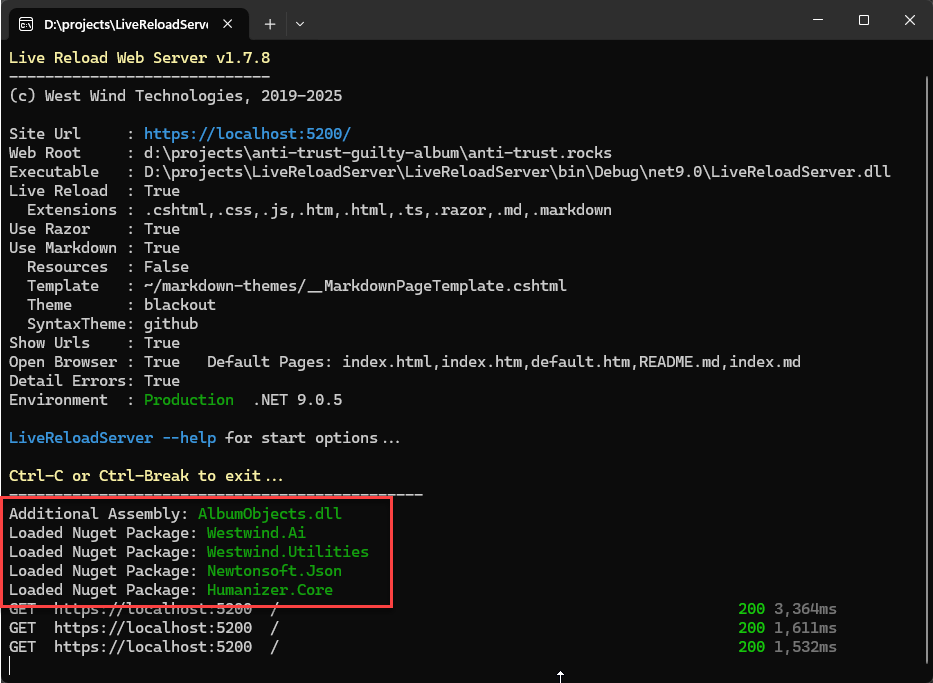

# Adding Runtime NuGet Package Loading to an Application


One of the tool applications I've built sometime ago and use a lot, is my [LiveReloadWebServer local Web server](https://github.com/RickStrahl/LiveReloadServer). It's a local .NET based Web server that you can point at a folder to serve as a Web site. It supports static content with Live Reload, has support for loose Razor Pages (`.cshtml`) and built-in themed Markdown file rendering among other things. It's a useful tool to have in your quiver to quickly fire up a local client Html app, or to create static sites locally and work on them interactively. Since it has live reload you can quickly make changes and see them rendered in real-time.

  
<small>**Figure 1** - Live Reload Server runs local Web sites with 'benefits'</small>

There's also dynamic processing support via loose Razor Pages which allow you to have standalone pages that can contain Razor code. This essentially provides you with what I call **Static Pages with Benefits** and you can use LiveReloadServer as a generic Web host that can serve many sites from a single installation. My personal use case is that I have about 10 mostly static sites that are product landing or very light logic pages. These are all driven by a single server installed LiveReloadServer instance being served behind - in my case IIS but you could use a Linux host just the same.

The loose Razor support essentially supports runtime execution of code. You can copy files to the server and they compile and run on the fly - without a project or a 'publish process'. If you've used things like classic ASP (eek!), or ASP.NET Web Pages in the past, or heck even something like PHP, you know what I'm talking about. There are lots of simple things that don't require a 'Web Site', but that just need a couple of small dynamic pages that maintain that same feel of **Static Pages, but with 'Benefits'**.  No site uploads, or 'publishing' process needed.

Once you go down that path, there a possibility that there comes a point where you go - I need something a little more than what Razor alone can provide and that's where dynamic loading of assemblies or NuGet packages comes in. LiveReloadServer always supported assembly loading from a specific dedicated folder, and recently  has added NuGet package loading, which is the focus of this post. I've been wanting to add that functionality for some time and always thought implementation too daunting, but more recently Microsoft provided a `Nuget.Protocol` and `Nuget.Packaging` libraries that makes package retrieval much more approachable.

Let's take a look and see how do add Assembly and NuGet Package loading at runtime to an application.

##AD##

## Executing Code
One of the key features of LiveReloadServer is its ability to run loose Razor pages. I use this functionality for most of my Web Site's 'static' landing pages: Product pages and informational pages which have a tiny amount of dynamic stuff on them. 

For example:

* [Markdown Monster Site](https://markdownmonster.west-wind.com)
* [Anti-Trust Band Site](https://anti-trust.rocks)

These sites look like they are static, but both have a little bit of server side code that can easily be managed with a Razor code in a self-contained site. Now, I could have done this with client side code and calling an API, but you'd loose important SEO for these landing type pages, and frankly setting up an API just to do a few simple things seems like overkill. A full Razor Web site would also work obviously, but all of that for a few small dynamic features seems like serious overkill. So LiveReloadServer along with its ability to host multiple Web sites off a single server instance is a great way for me to have my simple **Web Sites with Benefits** and also get the benefit of quick local startup without requiring Visual Studio - all I need is an editor and Ftp Client (in VS Code) to publish my files. 😁 Yeah, you know push button deployment - for a static site.

I use the Anti-Trust site as a showcase as it's actually fairly complex and in a way borderline to where the complexity might warrant a full Razor Web site. But, as is often the case, it started much simpler and got more complex as I went and made the site more generic to support multiple templated albums. The process pushed the features in LiveReload server - including the extensibility via external assembly loading and NuGet package support.

Let's take a look and see how that works...

### External Code: Assembly Loading is so Passé
There's been support for external code since LRS's inception, but up to this point it's been via **loose assembly files** dropped into a `PrivateBin` folder. Even with the newly added NuGet support, loose assembly loading can be useful for small little compiled assemblies. 

On the Anti-Trust site I created a small assembly for the album types that are serialized from the album and artist data along with a few helper functions. Open VS code create a class or two, `dotnet compile -o ../privatebin`: Done! It's very easy to add functionality that I don't want to build inside of a Razor page.

Runtime assembly loading is also relatively easy to integrate into an application. The following code is used to load assemblies when `LiveReloadServer` starts up, and makes them available to the Razor engine through which they are executed:

```csharp
private List<string> LoadedPrivateAssemblies = new List<string>();
private List<string> FailedPrivateAssemblies = new List<string>();

private void LoadPrivateBinAssemblies(IMvcBuilder mvcBuilder)
{
    var binPath = Path.Combine(ServerConfig.WebRoot, "privatebin");
    var updatePath = Path.Combine(binPath, "updates");

    // Allow for swapping in updates to private bin assemblies on a restart
    // from ./privatebin/updates. Also hooks up filewatcher to restart server
    // in some hosted scenarios
    UpdatePrivateBinAssemblies();

    if (Directory.Exists(binPath))
    {
        var files = Directory.GetFiles(binPath);
        foreach (var file in files)
        {
            if (!file.EndsWith(".dll", StringComparison.CurrentCultureIgnoreCase) &&
                !file.EndsWith(".exe", StringComparison.InvariantCultureIgnoreCase))
                continue;

            try
            {
                var asm = AssemblyLoadContext.Default.LoadFromAssemblyPath(file);
                mvcBuilder.AddApplicationPart(asm);
                LoadedPrivateAssemblies.Add(file);
            }
            catch (Exception ex)
            {
                FailedPrivateAssemblies.Add(file + "\n    - " + ex.Message);
            }

        }
    }
}
```

If you want to see all of this including the ` UpdatePrivateBinAssemblies()` logic, [you can check out the code on GitHub](https://github.com/RickStrahl/LiveReloadServer/blob/fa1fc7339a0584f8b6980b28e4a25110c9616b54/LiveReloadServer/Startup.cs#L483). `UpdatePrivateBinAssemblies()` allows for updating DLLs and forcing servers to restart with the newly found binaries.

##AD##

### NuGet Packaging is more Familiar
Clearly NuGet packages are much more familiar developers. Heck most developers probably can't remember the project syntax to add an assembly reference. 😂 There are many benefits to NuGet packages as they can encapsulate dependencies and manage versioning much better than plopping assemblies into a folder and hoping for the best. 

Assemblies are useful **for code you compile**, but **for anything that you externally import, NuGet Packages are the way to go**.

## Integrating NuGet
I've thought about NuGet integration on a number of occasions for any dynamic code based solution that involves scripting. In the past I've almost always dismissed NuGet as a solution because it seemed quite complex. Luckily it looks like as of .NET 8.0 there is now library support for .NET that makes NuGet integration much easier.

### Nuget.Protocol Nuget Package does the heavy lifting!
For the example below I'm going to be using the Microsoft `Nuget.Protocol` NuGet package:

```ps
dotnet add package Nuget.Protocol
```

which provides the functionality needed to:

* Download a primary NuGet package
* Download all its dependencies

Additional code is then needed to load all the required assemblies into the current process/assembly context so they become available to your code or in this specific use case to Razor pages.

### A semi-generic Nuget Package Loader
Let's get right to it: The following is an initial self-contained implementation of a `NuGetPackageLoader` that:

* Downloads a primary NuGet package
* Downloads all its dependencies
* Loads all assemblies downloaded (for the required target framework)
* Assigns assemblies to the Razor Assembly context

In my use case in LiveReloadServer, I store the package configuration in a JSON configuration file in `<WebRoot>/PrivateBin/NuGetPackages.json`:

```json
{
    "Packages": [  
        {
            "packageId": "Westwind.Ai",
            "version": "0.2.7"
        },
        {
            "packageId": "Humanizer.Core",
            "version": "2.14.1"
        }
    ],
    "Sources": [
        "https://api.nuget.org/v3/index.json"
    ]
}
```

... which gets loaded and deserialized, and then run in a loop to retrieve all the base packages and their dependent packages:

```csharp
// run in the background as the (Console) app starts up
Task.Run(async () =>
{
    foreach (var package in packageConfiguration.Packages)
    {
        try
        {
            await nuget.LoadPackageAsync(package.PackageId, 
                package.Version, 
                mvcBuilder, 
                packageConfiguration.NugetSources,  
                LoadedNugetPackages, FailedNugetPackages); // lists
        }
        catch
        {
            FailedNugetPackages.Add(package.PackageId);
        }
    }
}).FireAndForget();
```

Note that the package loader runs `async` and in this case my application is a Console app that originally wasn't set up to run async. So, rather than back fitting the sync nature of the entire app I use a `Task.Run()` loop to get the async context to run the package load in the background along with a short delay to wait for packages to load. In the future the better fix is to make the entire console app async but that's a fix for another day.

Finally here's the key code that actually retrieves an individual package and its dependencies from the package source and writes the relevant assembly/ies out to disk:

```csharp
public class NuGetPackageLoader
{
    private readonly string _packagesFolder;

    public NuGetPackageLoader(string packagesFolder)
    {
        _packagesFolder = packagesFolder;
    }

    public async Task LoadPackageAsync(string packageId, string version, IMvcBuilder builder, 
                IList<string> packageSources = null,
                IList<string> sucessPackages = null,
                IList<string> failedPackages = null)
    {
        sucessPackages = sucessPackages ?? new List<string>();
        failedPackages = failedPackages ?? new List<string>();

        var logger = NullLogger.Instance;
        var cache = new SourceCacheContext();
        var repositories = Repository.Provider.GetCoreV3(); // gets the default nuget.org store

        var packageVersion = new NuGetVersion(version);
        var packagePath = Path.Combine(_packagesFolder, packageId, version);
        Directory.CreateDirectory(packagePath);

        using var packageStream = new MemoryStream();

        FindPackageByIdResource resource = null;

        foreach (var source in packageSources)
        {
            if (!source.StartsWith("http"))
            {
                // local packages
                var sourceRepository = Repository.Factory.GetCoreV3(source); // local path
                try
                {
                    resource = await sourceRepository.GetResourceAsync<FindPackageByIdResource>();
                }
                catch { continue; }
            }
            else
            {
                // only packages
                var packageSource = new PackageSource(source);
                var sourceRepository = new SourceRepository(packageSource, repositories);
                try
                {
                    resource = await sourceRepository.GetResourceAsync<FindPackageByIdResource>();
                }
                catch { continue; }
            }
            if (await resource.CopyNupkgToStreamAsync(packageId, packageVersion, packageStream, cache, logger, default))
            {
                packageStream.Seek(0, SeekOrigin.Begin);
                break;
            }
    
            failedPackages.Add(packageId);
            return;
        }

        if (packageStream == null || packageStream.Length < 1)
        {
            failedPackages.Add(packageId);
            return;
        }

        var packageReader = new PackageArchiveReader(packageStream);

        // find the highest compatible framework
        string framework = GetTargetFramework(packageReader);

        // load dependencies
        var dependencies = packageReader
                    .GetPackageDependencies()
                    .Where(d => d.TargetFramework.ToString() == framework)
                    .ToList();

        foreach (var packRef in dependencies)
        {
            var pkg = packRef.Packages.FirstOrDefault();
            if (pkg?.Id == null) // framework references?
                continue;
            await LoadPackageAsync(pkg.Id, pkg.VersionRange.OriginalString, builder,packageSources, sucessPackages, failedPackages);
        }

        bool error = false;
        var files = packageReader.GetFiles().Where(f => f.Contains("/" + framework + "/"));
        foreach (var file in files)
        {
            var filePath = Path.Combine(packagePath, file.Replace("/", "\\"));
            if (!File.Exists(filePath))
            {
                Directory.CreateDirectory(Path.GetDirectoryName(filePath));  
                try
                {
                    using var fileStream = File.Create(filePath);
                    await packageReader.GetStream(file).CopyToAsync(fileStream);
                }
                catch { /* ignore - most likely the file exists already  */ }
            }

            if (filePath.EndsWith(".dll") && File.Exists(filePath))
            {
                try
                {
                    var assembly = AssemblyLoadContext.Default.LoadFromAssemblyPath(filePath);
                    if (assembly != null)
                    {
                        builder.AddApplicationPart(assembly);                     
                    }
                }
                catch
                {
                    error = true;
                    failedPackages.Add("-- " + Path.GetFileName(filePath));
                }
            }
        }

        if (error)
            failedPackages.Add(packageId);
        else
            sucessPackages.Add(packageId);
    }

    private string GetTargetFramework(PackageArchiveReader packageReader)
    {
        var frameworks = packageReader.GetReferenceItems();
        if (frameworks == null) return null;

        string framework = frameworks
            .Where(f => f.TargetFramework?.ToString().StartsWith("net") ?? false)
            .OrderByDescending(f=> f.TargetFramework.ToString())
            .Select(f => f.TargetFramework.ToString())              
            .FirstOrDefault();

        if (framework == null)
            framework = frameworks
                            .FirstOrDefault(f => f.TargetFramework?.ToString().StartsWith("netstandard") ?? false)?
                            .TargetFramework.ToString(); 
        
        return framework;
    }
}
```

The method takes a package Id and version and an optional list of package sources where to look for packages. 
The `NuGet.Protocol` library handles the most of  hard part of locating the package and downloading it and providing a **package stream** which looks like a file system (presumably an abstraction over the underlying zip file stream). The code then looks for the closest matching .NET version from a hardcoded list of versions which include recent .NET Core versions or any version of .NET Standard (secondary). The bulk of the code is taken up with trying to match the nearest .NET version and creating the folder structure to write out the assembly.

### Disk Layout
Once a version is matched that version is used to extract files from the output folder and duplicated into the file system in a local NuGet folder in a NuGet base folder that I specify:

  
<small>**Figure 2** - The Nuget output goes into a folder package hierarchy</small>

Individual library files are then nested based on version and Framework using a nested structure:

  
<small>**Figure 3** - Packages are isolated by version and framework</small>

Notice the version number and .NET Framework in the path. The NuGet package stream contains all targets, but my code only dumps out the version that's needed to run.

When it's all said and done, in **LiveReloadServer** packages and `privatebin` assemblies now get loaded on startup which looks like this:


<small>**Figure 4** - LiveReloadServer with assembly and package loading.</small>

Yay!

## Summary
Dynamically loading code at runtime is not something that most applications do. But if you're building generic execution tools like [LiveReloadServer](https://github.com/RickStrahl/LiveReloadServer), dynamic load can extend functionality substantially by allowing external code to be loaded in a generic way. There are options to disable dynamic loading in LiveReloadServer by the way, as this has potential security implications.

At the end of the day, the new-ish Microsoft `Nuget.Protocol` library made the difficult parts of NuGet package loading significantly easier by providing the tools to reliably grabbing the appropriate package from one or more package stores and getting it down to the local machine.

I had thought about adding NuGet support many times before for this and other applications, but was always put off by the complexity of managing the package retrieval. But this library makes that process the most trivial piece of the process. You still have to handle the local storage and assembly loading but those things while verbose are relatively straight forward to implement.

LiveReloadServer was the first use case for me, but I have a couple of others for templating and scripting tools that will also be able to to benefit from this functionality.

##AD##

## Resources

* [LiveReloadServer Source Code on Github](https://github.com/RickStrahl/LiveReloadServer)
* [NuGet.Protocol on NuGet](https://www.nuget.org/packages/NuGet.Protocol)