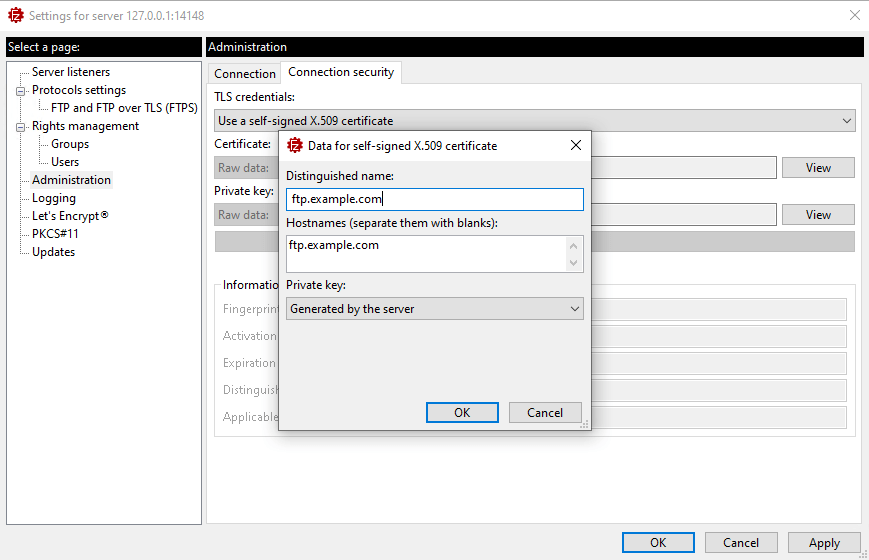
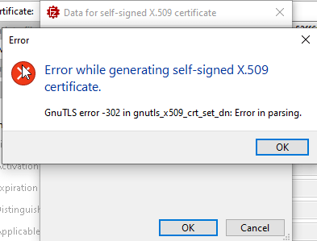
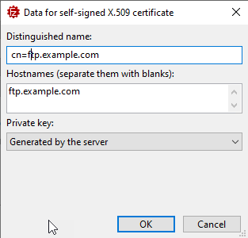

# Distinguished Name on FileZilla Server Self-Generated Certs


Ah renewing certificates - my favorite tasks as an 'amateur' sys admin, running my own servers. 

I run a private Filezilla server on a port blocked IP address, and more than once I've stumbled on trying to set up the self-signed Filezilla admin certificate. I look it up every time, and waste more than a few minutes in trying to pin down the problem. So I'm writing it down!

Issue is this:  
  
* Trying to renew my Administration Server Certificate
* It's a self-signed certificate 
* Prompts for Hostname (auto-fills)
* Prompts for **Distinguished Name**

For the Distinguished name which is typically provided as a hostname, any reasonable person would put in the... well, the hostname:



but unfortunately this is what you get in response:



Yeah, not really helpful, that! 💩 

##AD##

## Distinguish This!
The problem is that Filezilla actually **expects a full Common Name entry** so what's required is something like this (at minimum):



Now it works.

Unintuitively, you have to provide a proper Common Name (CN) formatted string. It doesn't help that the dialog calls this the *Distinguished Name*, which is the domain part of the Common Name, which normally with other certificate requests refers to the DNS domain name.

With Filezilla you need a CN formatted string:

**Minimal** (works)

```none
CN=ftp.example.com
```

**Full**

```none
CN=ftp.example.com, O=Example Corp, C=US
```
<small>&nbsp;&nbsp;&nbsp;*-- **O** for organization, **C** for country.*</small>

And that's all it takes. I didn't put those in here and it worked fine without - only the CN entry is required especially for the local admin certificate. 

## Summary
Filezilla isn't known for nice interfaces and the Admin interfaces are clearly very Unix focused and assume a lot of things. This is one of those cases. It's not the first time I've stumbled on this, which is why I'm here writing this trivial bit of information down in the hopes it will help burn it into my brain so I remember next time. 😁 

##AD##