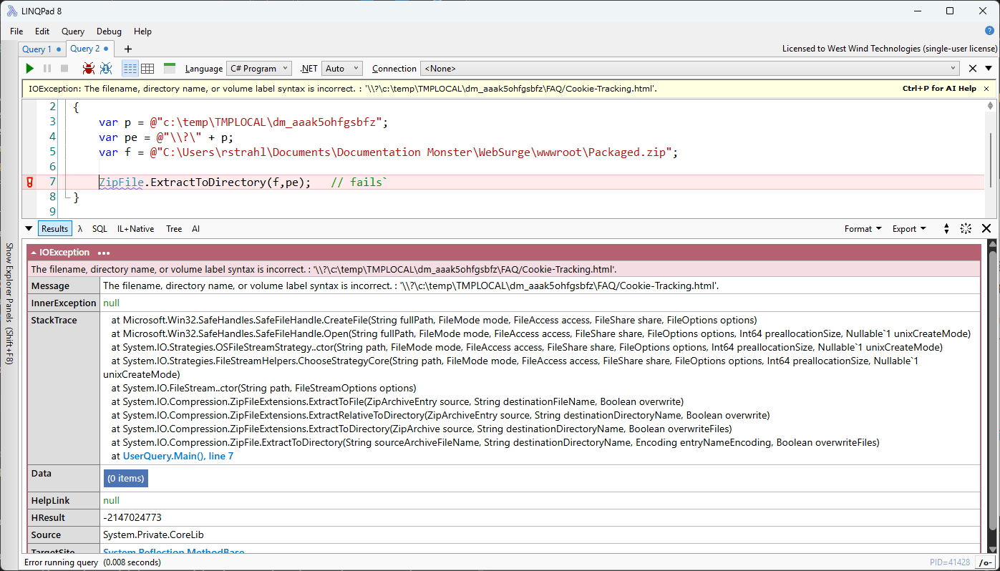
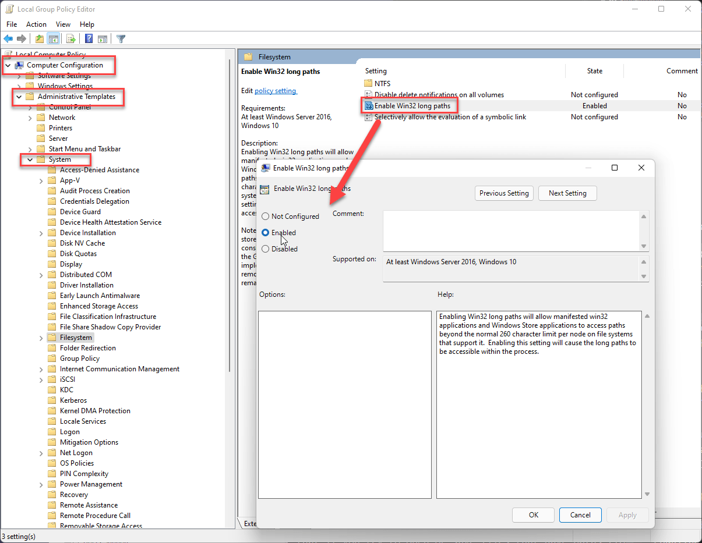

# Unpacking Zip Folders with Windows Long File Paths


[Long file paths on Windows are a pain in the ass ](https://weblog.west-wind.com/posts/2022/Jan/03/Integrating-Long-Path-Names-in-Windows-Applications)- we all know that. But today I ran into yet another issue with it that's worth mentioning: Namely that long file path syntax using the `\\?\` prefix, which allows even non-supporting applications to use long paths, does not work with the .NET [ZipFiles class](https://learn.microsoft.com/en-us/dotnet/api/system.io.compression.zipfile?view=net-9.0).

Specifically the following code does not work if you're unpacking a Zip file that creates files that exceed the 260 character MAX_PATH size limit:

```csharp
// THIS DOES NOT WORK
outputFolder = @"\\?\" + outputFolder;  
ZipFile.ExtractToDirectory(zipFile, outputFolder);
```

The function complains about an invalid file path passed in.



What's even more disconcerting is that this fails with an exception **after it's already unpacked a bunch of files**. Oddly, it doesn't bomb right away when starting to unpack but it only goes awry once it hits files that exceed the MAX_PATH limit. The end result is terrible: It ends up with a half-baked result of a partially unpacked folder. If you use this function **make sure you trap any exceptions and clean up a partially unpacked folder** as part of your unzip routine.

Bottom line: The `\\?\` Long Path syntax doesn't work with `ZipFile.ExtractToDirectory()` as I would have expected.

##AD##

## Quick Long File Paths Review
Before you get overeager and shout at me, *"just enable Long Path support in your application"*:

Yes, you can enable Long Paths in Windows and add a Manifest that enables application level long paths that make most things in .NET work automagically. 

In fact I wrote an extensive blog post about a few years ago:

* [Integrating Long Path Names in Windows Applications](https://weblog.west-wind.com/posts/2022/Jan/03/Integrating-Long-Path-Names-in-Windows-Applications)

The short version of it is that Long Paths on Windows can be addressed in a couple of ways:

* Enabling **both** Windows and the Application to support for Long Paths
    * System: Windows Registry or Group Policy setting
    * App: Application Manifest to enable Long Paths
* Using special `\\?\` file syntax to indicate long paths

Out of these two the global + app setting is the preferred mechanism **if you can manage to control the global setting**.

Unfortunately, Windows does us no favors here, because for unfathomable reasons, by default Long Path support is disabled in Windows and... more importantly... in order to enable it requires a global, **administrative** setting. It can't be easily set from applications unless you elevate - and even if you could, it's not polite to assume you can/should do this. There's no per application setting for this.

For the most part this setting is not something that an application can have full control over and especially not a for small tool, like the tool I'm in the middle of building.

## Enabling Long Path Support for an Application
So lets look at the two approaches in detail:

* Windows Settings and Application Manifest
* Using the `\\?\` Path syntax without special requirements

### Windows Settings and Application Manifest
The Registry hack is this:

```text
Windows Registry Editor Version 5.00

[HKEY_LOCAL_MACHINE\SYSTEM\CurrentControlSet\Control\FileSystem]
"LongPathsEnabled"=dword:00000001
```

The Group Policy setting can be set at **Computer Configuration->Administrative Templates->System->Enable Win32 Long Paths** in the Local Group policy Editor:



> ##### @icon-warning Awkward even with Tool Support
> In Markdown Monster [I have a documentation topic](https://markdownmonster.west-wind.com/docs/FAQ/Using-Markdown-Monster-with-Long-Path-Names.html) that describes how to enable Long Path support along with a CLI helper that allows enabling and disabling long path support which is one way to handle it - but even so it's very intrusive.

The global setting isn't enough however, you also need the application to support it and you do this via an Application Manfest bound to the application:

```xml
<?xml version="1.0" encoding="utf-8"?>
<assembly manifestVersion="1.0" xmlns="urn:schemas-microsoft-com:asm.v1">
  <assemblyIdentity version="1.0.0.0" name="MarkdownMonster.app"/>
  <application xmlns="urn:schemas-microsoft-com:asm.v3">

    <!-- This setting -->
    <windowsSettings xmlns:ws2="http://schemas.microsoft.com/SMI/2016/WindowsSettings">
        <ws2:longPathAware>true</ws2:longPathAware>
    </windowsSettings>
  
  </application>
</assembly>
```

and embedded into the project with:

```xml
<PropertyGroup>
 <ApplicationManifest>app.manifest</ApplicationManifest>
</PropertyGroup>
```

As you can see to make this works requires a few coordinated things that may or may not be easy to manage in your application.

### `\\?\` Long Path Syntax without Windows + App Support
If you want to do this generically without user intervention the above solution is not an option. If you're application and file access is simple enough you can do the 'one off' solution using the `\\?\` Long Path syntax which allows you to prefix a fully qualified Windows path with the above:

* Fully qualified path: `\\?\c:\temp\tmpfiles\dm_131233`
* UNC Path: `\\?\UNC\share\temp\tmpfiles\dm_131233`

This solution is not easy to manage in complex applications that have lots of file access to manage, but if you have a few places where files are accessed this can be the easiest and most non-obtrusive way to provide Long Path support.

### With a little help from our Friends
Long Paths only work with fully qualified or UNC paths - relative or root relative paths are not supported. So all paths need to be resolved before adding the appropriate `\\?\` full path or UNC path syntax. 

To make this easier and auto-resolve, I use a helper function for this in my [FileUtils Helper class](https://github.com/RickStrahl/Westwind.Utilities/blob/019109be41f8e1eb268594a878d8dbd4c9e2decb/Westwind.Utilities/Utilities/FileUtils.cs#L240)  in [West Wind Utilities](https://github.com/RickStrahl/Westwind.Utilities):

```cs
public static string GetWindowsLongFilename(string path)
{
    if (string.IsNullOrEmpty(path))
        return path;

    string fullPath = System.IO.Path.GetFullPath(path);

    if (fullPath.Length < 260)
        return fullPath; // No need to convert

    // Fully qualified path
    if (fullPath.Length > 1 && fullPath[1] == ':')
        fullPath = @"\\?\" + fullPath;
    // UNC Path
    else if (fullPath.Length > 2 && fullPath.StartsWith(@"\\"))
        fullPath = @"\\?\UNC\" + fullPath.Substring(2);

    return fullPath;
}
```

## Replacing ZipFile.ExtractToDirectory()
Alright so even with the long path syntax `ZipFile.ExtractToDirectory()` fails. Which means another approach is required.

Instead of using the high level function to unpack in one go, it's actually quite easy to walk the archive and unpack it into a folder and explicitly add the long path fix ups for each file as it is unpacked.

```csharp
public bool ExtractZipFileToFolder(string zipFile, string outputFolder = null)
{
    if (string.IsNullOrEmpty(outputFolder))
    {
        SetError("Output folder is not specified.");
        return false;
    }

    ZipFile.ExtractToDirectory(zipFile, outputFolder);

    zipFile = FileUtils.GetWindowsLongFilename(zipFile);
    using (var archive =  ZipFile.OpenRead(zipFile))
    {
        foreach (var entry in archive.Entries)
        {
            string targetPath = Path.Combine(outputFolder, entry.FullName);
            targetPath = targetPath.Replace('/', '\\'); // Ensure Windows path separators

            targetPath = Path.GetFullPath(targetPath);

            var fullPath = FileUtils.GetWindowsLongFilename(targetPath);            
            if (entry.FullName.EndsWith("/"))
                Directory.CreateDirectory(fullPath);
            else
            {
                Directory.CreateDirectory(Path.GetDirectoryName(fullPath));
                entry.ExtractToFile(fullPath, overwrite: true);
            }
        }
    }

    return true;
}
```

And voila, that does the trick even if the global Long Path setting is not enabled. I get to unpack long filenames and directories generically! Yay!

## Some Thoughts on Windows Pathing
Ideally we should try to avoid long file paths on Windows, but the reality is that that's actually pretty hard to do when you need to write out files, because of the way Windows nests user profiles and the only place you can write files and especially temporary files is somewhere deep inside of the User Profile. 

> ##### @icon-warning Minimizing Paths is a Band-Aid not a Solution!
> Incidentally, I initially trimmed down some of the library paths which helped in my use case. However, that's only a partial solution given that users can create free-form topic titles of any length and can nest topics as deep as they like. At some point a limit would get hit no matter what I do to minimize. 
>
> So trying to limit paths is often a fool's errant, unless you tightly control the file structure, which is difficult to do especially in applications that generically use files (like an editor like Markdown Monster for example).

A typical temp path starts out deeply nested before ever even getting into adding your own folder structure. 

```
c:\users\MyUserName\Temp\tmpfiles\
```

You're 35 characters in with this and god forbid you have a long ass username! 

In my specific scenario I'm running a utility that unpacks a potentially deeply nested documentation hierarchy to disk and it starts failing at some of the Javascript library dependencies which are deeply nested (ie. common NPM structures). And it needs to go into a location that has Write access which means it has to go somewhere in the user profile. It gets worse if you go into `%appdata%` or `%localappdata%` which have even longer base paths.

Heck I even use a custom temp folder that's not quite as deeply nested and still ran into 260 character limit.

By using the `\\?\` path syntax however I was able to write out the files and it worked. 

Putting this all together in my Web site packing tool which unpacks an Exe file that contains the base binary plus an embedded Zip file of the web site, it looks something like this:

```csharp
// Called from app startup to unpack the package
// before running the local Web site
public bool UnpackageFile(string packageFilename,
    string outputPath = null,
    bool unZip = true,
    bool noDirectoryCheck = false)
{   
    if (!File.Exists(packageFilename))
    {
        SetError("Package file does not exist.");
        return false;
    }

    if (Directory.Exists(outputPath))
    {
        SetError("Output path exists already. Make sure you use a unique folder name or clear the folder to avoid overwriting files.");
        return false;
    }
    
    Directory.CreateDirectory(outputPath);

    // find the separator that separates the EXE and Zip parts
    var offset = FindMarkerOffset(packageFilename, SeparatorBytes);
    if (offset < 0)
    {
        SetError("File is missing Packaged Html Data.");
        return false;
    }
    
    // unpack the EXE file from binary
    var exeFile = Path.Combine(outputPath, "WebPackageViewer.exe");
    using (var exeFs = new FileStream(exeFile, FileMode.Create, FileAccess.Write, FileShare.Write))
    using (var fs = new FileStream(packageFilename, FileMode.Open, FileAccess.Read, FileShare.Read))
    {
        CopyToBytes(fs, exeFs, offset - SeparatorBytes.Length);
        fs.Flush();
    }

    // unpack the Zip file
    var packageFile = Path.Combine(outputPath, "Packaged.zip");
    using (var packageFs = new FileStream(packageFile, FileMode.Create, FileAccess.Write, FileShare.Write))
    using (var fs = new FileStream(packageFilename, FileMode.Open, FileAccess.Read, FileShare.Read))
    {
        fs.Seek(offset, SeekOrigin.Begin);
        fs.CopyTo(packageFs);
        packageFs.Flush();
    }

    if (unZip)
    {
        if (!UnZipPackageInplace(packageFile, outputPath)) 
        {
            return false;
        }
        try { File.Delete(packageFile); } catch { /* ignore */ }
    }

    return true;
}


public bool UnZipPackageInplace(string packageFilename, string outputPath = null)
{
    if(string.IsNullOrEmpty(outputPath))
        outputPath = Path.GetDirectoryName(packageFilename);

    try
    {                
        ExtractZipFileToFolder(packageFilename, outputPath);
    }
    catch (Exception ex)
    {
        if (Directory.Exists(outputPath))
        {
            try { Directory.Delete(outputPath, true); } catch { /* ignore */ }
        }   
        SetError(ex, true);
        return false;
    }
    return true;
}
```

You should also be aware that just because your application can write out the files, it doesn't mean that other applications that are not Long Path aware can read the data! Make sure you know what the files will be used for or you may not be able to actually access them in the way you think if you're dealing with a non-Long Path aware application.

Luckily my use case is for a self-contained Html Web site viewer that points at a folder and the viewer and packager/unpackager are the same application that is Long Path enabled. Apparently the WebView2 control and Chromium also supports some level of Long Path support because the expanded site is running perfectly from the target location! 


##AD##

## Summary
It's really sad that we're still having to talk about this `MAX_PATH` crap today. The fact that Windows does not have Long Path support enabled by default seems almost criminal given the deep nesting of base user folders to begin wtih. Even if there are backwards compatibility issues, Long Paths should be opt out, not opt in. The feature is there damn it, enable it by default!

I've been running with Long Path support enabled for years and I have yet to see a problem. I'm sure some old DOS and classic Win32 applications might have issues, but do we really need to keep Windows hostage for those?

The good news is in some cases you can work around the limitations even generically if the problem space is simple enough as is the case in the Utility I'm working on at the moment. Using the `\\?\` work around with individual files might apply to other tools as well as a generic workaround that works without having to tweak Windows with Administrative rights in order to Extract a Zip file to a folder.

## Resources

* [ZipFile class](https://learn.microsoft.com/en-us/dotnet/api/system.io.compression.zipfile?view=net-9.0)
* [Integrating Long Path Names in Windows Applications](https://weblog.west-wind.com/posts/2022/Jan/03/Integrating-Long-Path-Names-in-Windows-Applications)