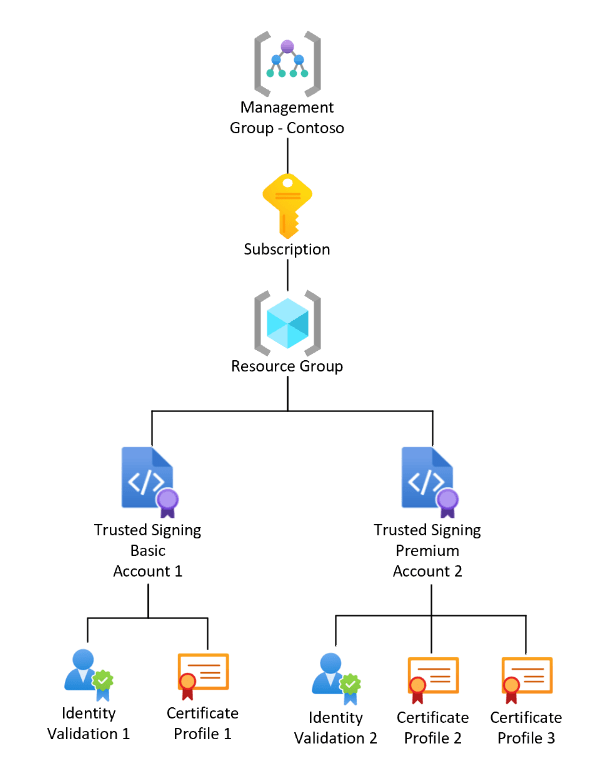
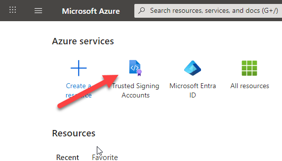
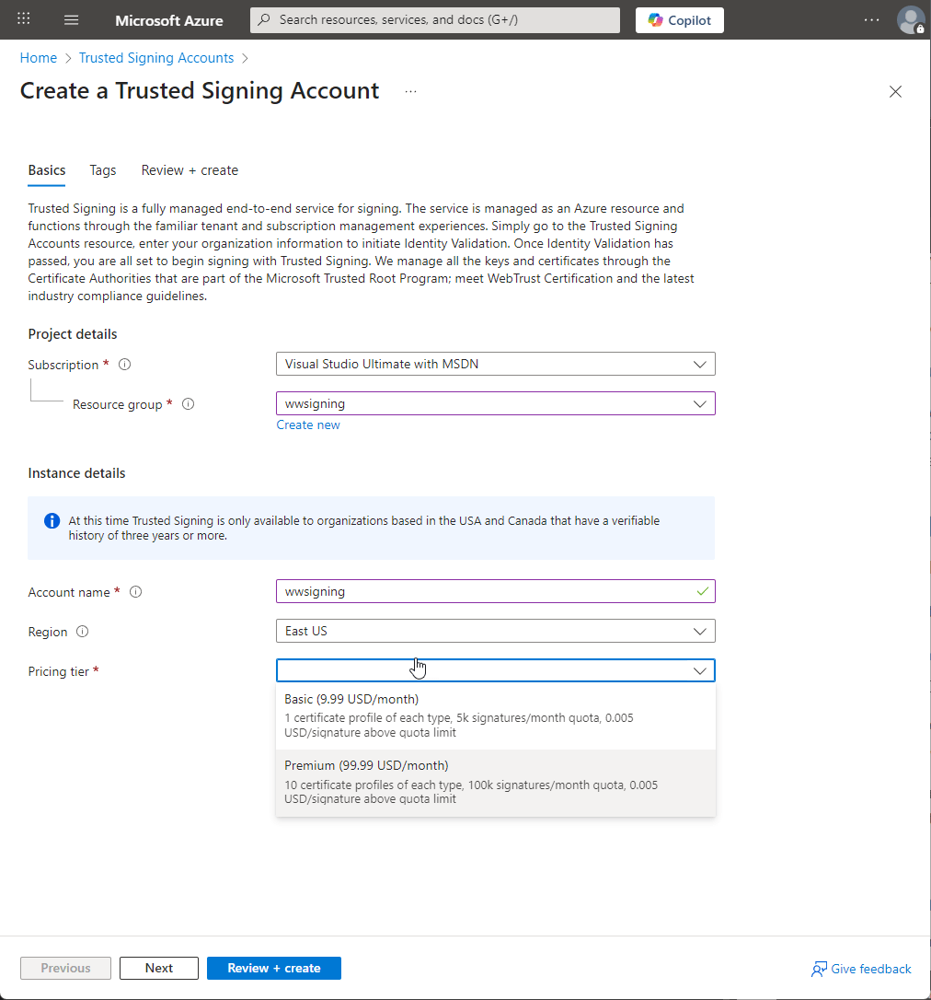
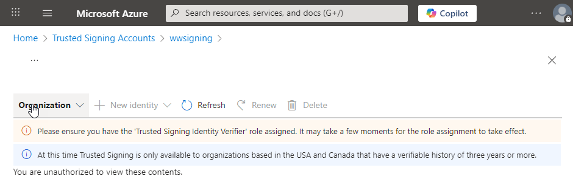
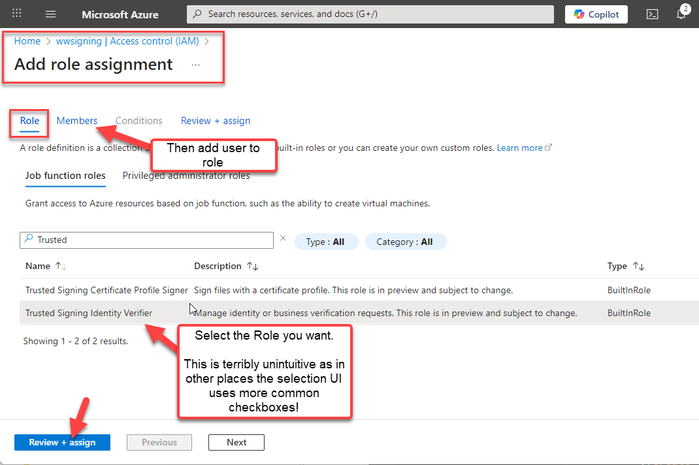
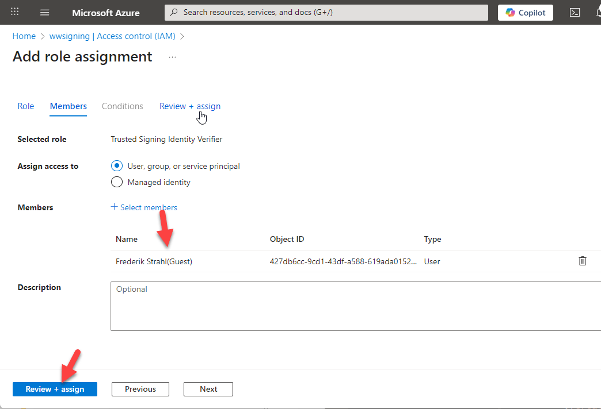
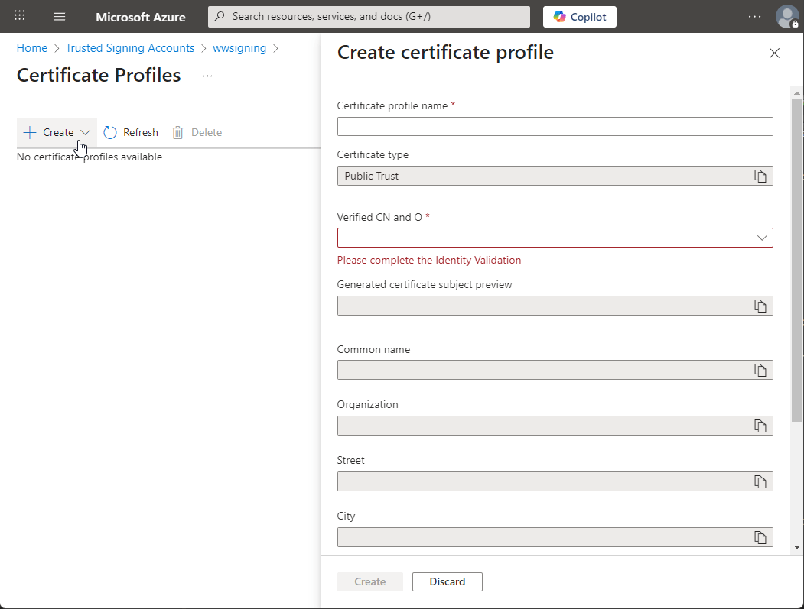
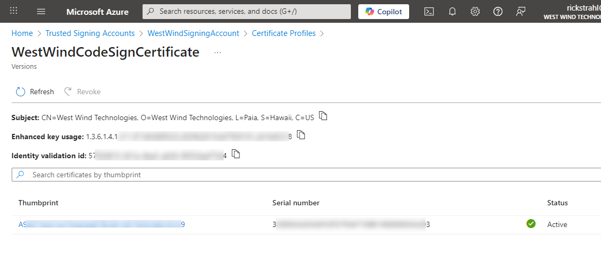
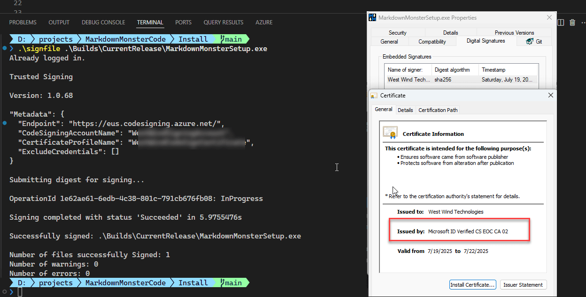
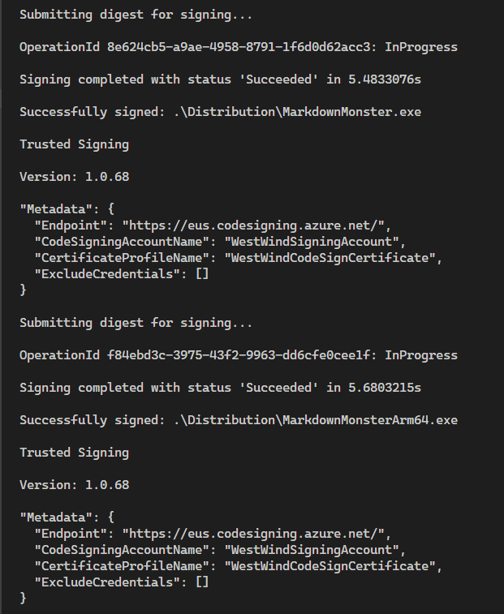

# Fighting through Setting up Microsoft Trusted Signing


So it's that time of year (actually time of several years) to renew my Code Signing certificate. I always dread this because it's a manual process, and invariably if you're not intimately familiar with the complexities of public key cryptography, the terminology is enough to drive me batty. It's gotten easier since I made some decent notes last time...

But all that's out of the window this time around because the CodeSigning rules have changed. Drastically! It actually happened a few years ago, but I got lucky and got my local, still exportable certificate just before the rules changed.

The new rules don't allow for locally, dynamically stored certificates. Instead certificates have to be served from one of a few certified online authorities, or the certs must be stored in a FIPS 140-2 Level 2+ compliant hardware security module (HSM). The keys cannot be exportable, so they effectively can't be copied and stored or used elsewhere. So you got the option of server provided keys or hardware keys.


What all this means the complexity of getting a certificate has gotten exponentially worse, and along with that prices have gone up significantly. Base non-EV certs run in the $350-500 range with fully verified EV certificates starting around $500 per year. 

##AD##

It all seems like a huge grift:

<blockquote>

As it is the whole CodeSigning thing has turned into another scam of Enshittification of a captured audience. 

If you're publishing software or even packages on NuGet now, you pretty much have to have a code signing certificate. Certificates that used to be ~$100-150 (or less for multi-year certs) a year a few years ago now cost $300-$400 for basic certs. The EV certs **start at** $500 and go up from there.

The validation rules for businesses haven't changed and you would think most of the the expense is all in that. But this isn't about security - it's about gate keeping and just one more hurdle for a small business to have to jump over.</p>&mdash; <small><a href="https://x.com/RickStrahl/status/1946323611045994548?ref_src=twsrc%5Etfw">@RickStrahl on X</a> *July 18, 2025*</small>

</blockquote> 

## Microsoft Is In the Game Too
Microsoft who requires these CodeSigning rules in the first place, is also providing an Azure service called **Trusted Signing** to provide CodeSigning services. To their credit their pricing is much better than what most  traditional SSL Cert providers are now charging. Azure Trusted Code Signing is still in **preview** but then again, it's been in preview for well over 2 years but  it looks like what you see and can sign up for now is in the final stages before going to a proper release as a service.

### Microsoft Trusted Signing Certificate Pricing
One reason to look at Microsoft's solution - despite the potential pain and suffering - is that the pricing is quite good (as of time of this post):


| Model type                   | Basic            | Premium          |
|------------------------------|------------------|------------------|
| Base price (monthly)         | $9.99            | $99.99           |
| Quota (signatures/month)     | 5,000            | 100,000          |
| Price after quota is reached | $0.005/signature | $0.005/signature |

These are non-EV, base certificates that only do basic vetting. For fully vetted EV certificates you'll need to look elsewhere. This pricing which ends up at ~$120/yr for the single cert is cheap compared to most of the SSL vendors most of which start at ~$300 for certificates with mailed hardware keys. So, you gotta give Microsoft credit here for keeping costs down and providing reasonable pricing.
 
> ##### @icon-warning United States and for Business Only 
> Currently Azure Trusted Signing is only available for US customers as they only can validate US businesses. From the looks of it you need to have a business entity that has a DUNS number or US Tax Id so I think it also wouldn't work for an individual.

Doing a bit of research out of all the bad options out there, Microsoft's Trusted Signing seems like the least bad (sound familiar???) solution that's also cheaper than traditional certs from various SSL vendors. The good news is that it works and pricing is reasonable. The bad news I wasted nearly an entire day trying to get it to work. 

### Navigating the Azure Jungle
If you end up going this route, plan on having to wade through the Azure dependency jungle of setting up several resources and trying to understand what all the mumbo-jumbo Azure jargon amounts to. If you're doing Azure all day that may not be much of a problem, but as someone who only occasionally jumps in for some very specific services like Trusted Signing, it's incredibly painful to deal with Azure security and the Resource dependencies that nest two to three levels deep with badly defined overlapping naming  boundaries. 

For Trusted Signing finding documentation via search engines was hit or miss - the docs for this are buried behind deeply nested links - perhaps because it's still in or just out of preview (hard to tell that too) and because there were previous releases that used a completely different publishing pipeline through Key Vault. LLMs were also no help here proving a lot of garbage.

The official documentation link can be found here:

* [Microsoft Trusted Signing Documentation](https://learn.microsoft.com/en-us/azure/trusted-signing/)

This has everything you need, but the instructions require some... uhm... interpretation. The tools are terrible, and the docs don't make working with them a lot easier by making you figure out where to find files and how to install tools.

### Don't believe your lying AIs!
In this day and age of AI assistants and ChatBots you would think that things like Azure configuration instructions for setting up an Azure task would be readily available. Heck there's even an Azure Specific CoPilot Model that you can use from the VS Code CoPilot integration. 

But that actually yielded surprisingly bad results and did not work well with Trusted Signing either for setup or for the signing part! Part of this might be because Trusted Signing is still in Preview or because the documentation for this is almost non-discoverable and because things have changed so much with the tooling.

Long story short:  After a very pissed off day of going down many wrong paths I managed to get Trusted Signing to work for my projects, and I'll try my best to provide the details how I have this set up, hopefully sparing a few of you all the pain I ran into.

##AD##

## Setting up Microsoft Trusted Signing
Alright so let's talk about what you need to set up Azure Trusted Signing.

There are two parts to this:

* Setting up the Certificate and all the Infrastructure for storing the Certificate
* Signing the Certificate as it require special software

Remember these certificates are not exportable so the only way you can sign is by using the online certificate via a service call by the sign tool.

### Structure
In their documentation Microsoft provides a high level resource overview of what's involved in the certificate creation process:

  
<small>source: [Microsoft](https://learn.microsoft.com/en-us/azure/trusted-signing/concept-trusted-signing-resources-roles)</small>

Here's a breakdown of the things needed to create on the Certificate creation side, and the Signing side:

**For Certificate Creation**

You will need an Azure account to do any of this. If you don't already have one, you can sign up for a  account. Since we're signing up for a paid feature you will need to set up payment information. 

There are lots of resources available online on how to setup an Azure account, so I won't cover that here. Once you're in the Azure portal you need to:

* Create or use an existing Azure Resource Group
* Create a Trusted Signing Account
* Create a Trusted Signing Identity (Company Information)
* Create a Trusted Signing Profile (Certificate)

**For Signing**  

* Azure Cli (to log in)
* Azure CodeSigning SDK
* SignTool (from Windows SDK)


### Create a Trusted Signing Account
To start to to Azure Home Screen and you should see a Trusted Signing Accounts button at the top:



Select that then click on Create:



You can click through the Next options and click on Create or Review + create to create the account.

Next you need to create an Identity. The identity is your business information that identifies your business unit.

The first hurdle you're likely to run into is the following error:



Two things that need to happen for that:
* Add the Trusted Signing Identity Verifier Role
  

* Add a User to Roles for the Signing Account
  


Talk about terrible user experience as the Role selection is totally non-obvious. There are like 3 other ways to look at roles, some with selections where you end up in this weird place where you have a role and user selected with no way to submit. The way shown above works with the weird role selection, which enables the **Review + Assign** button.

Now you should be able to add an Identity. Go back to the main screen of the Trusted Signing Account and click on Identity Validation again:


The information of this form is used on the certificate so make sure the Url and Organization are the correct entity names. You also need to provide some sort of validation in the form of a Duns Number, Tax Id or Business Number.    

The email address is validated so make sure that's accurate. In my case the validation with a Duns number took only a few minutes before the validation email showed up so this is surprisingly fast. Unlike previous certificates it also didn't involve a phone number callback which I thought was interesting in that it's actually less strict than previous certs I've signed up for.

The final step then is to create a **Certificate Profile** which effectively is the Certificate.



I didn't fill out this form because I couldn't actually create a new certificate since I can't reuse my existing identity information. Essentially you give your profile/certificate a name and then pick your verified identity from the list of available Identities.

Once that's all set and done you end up with a Certificate Profile:



While we're here the three pieces of information that you will need to sign a file are:

* **Signing Account Uri**    
  <small>*you can find that on the Signing Account Page, something like:
  `https://eus.codesigning.azure.net/`*</small>
* **The Signing Account Name**
  <small>*WestWindSigningAccount*</small>
* **The Profile Name**  
  <small>*WestWindCodeSignCertificate*</small>

Congratulations, the certificate should now be ready to go. 

Half the battle is done - and the second part is not a whole lot easier.

## Signing an Executable
You would think that with all the effort that goes into the Azure CLI that Microsoft would have figured out a way to make it easy to use a certificate from Trusted Signing, but - again in perfect counter intuitive fashion - you'd be wrong.

Although there's a `trustedsigning` addin to the Azure CLI that can be used to list and check for certificates, that same interface **does not support signing using that certificate**.

Instead the recommendation is to use a recent version of the good old `Signtool.exe` from the Windows SDK with - wait for it... an explicitly referenced DLL from the a separately downloaded and installed SDK.

### Azure CLI
In order to use the signing tools you will need the Azure CLI so you can sign in to your Azure account.

```powershell
winget install --id Microsoft.AzureCLI -e
```

### Trusted Signing Client Tools
There's a separate set of tools that need to be installed called the Trusted Signing Client Tools. You can install these via WinGet:

```ps
winget install -e --id Microsoft.Azure.TrustedSigningClientTools
```

> ##### @icon-warning Path to Codesigning Dll Required!
> You'll need to capture the path to the codesiging DLL and use it on the Signtool command line.
> 
> By default, if you use the installer, the file lives here:
> ```text
> %localappdata%\Microsoft\MicrosoftTrustedSigningClientTools\Azure.CodeSigning.Dlib.dll
> ```

### Install or Find Signtool
Next you need to install Signtool or - if you have Visual Studio installed you probably already have it locally installed as part of the Windows SDK (10.0.2261.755 or later). Personally I have a recent copy of Signtool in my `Utils` folder that's on my path, or I copy it into my Install folder of my project so I have it directly accessible.

If you want to use the global SDK reference:

```text
C:\Program Files (x86)\Windows Kits\10\bin\10.0.26100.0\x64\signtool.exe
```

### Create a MetaData File with Azure Trusted Signing Information
The last step is to create a meta data file that references the Azure Trusted Signing account information so that the cert can be found. It's a simple Json file that looks like this:

```json
{
  "Endpoint": "<Trusted Signing account endpoint>",
  "CodeSigningAccountName": "<Trusted Signing account name>",
  "CertificateProfileName": "<Certificate profile name>"
}
```

Filled out it looks something like this (`SignfileMetaData.json`):

```json
{
  "Endpoint": "https://eus.codesigning.azure.net/",
  "CodeSigningAccountName": "MySigningAccount",
  "CertificateProfileName": "MyCertificate"  
}
```

I named mine the same name as the Powershell script I use to sign the file.

### Ready to run Signtool to sign your Binary
So the actual signing operation is then done in two steps:

* Signing into Azure
* Signing the actual document


To make this a little easier I have a Powershell script that passes in one or more filenames to sign, then logs in if necessary and signs the file.

```ps
# dotnet tool install --global AzureSignTool
#winget install --exact --id Microsoft.AzureCLI
param(
    [string]$file = "",
    [string]$file1 = "",
    [string]$file2 = "",
    [string]$file3 = "",
    [string]$file4 = "",
    [string]$file5 = "",
    [boolean]$login = $false
)
if (-not $file) {
    Write-Host "Usage: SignFile.ps1 -file <path to file to sign>"
    exit 1
}


if ($login) {
    az config set core.enable_broker_on_windows=false
    az login
    az account set --subscription "Pay-As-You-Go"
}

$args = @(
    "sign", "/v", "/debug", "/fd", "SHA256",
    "/tr", "http://timestamp.acs.microsoft.com",
    "/td", "SHA256",
    "/dlib", "$env:LOCALAPPDATA\Microsoft\MicrosoftTrustedSigningClientTools\Azure.CodeSigning.Dlib.dll",
    "/dmdf", ".\SignfileMetadata.json"
)
foreach ($f in @($file, $file1, $file2, $file3, $file4, $file5)) {
    if (![string]::IsNullOrWhiteSpace($f)) {
        $args += $f
    }
}

.\signtool.exe $args
```

The script is pretty straight forward. The only oddity is the Signtool call with it's lengthy reference to the code signing DLL. Note that you need a recent version of `SignTool.exe` to support the `/dlib` and `/dmdf` parameters.

When you run this script in a new Terminal instance you will be prompted to login into Azure and if you have multiple subscriptions you have to select the subscription. Once the terminal session is active subsequent requests bypass the login and just go and sign.

If all goes well you should see something like this as your output:



And we have lift off! 

You're looking for the **Number of files successfully Signed: 1** (or more if you pass multiple files).

### Not Fast!
One thing I am noticing is that the signing process is **very slow**:



You can see that it takes about 5 seconds for signing each file which seems pretty slow if it's only sending the Digest over the wire as the message is suggesting. The old local cert SignTool processing took less than second at most per file.

Oddly it also doesn't get any faster with multiple files sent to SignTool as each request apparently is sent after the previous one completes. No parallelization here.

Another issue - and that is likely my ignorance - is that I can't seem to get a hands off Azure login to run. `az login` prompts for a manual login and then also for selection of a subscription. I know there are options for using a Secret key, but I couldn't figure out how to set this up and get Azure recognize my user and subscription. The secret key is recognized but for some reason it complains that it's not linked to a subscription (which it is). Just more piece of bureaucratic bullshit that I'm going to leave for another day. This is just how it goes for me with Azure - you solve one problem only to run into yet another seemingly unrelated issue and soon you have 20  services you're dealing with to do one simple thing. It's a never ending rabbit hole.

I'm hoping that once everything is set up I can just let it be, but knowing Microsoft's propensity to keep moving the cheese around that's also very unlikely :smile:

##AD##

## Summary
The process to do set up Trusted Signing was way harder than it should have been - in fact the entire process took me the better part of an entire work day. The server process is complicated primarily because the nomenclature is so crazy confusing and the dependency management on Azure is such a pain in the ass. The missing rights from the account to create an identity is particular maddening and how you fix it even more so! But it wouldn't be Azure if you wouldn't be cursing the thing every step of the way.

The signing process also is a pain in the ass with 3 different tool chains required. The fact that an `az TrustedSigning` CLI addin exists, **but doesn't support actually signing** is just ridiculous. With all the resources that are thrown at Azure it seems petty to not support the one feature that everybody is going to need without having to jump through hoops of managing several tool installation instructions. 

But grudgingly I have to say that at the end of the day the process works, warts and all. Microsoft's pricing for the service maybe makes it worth it than most other services, and frankly the fact that I have my cert running as a service that hopefully doesn't need to be updated unless I quit the service is enticing. Yeah it costs more than it did last time around - I'm now paying almost as much per year what I used to pay for 3 years, but given the circumstances and required Enshittification of all that surrounds the CodeSigning process, this is the best that we can do for now.

I'm hoping writing this up is helpful to some, and that these instruction won't be obsolete in a few short months because Microsoft changed designs again as is so often the case. We shall see...

## Resources

* [Microsoft Trusted Signing Documentation](https://learn.microsoft.com/en-us/azure/trusted-signing/)
* [Microsoft Trusted Signing Pricing Page](https://azure.microsoft.com/en-us/pricing/details/trusted-signing/)