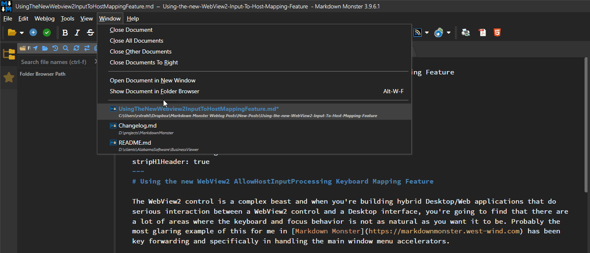
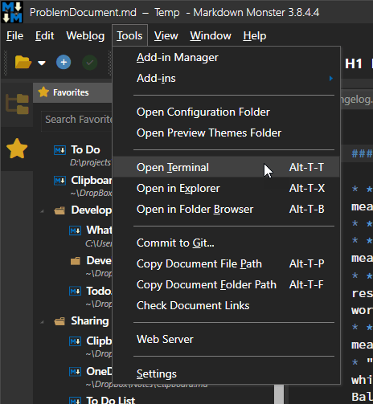

# Using the new WebView2 AllowHostInputProcessing Keyboard Mapping Feature



sThe WebView2 control is a complex beast and when you're building hybrid Desktop/Web applications that do serious interaction between a WebView2 control and a Desktop interface, you're going to find that there are a lot of areas where the keyboard and focus behavior is not as natural as you want it to be. Probably the most glaring example of this for me in [Markdown Monster](https://markdownmonster.west-wind.com) has been key forwarding and specifically in handling the main window menu accelerators.

Markdown Monster is a Markdown editor that uses a JavaScript based editor control, running in a WebView.  The editor control interacts in a million ways with the WPF desktop interface, primarily from .NET and WPF into the JavaScript editor, but also with some operations in the JS code triggering the WPF UI with content updates from the editor. There are tons of UI operations like popping up context menus, hot keys that trigger operations in the WPF app and so on.

For the most part this all works fine with most editor operations handled internally in the editor without ever forwarding keys into the host WPF application. So navigation keys and plain text input is all managed in the JS code. 

The WebView natively also supports **some** forwarding of keyboard operations from the WebView into the host **if the WebView doesn't handle the keys**. This may or may not be the behavior that you want, but even then it's tricky: some key events don't forward to WPF because the browser overrides them or in some cases forwarded keys are not triggered quite in the same way as 'native' keys trigger in WPF controls. 

What this means is that there's a lot of custom key handling to override default key behavior and some trial and error to figure whether keys need to be handled in JavaScript or in WPF. 😏 

##AD##

## Problem: Main Window Menu Activation (Alt Key Triggering)
For me, one big issue has been correctly handling the **main window menu accelerator keys** in the WPF Window host. Accelerators are those 'highlighted' keys on buttons or the main application menu, which based on Windows conventions should activate when you press the `Alt` key. In any 'normal' Windows application pressing `Alt` anywhere, forces focus into the main menu bar, which in turn shows these accelerators like this:

  
<small>**Figure 1** - Accelerator keys show as underlines in menus and buttons and are typically triggered by pressing `alt` in the related context. Here `alt-t` brings up the Tools menu. Note the underlines in the main menu and submenu.</small>

The issue here is that while some keys pass through to WPF, others like accellerators are not or not recognized as accellerators. [I filed an issue on the WebView2 Feedback site many years ago](https://github.com/MicrosoftEdge/WebView2Feedback/issues/468) and this has finally been addressed via a new feature that I describe below.

## The old Hack
Prior to the recently introduced `AllowInputToHostMapping` feature in the WebView, automatic alt key forwarding did not work. Instead, I had to resort to some ugly workarounds that:

* intercept alt-key presses
* use specific timing in code to determine whether it's a key combo or treated like an accelerator key
* manipulate focus explicitly and forward keys into WPF
 
It worked, but very badly. Alt-key combos often failed to activate the menu, or the menu would activate but required another hit of `alt` key to actually activate properly. Good riddance to that code!

## WebView Focus Context is Internal
The reason for all of this WebView misbehavior is that by default **the WebView control handles key events internally** and maintains focus internally. Focus in the WebView control stays inside of the control unless you explicitly click outside of it into another control. 

For a lot of scenarios that is actually the behavior you want - you don't want all events or even keystrokes bleed outside of the WebView. Focusing out adds overhead and can easily cause weird side effects where common browser operations trigger both in the browser and then also in the host.

Instead the WebView lets you handle events in JavaScript code, the WebView Shell (ie. things like `ctrl-f` Find, `ctrl-r` Refresh etc.) and then the .NET Wrapper exposes some of the events into the WPF host via the control wrapper. This works reasonably well for most things although it does mean if you need specific key sequences and shortcuts to work, you're likely going to have to build handlers both in JavaScript and in WPF. 

For example, in Markdown Monster I have a ton of keyboard shortcuts that are user customizable, and those are configured through a `KeyBindingManager` which is configurable and has options to define where a particular key is handled:

* In JavaScript Code via Command Name
* In .NET Via an Command object
* In some rare cases both

If this sounds extreme - it is due to the nature of this application which is highly customizable and because it's an editor it explicitly deals with many custom key combinations. Figuring out what to handle where is a bit of trial and error. 
  
Generally speaking if you control the Html page, handling events in JavaScript is preferable as that's the fastest way to handle events. Calling into .NET is not exactly slow, but it does have more overhead than just running native JavaScript code and in my case calling editor APIs directly, rather than round tripping into .NET to something similar. So raw text operations are handled in the JS code typically while complex or UI heavy or input output related operations typically run in .NET handlers through the WPF interface.

For most hybrid applications this isn't a huge issue because you likely just have a few keyboard operations - if any - that need to be explicitly handled.

But one thing that almost every hybrid app has to deal with is the Main Menu handling, which is as described above is definitely not well behaved from within a WebView.

## Enter CoreWebView2ControllerOptions.AllowHostInputProcessing
As of WebView .NET SDK `1.0.3351` and WebView runtime `1.0.1901.177` you can now have more of keyboard and mouse events bleed into WPF. This specifically fixes the default behavior of the Main Menu accelerator keys in Windows. When this option is enabled more keyboard events using 'special' keys bubble into the host interface where they previously did not.

But it doesn't come without caveats, especially if you've been handling keys the way that it has been working previously. Specifically `AllowHostInputProcessing` intercepts keys **before they hit the WebView Control**, which means that some Windows/WPF default behaviors now end up overriding keys in the WebView.

I'll have more on that a little bit later. Suffice it to say there are 'issues' you'll likely have to deal with, especially if you've handled keys based on the old behavior with WebView first key processing as was necessary before.

To enable the new `AllowHostInputProcessing` behavior, requires that you configure the `CoreWebView2ControllerOptions.AllowHostInputProcessing` which needs to be set up during the WebView environment setup. It's not very obvious as it's part of the WebView Environment setup which is optional - most applications probably don't do this setup by default - so if you want to use this feature a couple of extra steps are required.

I'm going to demonstrate this as part of a helper function (part of the [Westwind.WebView library](https://github.com/RickStrahl/Westwind.WebView)) as that shows the entire process and is probably a good way in general to instantiate an interactive .NET/JS based WebView control. This helper uses a shared WebView environment, so that multiple controls in the same application all share the same WebView environment without having to explicit configure each one. 

First here's the relevant bit of code that's needed to use `AllowHostInputProcessing`:

```csharp
if (allowHostInputProcessing)
{
    var opts = Environment.CreateCoreWebView2ControllerOptions();
    opts.AllowHostInputProcessing = true;                    
    await webBrowser.EnsureCoreWebView2Async(environment, opts);
}
```

Essentially you need to create an instance of the Controller options and then assign it to an environment that is assigned when the Web view is initially created.

What this means is that you can't just simply instantiate a WebView and have this work - you need a bit of machinery to create an environment explicitly, which BTW is a good idea and highly recommended anyway.

I use a helper method that handles the entire WebView initialization for me with every WebView I use. This helper does the following important tasks:

* Sets up a new WebView Environment in a specified (shared) path
  <small>*(**important** because the default deploy folders often don't allow writing which can crash your app or make the WebView not render)*</small>
* Reuses a previously created environment
* If `allowHostInputProcessing` is passed, sets it on the environment
* Calls and awaits the WebView Initialization (ensure that CoreWebView2 is available)

Here's this that wraps all this busy work into an easy to use function (part of [Westwind.Webview](https://github.com/RickStrahl/Westwind.WebView) source [on GitHub](https://github.com/RickStrahl/Westwind.WebView/blob/master/Westwind.WebView/Wpf/CachedWebViewEnvironment.cs))

```csharp
public async Task InitializeWebViewEnvironment(WebView2 webBrowser,
            CoreWebView2Environment environment = null, 
            string webViewEnvironmentPath = null, 
            bool allowHostInputProcessing = false)
{
    try
    {
        if (environment == null)
            environment = Environment;

        if (environment == null)
        {
            // lock
            await _EnvironmentLoadLock.WaitAsync();

            if (environment == null)
            {
                var envPath = webViewEnvironmentPath ?? Current.EnvironmentFolderName;
                if (string.IsNullOrEmpty(envPath))
                    Current.EnvironmentFolderName = Path.Combine(Path.GetTempPath(),
                        Path.GetFileNameWithoutExtension(Assembly.GetEntryAssembly().Location) + "_WebView");

                // must create a data folder if running out of a secured folder that can't write like Program Files
                environment = await CoreWebView2Environment.CreateAsync(userDataFolder:  EnvironmentFolderName,
                    options: EnvironmentOptions);

                Environment = environment;
            }

            _EnvironmentLoadLock.Release();
        }

        // *** THIS HERE ***
        if (allowHostInputProcessing)
        {
            var opts = Environment.CreateCoreWebView2ControllerOptions();
            opts.AllowHostInputProcessing = true;                    
            await webBrowser.EnsureCoreWebView2Async(environment, opts);
        }
        else
            await webBrowser.EnsureCoreWebView2Async(environment);
    }
    catch (Exception ex)
    {
        throw new WebViewInitializationException($"WebView EnsureCoreWebView2AsyncCall failed.\nFolder: {EnvironmentFolderName}", ex);
    }
}
```

That's a bit of code, but it ensures that you safely create a WebView instance with an attached environment and wait for it to initialize. 

> @icon-warning **Important:**
> `await webBrowser.EnsureCoreWebView2Async(environment, opts)` waits until the WebView has loaded. This method also **will not complete if the WebView is not visible**. By extension the helper method which calls this method also does not complete until those criteria are met.

Using this code to initialize the environment, menu accelerators now work as expected. Pressing `alt` activates the main menu even from within the WebView control!

Yay!

##AD##

## Caveats: Watch Tab and Potentially other Navigation Keys and Special Keys
New fea	ture, new challenges! As with all such major changes in how things works there are changes that affect behavior. And it's often not immediately obvious...

### Tab Key Handling
Once you set `AllowHostInputProcessing=true` keyboard behavior now passes through many things that you might not expect causing actions in the host WPF (or WinForms etc.) container. One of the things that is really noticeable is the `Tab` and `Shift-Tab` key which now moves focus to the next control. Again, this may be desirable for some scenarios, but in my editor scenario it most certainly is not: Tab is definitely a character that needs to apply to my text editing and not cause control focus change!

Without any intervention the behavior I now see is that the Tab key does fire inside of the editor, but ALSO causes the WebView to lose focus to another control (an editor tab in Markdown Monster's case). 

The behavior is:

* WPF event fires first
* If not cancelled, event **then** fires in the WebView/Editor

It turns out that this leaves you with some very BAD choices:

* **Handle the key in WPF and cancel**  
no good because the key is not forwarded back into JS code to execute the tab behavior as expected.

* **Handle the key in WPF and don't cancel**  
no good because Tab fires and focus changes.

Luckily in my situation I can explicitly call back into the JavaScript code to perform the appropriate tab action. In the case of my editor, the workaround is to handle the tab key event in WPF and cancel the operation, and **then** explicitly call back into the editor to trigger the Indent/Unindent command behavior. Yeah - very roundabout, but it works!

Here's what that looks like in code:

* Create a custom key Binding for Tab and Shift Tab
* Create a custom command that handles the operation
* Basically overrides the .NET WPF event default behavior (WPF `KeyBinding` does that internally)
* Fires Tab operation back into JavaScript code
	* For Tab simulates the Tab key
	* For Shift Tab calls an Editor command directly

First add the key bindings (these are app custom bindings that wrap WPF KeyBindings but in the end they use the underlying WPF `KeyBinding` for the key handling)

```csharp
// *** Special Bindings

// Tab Handling for the editor: Bind only the Tab control
// Forced to override Tab Handling here due to
// WebView2 ApplyHostToInputProcessing setting which handles
// Tab before it gets to the JavaScript handler.
KeyBindings.AddRange(

    new AppKeyBinding
    { Id = "EditorCommand_TabKey",
        Key = "Tab",
        Command = model.Commands.KeyBoardOperationCommand,
        CommandParameter = "TabKey",
        HasJavaScriptHandler = false,
        BindingControl = mmApp.Window.TabControl
    },
    new AppKeyBinding
    {
        Id = "EditorCommand_ShiftTabKey",
        Key = "Shift+Tab",
        Command = model.Commands.KeyBoardOperationCommand,
        CommandParameter = "ShiftTabKey",
        HasJavaScriptHandler = false,
        BindingControl = mmApp.Window.TabControl
    }
);
```

Then handle that with a custom Command handler:

```csharp
void Command_KeyBoardOperation()
{
    KeyBoardOperationCommand = new CommandBase(async (parameter, command) =>
    {
        var action = parameter as string;
        if (string.IsNullOrEmpty(action)) return;
       
        if (Model.ActiveEditor?.EditorHandler?.DotnetInterop != null)
            await Model.ActiveEditor.EditorHandler.DotnetInterop.KeyboardCommand(action);
    }, (p, c) => true);
}

// inside of `KeyboardCommand` fire JavaScript handlers that forward to the editor
else if (key == "TabKey")
{
    // override so we don't tab out (AllowHostInput option)
    await JsInterop.Invoke("fireTabKey");  // explicit Tab injection so Ghost Text works!
}
else if (key == "ShiftTabKey")
{
    // do nothing but keep from tabbing out
    await JsInterop.ExecCommand("outdent");
}
```

Finally the js code to simulate a key event in ACE editor that is used for `Tab` key:

```javascript
fireTabKey: function (e) {
    const event = new KeyboardEvent("keydown", {
        key: 'Tab',
        keyCode: 9,
        which: 9,
        code: 'Tab',
        bubbles: true,
        cancelable: true,
        shiftKey: false,
        ctrlKey: false,
        altKey: false
    });

    // Dispatch to ACE's hidden textarea
    te.editor.textInput.getElement().dispatchEvent(event);
},
```

`shift-tab` uses Ace Editor's built-in command via `ExecCommand(outdent)`. But `tab` can't use that because there are several special use cases for `tab` in Markdown Monster. In addition to plain editor Tab behavior, Tab is also used for accepting Ghost Text suggestions. For this reason the explicit and more verbose tab injection is used.

For more generic DOM application the `.dispatchEvent()` approach can always be used to simulate key behavior  **after WPF** has had its shot at it. While all of this seems like a circle jerk, it's effective and it works.

Here's a more generic version of a function to simulate a key:

```javascript
fireKey: function (element, key, keyCode, shift = false, ctrl = false, alt = false) {
    const event = new KeyboardEvent("keydown", {
        key: key,
        keyCode: keyCode,
        which: keyCode,
        code: key,
        bubbles: true,
        cancelable: true,
        shiftKey: shift,
        ctrlKey: ctrl,
        altKey: alt
    });

    // Dispatch to ACE's hidden textarea
    element.dispatchEvent(event);
},
```

### ESC
Another key that can cause problems is the `ESC` key which also bubbles up to the container. If you have the WebView on a form that uses ESC for closing the form for example, it'll do that from within the control now where it didn't before. 

Again - this may be the very behavior that you want, but perhaps not. For me in MM and other apps that's not been a problem but just be aware.

If you do need to override the behavior it's the same scenario as I described with the `Tab` key - handle in WPF then fire back into the WebView if you need special handling for ESC.

This pretty much applies to any key that 'misbehaves' in this way.

##AD## 

## Summary
Keyboard handling for special keys in a WebBrowser control always are and have been a bear to work with. It was a pain in the old IE based WebBrowser control and it's a bear now with the WebView2. Different issues with different behaviors, but similar scenarios. How this is handled is one of those damned if you do, and damned if you don't scenarios, because no matter which route you take there are some things that are not going to work the way you likely want them to work. The `alt` and `tab` key behaviors I've described here are perfect examples of that. 

But where there's a will there's a way - and there are ways around this. Overall while `AllowInputHostProcessing` causes some new 'behaviors', for complex hybrid UI interactive applications, if you start with `AllowHostInputHostProcessing` setting on, it provides a better base state for keyboard handling than the default behavior as you get proper forwarding into the host container for Windows specific keyboard combinations and behaviors.  Other than the `tab` key and potentially the `ESC` key I haven't noticed other abhorrent misbehavior even in Markdown Monster's extreme keyboard interop scenario. Hopefully with the information from this post - you can navigate your way more quickly through the issues you might run into, than I did.

## Resources

* [West Wind WebView Library (GitHub)](https://github.com/RickStrahl/Westwind.WebView)
* [See it work in Markdown Monster](https://markdownmonster.west-wind.com)
* [Original WebView2 GitHub Issue Filed (2020)](https://github.com/MicrosoftEdge/WebView2Feedback/issues/468)


<div style="margin-top: 30px;font-size: 0.8em;
            border-top: 1px solid #eee;padding-top: 8px;">
    
    this post created and published with the 
    <a href="https://markdownmonster.west-wind.com" 
       target="top">Markdown Monster Editor</a> 
</div>