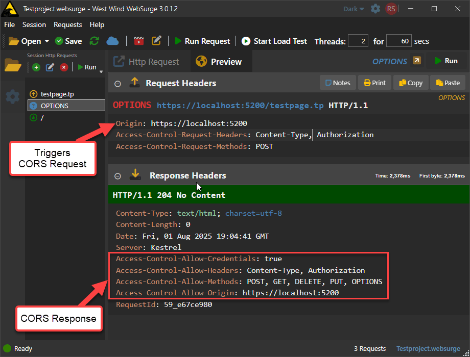
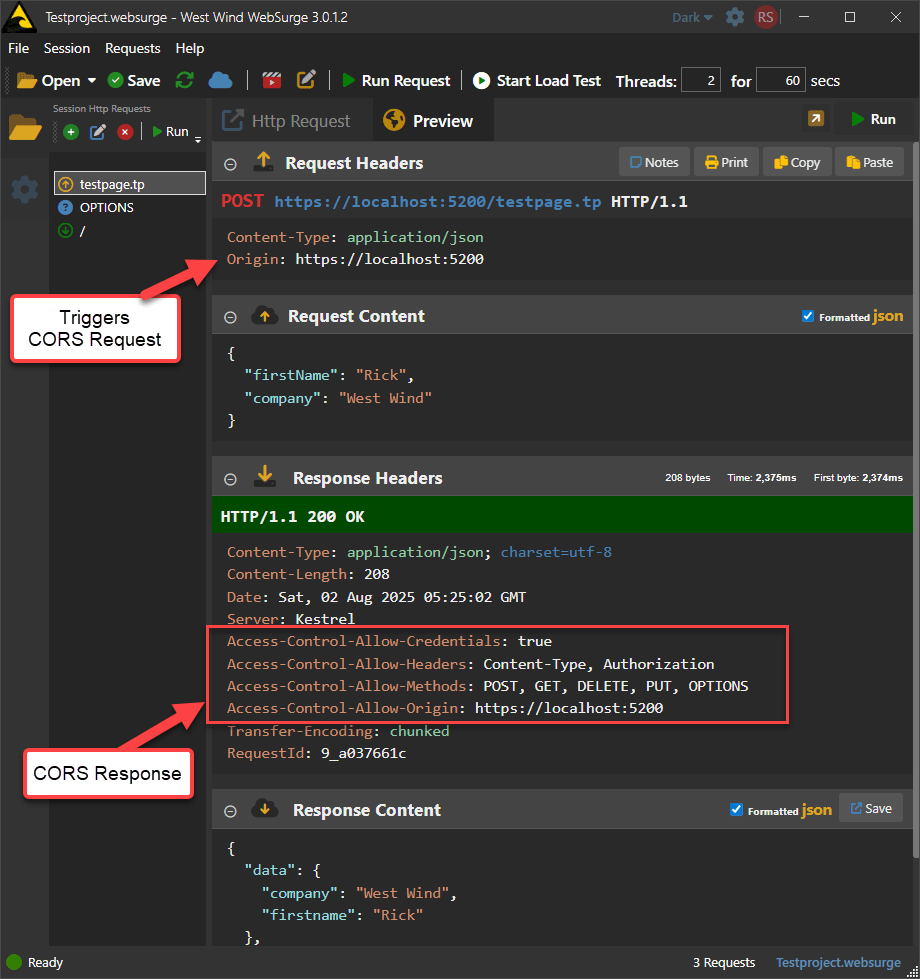

# What is CORS and how to set it up in West Wind Web Connection


CORS stands for **Cross Origin Resource Sharing** and it's a security feature that you need to be aware of if you're building any Http based REST services that are called from a Web browser and that are accessed across multiple domains. This applies if you have a front-end Web site that runs on one domain, and a back-end server that lives on another domain (or IP address). CORS typically kicks in when making script based requests from a browser for these cross domain calls.

The protocol is an odd one, in that it's typically enforced only by Web Browsers, and not in play for most other Http clients like say `wwHttp` or `XMLHttpRequest` in FoxPro, or `HttpClient` in .NET unless you explicitly mimic the `Origin` and `Access-Allow-Request` headers that the protocol uses.

##AD##

When a browser makes a cross-origin `fetch()` or `XMLHttpRequest` call from script, it sends a request for CORS headers which the server should respond to with it's own set of response headers. The browser then checks the server’s response for specific CORS headers like `Access-Control-Allow-Origin` and `Access-Control-Allow-Headers`. If the headers match the requesting origin and other headers, the browser allows the calling JavaScript to access the response. If it doesn't match the browser doesn't expose the response to the calling JavaScript Http client and throws a script error on the request.

The purpose of CORS is to allow the server to tell the Web Browser whether it is allowed access to the requested Url. Although CORS has to be implemented by the server, CORS is really **a Web Browser security feature** that only is enforced by Web Browsers, but not other Http clients.

For example the server may want to ensure that requests only come from one or two domains (origins) that are allowed to access the service when called from a browser. Note that CORS doesn't verify or authorize requests - it's merely a protocol feature that sends requesting headers that are confirmed by the server for a follow-on or in-flight request to process.

### Web Browser Only Protocol but implemented by the Server
It's an odd protocol because **it's only used in Web Browsers**, and mostly irrelevant for other Http clients. The reason is that the actual CORS 'security' feature - rejecting a request on invalid or missing CORS data - is implemented by the Web Browser Http client. So it's up to the client to provide this logic and in general only Web Browsers implement CORS security. Other Http never send CORS request nor do they process them or restrict access based on them.

### CORS doesn't fire on localhost
It's also easy to forget about CORS during development, because CORS doesn't kick in when running **same origin** requests. If your Web page and REST Service run on the same domain/IP Address, there's no CORS. During development that's very common, while deployed applications often run on separate servers. Also if you're using Http testing tools like [West Wind WebSurge](Https://websurge.west-wind.com) or [Postman](Https://www.postman.com/), CORS doesn't automatically kick in unless you explicitly provide the CORS request headers like `Origin` and any `Access-Allow-Request-xxxx` headers. Hence it's easy to forget to test CORS use cases while testing REST applications. Make a point of remembering and/or ensuring you set up specific tests in your Http client request testing suite (you are using that with your services, right? :smile:)


## The CORS Protocol
CORS is implemented at the Http protocol level via Http headers that are passed from client to server, and back to the client.

It works like this:	

* The client sends an `Origin` header and potentially several `Access-Allow-Request-xxxx` headers
* This signals that the server should return a CORS response
* The CORS response needs to include at minimum:
	* The domain that is allowed access (ie. the current domain)
	* The Http Verbs that are allowed
	* The Http Headers that are allowed
	* Whether security (Authorization, Cookies) is allowed

Depending what type of request you're making CORS data is either made via a separate, pre-flight Http `OPTIONS` request, or via in-flight headers that are part of a 'normal' request flow.

### Pre-flight OPTIONS Request
For  most `POST`, `PUT`, `DELETE`, `PATCH` operations browsers send a pre-flight `OPTIONS` request to the server which requests a CORS header response. In effect this results in **two requests** being made to the server by the browser: An `OPTIONS` request for CORS verification, followed by the original full Http request.

The Http `OPTIONS` request from client requests **only the Http headers** for the request and the response returned should contain only the Http headers that a server is expected to return for **this request**, which **includes the CORS headers**. The response code should return headers, no data and have a result Status Code  `204 No Data` although `200 OK` with no data also works - the browser doesn't really care about the result code or content, only the headers.

Here's what that looks like:

  
<small>**Figure 1** - A pre-flight OPTIONS CORS request</small>

Note that this is an `OPTIONS` request that was originally triggered by a `POST` operation that also requires Authentication in this case. Note that the client sets `Access-Control-Request` headers to specify what operations it wants to perform which the server response needs to include by adding the corresponding `Access-Control-Allow` headers. Remember these are typically sent by a Web browser making a cross-origin request via script code.

The server has to respond with headers that include the requested origin, headers and methods. If the CORS headers aren't matched the actual request (ie. the `POST` request in this case) is never fired and the `OPTIONS` request fails the original POST operation that initiated this sequence at the client (ie. the `fetch()` or `XMLHttpRequest` call).

To clarify the full request flow in this example is: 

1. Browser makes a `fetch()` request with  `POST` and Authentication
2. Browser fires `OPTIONS` request
3. Server responds with valid CORS response
4. Browser makes the original `POST` request
5. Server responds to `POST` request

### In-flight Request
For simple `GET` and `POST` requests that don't include authentication, cookie or custom headers, an `Origin` header is sent without a separate explicit `OPTIONS` request and only the single original request is sent. Instead the CORS headers are checked as part of the incoming request and your full response needs to include the CORS headers directly. 

  
<small>**Figure 2** - An in-flight CORS request adds CORS headers to the normal request and response headers. `Origin` is the trigger.</small>

Since in-flight requests don't use a separate request to determine whether the request can execute, it only includes an `Origin` header to validate that the domain is allowed. Everything else is moot, because the request is already in process. POST operations sometimes send the `Access-Control-Request-Headers`, but it's not required which means you can't just assume to echo back the Headers that were sent - or not add the CORS headers if you decide to not reject the CORS request.

##AD##

### CORS Failure and Success Responses
If the client makes a CORS request and your server code decides it doesn't want to allow the request to process, there are number of ways to do this. 

For failures simply return no content with `403 Forbidden`, and don't add any of the CORS headers, which effectively fails the CORS request on the client. Any `fetch()` or `XMLHttpRequest` call will then fail in JavaScript code.

For a successful `OPTIONS` response use `204 No Content`, make sure to return the CORS response headers and then exit **before processing the rest of the request**. 

For in-flight non-OPTIONS responses, make sure to add the CORS response headers, and continue processing your request as normal. No need to adjust any special Http Response code.

> ##### @icon-warning Beware of Access-Control-Allow-Origin: *
> In previous versions of Web Connection (and other server frameworks for that matter) the default generated CORS response for 'all origins allowed'  was to specify `*` for the origin value. Although this is a valid value per spec, in recent years several browsers - namely Safari on Mac and iOS - are refusing to accept any * wildcard values for any of the CORS response headers.  
>
> For this reason as of Web Connection 8.5 the templates have changed from the old `Access-Control-Allow-Origin: *` syntax to explicitly retrieving the `Origin` header and echoing it back in the outgoing header value. The code at the end of this article shows the new approach that works in this more restricted environment.

## CORS in Web Connection
Web Connection doesn't have direct support for CORS as part of the low level Web Connection Web Server connectors, so CORS support has to be implemented at the application level. It's an optional feature and typically only needed for REST projects, although in  some rare situations you may also need it if you have individual REST requests as part of an HTML application (rare, but it happens).

When you create a new REST project via the **New Project Wizard** Web Connection automatically adds CORS support into the generated Process class in `OnProcessInit()`. The code checks for an `Origin` header and then displays the appropriate CORS response headers, based on the incoming request. This ensures that valid cross-origin requests are properly acknowledged and allowed by the browser.

The semi generic code to do this lives in your Process class in `OnProcessInit()`:

```foxpro
FUNCTION OnProcessInit
LOCAL lcOrigin, lcRequestHeaders, lcVerb

*** Unrelated
Response.Encoding = "UTF8"
Request.lUtf8Encoding = .T.

*** Add CORS headers to allow cross-site access on REST calls for browser access
lcOrigin = Request.ServerVariables("Http_ORIGIN")

IF !EMPTY(lcOrigin) 
	*** Allow all domains IP addresses effectively
	Response.AppendHeader("Access-Control-Allow-Origin", lcOrigin)  
	Response.AppendHeader("Access-Control-Allow-Methods","POST, GET, DELETE, PUT, OPTIONS")	
	
	lcRequestHeaders = Request.GetExtraHeader("Access-Control-Request-Headers")
	if EMPTY(lcRequestHeaders)
	  lcRequestHeaders = "Content-Type, Authorization" && ,Cookie if you use cookie auth!
	endif
	Response.AppendHeader("Access-Control-Allow-Headers", lcRequestHeaders)
	Response.AppendHeader("Access-Control-Allow-Credentials","true")
ENDIF

lcVerb = Request.GetHttpVerb()
IF (lcVerb == "OPTIONS")
    Response.Status = "204 No Content"
	RETURN .F.  && Stop Processing
ENDIF

*** ... other OnProcessInit() code
```

The code first checks for the `Origin` client header, which determines whether the request is cross-site and requires the server to return a CORS response. No `Origin` means no CORS data is required on the request. So local domain access, or access from a non-Web Browser request won't trigger CORS requests.

When a CORS request comes in here are the items required:

### Original Origins
Next this code implements the default `Origin` behavior which returns the origin requested, which **effectively allows access to all domains** since we're always returning what the client requests.

If you want to allow only certain domains, you can create some sort of lookup function or even a hard code a list of domains to allow. If a CORS request fails you can return a `403 Forbidden` status - and not return the CORS headers.

Here's what that looks like:

```foxpro
IF !EMPTY(lcOrigin) 
    IF !THIS.CheckForValidOrigin(lcOrigin)
       Response.Status = "403 Forbidden"
       RETURN .F.
    ENDIF 
    
	Response.AppendHeader("Access-Control-Allow-Origin", lcOrigin)  
    ...
ENDIF
```

### Methods
You need to specify the allowed methods when OPTIONS requests are made. In OPTIONS requests the client will send `Access-Control-Request-Methods` which you can echo back. Not though that this value is not present in inflight requests so it's better to use a fixed set of Http Verbs that you are planning to use in your project.

Easiest just to return all the methods your app supports, but you could also return the specific verb being requested.

```foxpro
Response.AppendHeader("Access-Control-Allow-Methods","POST, GET, DELETE, PUT, OPTIONS")	
```

Note that in an `OPTIONS` command you need to include `OPTIONS` plus `Access-Control-Request-Methods` rather than just using `Request.GetHttpVerb()`.

### Headers
This one is a little tricky since you may not know what headers you need to support for all requests. `OPTIONS` requests provide an explicit `Access-Control_Request-Header` value that you can echo back, but again there's no guarantee that this value exists so you want to make sure you have a default value ready using this logic:

```foxpro
lcRequestHeaders = Request.GetExtraHeader("Access-Control-Request-Headers")
IF EMPTY(lcRequestHeaders)
  lcRequestHeaders = "Content-Type, Authorization" && ,Cookie if you use cookie auth or Sessions!
ENDIF
```

The tricky bit here is that **you need to provide all custom headers** that you might send. While that may seem easy for individual requests, it's more difficult to figure out exactly what's needed for *every request* in an application and distill that down to a single set of headers. Hence you'll want to use the requested headers if available. If you have custom headers it'll always trigger an `OPTIONS` request, so in that case the `Allow-Control-Request-Headers` should be sent with the incoming request and that's what you should return in your CORS header response.

### Allow Credentials
If your app has any authentication you'll want to set this value to true. This is needed if you have `Authorization` or `Cookie` headers.

Kind of silly that this is required since the headers should be able to determine whether this is required.

##AD##

## Summary
CORS is a clunky protocol and when you first look at it, it doesn't seem to be very effective at providing any security at all. However, for browsers it is useful in ensuring that errand Web browsers can't spoof requests from an embedded iframe for example. The server can explicitly check valid source domains and refuse to serve requests if the list of client domains is not met. However, that does not negate the problem because non-Web Browser clients can call your server any way they want - including potentially spoofed origin domains.

The good news is that it's easy to implement CORS for your REST services in Web Connection. There's only a little bit of code required, and in can be placed into a single entry point in `OnProcessInit()` in one place. If you're creating new REST projects, Web Connection automatically provides the CORS code in the generated process class and if you have existing code you can easily copy in the code from this article...

<div style="margin-top: 30px;font-size: 0.8em;
            border-top: 1px solid #eee;padding-top: 8px;">
    
    this post created and published with the 
    <a href="Https://markdownmonster.west-wind.com" 
       target="top">Markdown Monster Editor</a> 
</div>