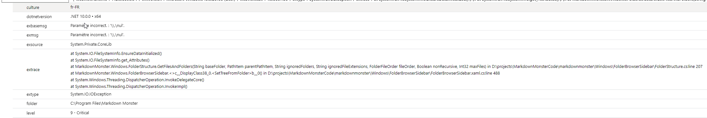
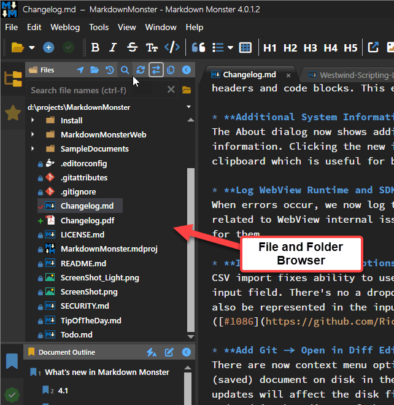
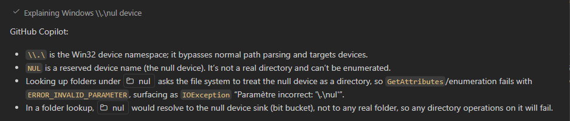
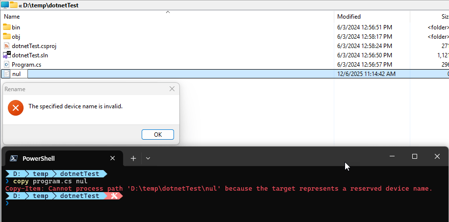

# What the heck is a `\\.\nul` path and why is it breaking my Directory Lookup?


In the last few months my [Markdown Monster](https://markdownmonster.west-wind.com) Application Insights log has been inundated with a hard failure for lookups of a `\\.\nul` device error. In my  logs this shows up as an error like this:

  
<small>**Figure 1** - Null device errors in the Application Insight logs</small>

This error started creeping up in my logs a few months ago, and since then has gotten more frequent. The error always occurs in the same location in the code and it's related to the File and Folder Browser in MM that displays the files available on the file system. 

  
<small>**Figure 2** - The File and Folder Browser in Markdown Monster that is the target of the error</small>

This is a generic file browser, so it's very susceptible to all sorts of oddball user configurations and mis-configurations and this particular error likely is of the latter kind. However, after doing a bit of research this is not an uncommon error - there are a number of references to this although the cause of it doesn't appear to be very clear and can be related to various different things.

In my use case, the error itself is triggered by doing a `fileInfo.Attributes` flag check  on a file name that was returned by the `Directory.GetFiles()` lookup originally. The file is  not a 'regular' file but rather a 'device' and access to `.Attributes.HasFlag()` throws the exception. And yeah that's **very unexpected**.

##AD##

Specifically the failure occurs here:

```csharp
// System.IO Exception: Incorrect Parameter \\.\nul  
if (fileInfo.Attributes.HasFlag(FileAttributes.Hidden))
    item.IsCut = true;
```

This code sits inside of a loop that does a directory lookup then loops through all the files and adds them to the display tree model that eventually displays in the UI shown in **Figure 1**. The key is that the Attribute look up fails on this mystery 'null device' file.

This is doubly frustrating in that `Attributes` is an enumeration that apparently is dynamically evaluated **so the only way to detect the invalid state is to fail with an exception when calling `.HasFlag()`**. Bah 💩!
  
## What the heck is  `\\.\nul`?
My first reaction to this error was, yeah some user is doing something very unusual - ignore it. And yes, the error is rare, but there appear to be a number of different users running into this issue and more and more are starting to show up.

Thanks to several commentors on this post, it appears that this problem is caused by [Claude Code](https://claude.com/product/claude-code) running Unix style Bash commands which produce invalid files on Windows. Quoting from **Michael Christensen**'s comment response below:

> I get this `nul` file all the time, in my case it's from **Claude Code**. The LLM has access to run Bash commands, and on Windows it uses Git Bash (presumably that was easier than getting it to use Windows Command or PowerShell).
>
> What happens is, it wants to suppress output on a command, but it also knows it's on Windows, so it tries something like `command > nul 2>&1`. In Git Bash that creates the `nul` file that Windows has so much trouble with. It should be using `/dev/null`, which works properly.

This explains why this happens - since it's Bash under a Unix shell is running the command it manages to create a `nul` file, which is an illegal file name in Windows. Windows in turn interprets that file as the `nul` device when doing directory lookup, which then doesn't behave properly for a local file - specifically missing attributes.

Before the comments, I started looking into this using several LLMs.

The first response is a standard explanation of a null device:

  
<small>**Figure 3** - Basic LLM definition of a null device in file context</small>

Turns out `nul`  refers to a the Windows `nul` device, which as the name suggests is a device sink that doesn't do anything. Apparently, it's meant to be used to pipe or stream STDIN/OUT to oblivion.

Under normal circumstances a `nul` file or folder can't be created in Windows:

  
<small>**Figure 4** - `nul` files and folders can't be created in Explorer or the Shell</small>

But if you're doing it from the Bash shell apparently there's a way around that. Once the file exists the directory listing returns it as a device, and that's when the problem that I've run into occurs.

##AD##

## Working around 
So given what we know now, there are workarounds. 

* Somehow (Claude) a file named `nul` is created
* Directory Listing picks up the `nul` file
* Windows treats this file as a Device, so some file features are not available (ie. Attributes)

So here are a couple of workarounds I've used for this:

### Bobbing for Apples - eh Errors
This falls into the simplest thing possible bucket:

Wrap the failure into an exception. This is easy enough but I always hate try/catch wrapping shit willy nilly, because it's one of those one-off fixes that doesn't really address what's going on. But... it's the simplest thing and it works for obvious reasons:

```csharp
try
{
    if (item.FileInfo.Attributes.HasFlag(FileAttributes.Hidden))
        item.IsCut = true;
}
catch {
    // if we can't get attributes it's some device or map and 
    // we should
    ignore it
    item.IsCut = true;
}
```

The idea here is that if attributes cannot be retrieved the file cannot be a 'normal' file that should be displayed and we can safely omit rendering it.

### Filtered Directory Listings
The second solution handles this from the other end: It tries to ignore any non-file 
'resources' or in this case 'devices'. It seems odd to me that `Directory.GetFiles()` would return a device as part of its default configuration, but apparently it does.

It turns out the default `Directory.GetFiles()` filter mode is rather liberal in what it retrieves using the default `EnumerationOptions` instance:

  
<small>**Figure 5** - Default enumeration mode doesn't skip Devices</small>

It only skips over hidden and system files, but allows everything else including 'devices'.

The `\\.\nul` error is caused by a **Device** that is the `nul` file.

So, rather than using the default directory listing, we can use explicit `EnumerationOptions` and skip over devices, like this:

```csharp
string[] files = [];
try 
{
    var opts = new EnumerationOptions { MatchType = MatchType.Simple,
        AttributesToSkip = FileAttributes.Hidden |  FileAttributes.Temporary |
                           FileAttributes.Device | FileAttributes.ReparsePoint
    };
    if (config.ShowAllFiles)
        opts.AttributesToSkip = FileAttributes.Device | FileAttributes.ReparsePoint;
    folders = Directory.GetDirectories(baseFolder, "*", opts);
}
catch { /* ignore */ }

foreach(var file in files) { ... }
```

> #### @icon-warning EnumerationOptions Default Behavior
> Notice the `MatchType.Simple` setting which is the default value, but this behaves differently from the no parameter version which uses a `compatible` version which on Windows is `MatchType.Win32`. `Simple` doesn't work with `*.*` the same way as `Win32` does (only selects directories with `.` in name) and that can bite you when using the explicit `EnumerationOptions` parameter.   
> `Simple` and `*` is the clearer syntax for directories, just be aware that the defaults are different between passing no EnumerationOptions and passing in default settings from `EnumerationOptions` especially if your 'upgrading' old code.

This is a bit more verbose obviously, but it makes it real obvious that we're skipping certain files.

Keep in mind that this is for a widely used generic implementation so there's a extra safety built in here with the `try/catch` to protect against invalid user provided folder names etc. from throwing out of the app. In that scenario there's no file list returned.

The code above should prevent devices and reparse points - which is the likely the cause of the `\\.\nul` device errors I'm seeing in the log - to stop occurring as they are not being returned by the directory listing.

This is now making me a bit paranoid that I should be using explicit EnumerationOptions whenever I do directory listings, but I suppopse this is a pretty rare error that - unfortunately - will blow up unsuspecting code if it tries to get information about the 'nul' device file returned if it's not filtered out. Ugh.

Presumably Claude Code will get this sorted at some point and we'll probably never ever see this error again 😂.

##AD##

## Summary
Since implementing the second fix (without the explicit try/catch for the Attributes) the logs have been clean of these null file errors. Since I never had a repro scenario, I can only go off my logs though so I can't be 100% certain that the problem is solved yet, but using both the directory skip filter plus the exception handling around the Attributes retrieval most definitely will fix this issue - I'm leaving the latter try/catch out for now to see if the filtered directory list alone will fix the issue and so far it seems that way.


However, it's important to remember that there can be funky behaviors with filesystem behavior related to symlinks and remapped folders (like DropBox) and apparently funky files created outside of the Windows direct file system managers (ie. Bash or other Linux shell). For example, I just ran into another issue where `FileInfo.Exists` reports my Dropbox folder as non-existing where `Directory.Exists()` does. IOW, special and symlinked files and folders can have odd behaviors and in those scenarios it might be a good idea to **explicitly** specify the file attributes to avoid unexpected failures that can't be easily handled with predictable logic especially when using a generic file client that accesses user provided paths.