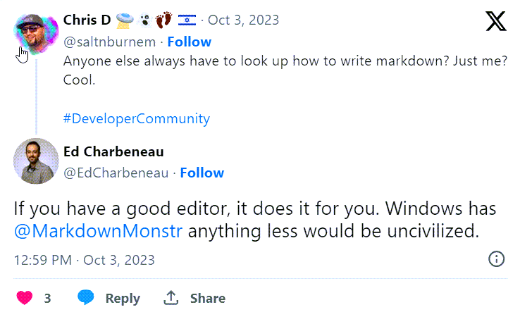

# WordPress API Publishing Test

Updated Post


This is a test post to send to WordPress.

Here's an image to post:


<small>**Figure 1** - Markdown Monster Editor Logo</small>

```cs
foreach(var name in names)
{  
	Console.WriteLine(name);
}
```

Here's another image to upload:

  

More text here.