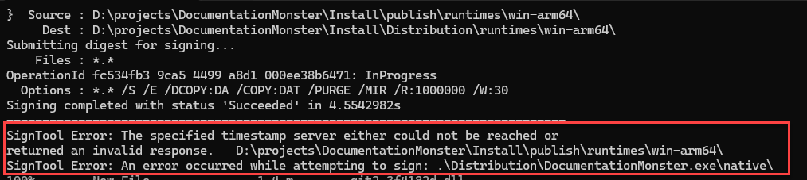
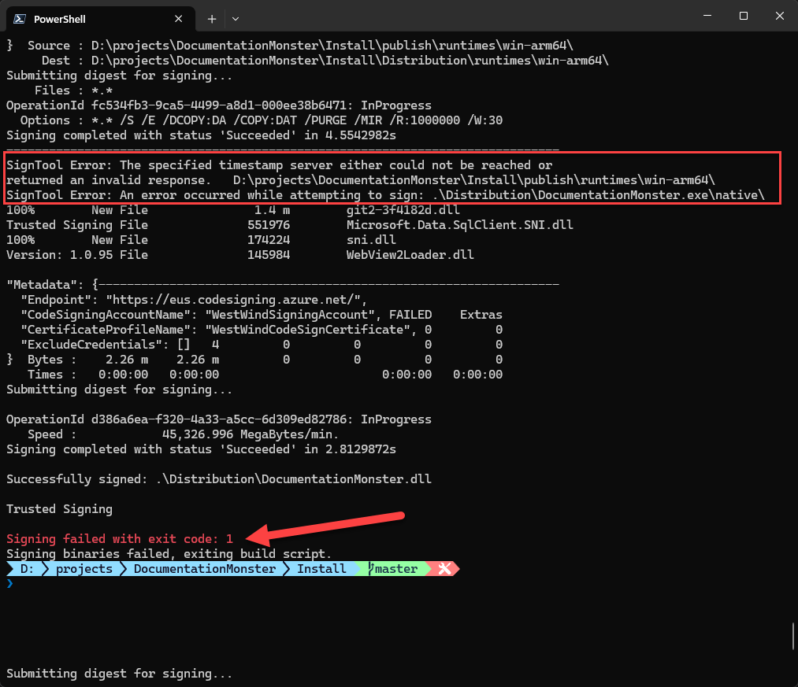

# Don't use the Microsoft Timestamp Server for Signing



If you're using any of the Microsoft Signing technologies like Trusted Signing, one thing you might run into is frequent failures of the default, suggested timestamp server that Microsoft uses in their examples:

```
$timeServer = "http://timestamp.acs.microsoft.com"
```

For signing code with trusted signing like this:

```ps
$timeServer = "http://timestamp.acs.microsoft.com"

$args = @(
    "sign", "/v", "/debug", "/fd", "SHA256",
    "/tr", "$timeServer",
    "/td", "SHA256",
    "/dlib", "$env:LOCALAPPDATA\Microsoft\MicrosoftTrustedSigningClientTools\Azure.CodeSigning.Dlib.dll",
    "/dmdf", ".\SignfileMetadata.json"
)
# Add non-empty file arguments
foreach ($f in @($file, $file1, $file2, $file3, $file4, $file5, $file6, $file7)) {
    if (![string]::IsNullOrWhiteSpace($f)) {
        $args += $f
    }
}

# Run signtool and capture the exit code
.\signtool.exe $args
```

This works about 80% of the time for me in my multiple file signing workflow - yeah that's a pretty high failure rate! I end up signing 8 files per distribution (several app binaries and the final setup Exe) and quite frequently one of those signing operations (mostly the last one of the larger set up exe) fails with:

  
<small>**Figure 1** - Signing fails due to the Microsoft Timestamp Server </small>

I see this happening in two separate but similar workflows both of which are signing a number of files in fairly rapid succession. I'm using `Signtool` to batch the files to sign, but it appears Signtool behind the scenes is still sending them one at a time - and that might be where the problem is - some sort of rate limiting kicking depending on how quick these files sign.

Regardless, whether it's an infra failure or a rate limiting issue, it's crazy to think that something as simple as a timestamp server could fail in a common scenario like this, but leave it to Microsoft to screw that up. 💩

##AD## 

## Use a different TimeStamp Server
The solution to this is simple: Don't use the Microsoft server and instead switch to a different signing compatible Timestamp Server that is actually reliable.

I've been using DigiCert's server with this Url:

```
$timeServer = "http://timestamp.digicert.com"
```

and that has solved the problem for me at the moment. No more signing errors.

## Resources 

* [Fighting through Setting up Microsoft Trusted Signing](https://weblog.west-wind.com/posts/2025/Jul/20/Fighting-through-Setting-up-Microsoft-Trusted-Signing)

* **Alternate Timestamp Servers**  
	* **DigiCert**
	    * `http://timestamp.digicert.com`
	    * `http://timestamp.digicert.com/ts` \(alt endpoint\)
	* **Sectigo \(Comodo\)**
	    * `http://timestamp.sectigo.com`
	    * `http://timestamp.comodoca.com/rfc3161`
	* **GlobalSign**
	
	    * `http://timestamp.globalsign.com/?signature=sha2`
	* **SSL.com**
	    * `http://ts.ssl.com`
	    * `http://ts.ssl.com/rfc3161`
	* **Entrust**
	    * `http://timestamp.entrust.net/TSS/RFC3161sha2TS`
	* **Certum \(Asseco\)**
	    * `http://time.certum.pl`
	    
<div style="margin-top: 30px;font-size: 0.8em;
            border-top: 1px solid #eee;padding-top: 8px;">
    
    this post created and published with the 
    <a href="https://markdownmonster.west-wind.com" 
       target="top">Markdown Monster Editor</a> 
</div>

<p style="margin-top: 1em;">
##AD##
</p>