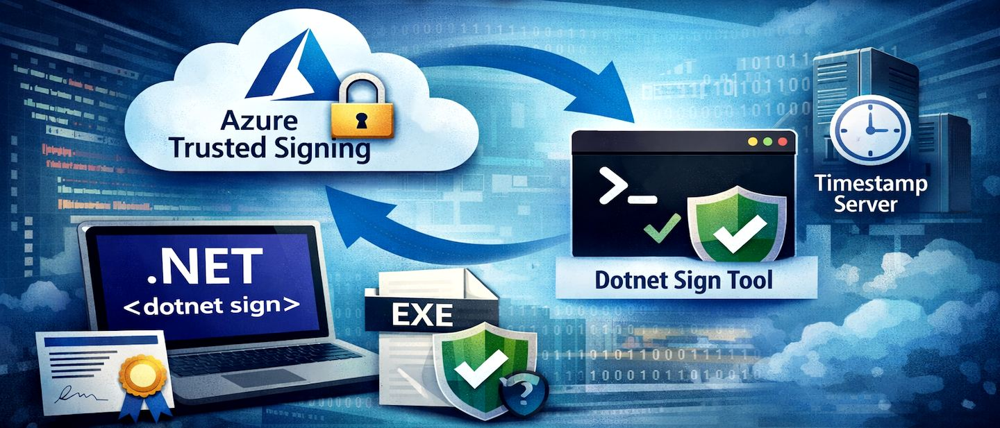
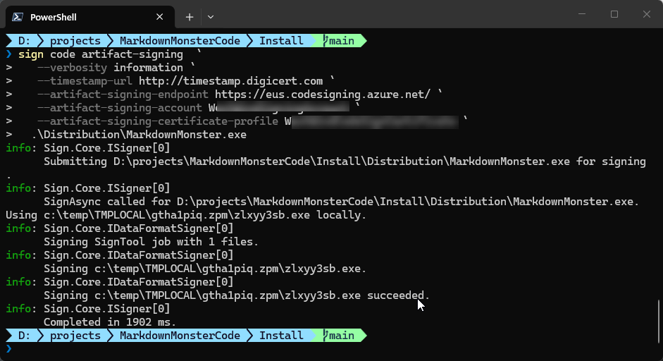

# Azure Trusted Signing Revisited with Dotnet Sign  



I [wrote about how to get Azure Trusted Signing to work](https://weblog.west-wind.com/posts/2025/Jul/20/Fighting-through-Setting-up-Microsoft-Trusted-Signing) for my application signing tasks a while back and mentioned how frustrating that process was both on Azure as well as on the client for the actual signing process. Well, since then I'm happy to say that some additional tooling has come out from Microsoft that makes this process quite a bit easier and also the signing process considerably faster than my previous workflow.

This post is specifically about **the client side of signing** - the original post covers both the Azure setup for your Azure Trusted Signing account and that hasn't changed much as well as the old SignTool based workflow which was a pain in the ass. In this post I'll discuss the new-ish `dotnet sign` tooling that now works officially with Azure Trusted Signing and is a lot simpler to set up and faster to run.

The documentation for the local client signing part of this process is still nearly non-existent or, at minimum, non-discoverable, and LLMs absolutely give the wrong advice because of it. The change of terminology and command names in the tooling isn't helping either, along with the outdated documentation. Why in the heck would you name something as obscure and non-relevant as `artifact-signing` instead of the obvious `trusted-signing` that already existed? But I digress :smile:

So, here's the skinny on what works with a heck of a lot less effort than what I described in the previous post.

##AD##


## Setting up Trusted Signing
You still need to set up your Azure Trusted Signing, so that part hasn't changed, although by now hopefully the process to set this up might be a little simpler than what I described in my previous post:

* [Setting up Microsoft Azure Trusted Signing](https://weblog.west-wind.com/posts/2025/Jul/20/Fighting-through-Setting-up-Microsoft-Trusted-Signing#setting-up-microsoft-trusted-signing)

Once you have your Trusted Signing account set up and ready to go, what has changed for the better is the process of how you sign your binaries on the local machine. It's quite a bit easier using `dotnet sign` as that tool combines everything you need through the single set of tools - except for the Azure CLI which is required for authentication.

## Local Signing: Enter dotnet sign
`dotnet sign` is a **dotnet tool** that you install via the .NET SDK. You need to have the .NET SDK installed to install dotnet sign, as well as the Azure CLI so you can authenticate your Azure account.


**Prerequisites**

* [.NET 10 SDK](https://dotnet.microsoft.com/en-us/download/dotnet/10.0)
* [Azure CLI](https://learn.microsoft.com/en-us/cli/azure/install-azure-cli-windows?view=azure-cli-latest&pivots=winget) 
* [Dotnet Sign](https://github.com/dotnet/sign)


### Install .NET SDK
The .NET SDK is required in order to install the dotnet tool infrastructure required to install and run the `dotnet sign` tool.

You can install the SDK from here if you don't already have it on your dev machine

* [.NET 10 SDK](https://dotnet.microsoft.com/en-us/download/dotnet/10.0)
<small>**Figure 1** - Preview to Editor Syncing in Markdown Monster</small>

> #### @icon-info-circle `dotnet tool` and the .NET SDK
>`dotnet tool` deployed *applications* use the locally installed .NET SDK to take advantage of the cross platform features of .NET without having to install any additional framework dependencies or having to create separate installers for each platform. A Dotnet tool will run on any of .NET's supported platforms assuming you use cross-platform compatible features only. It does this by automatically creating a platform specific executable for the tool application that `dotnet tool install` is run on.  For this reason it's a convenient way to deploy tools across platforms and if you're in the .NET development eco-system in any way it's likely the .NET SDK is already installed.

### Install Azure CLI
The Azure CLI is required so that you can authenticate using Azure's oAuth Authentication flow.

You can install the Azure CLI in a number of ways but the easiest is probably via WinGet.

* [Install Azure CLI](https://learn.microsoft.com/en-us/cli/azure/install-azure-cli-windows?view=azure-cli-latest&pivots=winget)

Here's the WinGet command:

```ps
winget install --exact --id Microsoft.AzureCLI
```

#### Logging into Azure CLI
Once the Azure CLI is installed you can then log in and set the subscription that your Certificate runs under:

```powershell
az config set core.enable_broker_on_windows=false
az login
az account set --subscription "Pay-As-You-Go"
```


This is what I have in mind.

The prompt to login is interactive - follow the yellow prompts. I've had quite a few  issues with the default Windows oAuth authentication using a Web Browser, and the first configuration line:

```ps
az config set core.enable_broker_on_windows=false
```

provides more reliable authentication directly in the CLI. You can try without it first, and if that doesn't work use that line to use the alternate sign in flow.

For me this was the only way I get it to work correctly. Your mileage may vary and you may not  need it. Another thing to look out for is to make sure you choose the right subscription as subscription ids are hard to decipher in some cases if you have a few of them.
 
### Install Dotnet Sign
[Dotnet Sign](https://github.com/dotnet/sign) is a **dotnet tool** installed executable, and in order to install it you need use the `dotnet tool` command that's part of the .NET SDK.

Make sure the .NET SDK is installed first, and then to install dotnet sign:

```ps
dotnet tool install -g --prerelease sign
``` 

The tool is currently in pre-release so the `--prerelease` switch is not optional -  otherwise the package won't be found. You can also install locally into your project by omitting the `-g` switch which creates a fixed local copy instead of a global instance installed in the shared tools location.

##AD##

### Using Sign Code Artifact Signing
With all this in place you can now use the `Sign` command from the command line to sign your binaries. Specifically you'll use:

```ps
sign code artifact-signing --help
```

Note that although there's a `trusted-signing` option, it's now deprecated and you should use `artifact-signing` instead.

A full signing command for a binary file looks like this:

```powershell
sign code artifact-signing  `
   --verbosity warning `
   --timestamp-url http://timestamp.digicert.com `
   --artifact-signing-endpoint https://eus.codesigning.azure.net/ `
   --artifact-signing-account MySigningAccount `
   --artifact-signing-certificate-profile MySignongCertificateProfile `  .\Distribution\MarkdownMonster.exe
```

You can specify multiple files and they will be batch sent together. Typically you'll want to run with Verbosity of warning, which doesn't show any output unless you have a problem. The default (Trace) and Information are very verbose and too much noise in any sort of build output unless you explicitly are looking for that.

Here's what that looks like with Information verbosity, when you run it in the Terminal:



Signing is **considerably faster** than what I saw with my old `SignTool` based workflow, with signing times under two seconds for most files (this is one is quite large). Based on this speed, it looks like `sign` uses locally created hashes rather than uploading the entire file to the server for processing.

Unfortunately, the new workflow with Sign doesn't support a metadata file like `SignTool` supports, so you **have to specify all the Azure parameters explicitly**. I'll fix that with the Powershell script provided below to keep that useful functionality intact.

### Putting it all together into a Signing Script
The basic syntax for signing via `Sign` is now simple enough. However, I need signing in **a lot of different projects**, so I need to reuse the functionality across these various projects and provide the script as part of the **local** build infrastructure.

The reasons to create a script for all this are:

* Using metadata configuration files (like SignTool used to use)
* Handling login optionally
* Handling parameter errors and signing errors
* Documentation for prerequisites and configuration in the script
* Self-contained for easy re-use - just copy two files

Here's the Powershell script:

```powershell
# File name: Signfile.ps1
# Prerequisites:  
# dotnet tool install -g --prerelease sign
# Azure CLI required for logging in optionally
# Support metadata: SignfileMetaData.json

param(
    [string]$file = "",
    [string]$file1 = "",
    [string]$file2 = "",
    [string]$file3 = "",
    [string]$file4 = "",
    [string]$file5 = "",
    [string]$file6 = "",
    [string]$file7 = "",
    [string]$file8 = "",
    [boolean]$login = $false
)
if (-not $file) {
    Write-Host "Usage: SignFile.ps1 -file <path to file to sign>"
    exit 1
}

if ($login) {
    az config set core.enable_broker_on_windows=false
    az login
    az account set --subscription "Pay-As-You-Go"
}

# SignfileMetadata.json is not checked in. Format:
# {
#   "Endpoint": "https://eus.codesigning.azure.net/",
#   "CodeSigningAccountName": "MySigningAccount",
#   "CertificateProfileName": "MySigningCertificateProfile"
# }

$metadata = Get-Content -Path "SignfileMetadata.json" -Raw | ConvertFrom-Json
$tsEndpoint = $metadata.Endpoint
$tsAccount = $metadata.CodeSigningAccountName
$tsCertProfile = $metadata.CertificateProfileName
$timeServer = "http://timestamp.digicert.com"

$signArgs = @(
    "--verbosity", "warning",
    "--timestamp-url", $timeServer,
    "--artifact-signing-endpoint", $tsEndpoint,
    "--artifact-signing-account", $tsAccount,
    "--artifact-signing-certificate-profile", $tsCertProfile
)

# Add file arguments at the end
foreach ($f in @($file, $file1, $file2, $file3, $file4, $file5, $file6, $file7, $file8)) {
    if (![string]::IsNullOrWhiteSpace($f)) {
        $signArgs += $f
    }
}

# Run signtool and capture the exit code
sign code artifact-signing $signArgs
$exitCode = $LASTEXITCODE

if ($exitCode -eq 0) {
    Write-Host "File(s) signed successfully." -ForegroundColor Green
    exit 0
} else {
    Write-Host "Signing failed with exit code: $exitCode" -ForegroundColor Red
    exit $exitCode
}
```

This script uses a separate, external configuration file for the Azure values required for code signing to work. I tend to check in the signing script into Git, while the metadata is locally created and not checked in which separates the two. Alternately you can use some other approach to keep the private data out of your repo - environment variables would also do the trick, but I prefer this explicit approach because it makes it easy to copy the data and script across multiple projects while still keeping the private data out of Git.

Here's what the metadata file looks like:

```json
// SignfileMetadata.json
{
  "Endpoint": "https://eus.codesigning.azure.net/",
  "CodeSigningAccountName": "MySigningAccount",
  "CertificateProfileName": "MyCodeSignCertificateProfile"
}
```

So now I can drop `SignFile.ps` and `SignfileMetadata.json` file into a folder and use it for signing.

In my build script I then have something like this to invoke the signing operation after my binaries have been built:

```powershell
if ($nosign -eq $false) {    
    "Signing binaries..."
    .\signfile-dotnetsign.ps1 -file ".\Distribution\MarkdownMonster.exe" `
                    -file1 ".\Distribution\MarkdownMonsterArm64.exe" `
                    -file2 ".\Distribution\MarkdownMonster.dll" `
                    -file3 ".\Distribution\mm.exe" `
                    -file4 ".\Distribution\mmcli.exe" `
                    -login $false                   

    if ($LASTEXITCODE -ne 0) {
        Write-Host "Signing failed, exiting build script."
        exit $LASTEXITCODE
    }
}
```

and then again at the very end to sign the final setup distributable:
l
```powershell
.\signfile-dotnetsign.ps1 `
	-file ".\Builds\CurrentRelease\MarkdownMonsterSetup.exe" `
    -login $false
```

The meta data file can be created in the output folder and should not be checked into Git repo. Alternately you could also change the code to use environment variables if that suits your workflow better.

## Dotnet Sign is Much Better
I've been using this new workflow for a couple of weeks now, and it has made signing **a lot faster** than `Signtool`. It appears that binaries are locally hashed and only the hash data is sent to the server result in much faster processing times. Average processing with Signtool was around well over 5 seconds per file, it's now down under 1 second per file - a huge improvement in packaging performance.

Microsoft's own documentation now also uses the Digicert timestamp server [instead of the Microsoft one that has been failing for me on a regular basis](https://weblog.west-wind.com/posts/2026/Feb/26/Dont-use-the-Microsoft-Timestamp-Server-for-Signing). Using the DigitCert timestamp server I haven't had any signing failures in the last two weeks.

## Summary
So all of this is good news, as it's taken away some of the early growing pains of using Azure Trusted Signing and makes it much more usable and predictable to run on the client without having to jump through all sorts of hoops.

It still isn't as simple as it could be, especially if developers are not already using the .NET ecosystem, but if you're doing code signing for Authenticode, you're likely a Windows developer.

The last hurdle that I'd like to get going now is NuGet signing. But I'll leave that for another time... Onwards.

## Resources

* [Fighting through Setting up Microsoft Trusted Signing  (for steps to set up on Azure)](https://weblog.west-wind.com/posts/2025/Jul/20/Fighting-through-Setting-up-Microsoft-Trusted-Signing)
* [Microsoft Trusted Signing Documentation](https://learn.microsoft.com/en-us/azure/trusted-signing/)
* [Microsoft Trusted Signing Pricing Page](https://azure.microsoft.com/en-us/pricing/details/trusted-signing/)


<div style="margin-top: 30px;font-size: 0.8em;
            border-top: 1px solid #eee;padding-top: 8px;">
    
    this post created and published with the 
    <a href="https://markdownmonster.west-wind.com" 
       target="top">Markdown Monster Editor</a> 
</div>

##AD##