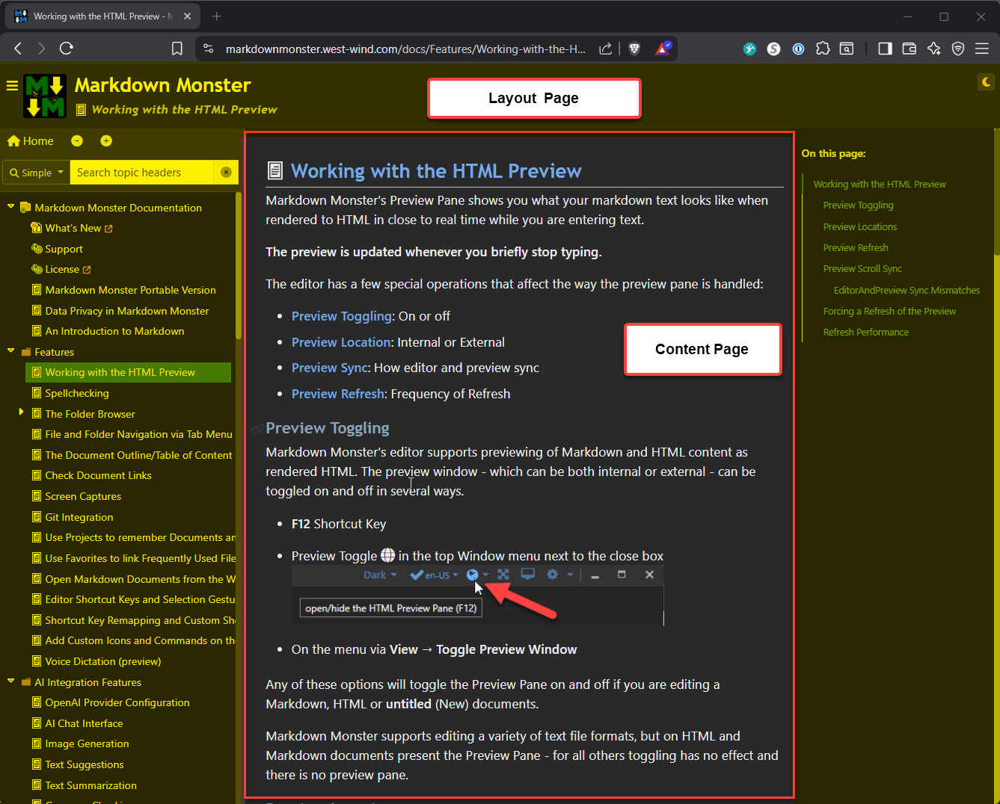
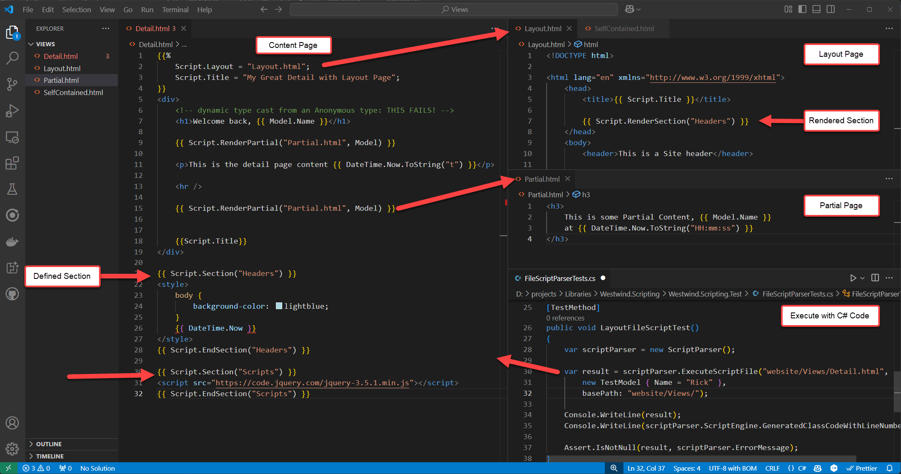
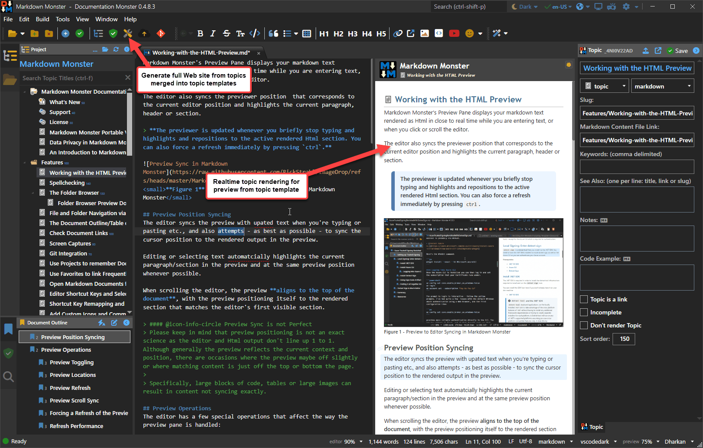
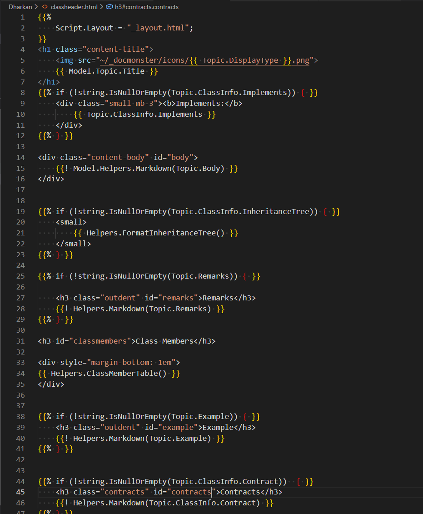
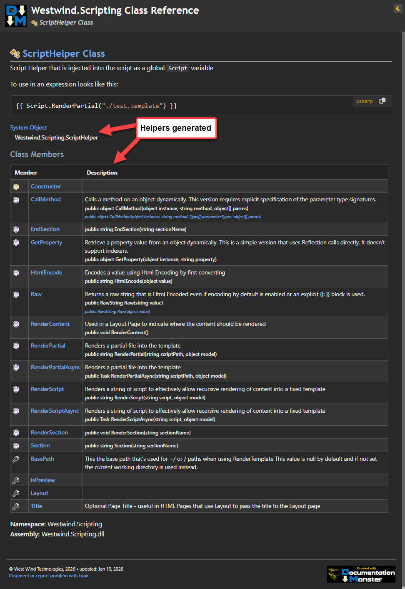
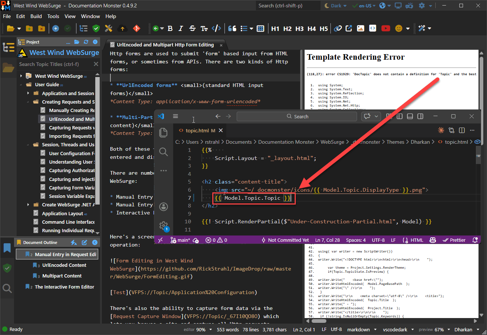

# Revisiting C# Scripting with the Westwind.Scripting Templating Library, Part 1


> This is a two part series that discusses the Westwind.Scripting Template library
> 
> * Part 1: An introduction to Template Scripting and how it works    <small>*(this post)*</small>
>   
> * [Part 2: Real world integration for Local Rendering and Web Site Generation](https://weblog.west-wind.com/posts/2026/Apr/23/Putting-the-WestwindScripting-Templating-Library-to-work-Part-2)


Recently I updated my [C# template scripting engine](https://github.com/RickStrahl/Westwind.Scripting/blob/master/ScriptAndTemplates.md) that uses a `ScriptParser` class in [Westwind.Scripting](https://github.com/RickStrahl/Westwind.Scripting) by adding support for **Layout Pages** and **Sections**. 

**ScriptParser** is a small, self-contained C# based template rendering engine that merges a text document with embedded expressions and code. It uses Handlebars-like syntax mixed with a simple mechanism for raw C# code expressions and code blocks. The scripting engine turns templates into executable .NET code that runs at native .NET speeds for fast template rendering. 

Similar in concept to Razor, which also compiles templates down to runnable code, **ScriptParser** lets you use raw C# code as the 'markup language' in your templates using familiar Handlebars syntax. Raw C# is used for all language and structure constructs, so unlike some other Handlebars scripting solutions, there are no weird 'scripting language constructs' involved; the scripting language is just raw C#.

##AD##

There are two main features to the `Westwind.Scripting` library:

* **C# Script Execution Engine**  
This is the core execution engine that allows you to compile and run C# code from source at runtime. You can execute code by providing a standalone snippet, a complete method, or an entire class definition to be loaded and accessed dynamically. The engine manages the full lifecycle of the script: generating the necessary wrapper code, compiling it via Roslyn, loading dependencies, caching the resulting assemblies for performance, and executing the compiled code. All of this including how it works is covered in [a previous article](https://weblog.west-wind.com/posts/2022/Jun/07/Runtime-C-Code-Compilation-Revisited-for-Roslyn).

* **Template Scripting Engine**  
The template scripting engine and the focus of this post series, leverages the execution engine by first parsing a Handlebars-style template into C# code, then compiling and executing the generated code. Templates use Handlebars-style syntax with `{{ expression }}` and `{{% codeBlock }}` tags to embed C# expressions and blocks within text using a model object passed in as the execution context. Expressions and code blocks can then access the model's data and methods to expand into the output. Templates can be executed from strings or files, with the model merged into the template as its data context. Because templates can contain code blocks, they can (but probably shouldn't) express complex logic.

In this post I'm only focusing on the latter Template Scripting Engine via **ScriptParser**, although that component uses the C# Script Execution after parsing.

**ScriptParser** isn't new and it has undergone a number of changes over its lifetime, but I realize now that I never mentioned it outside of the documentation. Since I spent a bit of time recently adding new features that add **Layout Pages** and **Sections**, this is as good a time as any to write about what it is and how it's been very useful to me.

Here's an overview of the template features:

* Handlebars-like syntax using raw C# code
* String based template execution
* File based script execution 
* Support for Partials loaded from disk <small>*(both string and file scripts)*</small>
* Support for Layout and Section directives <small>*(file scripts only)*</small>
* Expressions and code blocks use raw C# syntax
* Support for latest C# syntax
* Uses native C# language constructs - no pseudo scripting language
* Familiar Handlebars syntax with C# code:
    * `{{ C# expression }}`
    * `{{% C# code block }}`    
    * `{{: html encoded Expression }}`
    * `{{! raw expression }}`
    * `{{@ commented block @}}`
* Code blocks can be used for:
   * self contained code blocks
   * Any C# structured statements (for, while, if, using { } etc.)  
     can split across multiple code blocks
     with literal text, expressions and code blocks  
     in between.  **It's all raw C# code!**
* Script parses to plain C# code at runtime
* Compiled template generation code is very fast
	* Expressions and Codeblocks execute directly <small>*(no Reflection or Expressions)*</small>
	* Compiled code is very efficient
		* Code is compiled on first execution
		* First run is slightly slower
		* Subsequent invocation is faster
		* Code is cached to avoid re-compilation and startup cost 
		  on subsequent execution
* Error Handling Support
	* Captures Compilation and Runtime errors
	* Compilation errors capture line numbers and source reference
	* Runtime Errors can provide stack info
	* Compiled source can be captured


## Why Build?
So why not use Razor and build something completely from scratch? I built **ScriptParser** originally after I started several desktop and non-Web projects with Razor for templating using first an internal and then a third party Razor library, and eventually ran into walls with both of them. 

Razor is great in full ASP.NET Web applications when you use it with integrated tooling in Visual Studio or Rider. For pure Web applications Razor is awesome! But when used elsewhere, between the complexity of running it outside of ASP.NET, the differences in behavior, the Html based formatting oddities for plain text use cases, the required ASP.NET runtime requirements and potential for runtime compilation going away, the crappy Razor language and terrible 'syntax highlighting' support in non .NET editors, plus the constant churn of the engine internals made me eventually give up trying to run Razor outside of ASP.NET Web applications.

I went back and forth between continuing on with Razor (and several other libraries like DotLiquid and Fluid) and building a custom engine, resulting in long stretch of **analysis paralysis** which made me put off going forward with several projects for some time!

At some point I decided I had enough and just build exactly what I needed! Since I had built script engines before (as far back as FoxPro in the early 90's no less) and decided it would be more efficient and flexible to do something similar in .NET. Turns out that was the right call: Even the original very limited version of **ScriptParser** I built ended up being a very small easily re-usable scripting engine that uses raw C# code and runs very fast at compiled speeds. The syntax isn't as fancy as Razor's neat C# syntax integration in HTML, but it also doesn't require fancy tooling in editors to be still readable in any Html or plain text editor which is actually quite important for non-ASP.NET applications. And almost any Html editor does a decent job with Handlebars syntax these days. And as a bonus the Handlebars syntax is generally more familiar and easier to understand than Razor syntax outside of .NET circles.

I also like the idea of having a fully self-contained, .NET-based scripting solution that is easily embeddable, and not dependent on the whims of some big and constantly shifting scripting environment. The ScriptParser implementation is simple and unlikely to change, as it's merely a parser plus raw C# code that generates output. If C# changes, the existing parser can accommodate that simply by adding the latest Roslyn libraries. There's nothing magic there. And for me personally that's a huge bonus!

## Show me the Money!
If you want to jump to code and examples for the runtime compilation or C# Handlebars style scripting, head on over to the GitHub repo. The repo has all the info you need to get started quickly, and if you want you can look at the source code or check out the tests that demonstrate much of the functionality.

* [Westwind.Scripting on GitHub](https://github.com/RickStrahl/Westwind.Scripting)
* [Template Script Expansion in Westwind.Scripting specific topic](https://github.com/RickStrahl/Westwind.Scripting/blob/master/ScriptAndTemplates.md)

If you want to read more about the dynamic compilation features which are also used by this library to actually compile and run the templates, look at the previous blog post for the base `Westwind.Scripting` features:

* [Deep Dive on the Westwind.Scripting inner C# Compilation Workings](https://weblog.west-wind.com/posts/2022/Jun/07/Runtime-C-Code-Compilation-Revisited-for-Roslyn)  <small>*(original release blog post)*</small>

Keep reading if you want to learn more about the template scripting and the new Layout/Section features.

## A bit of Background on Westwind.Scripting and ScriptParser
The [Westwind.Scripting library](https://github.com/RickStrahl/Westwind.Scripting) was originally created as a C# runtime source-code based compilation library, but it also includes the [ScriptParser Template Engine](https://github.com/RickStrahl/Westwind.Scripting/blob/master/ScriptAndTemplates.md). The template engine provides **C# Handlebars-style templating** that uses embedded raw C# code expressions and code blocks to compile templates into executable .NET code. 

I originally created **Westwind.Scripting** almost 20 years ago, and it has gone through many behind the scenes iterations as compiler technology in .NET has changed. The latest incarnation a few years back [updated the library to support the latest Roslyn compilation APIs](https://weblog.west-wind.com/posts/2022/Jun/07/Runtime-C-Code-Compilation-Revisited-for-Roslyn) At that time I also added the `ScriptParser` class for Handlebars-like script template parsing and execution using .NET expressions and code snippets.

My primary use cases have been for template snippet expansions with embedded expressions and logic in Markdown Monster and Html generation templates in several text-based documentation generation tools. The templating has been a great addition for those scenarios.


### Installing the NuGet Package
To get started with the runtime compilation and/or the Template Scripting you can install a single NuGet package:

```ps
dotnet add package Westwind.Scripting 
```

This installs the actual `Westwind.Scripting` library and also the .NET Roslyn compiler libraries required to handle runtime code compilation.

> #### @icon-info-circle Rosyln Runtime Dependency
> Unfortunately the Roslyn runtime compilation library `Microsoft.CodeAnalysis.CSharp` is not part of the distributed .NET Runtime, so this library has to be added explicitly, and it adds several MBs of Roslyn dependency DLLs to your application's distribution. 
>
> It's a small price to pay for the ability to dynamically compile code at runtime, but something to keep in mind.

### Running Template Script Expansion
To give you a quick idea how [ScriptParser class](https://docs.west-wind.com/Westwind.Scripting/Westwind-Scripting-Class-Reference/Westwind-Scripting/ScriptParser-Class.html) works with Handlebars `{{ expression }}` and `{{% code block }}` syntax and uses raw C# code here are is a short overview.

#### Expanding Expressions and Code Blocks
There are really just two constructs that make up template logic:

**Expressions** <small>*`{{ expr }}`*</small>

```html
<i>{{ DateTime.Now.ToString("d") }}</i>
```

**Code Blocks** <small>*`{{% C# code }}`*</small>

```html
{{% for(int x; x<10; x++  { }}     
    <div>{{ x }}. Hello World</div>
{{% } }}

{{%
     // declare variables
     var album = new Album() {
       Title = "Album Title",
       Band = "Rocka Rolla"
     }
     
     var message = "Rock on Garth.";
}}

<!--  use declared variables -->
<div>
{{ album.title }} by {{ album.band }}
</div>
<div>
	{{ message }}
</div>
```

You can also pass in a `model` parameter to the various script execution methods, which then become available as `Model.` in the script code.

> ##### @icon-lightbulb Scripts compile to Class Methods
> You can think of a template script as **a method in a class** where the majority of the template's text is treated as **literal text** that's written out with `.Write()` method, with the **embedded expressions and codeblocks** directly injected as raw C# method body code as is. This means variables declared are visible to expressions and code blocks below, along with the `Model.` property if a model was passed. The whole thing is combined into a C# class wrapper, that is then compiled on the fly, and optionally cached and executed.

One way to execute script templates in C# code with a passed in model looks like this:

```cs
var model = new TestModel {Name = "rick", DateTime = DateTime.Now.AddDays(-10)};

string script = @"
Hello World. Date is: {{ Model.DateTime.ToString(""d"") }}!
{{% for(int x=1; x<3; x++) 
{ }}
    {{ x }}. Hello World {{Model.Name}}
{{% } }}

And we're done with this!
";

var scriptParser = new ScriptParser();

// add dependencies - sets on .ScriptEngine instance
scriptParser.AddAssembly(typeof(ScriptParserTests));
scriptParser.AddNamespace("Westwind.Scripting.Test");

// Execute the script
string result = scriptParser.ExecuteScript(script, model);

Console.WriteLine(result);

Console.WriteLine(scriptParser.ScriptEngine.GeneratedClassCodeWithLineNumbers);
Console.WriteLine(scriptParser.ErrorType);  // if there's an error
```

As you can see in the script template string, the C# code expressions are just **raw C# code wrapped into  Handlebars blocks**. Scripts are parsed into C# code, compiled at runtime into executable IL code, and then executed using standard .NET runtime execution. Output can be saved to assembly or executed immediately. Compiled code is automatically cached by default, so execution is very fast after the initial, one-time compilation step. If you re-run the same script or file template on the same script parser instance the cached assembly code is used.

All of the latest C# features are automatically supported in **embedded expressions** and **code blocks** matching the latest version support of the dependent Roslyn compiler assembly.

### Adding Layout Pages and Sections
Basic script operation is useful, but often you need to componentize templates into re-usable sub-pages or master pages that simplify more complex site based setups like a documentation project. 

To that effect, the initial implementation of `ScriptParser` until recently only supported `{{ Script.RenderPartial("./partial.html") }}` to pull in external templates. This allows pulling in of external code or files and executing them separately. While that works, use of `Script.RenderPartial()` can get very repetitive in larger projects if you need to simulate many pages that have similar high level layout and common document sections.

To that effect, the latest release of `ScriptParser` adds support for Layout Pages and Sections. Layout pages allow you to create a 'Master' page that is referenced from a 'Content' page. You can then have many Content pages that reference the same Master page to provide common UI Chrome that is common to all of those pages. The most common use case when creating a Web site/project, the common UI Chrome holds the main site layout (main panels, headers, footers, sidebars, logins etc.), but it could also be document headers for text generation for reports for example, or class wrappers for method code generations for example. Layouts can be super useful for a variety of use cases.


<small>**Figure 1** - Many Content pages request a shared Layout page into which content is loaded</small>

Layout pages work only with files on disk so you point at a base `basePath` location for the template files. Based on that related files like Layout files and partials can be located based on relative or site root paths.

The process works like this.

Start by setting up and calling the script parser and calling `ExecuteScriptFile()` (or `ExecuteScriptFileAsync()`):

```csharp
[TestMethod]
public void LayoutFileScriptTest()
{
    var scriptParser = new ScriptParser();
    
    // auto-encode {{ expr }}
    scriptParser.ScriptingDelimiters.HtmlEncodeExpressionsByDefault = true; 

    var result = scriptParser.ExecuteScriptFile("website/Views/Detail.html",
                        new TestModel { Name = "Rick" },
                        basePath: "website/Views/");

    Console.WriteLine(result);
    Console.WriteLine(scriptParser.ScriptEngine.GeneratedClassCodeWithLineNumbers);

    Assert.IsNotNull(result, scriptParser.ErrorMessage);
}
```

Next you specify:

* The Template Script file to 'execute'
* Provide a model to pass in (exposed a `Model` in the script)
* Provide a root path for the templates    
  <small>This allows paths that start with `/` or `~/` to find related scripts. Defaults the template's path so if everything is in the same path you don't need to pass this.</small>

> It's important that `basePath` resolves only for `Layout` and `RenderPartial()`. It doesn't automagically resolve other document Urls. We'll discuss how that can be handled towards the end of this post.

Next you'll have the `Detail.html` content page that is loaded from `ExecuteScriptFile()` call:

```html
{{ Script.Section("StartDocument") }}
{{%
    // Script.Layout page is PARSED out of the document not executed
    // it supports  bracketed expressions from the script Model optionally.
    // Paths resolve as: Absolute, Relative to Script, ~ Base Path Relative or Base Path Relative without ~
    Script.Layout = "Layout.html";

    // this is explicitly projected into the Layout page
    // A better approach is to make anything you need in the Layout page 
    // part of the model, but for hard overrides this works.
    string title = "My Great Detail with Layout Page";
    Script.Title = title;
}}
{{ Script.EndSection("StartDocument") }}
<div>
    <!-- dynamic type cast from an Anonymous type: THIS FAILS! -->
    <h1>Welcome back, {{ Model.Name }}</h1>

    {{ Script.RenderPartial("Partial.html", Model) }}

    <p>This is the detail page content {{ DateTime.Now.ToString("t") }}</p>

    {{% 
        for(var i = 1; i <= 5; i++) {  
        // any C# code
        Model.Name = "Name " + i;
    }}       
    {{% } }}

    <h3>Inline Methods</h3>
    {{ Add(8,10)}}        
    {{%
        // Example of an inline function
        int Add(int a, int b)
        {
           return a + b;
        }
        writer.WriteLine(Add(5, 10));        
    }} 
  
    {{%
        var text = "This is & text requires \"escaping\".";
    }}

    Encoded:  
    {{: text }}

    Unencoded: 
    {{! text }}

    default (depends on ScriptDelimiters.HtmlEncodeExpressionsByDefault):
    {{ text }}

    {{%
        // write from within code blocks
        writer.WriteLine("Hello world, " + Model.Name);  // unencoded
        
        // write with HtmlEncoding
        writer.WriteHtmlEncoded( $"this text is basic {Model.Name}, but \"encoded\".\n" );
    }}
</div>

{{ Script.Section("Headers") }}
<style>
    body {
        background-color: lightblue;
    }
    <script> 
        var viewMode = { Name:"{{ Model.Name }}" };
    </script>
</style>
{{ Script.EndSection("Headers") }}

{{ Script.Section("Scripts") }}
<script src="https://code.jquery.com/jquery-3.5.1.min.js"></script>
{{ Script.EndSection("Scripts") }}
```

This Html page is the entry point, but it's not what starts rendering the document since it references a `Script.Layout = "Layout.html";`  I could also have used `"/Laytout.html"`  since we declared a base path in the C# code which points back to current folder.

The rest of the page then uses the passed in `Model` and shows a few examples of using expressions and script blocks.
  
Also notice that there are several Sections like this one:

```html
{{ Script.Section("Headers") }}
<style>
    body {
        background-color: lightblue;
    }
    <script> 
        var viewMode = { Name:"{{ Model.Name }}" };
    </script>
</style>
{{ Script.EndSection("Headers") }}
```

This syntax refers to a Section defined in the Layout page into which the section's content is embedded.

To keep things simple, the Layout Page in this test scenario here is not very practical and simply shows a header, but it shows the different areas that are being filled in. In real application, this page likely would contain a top level Html layout with headers and footers, sidebars etc.

The key item below is the `{{ Script.RenderContent() }}` block that pulls in the content page:

```html
{{ Script.RenderSection("StartDocument") }}
<!DOCTYPE html>

<html lang="en" xmlns="http://www.w3.org/1999/xhtml">
    <head>
        <title>{{ Model.Name }}</title>
   
        {{ Script.RenderSection("Headers") }}
    </head>
    <body>
        <header>This is a Site header</header>
        
        <!-- Merges in the Content Page's script before parsing and compiling -->
        {{ Script.RenderContent() }}

        <footer>
            <hr/>
            Site Footer here &copy; {{ DateTime.Now.Year}}
        </footer>


        {{ Script.RenderSection("Scripts") }}
    </body>
</html>
```

> ##### @icon-lightbulb Content and Layout Merge into a Single Class Method
> Layout and Content page using `ScriptParser` are combined into a single block of generated code at parse time. The Layout page renders first and merges the content from the Content page at the  `{{ Script RenderContent() }}` block. The combined content is then parsed compiled and executed.
>
> This means that any change to the Layout page requires rebuilding all the content pages that use that Layout page.

Notice also the sections that are **declared in the Layout page** and **implemented in the Content page**. Sections are pulled from the Content page and injected into the generated code at the defined section boundaries so they execute in order based on the location of the section definition in the layout page.

Here's another look at Content, Layout and Partials in single view in relation to each other.

  
<small>**Figure 2** - A test example that demonstrates Content, Partials, Layout and Sections in templates using Handlebars syntax. All files are .html files to facilitate editor syntax support.</small>

I've needed this functionality for some time on several projects and finally after building it had the chance to put it into a production system that replaced the previous incomplete Razor engine that was holding up the project. The results in this documentation solution worked out great with fast performance and lots of flexibility for custom rendering and providing for customized rendering by combining both the Template Scripting and the underlying C# code generation to customize the exposed script API surface in scripts. 

More on this later in part 2.

### Eating my own Dogfood 
So let me give a few examples how I've been using the Template Scripting features in various ways both with and without the new Layout Page features. Templating is not a common application scenario, but when you need it, you really need it and there are not a ton of options.

Here are a few scenarios where I'm using this templating engine now in production:

#### Markdown Monster Snippet Engine
Markdown Monster has a dynamic execution feature in the [Markdown Monster for the Snippet Template Expansions](https://markdownmonster.west-wind.com/docs/Embedding-Links-Images-Tables-and-More/Embedding-Code-Snippets.html) and [Commander Scripting Addin](https://github.com/RickStrahl/Commander-MarkdownMonster-Addin/blob/master/readme.md) both of which allow Markdown Monster's functionality with dynamic code. **Snippets** uses dynamic text expansions in the markdown text editor, and **Commander** allows for application automation. The Snippets expansion uses the `ScriptParser` template expansion to mix text with C# expressions and code to produce embeddable text. The latter use pure code execution to perform automation tasks and has built-in support for text generation through the scripting engine.

Here's an example of the Snippets Addin in Markdown Monster, running user provided snippets:

  
<small>**Figure 3** - Snippet Expansion in Markdown Monster uses template expansions with C# code</small>

There's some more information in the [Markdown Monster Docs](https://markdownmonster.west-wind.com/docs/Addins/Snippets-Addin-Snippet-Template-Expansion.html).

#### Documentation Monster Topic Generation
I also use the ScriptParser to generate output for my documentation solution [Documentation Monster](https://documentationmonster.com) which creates a self-contained Web site for documentation (Examples: [here (product)](https://markdownmonster.west-wind.com/docs) and [here (product)](https://websurge.west-wind.com/docs/) and [here (generated class reference)](https://docs.west-wind.com/westwind.utilities/)). Html is generated from Templates for live previews in real time as you type and for final bulk output generation of the entire Documentation project. The process is blazing fast:  2.5k+ Html topics generated in ~10 seconds in one project.


<small>**Figure 4** - Documentation Monster renders topics in the previewer and eventually in a fully generated Web site of Html pages using various topic templates merged with topic content</small>

#### Bulk E-Mail Generation for Notifications
I also use the script engine for creating a simple mail merge engine that runs against my customer and order database. I create mailing documents with embedded data that comes from various internal databases driven through a set of business objects. Code snippets at the top of templates drive the controller code, and the template expressions do the view rendering. In this case it's a background service console app that gets called every few days to check for renewals and sends out various generated and mail merged notifications on a regular schedule.

#### Code Generation
Recently I also upgraded an ancient legacy application that uses a SQL to entity generator tool for creating custom entities based on various structure code templates, that merge together multiple templates into code files. The old T3 templating was getting to be a pain in the ass to use and maintain so I switched out to a small console app using ScriptParser with mostly string based processing. The end result was much cleaner code that was more flexible as we could mix application logic with the template generation bits.

In short, this templating engine has proven very useful to me for a whole host of uses cases.

##AD##

## A look under the Hood of Westwind.Scripting and ScriptParser
We already looked at template rendering but let's look a little deeper at what gets generated and run, and at configuration and things you have to provide in order for code to compile.

So again, the simplest Script Rendering you can do is the following:

```csharp
string script = @"
Hello World. Date is: {{ DateTime.Now.ToString(""d"") }}!

{{% for(int x=1; x<3; x++) { }}
{{ x }}. Hello World
{{% } }}

DONE!
";
var scriptParser = new ScriptParser();
var result = scriptParser.ExecuteScript(script, null);

// merged content as a string
Console.WriteLine(result);  

// Generated Class Code with Line Numbers
Console.WriteLine(scriptParser.ScriptEngine.GeneratedClassCodeWithLineNumbers);

// Error Information is available on the .ScriptEngine property
// which captures compilation and runtime errors
// ErrorType, ErrorMessage, ErrorException are available
Assert.IsNotNull(result, scriptParser.ScriptEngine.ErrorMessage);
```

The output from this is:

```text
Hello World. Date is: 3/31/2025!

1. Hello World
2. Hello World

DONE!
```

Pretty straight forward and simple. In this case I'm not passing in a model, so the code just uses base C# and library code -  it's using core .NET runtime features so there are no extra assemblies that need to be loaded. 

By default the compiler and parser load a good chunk of common runtime libraries which works for core language features, but if you need additional types - like a model or runtime features not included - **you have to explicitly reference them**.

Here I **have to** add the model's type because the compiler doesn't know about it as it's contained in an external library (`Westwind.Utilities`):

```csharp
var model = new TestModel { Name = "Rick", Date = DateTime.Now.AddDays(-10) };

string script = """
{{%
using Westwind.Utilities;
}}
Hello {{ Model.Name }}.
Date is: {{ Model.Date.ToString("d") }}!

{{% for(int x=1; x<4; x++) { }}
{{ x }}. {{ StringUtils.Replicate("Hello World ",x) }}
{{% } }}

And we're done with this!
""";

var scriptParser = new ScriptParser();

// Referenced types and required assemblies
scriptParser.AddAssembly(typeof(Westwind.Utilities.StringUtils));  // include a library
scriptParser.AddAssembly(typeof(TestModel));                       // include model/executing assembly

// Execute and pass the model
string result = scriptParser.ExecuteScript(script, model);

Console.WriteLine(result);

Console.WriteLine(scriptParser.ScriptEngine.GeneratedClassCodeWithLineNumbers);
Assert.IsNotNull(result, scriptParser.ScriptEngine.ErrorMessage);
```

Notice the `.AddAssembly()` calls. The relevant assemblies have to be present in the current execution path of the current (host) environment.

This template produces the following text:

```text
Hello Rick.
Date: 2/5/2026!

1. Hello World 
2. Hello World Hello World 
3. Hello World Hello World Hello World 

And we're done with this!
```

> There is also `ExecuteScriptAsync()` which allows for executing `async` code to execute in the script. Both `ExecuteScript()` and `ExecuteScriptAsync()` have several overloads that deal with how the model or parameters are handled.

In this example the model is passed in generically and parsed as a `dynamic` value that is passed to the template code. If you'd rather pass the model using a fixed type you can use the `ExecuteScript<TModelType>()` overload. If you know the type at execution time, the generic version is preferred as it gets around weird edge cases where dynamic might misinterpret types or null values, plus it's slightly faster.

If you look at the template code you see the `{{ expression }}` and `{{% codeBlock }}` tags. 

To make it a little clearer what happens here's the for loop with some indentation and comments:

```html
{{% 
	for(int x=1; x<3; x++) 
	{
	    var output = x + ". Hello World";
}}  
	<!-- End of top code block -->
	
	<!-- literal text with expression expansions -->
	<div>{{ output }}</div>
	
{{% 
    // You can add additional code here before closing tag
    Console.WriteLine(output);  
} }}
<!-- End of for loop -->
```

Expressions expand inline and simply replace the expression value for the tag. They are expanded as string values - by default rendering using `ToString()`. 

Code blocks are **raw snippets C# code** and they expand **as-is** into the generated code. They also strip off the linefeed at the end of the code block so generated text doesn't end up with extra line breaks. 

Code Blocks can be single line blocks as shown in the first example, or multi-line code blocks that combine multiple operations as shown in the second example. When creating structured blocks (ie. `if` or `for` statements) with markup text between the start and end statements you need two code blocks for each part separated by additional markup in between. The markup in between can contain additional literal text, or nested expressions and code blocks.

> Bottom line: Expressions and Code blocks are simply embedded as-is into the generated code with any text between embedded the markup writing out string literals and generate into raw C# code.

To give you an idea of a more real world example of a template here's one of my Documentation Monster topic templates in VS Code:

  
<small>**Figure 5** - A real world example of a template that renders a documentation topic for a Class Header. </small>

You can see there's a mixture of expressions and code blocks and nested code blocks. Generally the template inline code is kept very simple. While it's possible to write complex C# logic in the template, personally I prefer code helpers for complex operations. For example, generating a Child Topics List as a list, or creating a list of members for a Class Header is much better done in code than an enormouse code block inline of the template. You can do that if you want to, but it's preferred to externalize complex logic to helpers on the model. The advantage is that you get to write your code in your development IDE with all the editor tooling and completions, and you can independently test the logic. Just as importantly: You can re-use the functionality in multiple templates.

Here's what this rendered template **ClassHeader** looks like:

  
<small>**Figure 6** - The rendered template has complex page elements that are rendered in external library code rather than embedding complex code into the template</small>

### References and Namespaces
In the first examples,  I have to explicitly add references to the model type and utility library.

Because code gets compiled, the compiler needs to know **all**  references that are used in the code you are executing. The current application's environment and loaded assemblies are not used by the compiler so **everything** has to be explicitly declared.

The script engine by default adds commonly used .NET Core base assemblies so it works with common base .NET base libraries. But if you use less common libraries or reference your own support assemblies and types including model types, you'll have to explicitly add those assemblies and also the namespaces - either in code or via the template. Regardless of whether they might already be loaded in your application as the compiler doesn't know about any of that.

.NET Core made this more complex due to its highly granular assembly usage. To help make it easier to add references there are a few high level helpers methods in the C# Execution engine and Script Parser:

* Common .NET Runtime base libraries (default)   
`AddCommonDefaultReferences()`

* Common plus forward all loaded assemblies from the host application  
`AddLoadedReferences()`.  
<small>*Note that assemblies have to be actually loaded at the time of compilation to be picked up, not just referenced by the application!*</small>

* Explicitly add assemblies from types or from disk  
`AddAssembly()` `AddAssemblies()`  
	<small>*Explicitly adding assemblies is usually easiest with typeof() unless the type is not used by the host:*
	```cs
	scriptParser.AddAssembly(typeof(ScriptParserTests));  // from type
	```
	</small>
     

* Add all assemblies from a **.NET Runtime Meta Reference Library**   
`AddAssemblies()`  
<small>*This guarantees that all runtime libraries are loaded, but these meta libraries are large and add several megabytes of disk footprint to your application.*</small>

Here's how you add references and namespaces so the compiler can resolve your script code:

```csharp
var scriptParser = new ScriptParser();

// Explicit references
scriptParser.AddAssembly(typeof(ScriptParserTests));  // from type
scriptParser.AddAssembly("./Westwind.Utilities.dll"); // from file

// Loaded References from Host (current assembly context)  
// be careful here: Not all referenced assemblies may be loaded when you call this
script.ScriptEngine.AddLoadedReferences();               

// If you add a Meta Data Reference Assembly to your project
scriptParser.AddAssemblies(metaAssemblies: Basic.Reference.Assemblies.Net100.References.All.ToArray());

// Add namespaces your code needs explicitly            
scriptParser.AddNamespace("Westwind.Scripting.Test");
```

Namespaces can also be added in code:

```csharp
string script = """
{{%
using Westwind.Utilities;
}}
Hello {{ Model.Name }}.
Date: {{ Model.Date.ToString("d") }}!

{{% for(int x=1; x<4; x++) { }}
{{ x }}. {{ StringUtils.Replicate("Hello World ",x) }}
{{% } }}

And we're done with this!
""";
```

> Assembly loading and explicit namespace requirements can be one of the more tricky things to get right when using the compilation and templating tools especially if you are integrating with a complex application and are exposing a broad application model to templates.

### Take a look at Generated Code - no really!
The easiest way to understand how Literals, Expressions and Code Blocks work in templates is to look at the generated code from the script template above. The generated class source code can be captured via `script.ScriptEngine.GeneratedClassCode` or `.GeneratedClassCodeWithLineNumbers` which shows the entire generated class:

```cs
 1. using System;
 2. using System.Text;
 3. using System.Reflection;
 4. using System.IO;
 5. using System.Net;
 6. using System.Net.Http;
 7. using System.Collections;
 8. using System.Collections.Generic;
 9. using System.Collections.Concurrent;
1. using System.Text.RegularExpressions;
2. using System.Threading.Tasks;
3. using System.Linq;
4. using Westwind.Scripting;
5. using Westwind.Utilities;
6. 
7. namespace __ScriptExecution {
8. 
9. public class _yzf2irai
10. { 
11. 
12. 
13. public System.String ExecuteCode(Westwind.Scripting.Test.TestModel Model)
14. {
15. ScriptHelper Script = new ScriptHelper() { BasePath = null };
16. 
17. 
18. using( var writer = new ScriptWriter())
19. {
20. 
21. // using Westwind.Utilities;
22. 
23. writer.Write("Hello ");
24. writer.Write(  Model.Name  );
25. writer.Write(".\r\nDate: ");
26. writer.Write(  Model.Date.ToString("d")  );
27. writer.Write("!\r\n\r\n");
28. for(int x=1; x<4; x++) { 
29. writer.Write(  x  );
30. writer.Write(". ");
31. writer.Write(  StringUtils.Replicate("Hello World ",x)  );
32. writer.Write("\r\n");
33. } 
34. writer.Write("\r\nAnd we're done with this!");
35. return writer.ToString();
36. 
37. } // using ScriptWriter
38. 
39. }
40. 
41. 
42. } 
43. }
```

You can see that actual template script, is broken down into:

* **Class Header**  
This is basically a shell that wraps the code and includes all the added namespaces and class wrapper. This code is static and entirely generated by the `CSharpScriptExecution` class. The only thing that changes there is typically the class name and namespace.

* **Literal text**  
All non code text outside of the `{{ }}` tags is treated as a literal. In the generated code literals are parsed and formatted and then written out as properly encoded C# string literals which is why you see line breaks and other encoded text. 

* **Expressions**  
Expressions are parsed and embedded - as-is - and written straight out as string values into `writer.Write()`. Non-string values are auto-converted using `.ToString()` on any non string value.

* **Code Blocks**   
Similar to expressions any code block code is written out as is but does not generate a `writer.Write()` since it's literally raw code. There's some additional logic that cleans up line breaks after code blocks to avoid extra line breaks introduced by the code tags (as Razor maddeningly does).

From a coding perspective the hardest part about all of this is the literal text parsing - finding all the places and special cases where literals get too long and have to be broken up and require special encoding or formatting.

There are also different tag prefixes that need to be parsed:

* **{{: expression }}** - Explicitly Html Encoded 
* **{{! expression }}** - Always parsed as Raw Text - no encoding

Note that there's an option to automatically Html Encode all expression tags:

```csharp
scriptParser.ScriptingDelimiters.HtmlEncodeExpressionsByDefault = true;
```

which makes the `{{: expr }}` syntax redundant but you may be required to use `{{! expr }}` occasionally to get raw Html or text rendered. If you're generating Html you'll want this set to `true`, but if you're generating text for code, scripts or other plain text output, you'll want to leave it at its `false` default.

### Caching
Each template 'executed' compiled into an assembly that is eventually executed. Many templates means also many assemblies loaded into the current process.

The script engine by default caches generated template assemblies based on the generated code used as input. If you execute the same template multiple times, the previously cached assembly will be used instead, for much faster execution.

This means the **very first** time you run your template it might take a second or two as the Roslyn compiler is loaded for the first time. If you re-run the same template again it will be much, much faster. Compiling another template after the initial cold start will be significantly faster than the very first compile, but still slower than cached operation. Compilation even of moderately sized templates tends to be very quick, but ideally you'll want to compile once, and run many times to achieve best performance.

In most application situations templates get reused frequently. For example, in Documentation Monster I have 15 different topic templates of which 8 are actively used. Some of my help files contain a couple of thousand topics. So essentially I compile 8 templates once as they are first accessed, but I may generate two thousand topics from these 8 cached assemblies. When a script or layout page changes, the cache busts and the templates that require it automatically recompile - once - and then are reused many times more to render the other topics that use the same template. Using cached compilation I can compile my nearly 3500 topic documentation site to disk in less than 15 seconds.

Assembly caching uses a `static` object collection. Assemblies are loaded into the host process and by default can't be unloaded, hence the static collection. However, if you're adventurous you can create and provide your own `AassemblyLoadContext` to implement unload behavior on your own.

### Error Handling
Error handling for templates is critical as you may run into compilation errors as you're creating your templates:

  
<small>**Figure 7** - A template compilation error shows code, so that you can cross reference back into your original template</small>

Errors are captured on the ScriptEngine's `ErrorMessage` property. There are two `scriptParser.ScriptEngine.ErrorType` values:

* Compilation
* Runtime 

If **compilation errors** occur in the generated code the `scriptParser.ScriptEngine.ErrorMessage` has error information pointing at specific line numbers into the generated code as shown in **Figure 99** above. This can be super useful for scripting solutions: In Markdown Monster's Command Scripting Addin the errors and generated code are displayed so you can glance at the generated code and glean where the error occurred - in there I adjust the line numbers so they match up with the user provided code. It ain't exactly Visual Studios Error Pane but it's pretty good for a generic template solution to pinpoint the line of **generated** code where the error occurred that you can translate into whatever line that matches in your script.

Runtime errors provide less specific error information - you generally just get the exception and message returned. For runtime errors you likely want to catch the exception around the template execution block and either display the error message or handle it in some generic way via a custom method that generates formatted error output. The exception is preserved and passed forward so you can decide what to do with it - it's essentially up to your application how to display the error. More on that in part 2.

## File Template Rendering and Layout and Sections
String rendering works for simple things, but if you're building more complex projects that involve multiple pages you're likely to use files to hold your templates. Unlike string based templates, file templates support Layout Pages and Sections.

If you want to render templates from disk, the base features work the same as with templates except you use `ExecuteScriptFile()`.

If you're calling a single self contained template it works exactly the same as `ExecuteScript()`


```csharp
var scriptParser = new ScriptParser();
var result = scriptParser.ExecuteScriptFile("website/Views/SelfContained.html", 
             new TestModel { Name = "Rick" });

Console.WriteLine(result);
Console.WriteLine(scriptParser.ScriptEngine.GeneratedClassCodeWithLineNumbers);
Assert.IsNotNull(result, scriptParser.ErrorMessage);
```

The template in this case is a self-contained Html page:

```html
{{%
  Script.Title = "Self Contained Page";
}}
<!DOCTYPE html>
<html lang="en">
<head>
    <meta charset="utf-8" />
    <title>{{ Script.Title }}</title>
</head>
<body>
  <h1>This is a self contained page!</h1>

  <p>Hello, {{ Model.Name }}</p>

  <p>This page is self contained and doesn't require any external resources to render.</p>

  {{ DateTime.Now.ToString("d") }}
</body>
</html>
```

If you have a folder hierarchy for your templates you might need to explicitly specify a base path that acts as a root folder for the project. This is so that files can resolve the root folder as in `/path/subpath/file` in code for things like a referenced Layout or Partial pages.	

### Layout and Content Page in MultiPage Layouts
But it gets more interesting if you are working with multi-page layouts where you have multiple pages that use a common theme layout. You can separate out Content pages and Layout pages the latter of which provide the site chrome that can potentially be customized through the model that is passed to it.

In this scenario you have:

* A Content Page that holds the current Page Content
* A Layout Page that is referenced from the Content Page
* Partial Pages loaded from either Content or Layout Pages

Let's start with the Content page. This page contains the relevant content that holds the current information to display. So in my documentation example, each topic renders as a Content page. The content page is the top level page that is referenced by the code that invokes the Template. The template then can optionally link a Layout page that provides the base layout which is then merged into the Content template as it's rendered and compiled. 

```csharp
var scriptParser = new ScriptParser();
scriptParser.ScriptingDelimiters.HtmlEncodeExpressionsByDefault = true;

var result = scriptParser.ExecuteScriptFile("website/Views/Detail.html",
                    new TestModel { Name = "Rick" },
                    basePath: "website/Views/");

Console.WriteLine(result);
Console.WriteLine(scriptParser.ScriptEngine.GeneratedClassCodeWithLineNumbers);

Assert.IsNotNull(result, scriptParser.ErrorMessage);
```

Here's the `Detail.html` content page - notice the `Script.Layout  = "detail.html"` at the top that links in the Layout page. The page demonstrates a lot of the different features of the templates all of which should look familiar if you've used Razor/Blazor or ASP.NET Pages.

```html
{{%
    // This code will execute at the top of the Layout page
    Script.Layout = "Layout.html";
}}
<div>
    <h1>Welcome back, {{ Model.Name }}</h1>

    
    {{ Script.RenderPartial("Partial.html", Model) }}

    <p>This is the detail page content {{ DateTime.Now.ToString("t") }}</p>

    {{% 
        string display = string.Empty;
        for(var i = 1; i <= 5; i++) {  
            // any C# code
            display = "Name " + i;
    }}
    {{ i }}. {{ display }}
    {{% } }}

    <h3>Inline Methods</h3>
    {{ Add(8,10)}}        
    {{%
        // Example of an inline function
        int Add(int a, int b)
        {
           return a + b;
        }
        writer.WriteLine(Add(5, 10));        
    }} 
  
    {{%
        var text = "This is & text requires \"escaping\".";
    }}

    Encoded: {{: text }}
    Unencoded: {{! text }}
    Default: {{ text }}

    {{%
        // write from within code blocks
        writer.WriteLine("Hello world, " + Model.Name);  // unencoded
        
        // write with HtmlEncoding
        writer.WriteHtmlEncoded( $"this text is basic {Model.Name}, but \"encoded\".\n" );
    }}
</div>

{{ Script.Section("Headers") }}
<style>
    body {
        background-color: lightblue;
    }
    <script> 
        var viewMode = { Name:"{{ Model.Name }}" };
    </script>
</style>
{{ Script.EndSection("Headers") }}

{{ Script.Section("Scripts") }}
<script src="https://code.jquery.com/jquery-3.5.1.min.js"></script>
{{ Script.EndSection("Scripts") }} 
```

### Layout Page
The Layout page is loaded via a code reference to `Script.Layout = "Layout.html";`. This code can appear **anywhere** in code in the template. The page is referenced relative to the page it's called from - in this case in the same folder. 

The Layout Page and the Content page are merged into a single text document before the code is parsed into code. This means the Layout page is passed the same model that the main content page has access to. This usually means that content pages need to use a common base model that has the data for the Content page and the Layout page. That means things like Title, Project Name etc. company info for the footer etc. Essentially the model contains both data for the content page **and** the layout page.

The content page is the entry point that references the layout page, but the layout page renders first and the `{{ Script.RenderContent() }}` section **pulls the Content Page into the layout**. Both are combined into a single C# program that is then compiled and executed.

> Keep in mind that any code that runs in the Content Page **runs after the top of the Layout page code has run**. 

IOW, by the time the first code inside of the Content page is executed, the Html header has already been rendered and any code blocks and expressions in the top of the Layout page have already run. This means for example that you can't set the title after the fact from the content page. You can use the model to hold the values you want to set, or you can use Sections to force content from the Content Page into the layout page at designated Section locations.

In the layout page you declare sections using `{{ Script.RenderSection("StartDocument") }}`  which 'pulls' the content from the content page:

```html
<!-- inject code here so it's available/set above Script.RenderContent() -->
{{ Script.RenderSection("StartDocument") }}
<!DOCTYPE html>

<html lang="en" xmlns="http://www.w3.org/1999/xhtml">
    <head>
        <title>{{ Model.Name }}</title>
   
        {{ Script.RenderSection("Headers") }}
    </head>
    <body>
        <header>This is a Site header</header>
        
        <!-- main content goes here -->
        {{ Script.RenderContent() }}

        <footer>
            <hr/>
            Site Footer here &copy; {{ DateTime.Now.Year}}
        </footer>

        {{ Script.RenderSection("Scripts") }}
    </body>
</html>
```

### Sections
You've seen sections referenced in the previous snippet in the Layout page.

Sections are defined in a Layout page as a placeholder via `{{ Script.RenderSection("SectionName") }}` and implemented in Content pages via `{{ Script.Section("SectionName") }}` and `{{ Script.EndSection("SectionName") }}`. Any content between the two - literal text, expressions and code blocks are then embedded in the Layout page at the section placeholder location.

**Layout Page**

```html
<head>
    <title>{{ Script.Title }}</title>
    {{ Script.RenderSection("Headers") }}
</head>
```


**Content Page**

```html
{{ Script.Section("Headers") }}
<style>
    body {
        background-color: lightblue;
    }
    <script> 
        var viewMode = { Name:"{{ Model.Name }}" };
    </script>
</style>
{{ Script.EndSection("Headers") }}
```

The Layout page's `RenderSection()` pulls the markup from between the Content Page's section and embeds it into the template during the parsing phase as part of the process of creating a single executable file from the content and layout page.

### Partials
Unlike Layout and Content pages (and Sections) which merge into a single template before parsing, partials are rendered like a standalone page based on a file on disk. For Html rendering Partials are typically Html fragments for a page sub-component.

```html
<h3>
    This is some Partial Content, {{ Model.Name }} 
    at {{ DateTime.Now.ToString("HH:mm:ss") }}
</h3>
```

Partials can be called from Content Pages, Layout Pages and other Partial pages using the following syntax:

```html
<hr />
    {{ Script.RenderPartial("Partial.html", Model) }}
<hr />
```

Note that you pass a model to the partial explicitly - typically you'll just pass forward the existing content page model but you can also pass something completely different here if it makes sense.

Using Layout pages and Sections is a key feature and I'm glad that functionality finally part of the **ScriptParser** class. It's made a big difference for several projects that previously suffered with lots of `.RenderPartial()` embeddings.

## Summary
This brings us to the end of part 1 of this series. 

In this post I've reviewed the core features of the Westwind.Scripting templating features and how you can use both string based and file template based scripting to quickly merge text with data using its simple Handlebars C# syntax and provided some insight how the template engine works behind the scenes.

In Part 2, I'll expand on usage in a real-world scenario for Html output generation from a desktop application, which involves a few extra steps to ensure that content generated locally works in Web environments. It'll demonstrate how to pass in application level data, format paths, handle site base paths in Web scenarios and a few other issues like dealing with dependency references.

Until then  give this library a try and see where it might fit for your use cases.

## Resources
* [Part 2: Putting the Westwind.Scripting Templating Library to work](https://weblog.west-wind.com/posts/2026/Apr/23/Putting-the-WestwindScripting-Templating-Library-to-work-Part-2)
* [Westwind.Scripting Library on GitHub](https://github.com/RickStrahl/Westwind.Scripting)
* [Westwind.Scripting Templating Features](https://github.com/RickStrahl/Westwind.Scripting/blob/master/ScriptAndTemplates.md)
* [Previous Post: Runtime Compilation with Roslyn and Building Westwind.Scripting](https://weblog.west-wind.com/posts/2022/Jun/07/Runtime-C-Code-Compilation-Revisited-for-Roslyn)
* [Documentation Monster](https://documentationmonster.com)
* [Markdown Monster](https://markdownmonster.west-wind.com)
* [Markdown Monster Snippets Expansions](https://markdownmonster.west-wind.com/docs/Addins/Snippets-Addin-Snippet-Template-Expansion.html)