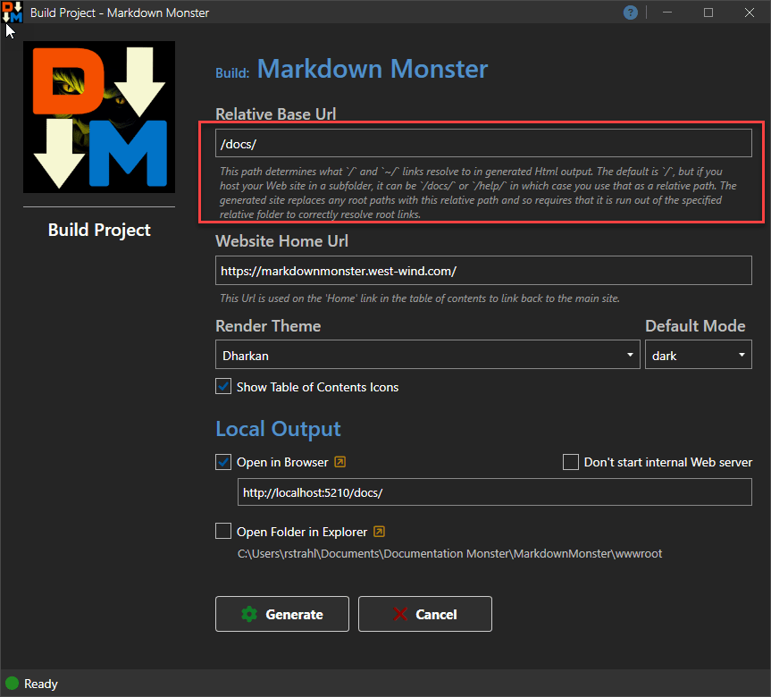

# Putting the Westwind.Scripting C# Templating Library to work, Part 2


> This is a two part series that discusses the Westwind.Scripting Template library
> 
> * [Part 1: Revisiting C# Scripting with the Westwind.Scripting Templating Library](https://weblog.west-wind.com/posts/2026/Apr/20/Revisiting-C-Scripting-with-the-WestwindScripting-Templating-Library-Part-1)
>   
> * **Part 2**: Real world integration for a Local Rendering and Web Site Generation
>   <small> *(this post)*</small>

In part 1 of this series I introduced the `Westwind.Scripting` library, how it works and how you can use it and integrate it into your applications. In part 2, I'm going over implementation details of hosting a scripting engine for a specific scenario that generates local static Html output for a for a project based solution that requires both local preview and local Web site generation. As part of that process I'll point out a number of issues that you likely have to consider in this somewhat common scenario.

If you haven't already, I'd recommend you [read Part 1](https://weblog.west-wind.com/posts/2026/Apr/20/Revisiting-C-Scripting-with-the-WestwindScripting-Templating-Library-Part-1) so you have a good idea what the library provides and how it works. While not required, this post will make a lot more sense with that context in place.

* [Revisiting Westwind.Script Template Scripting Library, Part 1](https://weblog.west-wind.com/posts/2026/Apr/20/Revisiting-C-Scripting-with-the-WestwindScripting-Templating-Library-Part-1)

##AD##

## Putting Templating to use in a Real World Scenario
The `ScriptParser` class in the `Westwind.Scripting` library allows you to execute C# based, Handlebars-like templates that merge template text with model data that can be embedded into the template with Handlebars style `{{ expression }}` and `{{% code block }}` directives. You can use both string based templates and templates from files that can also include references to partials and layout pages. All of that was covered in Part 1.

While using the `ScriptParser` for demos and single template output is easy enough, using it to integrate into a larger application, interacting with host application features and content, and especially generating many document Web site output with related dependencies, requires a bit more work. 

I'm using my [Documentation Monster](https://documentationmonster.com) application as an example here as it's been my dog-fooding project to put the `ScriptParser` to real world use. It's a project based documentation solution that statically produces Web Site Html output. It generates Html output in two ways in an offline desktop application:

* Renders a single topic for Live Preview as you type topic content
* Renders many topics in a documentation project into a full self-contained Web site

DM uses script templates to render each topic with a specific topic type - Topic, Header, ClassHeader, ClassMethod, ClassProperty, WhatsNew, ExternalLink etc. -  each representing a separate Html template in an Html file (ie. `Topic.html`) on disk which are the templates I'm passing into the `ScriptParser` class for execution. The model then feeds specific a specific model that contains the topic, project and other support data and some application logic.

These topic templates templates are similar but all have overlapping content: All of them have a header and topic body, but they also have customized areas to them: For example, *ClassHeader* has a class member table, inheritance list, lists assembly and namespace, **ClassProperty**/**ClassMethod**/**ClassField** member templates have syntax and exception settings, **ExternalLink** displays an Html page during development but redirects to a Url in a published output file etc. In other words, each topic type has some unique things going on with it that the template script reflects. If a topic has a type that can't map to a template, the default template which in this case is the **Topic** template is used via fallback.

Templates are user customizable, so they are sensitive to changes and are recompiled whenever changes are **detected** in the generated code.

The raw Html rendering of topics is simple enough - the template is executed as is and produces Html output. But once you introduce document dependencies  like images, scripts, css etc. and you create output that may end up in nested folders, **pathing becomes a concern** in statically generated content. The reason is, the 'hosting' environment can't be determined at render time and the content may be hosted locally via file system (for individual preview in this case), a root Web site, or in a sub-folder of a Web site. 

So then the question is what's a relative path based on? What's a root path (`/`) based on? The rendered output has to be self-contained, and templates are responsible for properly making paths natural to use for a specific output environment.

This means some or all Urls may have to be fixed up and in some cases a `<base>` has to be provided in the Html content for each page. None of that can happen automatically so this is a manual post-processing step that is application specific. 

In addition, when rendering topics a few things that need to be considered:

* When and how to render using the ScriptParser
* Where to store the Templates consistently
* Ensure that rendered output can be referenced relatively
* Ensure there's consistent BasePath to reference 
  root and project wide Urls (ie. `/` or `~/`)

Let's walk through what template rendering looks like inside of an application.

##AD##

### Create a TemplateHost
In projects that use template rendering I like to create a **TemplateHost** class that encapsulates all tasks related to executing the scripting engine. This simplifies configuration of the template engine in one place and provides a few easily accessible methods for rendering templates - in the case of DM rendering topics to string and to file.

#### ScriptParser Configuration - References and Namespaces
Adding of dependent references and namespaces is one of the most frustrating things of doing runtime compilation of code and so that step needs to be consolidated into a single place.

Here's the base implementation of the TemplateHost with the `CreateScriptParser()` method implementation from DM:


```csharp
public class TemplateHost
{
    public ScriptParser Script
    {
        get
        {
            if (field == null)
                field = CreateScriptParser();
            return field;
        }
        set;
    }

    public static ScriptParser CreateScriptParser()
    {
        var script = new ScriptParser();            
        
        // Good chunk of .NET Default libs
        script.ScriptEngine.AddDefaultReferencesAndNamespaces();
        
        // Any library in Host app that's been loaded up to this point
        // In DM everything required actually is loaded through this
        script.ScriptEngine.AddLoadedReferences();
        
        // explicit assemblies not or not yet used by host
        //script.ScriptEngine.AddAssembly("privatebin/Westwind.Ai.dll");
        //script.ScriptEngine.AddAssembly(typeof(Westwind.Utilities.StringUtils));

        script.ScriptEngine.AddNamespace("Westwind.Utilities");
        script.ScriptEngine.AddNamespace("DocMonster");
        script.ScriptEngine.AddNamespace("DocMonster.Model");            
        script.ScriptEngine.AddNamespace("DocMonster.Templates");
        script.ScriptEngine.AddNamespace("MarkdownMonster");
        script.ScriptEngine.AddNamespace("MarkdownMonster.Utilities");

        script.ScriptEngine.SaveGeneratedCode = true;
        script.ScriptEngine.CompileWithDebug = true;            

        // {{ expr }} is Html encoded - {{! expr }} required for raw Html output
        script.ScriptingDelimiters.HtmlEncodeExpressionsByDefault = true;            

		// custom props that expose in the template without Model. prefix
        script.AdditionalMethodHeaderCode =
            """
            DocTopic Topic = Model.Topic;
            var Project = Model.Project;
            var Configuration = Model.Configuration;
            var Helpers = Model.Helpers;                
            var DocMonsterModel = Model.DocMonsterModel;
            var AppModel = MarkdownMonster.mmApp.Model;
            
            var BasePath = new Uri(FileUtils.NormalizePath( Project.ProjectDirectory + "\\") );

            """;            
        return script;
    }
    
    // render methods below
}
```

In DM the TemplateHost is created on first access of a `Project.TemplateHost` property and then persists for the lifetime of the project, unless explicitly recreated. There is some overhead in creating the script parser environment and we might be generating **a lot** of documents very quickly when generating Web site output so a cached instance is preferred.

```csharp
get
{
    if (field == null)
        field = CreateScriptParser();
    return field;
}
```

Notice that the parser is set up with common default and all loaded assembly references from the host. I then add all the specific libraries that may not have been loaded yet, and any custom namespaces that are used by the various application specific components that are used in the templates. This is perhaps the main reason to use a `TemplateHost` like wrapper: To hide away all this application specific configuration for a one time config and then can be forgotten about - you don't want to be doing this sort of thing in your application or business logic code.

In DM I'm lucky enough that all application dependencies live in a couple of assemblies that are already loaded by the time the parser is activated so I can rely on `script.ScriptEngine.AddLoadedReferences()` to bring in all of my dependencies. If your application is broken out into many small dependencies that may not work as some assemblies may not have loaded yet in which case you have to ensure you manually use `script.AddAssemblyReference()` to pull in explicit assemblies preferrably using the `Type` overload.

Another thing of note in this particual usage scenario: The `AdditionalMethodHeaderCode` property is used to expose various objects as top level objects to the template script. So rather than having to specify `{{ Model.Topic.Title }}` we can just use `{{ Topic.Title }}` and `{{ Helpers.ChildTopicsList() }}` for example. Shortcuts are useful, and you can stuff anything you want to expose in the script beyond the model here.


> Since the templates in DM are accessible to end-users for editing, making the template expressions simpler makes for a more user friendly experience. Highly recommended.

#### Rendering
The actual render code is pretty straight forward by calling `RenderTemplateFile()` which renders a template from file:

```cs
public string RenderTemplateFile(string templateFile, RenderTemplateModel model)
{
    ErrorMessage = null;

    Script.ScriptEngine.ObjectInstance = null; // make sure we don't cache
    
    // explicitly turn these off for live output
	Script.ScriptEngine.SaveGeneratedCode = false;
	Script.ScriptEngine.CompileWithDebug = false;
	Script.ScriptEngine.DisableAssemblyCaching = false;
    
    string basePath = model.Project.ProjectDirectory;
    model.PageBasePath = System.IO.Path.GetDirectoryName(model.Topic.RenderTopicFilename);

    string result = Script.ExecuteScriptFile(templateFile, model, basePath: basePath);

    if (Script.Error)
	{
	    // run again this time with debugging options on
	    Script.ScriptEngine.SaveGeneratedCode = true;
	    Script.ScriptEngine.CompileWithDebug = true;
	    Script.ScriptEngine.DisableAssemblyCaching = true;  // force a recompile
	
	    Script.ExecuteScriptFile(templateFile, model, basePath: basePath);
	
	    Script.ScriptEngine.SaveGeneratedCode = false;
	    Script.ScriptEngine.CompileWithDebug = false;
	    Script.ScriptEngine.DisableAssemblyCaching = false;
	
	    // render the error page
	    result = ErrorHtml(model);
	    ErrorMessage = Script.ErrorMessage + "\n\n" + Script.GeneratedClassCodeWithLineNumbers;
	}

    return result;
}
```

This is the basic raw template execution logic that produces direct generated output - in this case Html.

Note that the processing checks for template errors which captures either compilation or runtime errors. If an error occurs, the current render process is re-run with all the debug options turned on so I can get additional error information to display on the error page. 

I'll talk more about the error display in a minute.

#### Template Layout
I haven't talked about what the templates look like: DM uses relatively small topic templates, with a more complex Layout page that provides for the Web site's page chrome. The actual project output renders both the content the headers and footers and there's a bunch of logic to pull in the table of contents and handle navigation to new topics efficiently. The preview renders the same content but some of the aspects like the table of content are visually hidden in that mode.

All of that logic is encapsulated in the layout page and the supporting JavaScript scripts.

At the core re the Html/Handlebars topic templates. As mentioned, each topic type is a template that is rendered. Topic, Header, ExternalLink, WhatsNew, ClassHeader, ClassProperty, ClassMethod etc. each with their own custom formats. Each of the templates then references the same layout page (you could have several different one however if you chose)

Here's an example **Content Page**:

**topic.html Template**

```html
{{%
    Script.Layout = "_layout.html";
}}

<h2 class="content-title">
    
    {{ Model.Topic.Title }}
</h2>

<div class="content-body" id="body">
    {{% if (Topic.IsLink && Topic.Body.Trim().StartsWith("http")) { }}
        <ul>
        <li>
            <a href="{{! Model.Topic.Body }}" target="_blank">{{ Model.Topic.Title }}</a>
            <a href="{{! Model.Topic.Body }}" target="_blank"><i class="fa-solid fa-up-right-from-square" style="font-size: 0.7em; vertical-align: super;"></i></a>
        </li>
        </ul>

        <blockquote style="font-size: 0.8em;"><i>In rendered output this link opens in a new browser window.
            For preview purposes, the link is displayed in this generic page.
            You can click the link to open the browser with the link which is the behavior you see when rendered.</i>
        </blockquote>
    {{% } else { }}
        {{ Model.Helpers.Markdown(Model.Topic.Body) }}
    {{% } }}
    
</div>

{{% if (!string.IsNullOrEmpty(Model.Topic.Remarks)) {  }}
    <h3 class="outdent" id="remarks">Remarks</h3>
    {{ Helpers.Markdown(ModelTopic.Remarks) }}
{{% } }}


{{% if (!string.IsNullOrEmpty(Topic.Example))  {  }}
    <h3 class="outdent" id="example">Example</h3>
    {{ Helpers.Markdown(Topic.Example) }}
{{% } }}

{{% if (!string.IsNullOrEmpty(Topic.SeeAlso)) { }}
    <h4 class="outdent" id="seealso">See also</h4>
    <div class="see-also-container">
        {{ Helpers.FixupSeeAlsoLinks(Topic.SeeAlso) }}
    </div>
{{% } }}
```

For demonstration purposes I'm showing both the `Model.Topic` and the custom header based direct binding to `Topic` via `script.AdditionalMethodHeaderCode` I showed earlier. Both point at the same value.

Note also the code block at the top that pulls in the Layout page:

```html
{{%
    Script.Layout = "_layout.html";
}}
```

The layout page then looks like this:

**_Layout.html**

```html
<!DOCTYPE html>
<html>
<head>
    {{%
     var theme = Project.Settings.RenderTheme;
     if(Topic.TopicState.IsPreview) { }}
    <base href="{{ Model.PageBasePath }}" />
    {{% } }}

    <meta charset="utf-8" />
    <title>{{ Topic.Title }} - {{ Project.Title }}</title>

    {{% if (!string.IsNullOrEmpty(Topic.Keywords)) { }}
    <meta name="keywords" content="{{ Topic.Keywords.Replace(" \n",", ") }}" />
    {{% } }}
    {{% if(!string.IsNullOrEmpty(Topic.Abstract)) { }}
    <meta name="description" content="{{! Topic.Abstract }}" />
    {{% } }}
    <meta name="viewport" content="width=device-width, initial-scale=1,maximum-scale=1" />
    <link rel="stylesheet" type="text/css" href="~/_docmonster/themes/scripts/bootstrap/bootstrap.min.css" />
    <link rel="stylesheet" type="text/css" href="~/_docmonster/themes/scripts/fontawesome/css/font-awesome.min.css" />
    <link id="AppCss" rel="stylesheet" type="text/css" href="~/_docmonster/themes/{{ theme }}/docmonster.css" />

    <script src="~/_docmonster/themes/scripts/highlightjs/highlight.pack.js"></script>
    <script src="~/_docmonster/themes/scripts/highlightjs-badge.min.js"></script>
    <link href="~/_docmonster/themes/scripts/highlightjs/styles/vs2015.css" rel="stylesheet" />
    <script src="~/_docmonster/themes/scripts/bootstrap/bootstrap.bundle.min.js" async></script>
    <script src="~/_docmonster/themes/scripts/lunr/lunr.min.js"></script>
    <script>
        window.page = {};
        window.page.basePath = "{{ Project.Settings.RelativeBaseUrl }}";
        window.renderTheme="{{ Project.Settings.RenderThemeMode }}";
    </script>
    <script src="~/_docmonster/themes/scripts/docmonster.js"></script>

    {{% if(Topic.TopicState.IsPreview) { }}
    <!-- Preview Navigation and Syncing -->
    <script src="~/_docmonster/themes/scripts/preview.js"></script>
    {{% } }}

</head>
<body>
    <!-- Markdown Monster Content -->
    <div class="flex-master">
        <div class="banner">
            <div class="float-end">
                <button id="themeToggleBtn" type="button" onclick="toggleTheme()"
                        class="btn btn-sm btn-secondary theme-toggle"
                        title="Toggle Light/Dark Theme">
                    <i id="themeToggleIcon"
                       class="fa fa-moon text-warning">
                    </i>
                </button>
            </div>

            <div class="float-start sidebar-toggle">
                <i class="fa fa-bars"
                   title="Show or hide the topics list"></i>
            </div>

			{{% if (Topic.Incomplete) { }}
               <div class="float-end mt-2 " title="This topic is under construction.">
                   <i class="fa-duotone fa-triangle-person-digging fa-lg fa-beat"
                   style="--fa-primary-color: #333; --fa-secondary-color: goldenrod; --fa-secondary-opacity: 1; --fa-animation-duration: 3s;"></i>
	           </div>
		    {{% } }}

            
            <div class="projectname"> {{ Project.Title }}</div>

            <div class="byline">
                
                {{ Topic.Title }}
            </div>
        </div>
        <div class="page-content">
            <div id="toc-container" class="sidebar-left toc-content">
                <nav class="visually-hidden">
                    <a href="~/tableofcontents.html">Table of Contents</a>
                </nav>
            </div>

            <div class="splitter">
            </div>

            <nav class="topic-outline">
                <div class="topic-outline-header">On this page:</div>
                <div class="topic-outline-content"></div>
            </nav>

            <div id="MainContent" class="main-content">
                <!-- Rendered Content -->

                <article class="content-pane">
                    {{ Script.RenderContent() }}
                </article>

                <div class="footer">

                    <div class="float-start">
                        &copy; {{ Project.Owner }}, {{ DateTime.Now.Year }} &bull;
                        updated: {{ Topic.Updated.ToString("MMM dd, yyyy") }}
                        <br />
                        {{%
                            string mailBody = $"Project: {Project.Title}\nTopic: {Topic.Title}\n\nUrl:\n{ Project.Settings.WebSiteBaseUrl?.TrimEnd('/') + Project.Settings.RelativeBaseUrl }{ Topic.Id }.html";
                            mailBody = WebUtility.UrlEncode(mailBody).Replace("+", "%20");
                        }}
                        <a href="mailto:{{ Project.Settings.SupportEmail }}?subject=Support: {{ Project.Title }} - {{ Topic.Title }}&body={{ mailBody }}">Comment or report problem with topic</a>
                    </div>

                    <div class="float-end">
                        <a href="https://documentationmonster.com" target="_blank"></a>
                    </div>
                </div>
                <!-- End Rendered Content -->
            </div> <!-- End MainContent -->
        </div> <!-- End page-content -->
    </div>   <!-- End flex-master -->
    
    <!-- End Markdown Monster Content -->
</body>
</html>
```


The full rendered site output looks something like this for a topic:

  
<small>**Figure 1** - Documentation Monster Rendered site output</small>

The rendered topic content is in the middle panel of the display - all the rest is both static and dynamically rendered Html that is controlled through the Layout page. Both the table of contents and the document outline on the right are rendered using dynamic loading via JavaScript, while the header and footer are static with some minor embedded expressions.

With a Layout page this is easy to set up and maintain as there's a single page that handles that logic and it's easily referenced from each of the topic templates with a single layout page reference.

Behind the scenes, the parser looks for a Layout page directive in the content page requested by the `ScriptParser`, and if it finds one combines the layout page and content page into a single page that is executed. Essentially the `Script.Layout` command in the content page causes the referenced Layout page to be loaded, and the `{{ Script.RenderContent() }}` tag then is replaced with the content page content resulting in a single Html/Handlebars template. This combined content is then compiled and executed to produce the final merged output.

##AD## 

So far things are pretty straight forward relying on the core features of the scripting engine: We're pointing at template and a layout page and it produces Html in various forms depending on the type of template that we are dealing with.

That still leaves the task fixing up paths to make sure they work in the final 'hosting' environment.

### Base Path Handling - PageBaseFolder and BaseFolder
When rendering Html output that depends on other resources like images CSS and scripts that referenced either as relative or site rooted paths, it's important that the page context can find these resources based on natural relative and absolute page path resolution.

There are two concerns:

* Page Base Path for page relative links 
* Project Base Path for site root paths

#### Page Base Path for Relative Linking
Page base path refers to resolving relative paths in the document. For example from the current page referencing an image as `SomeImage.png` (same folder) or `../images/SomeFolder` (relative path). In order for these relative paths to work the page has to be either running directly from the folder or the page has to be mapped into that page context.

In the context of a Web site that's simple as you have a natural page path that always applies. However, for previewing pages that are often rendered to a temporary file in an external location, which is then displayed in a WebView for preview. In that scenario relative path needs to be fixed up so it can find resolve links.

This scenario can be handled by explicitly forcing the page's `<base>` path to reflect the current page's path:

```html
{{%
    if(Topic.TopicState.IsPreview)  { }}
       <base href="{{ Model.PageBasePath }}" />
{{%  }  }}
```

Note that I'm only applying the `<base>` tag in Preview mode. In Preview the Html is rendered into a temp location, so I map back to the actual location where relative content is expected and that makes relative links work.

Here's what that looks like:

  
<small>**Figure 2** - Providing a Page Base path when rendering to a temp location is crucial to ensure relative resources like images can be found!</small>

Without the `<base>` path in the document, the page would look for the image in the rendered output location - in the `TMP` folder - and of course would not find the image there.

For final rendered output running in a Web Browser, this is not necessary as the page naturally runs out of the appropriate folder and no `<base>` path is applied.

> *Why not just render local output into the 'correct relative location' where relative content can be found?*  
> For local preview that's often impractical due to permissions or simply for cluttering up folders with temporary render files. Generated files can wreak havoc with source control or Dropbox and permissions unless explicit exceptions are set up. I recommend that local WebView content that has dependencies should always be rendered to a temporary location and then be back-linked via `<base>` paths to ensure that relative paths can resolve.

#### Root Paths In Temporary Location
The other more important issue has to do with resolving the root path. This is especially important when rendering to a temporary file, but it can even be an issue if you create a 'site' that sits off a Web root. 

For example, most of my documentation 'sites' live in a `/docs` folder off the main Web site rather than at the `/` root.

For example:

* [Markdown Monster Documentation](https://markdownmonster.west-wind.com/docs/)

In this site, any links that reference `/` and intend to go back to the documentation root, are going to jump back to the main Web site root instead. From a project perspective I want `/` to mean the project root, but I don't want to have to figure out while I'm working on the content whether I have to use `/docs/` or `/`. In fact, I never want to hard code a reference to `/docs/` in my templates or in user content, but expect to reference the project root as `/`.

In DM this is very relevant when the site is generated. We can then specify a root folder `/` by default or `/docs/` explicitly as shown here entered for my specific site:


  
<small>**Figure 3** - When rendering to a non-root location it has to be generated at Html generation time.</small>

Here's what this looks like in the template *(you can use either `~/` or `/`)*:

```html
<link id="AppCss" rel="stylesheet" type="text/css" 
      href="~/_docmonster/themes/{{ theme }}/docmonster.css" />
```

and here is the rendered output with the `/docs/` path for any `/` or `~/` starting Urls:

```html
<link id="AppCss" rel="stylesheet" type="text/css" 
      href="/docs/_docmonster/themes/Dharkan/docmonster.css" />
```

This fixup applies to any Url generated both from the templates and from user generated topic content so the fixup has to occur post rendering - it's not something that can be fixed via the template.

This fixup also happens in Preview mode where the full path is prefixed which produces these nasty looking paths:

```html
<link id="AppCss" rel="stylesheet" type="text/css" 
      href="C:/Users/rstrahl/Documents/Documentation Monster/MarkdownMonster/_docmonster/themes/Dharkan/docmonster.css" />
```


This means that the root path need to be fixed up depending on the root path environment. There are several scenarios:

* Root is root `/` rendered into root of site for final Html Site output - no replacements required.
* Root is a subfolder (ie. `/docs/`) - `/` is replaced with `/docs/` in all paths
* Root is the project folder from Temp location - `/` is replaced with a folder file location or WebView virtual host name root

This is something that is not part of the `ScriptParser` class, but rather has to be handled at the application layer post fix up, and it's fairly specific to the Html based generation that takes place. In my template based applications I **always** have do one form or another of this sort of fix up.

Here's what this looks like in DM:

```csharp
string html = Project.TemplateHost.RenderTemplateFile(templateFile, model);

...

// Fix up any locally linked .md extensions to .html
string basePath = null;
if (renderMode == TopicRenderModes.Html)
{
 	 // fix up DM specific `dm-XXX` links like topic refs, .md file links etc.
     html = FixupHtmlLinks(html, renderMode);  

     // Specified value in dialog ('/docs/` or `/`)
     basePath = Project.Settings.RelativeBaseUrl;  // 
}            
else if (renderMode == TopicRenderModes.Preview || renderMode == TopicRenderModes.Chm)
{
	// special `dm-XXX` links are handled via click handlers
	
	// Project directory is our base folder
    basePath = Path.TrimEndingDirectorySeparator(Project.ProjectDirectory).Replace("\\", "/") + "/";
}

html = html
           .Replace("=\"/", "=\"" + basePath)
           .Replace("=\"~/", "=\"" + basePath)
           // UrlEncoded
           .Replace("=\"%7E/", "=\"" + basePath)
           // Escaped
          .Replace("=\"\\/", "=\"/")
          .Replace("=\"~\\/", "=\"/");
          
if(renderMode == TopicRenderModes.Preview ||
   renderMode == TopicRenderModes.Print || 
   renderMode == TopicRenderModes.Chm)
{
   // explicitly specify local page path
   var path = Path.GetDirectoryName(topic.GetExternalFilename()).Replace("\\","/") + "/";
   html = html.Replace("=\"./", "=\"" + path)
              .Replace("=\"../", "=\"" + path + "../");
}

OnAfterRender(html, renderMode);

return html;          
```

The key piece is the Html fix up block that takes any `/` or `~/` links - including some variations - and explicitly replaces the actual base path that's specified.

Another issue is addressed in the following block that deals with print and local pages: Relative links don't resolve in print and PDF output, so they have to be explicitly specfied as part of the link. Apparently the WebView print engine ignores `<basePath>` for many things and so even relative links have to be fixed up with an explicit prefix even if the page is in the correct location.

So yeah - path handling is a pain in the ass! 🤣 But hopefully this section gives you the information you need to fix up your paths as needed.

##AD## 

### Error Handling
When a template is run there is a possibility that it can fail. Typically it fails because there's an error in the template itself, which tends to generate compilation errors, or you can also run into runtime errors when code execution fails.

The `ScriptParser` automatically captures error information for both compilation and runtime errors are provides convenient members to access them. There's `ErrorMessage` and ``
If an error occurs, DM checks for it and then generates an error page:

```
if (Script.Error)
{
    result = ErrorHtml();
    ErrorMessage = Script.ErrorMessage + "\n\n" + Script.GeneratedClassCodeWithLineNumbers;
}
```    

where `ErrorHtml()` is the method that creates the error.

You can keep this real simple and just render the error message and optionally the code:

```cs
public string ErrorHtml(string errorMessage = null, string code = null)
{            
    if (string.IsNullOrEmpty(errorMessage))
        errorMessage = Script.ErrorMessage;
    if (string.IsNullOrEmpty(code))
        code = Script.GeneratedClassCodeWithLineNumbers;

    string result =
            "<style>" +
            "body { background: white; color; black; font-family: sans;}" +
            "</style>" +
            "<h1>Template Rendering Error</h3>\r\n<hr/>\r\n" +
            "<pre style='font-weight: 600;margin-bottom: 2em;'>" + WebUtility.HtmlEncode(errorMessage) + "</pre>\n\n" +
            "<pre>" + WebUtility.HtmlEncode(code) + "</pre>";                   

    return result;
}
```

Or you can present a nicer error page that itself is rendered through a template. This is the error page that is used in DM.

  
<small>**Figure 4** - Displaying render error information for debugging purposes</small>

The code for this implementation is more complex.

```csharp
public string ErrorHtml(RenderTemplateModel model, string errorMessage = null, string code = null)
  {
      if (string.IsNullOrEmpty(errorMessage))
          errorMessage = Script.ErrorMessage;
      if (string.IsNullOrEmpty(code))
          code = Script.GeneratedClassCodeWithLineNumbers;

      var origTemplateFile = model.Topic.GetRenderTemplatePath(model.Project.Settings.RenderTheme);            
      var templateFile = Path.Combine(Path.GetDirectoryName(origTemplateFile), "ErrorPage.html");
      string errorOutput = null;

      if (File.Exists(templateFile))
      {
      	  // render the error template
          var lastException = Script.ScriptEngine.LastException;
          model?.TemplateError = new TemplateError
          {
              Message = errorMessage,
              GeneratedCode = code,
              TemplateFile = origTemplateFile,
              CodeErrorMessage = errorMessage,
              CodeLineError = string.Empty,
              Exception = lastException
          };
          model.TemplateError.Message = model.TemplateError.WrapCompilerErrors(model.TemplateError.Message);
          model.TemplateError.ParseCompilerError();

          // Try to execute ErrorPage.html template

          bool generateScript = Script.SaveGeneratedClassCode;
          Script.SaveGeneratedClassCode = false;

          errorOutput = Script.ExecuteScriptFile(templateFile, model, basePath: model.Project.ProjectDirectory);

          Script.SaveGeneratedClassCode = generateScript;
      }

	  // if template doesn't exist or FAILs render a basic error page
      if (string.IsNullOrEmpty(errorOutput))
      {
          if (Script.ErrorMessage.Contains(" CS") && Script.ErrorMessage.Contains("):"))
          {
              errorOutput =
                      "<style>" +
                      "body { background: white; color: black; font-family: sans-serif; }" +
                      "</style>" +
                      "<h1>Template Compilation Error</h3>\r\n<hr/>\r\n" +
                      "<p style='margin-bottom: 2em; '>" + HtmlUtils.DisplayMemo(model.TemplateError.WrapCompilerErrors(errorMessage)) + "</pre>\n\n" +
                      (model.Topic.TopicState.TopicRenderMode == TopicRenderModes.Preview
                          ? "<pre>" + WebUtility.HtmlEncode(code) + "</pre>"
                          : "");
          }
          else
          {
              errorOutput =
                  "<style>" +
                  "body { background: white; color: black; font-family: sans-serif;}" +
                  "</style>" +
                  "<h1>Template Rendering Error</h3>\r\n<hr/>\r\n" +
                   "<p style='font-weight: 600;margin-bottom: 2em; '>" + WebUtility.HtmlEncode(errorMessage) + "</p>\n\n" +
                   (model.Topic.TopicState.TopicRenderMode == TopicRenderModes.Preview
                       ? "<hr/><pre>" + WebUtility.HtmlEncode(code) + "</pre>"
                       : "");
          }
      }

      return errorOutput;
  }
```


## Summary
And that brings us to the end of this two-part post series. In this second part I've given a look behind the scenes of what's involved in running a scripting engine for site generation and local preview. As you can tell this is a little more involved than the basics of running a script template using the `ScriptParser` class as described in part one of this series.

Pathing is the main thing that can give you headaches - especially if there are multi-use cases of where your output is rendered. In the case of Documentation Monster, output can both be rendered into a final output Web site, or be used locally for previewing content from the file system and also be used for generating PDF and Print output which have additional specific requirements for pathing. The issues involved depend to some degrees on how you set up your application, but for me at least, I spent a lot of time getting the pathing to work correctly across all the output avenues. I hope that what I covered here will be of help in figuring out what needs to be considered, if not solving the issues directly.

I've been very happy with how using ScriptParser with its new features of Layout/Sections support works for this project. Given that I've been sitting in analysis paralysis for so long prior fighting with Razor, the results I've gotten are a huge relief, both in terms of features and functionality and performance. Hopefully the Westwind.Scripting library and the Script Templating will be useful to some of you as well.


## Resources
* [Part 1: Revisiting C# Scripting with the Westwind.Scripting Templating Library](https://weblog.west-wind.com/posts/2026/Apr/20/Revisiting-C-Scripting-with-the-WestwindScripting-Templating-Library-Part-1)
* [Westwind.Scripting Library on GitHub](https://github.com/RickStrahl/Westwind.Scripting)
* [Westwind.Scripting Templating Features](https://github.com/RickStrahl/Westwind.Scripting/blob/master/ScriptAndTemplates.md)
* [Previous Post: Runtime Compilation with Roslyn and Building Westwind.Scripting](https://weblog.west-wind.com/posts/2022/Jun/07/Runtime-C-Code-Compilation-Revisited-for-Roslyn)
* [Documentation Monster](https://documentationmonster.com)
* [Markdown Monster](https://markdownmonster.west-wind.com)