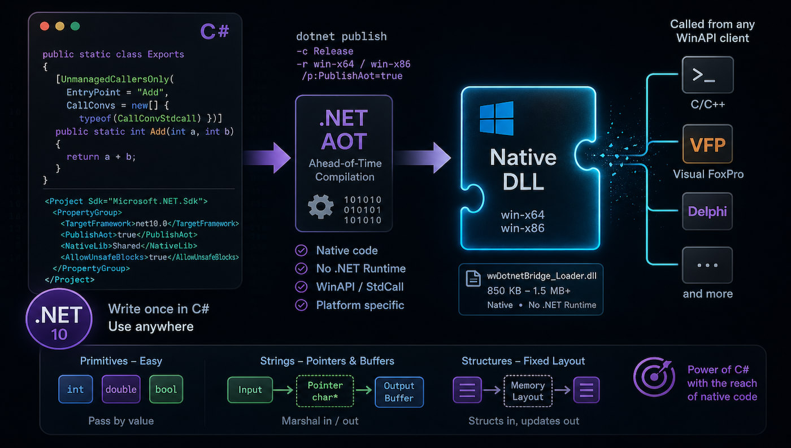
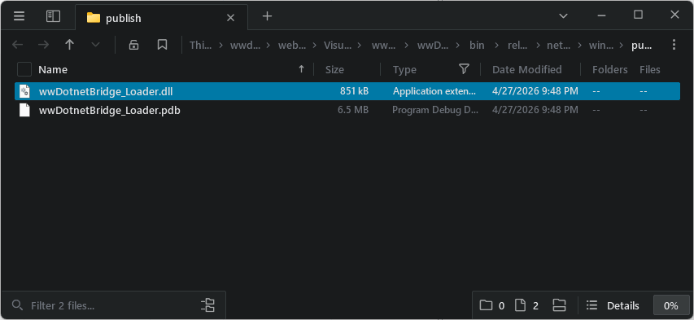

# Using .NET Native AOT to build Windows WinAPI Dlls



Here's something that I didn't know you could do: You can create AOT compiled DLLs that compile down to platform specific native DLLs. For example, on Windows you can compile an AOT library to a Standard Calling Convention type DLL that you can be called from any tool that can access WinApi-style dlls. C-Style DLLs are also supported but in this post I look at StandardCall (WinAPI style) DLLs for Windows.

I'm specifically looking at this for some Windows DLLs that I created eons ago using the Visual Studio C++ compiler to build the DLLs. Moving those into .NET and C# certainly would make a number of things easier including not having to install the Visual Studio C++ compiler and all its crazy Windows dependencies (C++ SDK, ATL etc.) and dealing with the constant version update hassles in Visual Studio when the compiler version revs and screws up dependencies.

My specific use case involves some very old FoxPro x86 code on the calling end, so I'll use FoxPro for my calling examples here. But the same applies for any application that can call into DLLs using either WinAPI standard call or optionally standard C calling syntax.

##AD##

## Setting up an AOT Project for native Windows DLL Compilation
So here's what you need to create an .NET AOT DLL for use as a Windows API (Standard Call) style DLL:

* Create a new **Class Library** .NET 10+ project
* Set it up for AOT compilation
* Create a class with static methods with specific attributes to specify native Exports
* Use `dotnet publish` to build the native DLL for each target platform

Let's start with the project file. To build a DLL you'll use a standard Class Library project and then add a couple of explicit tags:

```xml
<Project Sdk="Microsoft.NET.Sdk">
	<PropertyGroup>
		<TargetFramework>net10.0</TargetFramework>
		<ImplicitUsings>enable</ImplicitUsings>
		
		<!-- These are the critical settings -->
		<PublishAot>true</PublishAot>
		<NativeLib>Shared</NativeLib>
		<AllowUnsafeBlocks>true</AllowUnsafeBlocks>
	</PropertyGroup>
</Project>
```

`PublishAot` and `NativeLib` are the keys for creating a DLL library. `AllowUnsafeBlocks` is optional but likely needed if you do any sort of P/Invoke code which is likely if you end up pushing reference values in and out of the DLL.

Next create a class and add the appropriate attributes to `static` methods that make up the exports:

```csharp
public static class Exports
{    
    [UnmanagedCallersOnly(
        EntryPoint = "Add",
        CallConvs = new[] { typeof(CallConvStdcall) })]
    public static int Add(int a, int b)
    {
        return a + b;
    }
}    
```

The key bit here are the `[UnmanagedCallersOnly]` attribute which marks the method for external access. For Windows Standard Call or 'WinApi' style DLLs you can specify the `CallConvStdcall` type which is required in order to generate the DLL export, so the exported function becomes visible.

Next you need to build the project. A plain `dotnet build` just builds a .NET DLL not an AOT DLL. In order to create the native DLL you have to use `dotnet publish`.

Open a terminal in the project folder and then use:

```powershell
dotnet publish -c Release -r win-x64 /p:PublishAot=true
dotnet publish -c Release -r win-x86 /p:PublishAot=true
```

You should publish for each of the platforms you want to target.

> the `/p:PublishAot` is technically not required since we specify it in the project file, but if you don't, this is how you can override the project value for AOT compilation explicitly at build time.

To call the generated DLL externally - using FoxPro in my case - I can do the following:

```foxpro
lcDll = FullPath("wwDotnetBridge_Loader.dll")

DECLARE integer Add;
     in (lcDll) ;
     as DotnetAdd ;
     integer a, integer b 
     
? DotNetAdd(1,5)
```

Et voila: You now have a Windows compatible DLL that you can call from another application.



The file is 850k - not exactly tiny but considering it's .NET code that's not bad. As you add .NET features though, the size of the DLL gets bigger and fast. Obviously the code above does very little and relies only on core language features and no library calls, so that's about as small as the DLL you can get. From here any dependencies used increase the size of the DLL. Any library you reference or call, AOT will pull out the code you are using (if it's compatible even) and include it in the AOT DLL. So the more diverse code you call - the bigger the library gets. 

For reference, for the entire samples I show in this post (which are all very minimal!) the size will end up at about 1.5mb.

### It's .NET but it's different
Although you're building your code with .NET, a Windows native DLL that is called using external non-.NET code has to behave more like a C/C++ method than what you're used to in a .NET interface. While you can easily pass primitive parameters like the integers I passed above for just about anything else you have to fall back to C style calling conventions. This means using pointers for strings and objects, ints for boolean values and so on. The only straight through values pretty much are number primitive types (int, long, double, single).

This makes passing parameters in and out a lot more tedious especially in a client that doesn't have explicit support for structured fixed-sized types.

Here's an example of passing strings in and out:

```csharp
[UnmanagedCallersOnly(
    EntryPoint = "StringInStringOut",
    CallConvs = new[] { typeof(CallConvStdcall) })]
public static int StringInStringOut(IntPtr input, IntPtr output)
{
    // retrieve the input buffer        
    string inputStr = Marshal.PtrToStringAnsi(input) ?? string.Empty;


    // get the empty buffer for size
    string outputStr = Marshal.PtrToStringAnsi(output) ?? string.Empty;
    if (outputStr.Length < 1)
        return 0; // output buffer too small

    var result = inputStr + " !!!"; // "Echoing back your message:\r\n\r\n" + inputStr;

    WriteAnsiString(output, outputStr?.Length  ?? 0 , result);
    return outputStr.Length;  // success
}
```

In typical Windows API style string output is passed in as a buffer address that is filled by the method. Input too comes in as a pointer that has to be dereferenced back into a string first.

To call this from FoxPro looks like any other Windows API call and requires passing in a  pre-allocated buffer by reference for the return value:

```foxpro
DECLARE integer StringInStringOut ;
     in (lcDll) ;
     string input, string@ output

lcOutput = SPACE(255)
? StringInStringOut("Hello World. Time is: " + TIME(), @lcOutput)
? lcOutput
```

It's also possible to pass back a generated string, but then your calling code will be responsible for releasing the memory allocated for the string which is even more of a pain than passing in a pre-allocated buffer.

> None of this is new or different than calling Windows APIs or most StdCall DLLs. While you can use .NET code to write your method logic, the call and return interface is still tightly bound to the very low level DLL calling standard and accordingly more verbose than simple parameter and result value passing.

## Objects? Yes but no Thanks!
Object passing is even more painful especially when you work with a non-structured client like FoxPro that can't easily construct a fixed structure. For objects, the best way is to use Structures with fixed layouts that can be filled and read by the client.

Here's an example of passing data in via a structure, updating it and passing it back:

```csharp
[StructLayout(LayoutKind.Sequential, Pack = 1, CharSet = CharSet.Ansi)]
public struct PersonInfo
{
    public int Id;
    public double Amount;
    [MarshalAs(UnmanagedType.ByValTStr, SizeConst = 64)]
    public string Name;
}

[UnmanagedCallersOnly(
    EntryPoint = "ProcessPerson",
    CallConvs = new[] { typeof(CallConvStdcall) })]
public static int ProcessPerson(IntPtr personPtr)
{
    if (personPtr == IntPtr.Zero)
        return -1;

    // read the structure from the VFP buffer
    var person = Marshal.PtrToStructure<PersonInfo>(personPtr);

    var id = person.Id; // return val        
    
    // Update fields
    person.Id += 100;
    person.Amount += 10.00;
    person.Name = "Updated from .NET";

    // Write updated struct back into same VFP buffer
    Marshal.StructureToPtr(person, personPtr, false);

    return id;
}
```

From FoxPro this code is ugly as you have to create the binary layout via string construction. Here's what that looks like:

```foxpro
lcStruct = ;
    BINTOC(11, "4RS") + ;        && int Id
    BINTOC(99.95, "8B") + ;       && double Amount - verify format
    PADR("Rick", 64, CHR(0))      && fixed char[64]
? lcStruct

DECLARE INTEGER ProcessPerson IN (lcDll) STRING@ person

lnResult = ProcessPerson(@lcStruct)
? lnResult  && 11

***  retrive the data back out
lnId = CTOBIN(SUBSTR(lcStruct, 1, 4), "4RS")  
lnAmount = CTOBIN(SUBSTR(lcStruct, 5, 8), "8B")
lcName = SUBSTR(lcStruct, 13, 64)
lcName = LEFT(lcName, AT(CHR(0), lcName + CHR(0)) - 1)

? lnId    && 111
? lnAmount
? lcName
```

Yeah that's not pretty, but it gives you the idea of how to pass complex data in and out using StdCall DLL interface. This isn't any better than standard C/C++ because we're building a native DLL.

There are FoxPro libraries that can help with structure conversions ([Vfp2C32](https://github.com/ChristianEhlscheid/vfp2c32)) but even then this process is tedious and error prone especially if structures change.

## When does this make Sense?
I was pretty excited about using C# to create DLL interfaces and replace some of my ancient, nearly unmaintainable native DLLs. Using C/C++ for critical components is a PITA, and it requires installing the C compiler plus a pile of dependencies that seem to break every time the compiler or Windows SDK revs. So yes, replacing C with C# and AOT compilation sounds like a great idea.

But... there are issues. I use .NET interop a lot from different applications, and one thing that has always bugged me is the loader DLL that spins up the .NET Runtime Host. For one, that code is incredibly dense, and difficult to understand and horribly under documented by Microsoft. So much so that even with the help of LLMs, I've gotten this wrong many times before ending up on a shakey foundation that worked but that I don't 100% understand. I was hoping by bootstrapping through .NET that would be easier, but unfortunately, COM wrapper interfaces aren't part of AOT so there's no 'built-in' mechanism to pass back a .NET reference from without re-constructing the COM wrapper infrastructure. And even if it would be available, startup would likely bloat into multi-megabyte territory, which is unacceptable.

On top of that the reality is that to do anything productive with this tech, you still have to use the same awkward calling syntax that makes C-style DLL code painful outside of C code in the first place. AOT doesn't change that. And if you need serious C# functionality with runtime dependencies, you'll likely end up with a fairly large DLL anyway.

For any environment that has access to COM, I'd recommend sticking with traditional ways to call into .NET via COM interop or something like [wwDotnetBridge](https://github.com/RickStrahl/wwDotnetBridge) to bootstrap and then communicate over COM with the .NET object. Yes, that's not native code, but you get a much cleaner calling interface, and performance is only slightly slower for call overhead, and first time JIT compilation. After that, I wouldn't expect any meaningful performance difference of JIT compiled code versus native AOT compilation.

I can still see this being useful in a few places. I may still end up using it for my `wwDotnetBridge` bootstrapping DLL although it'll end up being a bit more work than I'd hoped. Even though I can't use runtime libraries directly to get the .NET Runtime hosted, I might be able to make it work with P/Invoke calls. The main benefit for me would be dropping the C compiler from my build pipeline, which would be a win.

That leaves environments that have good native C interfaces like Python or no easy COM interfaces. Basically any scenario where you'd opt to use C/C++, the .NET AOT route might be an option.

##AD##

## Summary
In the end using AOT to create native DLLs is a very niche feature that has a very narrow optimal usage range, that probably benefits only certain bootstrapping scenarios. Almost everything else is probably better handled with full .NET interop with the same performance profile other than initial JIT compile overhead.

However, if you find yourself with one of those very narrow use cases, I hope this post has given you the background for what you need to know to create your AOT DLLs...