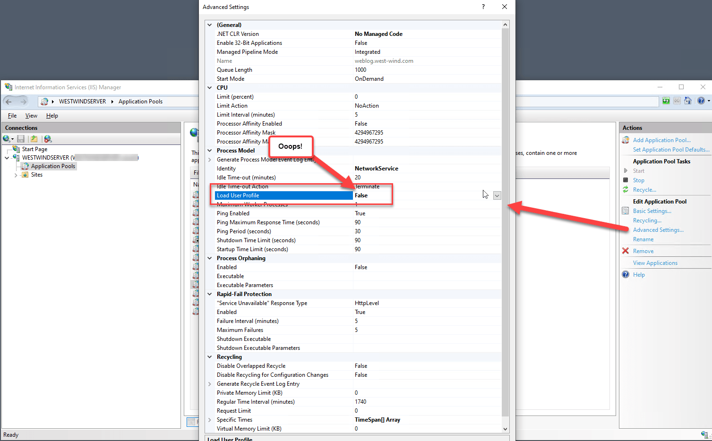
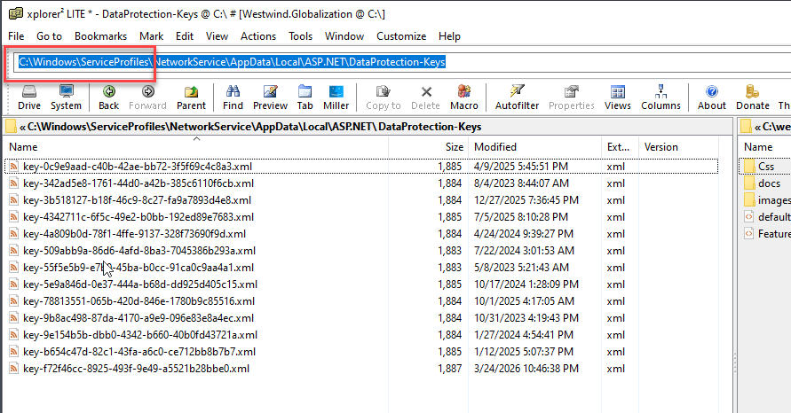

# Lost ASP.NET Identity Cookies on IIS Application Pool Restarts


Last week I finally updated my blog and moved it to .NET 10 from the ancient WebForms based engine I built 20 years ago. The app is deployed onto a Windows server running IIS and I ran into a snag related to cookie authentication in ASP.NET. 

The problem showed up in my Admin panel login where the login would persist across browser sessions, but would not persist across **IIS or ASP.NET application restarts**. In other words, I could sign in and the cookie worked fine for the current session and even in subsequent sessions after shutting down and restarting the browser, but it would eventually fail after an application update, or the nightly scheduled IIS recycle ignoring the full cookie persistence expiration.

##AD##

## Encryption Keys 
The app uses Cookie Authentication for the administration backend using a custom identity implementation on top of the base ASP.NET Identity APIs. The base Identity implementation in ASP.NET handles the cookie creation and management using internal logistics to encrypt and decrypt the cookie data, which serves both to hide the data as well as ensuring the content is not tempered with.

In the scenario I mention above the problem is that Cookies are re-generating when the machine application or the Application Pool is restarting (which on IIS usually coincides). For the TLDR; crowd the short version is that the Encryption Keys for the application weren't persisting across Application Pool restarts.

But before I get into the why of that lets look at how the ASP.NET Cookie encryption works by default on Windows and IIS and locally in your development environment.

### Cookie Authentication 101 in ASP.NET Core
Here's a quick review of explicit (non-Identity-Provider) Cookie Authentication in ASP.NET Core, which thankfully has gotten a lot simpler over the many convulsions that were plaguing early Authentication schemes in ASP.Core. These days doing your own Cookie implementation on top of the Identity base layer is pretty easy.

It's a two step process:

* Configure the Cookie/Identity middleware in the Startup
* Sign in and Sign out in your endpoints with a single method call

In your app startup set up the auth middleware:  

```csharp
services
    .AddAuthentication(CookieAuthenticationDefaults.AuthenticationScheme)
    .AddCookie(o =>
    {
        o.LoginPath = "/account/login";
        o.LogoutPath = "/account/logout";
        o.SlidingExpiration = true;
        o.ExpireTimeSpan = new TimeSpan(7, 0, 0, 0); // overridden by login 
        o.Cookie.Name = "ww_wl";
    });
```

and to enable the middleware:

```csharp
// in this order!
app.UseRouting();

app.UseAuthentication();
app.UseAuthorization();
```

Then in your authentication endpoint logic - a controller or minimal api endpoint or Page logic - you can sign in a user after you've validated their credentials (in my case **not using the Identity provider**) by adding the auth cookie:

```csharp
// `user` comes from Db
var identity = new ClaimsIdentity(CookieAuthenticationDefaults.AuthenticationScheme);
identity.AddClaim(new Claim("Fullname", user.Fullname));
identity.AddClaim(new Claim("Username", user.Username));
identity.AddClaim(new Claim("UserId", user.Id.ToString()));

if (user.IsAdmin)                
    identity.AddClaim(new Claim(ClaimTypes.Role,"Admin"));

// Set cookie and attach claims
await HttpContext.SignInAsync(
    CookieAuthenticationDefaults.AuthenticationScheme,
    new ClaimsPrincipal(identity), 
    new AuthenticationProperties
    {
        IsPersistent = true,
        ExpiresUtc = DateTimeOffset.UtcNow.AddDays(7),
        AllowRefresh = true
    });
```

To sign out is also a one-liner:

```cs
await HttpContext.SignOutAsync(CookieAuthenticationDefaults.AuthenticationScheme);
```

With the sign in set you can now get a `Context.User.Identity` object when a cookie has been set, and you can examine `Identity.IsAuthenticated` and the individual `Claims` you added.

Here's the part that's relevant to this post and the lost cookies:

ASP.NET encodes all that information into an Identity cookie and encrypts that whole internally stored package with using a known encryption key when it it is created, and then uses that same key to decrypt the cookie value to restore the Identity associated data. More on this in a second as this is part of the problem I ran into...

Once signed in in my app, once the cookie is set, I can now access the admin panel. The cookie persists and should persist across browser sessions and  - in theory - across application shutdowns.

When I ran this on my local development setup with Kestrel and a regular logged in user everything is hunky dory. It works for all scenarios - including application restarts.

## On Server on IIS: Not so much
I then deployed the app to the server running IIS, and now the browser persistence was working fine even with browser restarts, but an application restart now forced a new login every time. Annoying!
 
So what gives?

### It's not me - it's You! (IIS you old bastard!)
Turns out I was looking in all the wrong places for the problem. I was looking at the ASP.NET Cookie configuration, which as a I showed above is pretty straight forward - not to many thing you can screw up there. I have several applications that use the **exact same cookie auth set up**, and they work just fine with cookies persisting across restarts. 🤔

After checking and checking and re-checking everything, and even pointing CoPilot at two projects and it confirmed that it couldn't spot a difference that would account for the different behavior either.

CoPilot turned out to be helpful after all, because in a small reasoning side note it mentioned the DataProtection API and key storage location. Although it didn't point at the exact cause - it made me review how encryption keys are generated and used and sure enough that's where the problem turned out to be! 

### DataProtection APIs for Cookie Encryption
The cookies that ASP.NET writes are two-way encrypted and so the keys to read and write have to be available when the cookie is created and then also when it is read. 

> More simply put: The underlying key can't change or be 'renewed' in any way between encryption and decryption.

It turns out that the location where keys are stored is crucial. The location is configurable, but by default this location is stored in the active user's **Windows User Profile**. Aha! 💡

**Turns out when you create a new Application Pool in IIS, the User Profile activation is turned off by default!**. 



Oddly the default of `False` shows as a non-default value (ie. it's bolded) in the Application Pool Admin panel.

> ##### @icon-lightbulb What does Load User Profile do?
> *Load User Profile* effectively causes the Application Pool to map environment variables like `USERPROFILE` and registry keys like `HKEY_CURRENT_USER`, so that they work as expected against the specific Identity User Profile. For 'dynamic' accounts like ApplicationPoolIdentity a Profile folder is created the first time the AppDomain starts and that profile is persisted after that and behaves the same as a standard user account.

Here's why this matters: By default, **ASP.NET stores the DataProtection API encryption keys used for Cookie Encryption in the active User Profile**. No user profile, no persistent encryption key storage. 

Instead when no User Profile is mapped, a temporary, non-persistent user profile is created when the Application Pool instance is created (so that profile update operations can work without blowing up) which results in new encryption keys getting generated every time the Application Pool starts. 

Now, when a previously created cookie comes in it and tries to validate against the new cookie encryption keys, the keys no longer match and the integrity check against the cookie fails, and a new sign in is required. And that's precisely what I saw happening in my Admin Panel access.

There are couple of ways to fix this:

* Re-enable the User Profile Mapping so your get a persistent User Profile
* Explicitly store the encryption keys in a known location

#### Enable the Load User Profile
The simplest fix then is to set the **Load User Profile** setting in the Application Pool  to `True` to force using a persistent user profile for the Application Pool Identity account. This works both with existing User and System accounts as well as with dynamic accounts like `ApplicationPoolIdentity`.

And voila - keys now work across application and IIS restarts.

When you enable the user profile and don't set an explicit DataProtection API location, keys are stored in:

```ps
%LOCALAPPDATA%\ASP.NET\DataProtection-Keys
```

> On non-Windows platforms this works in a similar fashion and are stored under:
> `~/.aspnet/DataProtection-Keys/key-*.xml`

For Windows 'Service' accounts like Network Service this ends up being in a special location that is not in `c:\Users` as you might expect but in `c:\windows\ServiceProfiles\`:



For each account, each application gets its own set of keys based on some generated application id. You can see above several different applications that are all running under Network Service with their own dedicated encryption keys.

The Windows key files look like this in case you're interested:

```xml
<?xml version="1.0" encoding="utf-8"?>
<key id="65d6b51f-5282-4065-a0e4-1681d6fc0096" version="1">
  <creationDate>2024-03-08T00:52:28.2113827Z</creationDate>
  <activationDate>2024-03-08T00:52:28.2059047Z</activationDate>
  <expirationDate>2024-06-06T00:52:28.2059047Z</expirationDate>
  <descriptor deserializerType="Microsoft.AspNetCore.DataProtection.AuthenticatedEncryption.ConfigurationModel.AuthenticatedEncryptorDescriptorDeserializer, Microsoft.AspNetCore.DataProtection, Version=8.0.0.0, Culture=neutral, PublicKeyToken=adb9793829ddae60">
    <descriptor>
      <encryption algorithm="AES_256_CBC" />
      <validation algorithm="HMACSHA256" />
      <encryptedSecret decryptorType="Microsoft.AspNetCore.DataProtection.XmlEncryption.DpapiXmlDecryptor, Microsoft.AspNetCore.DataProtection, Version=8.0.0.0, Culture=neutral, PublicKeyToken=adb9793829ddae60" xmlns="http://schemas.asp.net/2015/03/dataProtection">
        <encryptedKey xmlns="">
          <!-- This key is encrypted with Windows DPAPI. -->
          <value>AQBAANCMnd8BFdERjHoAwE/Cl+sBAAAA/13cneK0bkmbEII3g6oEDgAAAAACAAAAAAAQZgAAAAEAACAAAADxJcn0BIJYkGlTN...==</value>
        </encryptedKey>
      </encryptedSecret>
    </descriptor>
  </descriptor>
</key>
```

Using the profile option is easiest because it's automatic, but if you need to share keys between multiple machines or multiple applications, you need to use another approach using one of the other supported key storage mechanisms.

And remember that if you turn Load User Profile to `False` you don't get a peristant profile and keys won't survive an Application Pool shutdown.

#### Explicitly provide DataProtection Folder Location
If you don't want to be tied to a Windows User Profile there's a more deterministic approach in ASP.NET that lets you specify where the DataProtection keys are stored explicitly in an explicitly specified known location or another storage API solution.

This is configured through ASP.NET's configuration and there's a middleware service that you can register for this via  `services.AddDataProtection()`:
 
```csharp
// Key storage for cookies - so cookies can persist
if (env.IsProduction())
{
    services.AddDataProtection()
        .PersistKeysToFileSystem(new DirectoryInfo(Path.Combine(env.ContentRootPath, "DataProtectionKeys")))
        .SetApplicationName("Weblog");
}
```

This example uses the File System provider to store the keys to a specified folder on disk, that contains the required key chain used for encryption using the DataProtection APIs. The layout for this folder is the same as shown in the Profile location, with the difference that you get to chose the location explicitly. Note that your Application Pool Identity account has to have read and write access in this location in order to create the keys written there.

 You can store key - as I do here - in a folder below the app's content root (which is **not** Web accessible), or if you're overly paranoid, stuff it into a known, completely away-from-the-app location.

There are additional providers including persistence to the registry, AzureBlobStorage and you can also implement your own provider to store the key files.

##AD##

## Summary
In the end for my application, I opted for the simplest solution of just enabling the user profile to automatically let it do its thing to store the keys. When running on Windows I tend to have the User Profile enabled even though I don't explicitly access it, because there always can be odd APIs that require a profile user that you might not expect anyway - this has bitten me more than once so I tend to enable it on all app pools. There's no real overhead here as all that really does is map environment variables to point at file and registry keys that already exist. I've had apps break in the past with off the wall failures because profile access was not available. There's no real downside to leaving it on especially with an otherwise non-interactive account.

The alternative of using an explicit store makes sense if you need to share keys between multiple machines in a load balancing or other multi-server environment, or if you simply want more control over where the keys go. Just make sure your app can actually write out the new keys in the location you choose. 

Writing this down mainly to remind myself in the future, because due to the default setting in the Application Pool to not load a User Profile I've run into this more than once. Hopefully spending a little time writing it down will have jogged my memory enough not to repeat that mistake in the future... 😀

<div style="margin-top: 30px;font-size: 0.8em;
            border-top: 1px solid #eee;padding-top: 8px;">
    
    this post created and published with the 
    <a href="https://markdownmonster.west-wind.com" 
       target="top">Markdown Monster Editor</a> 
</div>