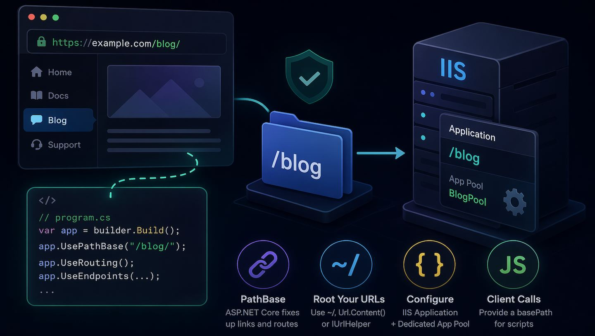
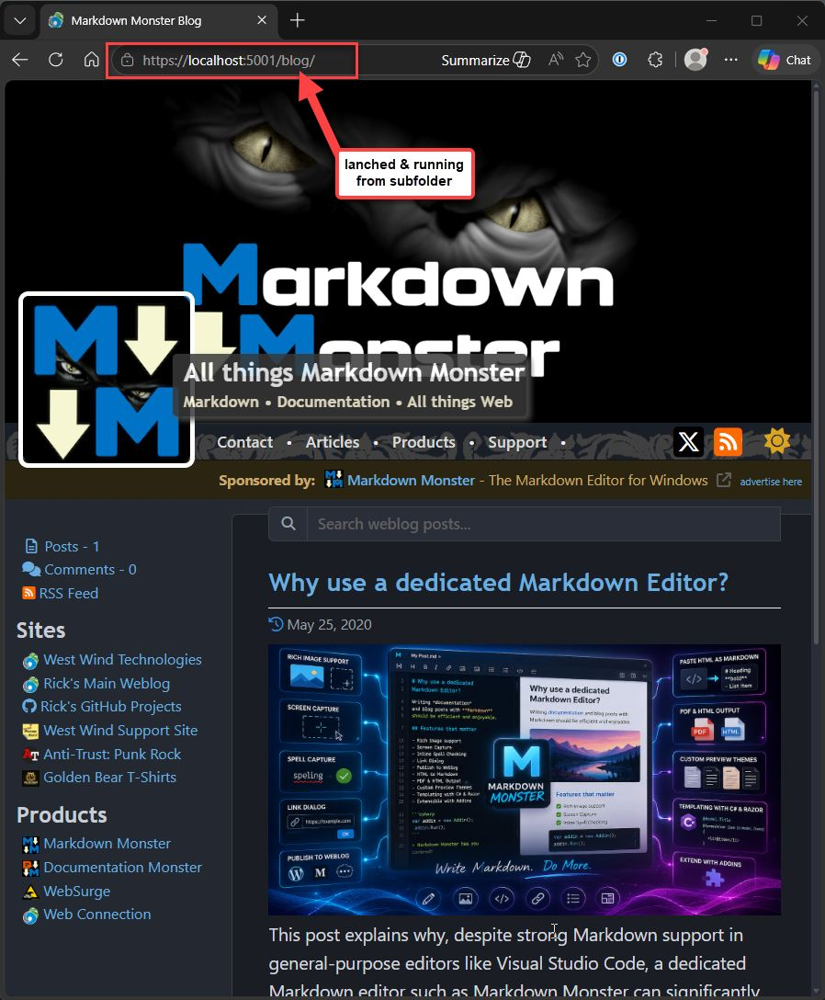
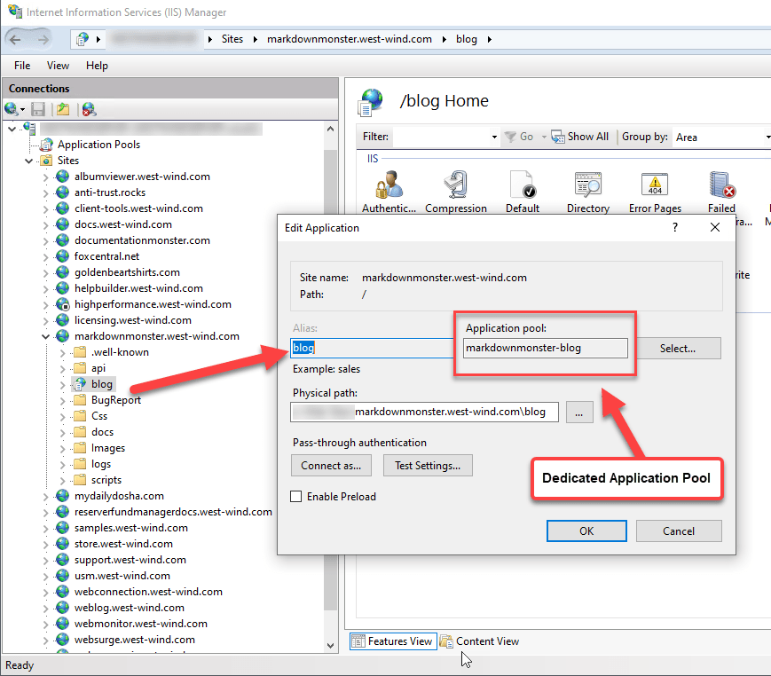
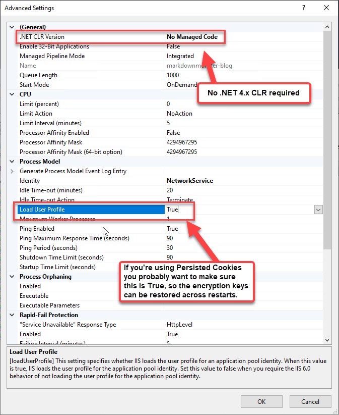
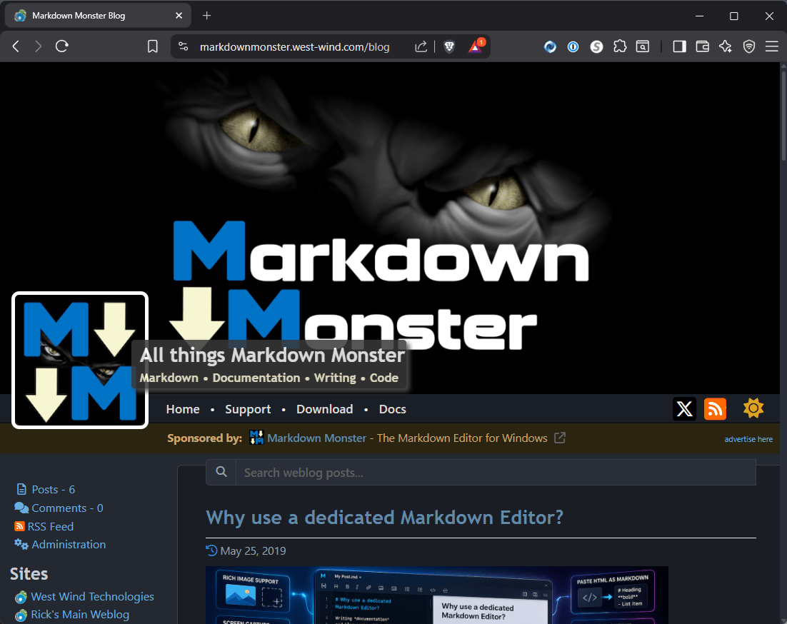
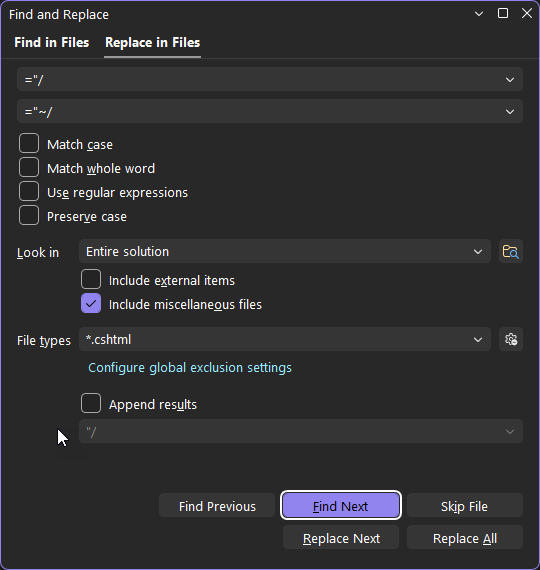

# Running ASP.NET Core Applications as a Subfolder Application



ASP.NET Core applications by default want to run in a root folder - and to be fair that's the 99% use case. But there are those occasional situations where you want to run a Web site in a sub folder rather than on the root of the Web site.

In this post I review what's required to run ASP.NET with a `PathBase` - which works with any Web server - and then specifically discuss how to set this up on IIS, which is a little more complicated than it should be.

> Although I discuss IIS specifically here for the physical deployment part since that's what I'm running on, the majority of this this content concerning the ASP.NET set up and modifications, applies to any Web server hosting when using sub folder mapping.

##AD##

## Why would I need to run out of a SubFolder?
The specific scenario that I ran into was that recently I updated my old custom Blog engine, and decided to pull all my secondary blogs onto my own server from various blog publishing sites. I've always run my blog on my own hosted server and the main blog runs of its own sub-domain. But the other two blogs are small barely used product related blogs that ran on different hosting sites which I never used because they were terrible and it would be a better fit to just run them off the same site in `/blog/` folder.

With my recent site blog update - I finally moved the old WebForms app to .NET Core - and the much simplified deployment set up that comes with it, I decided to just run everything in house for these relatively low volume sites and get better, more consistent theming and a much easier publishing pipeline using Markdown Monster (using a new custom protocol - more on that in another post).

In any case the scenario here is that I have a root product site:

* https://markdownmonster.west-wind.com

and I now want to run the blog site out of a `/blog/` sub-folder, rather than as a root site. So:

* https://markdownmonster.west-wind.com/blog

rather than a separate new root Web site like:

* https://markdownmonsterblog.west-wind.com

(which is what I started with then aborted)

For SEO it's often beneficial to run everything on the same site which matters more for the low volume sites, but it's also cleaner and more consistent with other sub folders like `/docs` and `/support`. Running a sub folder site also requires less setup - you don't need yet another certificate and custom bindings to manage and so on. So using a subfolder is effectively more lightweight from a config perspective. On the other hand, using a subfolder site requires that more care is given how urls are created in the application as we'll see in a minute.

## Creating an Application in a Subfolder
There are three parts to the process of running an application in a subfolder:

* Configuring ASP.NET for running from a subfolder
* Fixing up links so no hardcoded `/` references are used
* Configuring the Web Server for a subfolder application

### Setting up ASP.NET For running with a Subfolder
Turns out setting up ASP.NET to run from a subfolder is pretty easy to do as there's a dedicated middleware to set up a custom `PathBase` as ASP.NET likes to call it. 


In `program.cs` add this:

```cs
var app = builder.build();
...
app.UsePathBase("/blog/");
```

This code goes into `program.cs` after the builder has created an `app` instance using the provided services. You'll want to do this near the top of the app middleware declarations to ensure the folder is respected all the way through the middleware pipeline - you'll want this before authentication,  static files and certainly before any routing middleware. I have it at the very top of the pipeline immediately after the builder has created the `app` instance.

I tend to parameterize the PathBase parameter with a configuration value, because I'm  duplicating the same application in multiple folders. So, in my Weblog application it looks like this:

```csharp
// config from DI initialization or wlApp.Configuration static
if (!string.IsNullOrEmpty(config.VirtualPath) && config.VirtualPath != "/")
{
	app.UsePathBase($"/{config.VirtualPath}/");
}
```

I have 3 blog sites - one of which runs as root and two of which run in `/blog/` subfolders. By parameterizing I can customize whether they run out of a subfolder or not without recompilation.

So what does `.AddPathBase()` actually do? 

It's used to resolve Urls internally, using the path specified in `AddPathBase()`. Anytime ASP.NET creates a path dynamically for routes, uses `~/` in Views or Pages, or via `Url.Content()` or other `IUrlHelper` the path is automatically fixed up with the provided path base. 

So instead of returning `/images/someimage.png` which you'd get for a root site, you get `/blog/images/someimage.png` for example.

If you use implicit routing, Url helper methods,  or you stick to using `~/` paths in your Views/Pages, ASP.NET does most of the heavy lifting for you,  without having to do anything else. 

#### Fixing up Root Paths with `~/` and an ApplicationBasePath
All this means is that you need to be more vigilant about how you **root** any explicitly referenced Urls both in View markup and in your application code. Code fixups should be minimized as much as possible.

For Views:  Rather than  using `` you should use `` to ensure the appropriate path is used.

If you didn't do this - and let's be honest most of us don't - you can quickly find and replace all instances of hard coded root paths by doing a **Find in Files Search** (Ctrl-Shift-F) in your IDE and doing a search and replace for `="/` and replacing with `="~/` in all your View files. This should capture most scenarios in any physical files.

In code you can access the `IUrlHelper` interface in Razor views or injected into controllers or methods.

**In a Razor Page or View**

```cs
var rootPath = Url.Content("~/images/someimage.png");
```

**In Application Code (.cs files)**

You can also inject `IUrlHelperFactory` (WTF Microsoft?) and then retrieve the `IUrlHelper` in a somewhat convoluted way that only an ivory tower architect could love:

```csharp
public class MyService
{
    private readonly IUrlHelper _url;

	public MyService(
    			IUrlHelperFactory factory,
    			IActionContextAccessor actionContextAccessor)
	{
	    _url = factory.GetUrlHelper(
	        actionContextAccessor.ActionContext);
	}
	
	public string Resolve()
	{
	    return _url.Content("~/images/logo.png");
	}

}
```

If you don't want to deal with this and just have a couple of generic methods that work anywhere, the [Westwind.AspNetCore](https://github.com/RickStrahl/Westwind.AspNetCore) package has a couple of generic helpers:

* [HttpContext.ResolveUrl()](https://github.com/RickStrahl/Westwind.AspNetCore/blob/f244102fcc3b9fbed5f0d736bd0bb9cd2cd57799/Westwind.AspNetCore/Extensions/HttpContextExtensions.cs#L88) extension method
* [WebUtils.ResolveUrl()](https://github.com/RickStrahl/Westwind.AspNetCore/blob/f244102fcc3b9fbed5f0d736bd0bb9cd2cd57799/Westwind.AspNetCore/Utilities/WebUtils.cs#L209) - you provide a base path as a string and it resolves with that (works without any Context)

### Running locally with a SubFolder
If you create your app this way, and fix up Urls you run it locally using the Kestrel Web server with `dotnet run` or from your IDE you will see the site come up in a subfolder:



The url includes the `/docs/` subfolder:

```text
https://localhost:5001/docs/
```

If you stuck to using `~/` root paths everything is bound to just work the same as if you were running from the root folder.

Note that you should also change your dev `launchSettings.json` to reflect the new `launchUrl` that includes the subfolder:

```json
"Westwind.Weblog.MarkdownMonster": {
  "commandName": "Project",
  "launchBrowser": true,
  "environmentVariables": {
    "ASPNETCORE_ENVIRONMENT": "Development"
  },
  "applicationUrl": "https://localhost:5001",
  
  // THIS!
  "launchUrl": "https://localhost:5001/blog/"
},
```

### Configuring IIS for a Subfolder Application
While the `UsePathBase()` middleware handles the ASP.NET Core side seamlessly, IIS requires some extra work to create an **Application** under your root website.

IIS has Web Sites and Applications, which are very similar. Web Sites have extra configuration related to Host mappings and bindings, but otherwise Web Sites and Applications behave very similarly.

> ##### @icon-lightbulb One ASP.NET Application per Application Pool
> IIS requires that each ASP.NET application uses **its own dedicated ASP.NET Application Pool**. Only a single ASP.NET Application can run inside of any given Application Pool, so unlike classic .NET sites, you can't share a single application pool for multiple Core apps. 
> 
> It's possible to mix an ASP.NET Core app with a classic ASP.NET app or a static app in the same Application Pool, but you cannot have two or more ASP.NET Core Applications in an Application Pool. If you do only the first starts - the second one fails with a startup error.

Here's what a folder based Application looks like in the IIS Manager:




> ##### @icon-lightbulb Application vs. Virtual Folder
> There are two options in IIS for a folder: Application or Virtual. In this post I'm only talking about Applications which are self contained apps that run in their own Application Pool.   
>
> You can also create a virtual which does not create or use a new Application Pool but simply provides a virtual folder mapping with the app running in the parents application scope. This might work in some scenarios where the parent site is not an ASP.NET Core app. A static site or an ASP.NET Classic site but I've not tried this out. What I describe here is the scenario of creating a new Application that is mapped to an Application Pool explicitly.


Note that the physical folder doesn't have to live in the matching parent site folder  - it can point to any location on disk. However, in most cases I put the actual site content into the relative folder location in the parent Web site for consistency in finding it later 😄

For an Application you need to have a **dedicated Application Pool** for this application - or at least an AppPool that doesn't have another ASP.NET application in it. That AppPool should be configured for **No Managed Code**.



Make sure you use an identity (user) that matches the rights that you need for your application. My apps tend to have a few configuration related settings that get written out so I have to use an account that has some additional rights.

Once this is set up and you've published your app, IIS will handle the initial request routing and pass the correct path information to the ASP.NET Core module to give you the same behavior that you see on your local install.



## Recommendations
If you're like me and you built this site with a Root Site in mind initially,  doing this switch to running a sub-folder - I'd highly recommend you take a breather 😄 and spend a bit of time testing locally with the subfolder.

There are bound to be lots of little edge cases that are hard to test and easy to miss when doing smoke testing.

I initially built the site for my main Weblog which runs on root, never giving any thought for running out of a sub-folder. Then when I created the other two sites I initially set them both up as root sites before realizing that I'd rather run them in sub folders.

I went through the initial steps of making the site work with subfolders, and at first glance everything worked. However I ran into lots of little edge cases with a couple of oddball links that used different quotes around links, and any links in Javascript code (see below). I managed to find most issue before uploading the site to production, but over the next day a whole bunch error log reports came in from things I had missed - mostly links.

So take the time to test your functionality, if not automated then manually excercising all the nooks and crannies of your site.

### Summary of Path Fixups

To summarize these are some of the things that you have to probably fix or at least check when going from Site to Folder based:

### All .cshtml, .razor  Pages
All view pages can automatically fix up pages that reference via "~/" paths. Maybe you were diligent and started doing this right way. I rarely ever do this right - I do some with `~/` and some not which is no better than not doing it all 😄.

Luckily fixing up View pages is pretty straight forward: You can do a simple search and replace:

* Select *.cshtml, *.razor etc.
* Search for `="/` 
* Replace with `="~/`



### Code Fix ups
You can do something similar for your .NET code, but you have to be a lot more selective and you can't do a search and replace.

* Select *.cs, *.cshtml     (cshtml for code blocks that build Urls)
* Search for `"/` 

You want to search code both in your CS files and any code snippets in your Views/Pages.

Hopefully there shouldn't be a lot of those in your code because generally hard coding Urls is a bad idea. Typically this only happens if Urls need to be built up based on a host of input parameters. 

```cs
var redirectUrl = "/somedeeplink/in/the/site";
```

changed to:

```cs
var redirectUrl = wlApp.Configuration.ApplicationBasePath + "somedeeplink/in/the/site";
```

Again, this should be pretty rare but worth checking for. This search is likely to produce a lot of false positives that don't require any changes.

### Javascript Code
Javascript code is little more tricky. If you have script code that's making server calls, you may have to fix up paths in your scripts. Scripts aren't executable code and the ASP.NET parser doesn't touch them as the files are served as static resources. It's also common that you provide Urls as strings.

It's a lesson I've learned a long time ago - almost every application that calls to the server requires a configurable value to for a base path to call the server. There are lots of ways to do this and in SPA applications I always have a config object to do this.

However, for traditional server based Web apps that have only a few isolated JavaScript callbacks to the server, there is no common entry point for scripts - they are just loaded randomly.

In this application I do this the brute force way by providing a base path in a global script variable that gets embedded into the `_Layout.cshtml` page. Since `_Layout.cshtml` touches every page this is as close as I get to a global client side entry point. You can also put this in a script file but you have to make sure it gets loaded early enough that all other scripts can see it.

The idea is that I create a global variable - or rather a global object with an embedded variable - that is accessible from any script.  The script is defined at the top of the page in the header so it's visible to any code that follows.

I use another helper class from `Westwind.AspNetCore` helper for this:

```cs
@
{
	// at the top of _Layout.cshtml

	// creates an object with props for the value(s) below
	var scriptVars = new ScriptVariables("window.page");  
	scriptVars.Add("basePath", wlApp.Configuration.ApplicationBasePath);
}
<!DOCTYPE HTML>
<html>
<head runat="server">
    <title>@(ViewBag.Title ??  wlApp.Configuration.ApplicationName)</title>
    <script>
        // expands into an object with props
        @scriptVars.ToHtmlString();
    </script>
```

[ScriptVariables](https://github.com/RickStrahl/Westwind.AspNetCore/blob/f244102fcc3b9fbed5f0d736bd0bb9cd2cd57799/Westwind.AspNetCore/Utilities/ScriptVariables.cs#L100) is a helper class that makes it easy to create a Json safe object of values you want to embed into the page from your .NET code. You basically add variables which are then serialized - Javascript and Html safe into the document when you use `@scriptVars.ToHtmlString()`.

In this case it produces an object with a single variable, but typically I end up with a handful of 'global' page level properties that need to be passed through:

```js
window.page = {
	basePath: "https://markdownmonster.west-wind.com/blog/"
};
```

You can decide whether you want to use just `/blog/` or the fully qualified path as I'm doing here. 

I'm using:

```cs
scriptVars.Add("basePath", wlApp.Configuration.ApplicationBasePath);
```

which is configured value that I store in the app to have quick and easy access to the full site url. In the case of this `_Layout.cshtml` page you could also use:

```cs
scriptVars.Add("basePath", Url.Content("~/");
```

which produces the site relative `/blog/` base path.

Now any scripts on the page - both in the page itself or in any script files can look at `page.basePath` and use that to fix up any Urls as necessary:

```js
deletePost = ()=> {
	if (confirm('Are you sure you want to delete this post?')) {
		// THIS
		var url = page.basePath + "posts/@post.Id";
		
		ajaxJson(url, null,
			(res) => { 
			    // AND THIS
			    location.href = page.basePath + "posts";
			},
			(err) => {
			    alert("Error deleting post: " + err.responseText);
			},
			{ HttpVerb: "DELETE" });                                                    
	}
}
```

##AD##

## Summary
Conversions like this are always more time consuming than you think - getting to 80% is easy. And just as you're padding yourself on the shoulder for an easy job you find all the edge cases that you didn't test for.

The basics mentioned above should get you through most of the conversion pretty quickly. It takes a little bit of time to set up, and I always kick myself for not doing things like using `~/` paths and explicit base path fixups for any coded paths right from the start. 

Running Web sites out of a virtual folder is not all that common, but for many low impact sites I'm actually finding myself using them more often than I would have thought. When you need to do it, it's good to know that it's possible and not as complicated as I thought it might be. 

Now that I've gone through it I suspect I will be more diligent in the future with new and old sites to use proper pathing from the get go even when it seems overkill and you think you'd never run any other way than out of a root site... we shall see. 


<div style="margin-top: 30px;font-size: 0.8em;
            border-top: 1px solid #eee;padding-top: 8px;">
    
    this post was created and published with the 
    <a href="https://markdownmonster.west-wind.com" 
       target="top">Markdown Monster Editor</a> 
</div>