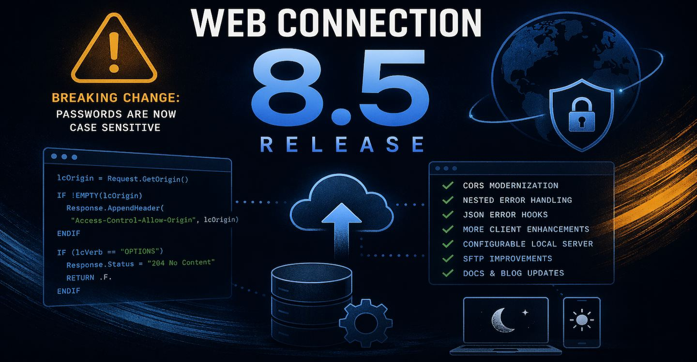

# Web Connection 5.4 Release Post



I've released Web Connection 8.5 which is a minor maintenance release of the FoxPro Web and Service Development framework. It's been a while since the last release, so there are quite a few items on the update list, but most of them fairly minor and have no impact on existing behavior.

>  ##### @icon-warning One Potential Breaking Change
>  There's is one potentially breaking change related to how default passwords and authentication are handled in `wwProcess` and `wwUserSecurity` Authentication. Specifically, this update by default enforces case sensitivity in passwords, which previously it was not. More info below.

## Changes 
Here are the updated changes in Web Connection 8.5 broken out into some additional detail. As always you can look at the quick overview in the Web Connection Changelog:

* [Web Connection Changelog](https://webconnection.west-wind.com/docs/West-Wind-Web-Connection/Whats-new-in-Web-Connection.html)

## Server Framework Changes

### Update New Project Template for CORS Domain Logic
CORS rules have gotten more strict in browsers recently, with certain browsers disallowing the catch-all `Access-Control-Allow-Origin: *` rule. Previous versions of Web Connection used the `*` value by default to allow all traffic through by default and left customization to you. 

CORS is used by client side Web browser applications typically using JavaScript that use the browser's Http client via the `fetch()` function or the old `XmlHttpRequest` object. 
The problem with  `*` is that **recent changes** in Web Browser security restrictions do not allow this value longer as a catch-all value. Using that header breaks with an Http `401 Unauthorized` result in the browser.

The updated CORS configuration fixes this by explicitly specifying the caller's domain, which has the same effect but requires a little bit of extra code.

Web Connection creates a default CORS implementation as part of the [New Project](https://webconnection.west-wind.com/docs/Walk-Through-Tutorials/Step-by-Step-Creating-a-JSON-REST-Service.html) Wizard, which is now updated to look like this:

```foxpro
*** in YourProcess::OnProcessInit()
lcOrigin = Request.GetOrigin()

IF !EMPTY(lcOrigin) 
***    *** Optional - validate origin against a domain list (you implement)
***    IF !THIS.CheckForValidOrigin(lcOrigin)
***       Response.Status = "403 Forbidden"
***       RETURN .F.
***    ENDIF 

	*** Allow all domains IP addresses effectively 
	Response.AppendHeader("Access-Control-Allow-Origin", lcOrigin)  
	Response.AppendHeader("Access-Control-Allow-Methods","POST, GET, DELETE, PUT, OPTIONS")	
	
	lcRequestHeaders = Request.GetExtraHeader("Access-Control-Request-Headers")
	if EMPTY(lcRequestHeaders)
	  lcRequestHeaders = "Content-Type, Authorization" && ,Cookie if you use cookie auth!
	endif
	Response.AppendHeader("Access-Control-Allow-Headers", lcRequestHeaders)
	Response.AppendHeader("Access-Control-Allow-Credentials","true")
ENDIF

lcVerb = Request.GetHttpVerb()
IF (lcVerb == "OPTIONS")
    Response.Status = "204 No Content"
	RETURN .F.  && Stop Processing
ENDIF
```

Notice that rather than:

```foxpro
Response.AppendHeader("Access-Control-Allow-Origin", "*")  
```

the code now uses the original user's origin domain:

```foxpro
Response.AppendHeader("Access-Control-Allow-Origin", lcOrigin)  
```

There's also a new `Request.GetOrigin()` method that makes it easier to retrieve `HTTP_ORIGIN` header.

There's also an updated topic in the documentation that describes the CORS setup for those of you that need to add or update it in existing applications:

* [Adding CORS Support to a REST Service](https://webconnection.west-wind.com/docs/Walk-Through-Tutorials/Step-by-Step-Creating-a-JSON-REST-Service/Step-7-Adding-CORS-support.html)


### Update wwProcess Error Handling to catch nested Errors in Error Handling
One long-standing issue in Web Connection has been nested error handling. Specifically the scenario where an error occurs during error handling could result in an empty response being sent back to the client from the server. The failure also would fail and not fire the rest of the error pipeline, often resulting in really hard to track down errors.

In this release I updated the Web Connection process error handler to detect and better handle errors that occur during error handling. If your code fails during error handling (like say a database error during error logging) that second error is now captured and logged and a generic error page is displayed. This fixes the scenario where you get a blank page result, due to  these nested errors which were difficult to debug or pinpoint.

In essence the default error handle is now wrapped in a secondary try/catch/finally loop so that any response through the default error handler will now always produce some sort of output.

> #### @icon-warning You're on your Own if you override wwProcess::OnError
> Last resort error handling runs through `wwProcess::OnError` which can - and frankly should be - overriden in applications. If you override you become responsible for the error returns so make sure you follow the base class' structure for exception handling. 

### [wwRestProcess::OnJsonError Handler](dm-topic://_o7b75vrgfd)
On a related note REST services now get a new `OnJsonError` method which allows you to intercept REST service errors so you can easily log failures. 

Unlike the page `OnError()` handler, this handler method doesn't generate any output - it only provides a mechanism for capturing the error and potentially logging it. If you want to look at generated output, and based on the headers do error management of some sort you can do so in the [wwRestProcess::OnAfterCallMethod()](https://webconnection.west-wind.com/docs/Framework-Classes/Class-wwRestProcess/wwRestProcessOnAfterCallMethod.html) which provides you the generated output as input.

### Removed Case Insensitivity from wwUserSecurity Password Checking
So here's the potentially **Breaking Change**:

I changed the behavior of base authentication in default `wwUserSecurity::Authenticate()` - which also affects `wwProcess::OnAuthenticateUser()` - by removing the `LOWER()` case conversion on the input password to be lower case. 

The reason for this is is that modern security often requires and generates mixed case passwords and forcing case insensitivity lowers the password's strength. This affects the password behavior of the built-in wwUserSecurity security process in Web Connection, which you can override with your own `wwUserSecurity.Authenticate()` method as you see fit. 

However, the default implementation is now case sensitive which **might** break existing users who were expecting to use non-case sensitive passwords. Web Connection's default implementation didn't provide a mechanism to enter passwords natively other than direct entering into the DB, so how passwords are stored was always up to you. If you need to maintain password lower casing there are a few ways to do this:

* **Force all Passwords to lower**   
You can force all passwords in the DB to lower case and then force the user's input to lower case. This is a quick fix if you don't want to do any other code changes.

* **Subclass wwUserSecurity::Authenticate()**  
You can always subclass the `wwUserSecurity` class and use a customized version that does the lookup in `Authenticate()` exactly as you want it to. The default implementation has now removed the lower casing match for the password when doing the lookup but your version can put that lower casing right back in.


## Client Framework Changes


### Explicit wwDotnetBridge [GetField()](dm-topic://_70y19t8wr) and [SetField()](dm-topic://_s850mn6vv) Methods
Several people ran into issues with wwDotnetBridge due to a  (not so) recent change that removed the ability to for `GetProperty()` and `SetProperty()` to also access fields. Although it's really not recommended to use fields instead of Properties for public and external access, some people can't resist :smile:

So due to those recent changes, there are now dedicated `GetField()` and `SetField()` methods to that explicitly allow you to retrieve field values including private fields. 

> Note: The original reasoning for field removal from the Property methods was to improve Reflection performance on fewer members to parse.

### [wwSQL::cDefaultLocalServerName - Configurable `Server=` when not provided](../Utility-Classes/Class-wwSQL/wwSqlcDefaultLocalServerName.md)
I recently ran into an issue with a local SQL Server installation that did not - for some reason - work with TCP/IP connections. A botched install that didn't have access to the SQL configuration didn't allow access via TCP/IP and no way to set it. As an aside [Windows ARM devices may also not work TCP/IP with local SQL server installations](https://weblog.west-wind.com/posts/2024/Oct/24/Using-Sql-Server-on-Windows-ARM).

Long story short because TCP/IP failed the default local server name of `server=.` that wwSQL uses didn't work.

`wwSql` automatically injects the `server=` into the connection string if it's missing and the value that is injected there is now configurable via two separate values:

* `wwSql::cDefaultLocalServerName` Property
* `WSQL_DEFAULT_LOCALSERVERNAME` default Header Value                

The default header value in `wconnect.h` defaults to `127.0.0.1` and is assigned to `cDefaultLocalServerName` as the default value. The value can be overriden per wwSQL instance or globally in one place.

Again this applies only if a connection string is used that doesn't include a server name like:

```foxpro
loSql.Connect("database=Weblog;integrated security=true; encrypt=false")
```

This injects the following:

```foxpro
IF ATC("server=",lcConnectString) = 0
	lcConnectString = "server=" + this.cDefaultLocalServerName + ";" + lcConnectString
ENDIF
```

with:

```foxpro
*-- The default local server name used when omitted in connection string
cDefaultLocalServerName = WWSQL_DEFAULT_LOCALSERVERNAME
```

Effectively this allows you to set specific protocols like `lpc:.` or `np:127.0.0.1` or `tcp:127.0.0.1,1434` when no explicit connection string is passed. The `wconnect.h` value allows for a global change in one place without having to assign the value to each instance.

In the end this change allowed us to make a single change in the `wconnect.h` header file to get the server to use the `lpc:127.0.0.1` connection string, without having to upend the entire application. It's not a common feature, but it is useful in some edge case scenarios like this.

> Ideally you should **always** parameterize your connection strings. In a configuration file (create and use `Server.oConfig.cAppConnectionString` or similar) or Environment variables or whatever. Never hardcode connection strings or any potentially configurable value if at all possible. Thank me later! 😄

### [wwFtpClient::AddCertificateFromCertificateStore()](dm-topic://_8ea3e8k6o2) and     [wwFtpClient.AddCertificate()](https://webconnection.west-wind.com/docs/Utility-Classes/West-Wind-Internet-Protocols/Class-wwFtpClient/wwFtpClient-AddCertificate.html)
Added a new methods that can be used to add a certificate from the certificate store or from `.pfx` files to the connection. 

For the `.AddCertificateFromCertificateStore()` version the certificate has to be installed in the appropriate user or machine certificate store. By default the User Store is used, unless you pass the `llUseMachineName` option as `.T.`.

> Remember that for Web applications, the user account is the impersonated account so in Web apps for Web apps that need to add certificates from the store you probably need to install them into the local machine store.

Store Certificates are selected by their subject which look like this:

```text
CN=example.com, O=Example Corp, OU=IT Department, L=Seattle, S=Washington, C=U
```

Pass the whole subject or `CN=` value with the `CN=` prefix (ie. `CN=example.com`).

For `.AddCertificate()` you need to provide a `.pfx` file. Pfx is a Windows specific format of the `PKCS #12` encryption which is produced by most Windows based tools that spit out self-signed certificates (like IIS or the local certificate manager).

Both of the methods that add certificates have to be called before sending any commands over the `wwFtpClient` connection.

### Fix: [wwSFtpClient::UploadFile](dm-topic://_6wr0zm6jl) and [wwSftpClient::DownloadFile()](dm-topic://_6wr0zm6jk) now preserve File Time  
These methods now preserve the uploaded or downloaded file's time stamp on the receiving end when the file is saved. 

SFTP natively is a streaming API and doesn't support automatic timestamps, but wwSftpClient now explicit calls the server API to match the client and server dates by default. If you need different dates, you can use the new `SetFileTime()` method to explicitly change the date.

### [wwSftpClient::SetFileTime()](dm-topic://_octus3bcc6)
Added new method to allow setting the file time of a server file more easily. 

Note that `UploadFile()` and `DownloadFile()` now preserve file dates by default so there should be less need for this method, but it can be used if you different behavior than our new imposed default of time preservation.

### Fix: Implement missing [wwSftpClient::GetDirectory()](dm-topic://_idnh36dbs9)
Added missing `GetDirectory()` method that returns the currently active SFTP directory name as a string. 

Note that to return the files in a directory with its directory and file details, use the `ListFiles()` method.

### Fix: wwHttp Upload File Name Encoding
Fixed an old issue that caused problems with filenames that include extended characters when using `nHttpPostMode=2`.

In some cases files, would double UTF-8 encode the `filename=` attribute  that the server can use to determine what the file name sent was. The old code also wouldn't preserve filename case,  so it was hard to determine expected file names on the server. 

This has now been fixed and file names are now properly encoded as provided either by explicit filename or by deducing from the upload filename.

### Documentation Updates: Dark Mode added, Typography and Navigation Improvements
There are a number of documentation updates for the Web Connection (and all other West Wind) documentation - courtesy of [Documentation Monster](https://documentationmonster.com).

The help file now has a toggle for light and dark mode. Not a big thing for most, but some (very vocal) people have been asking for dark most on the documentation. The Web Connection docs continue to default to light mode, but you can now toggle to dark mode on the top right  toolbar.

The typography has also been updated with more readable fonts, and sizing of the main panel has been adjusted a bit for various display sizes. 

Finally the tree navigation now manages topic positioning better, both when jumping in to specific topic links from outside of the docs site as well as when searching in the topic tree. Tree searches should also be significantly faster now than before.

### [Web Connection Weblog Facelift](https://webconnectionblog.west-wind.com)
I've migrated the Web Connection Weblog to my main Weblog engine that I also use and have recently updated on my [main weblog](https://weblog.west-wind.com).

As a result the blog now has a more modern look with all old content migrated into the new engine. All old links now forward to the new blog site.

As with the docs site there are improvements like dark mode, improved typography and better sizing for various mobile and desktop form factors.

The old Web Connection blog site was getting a bit long in the tooth and was a bear to maintain. While the site has been working fine, it was missing important back end features necessary to maintain the blog operations. 

The new site has been re-homed at:

https://webconnectionblog.west-wind.com

and all old links into the old site now forward to the new site.

If you run into any dead links, please let me know...


## Summary
As I mentioned in the beginning, it's been a while since the last release, so a lot of the small fixes have been building up making this is a bigger release than many of the preceding small releases.

However, none of these updated features and enhancements have any significant impact on existing applications in terms of changes required, with the potential exception of the the password behavior in `wwUserSecurity.Authenticate()`  and by association default `wwUserSecurity` Authentication in `wwProcess`.

Until next time...