# Creating a Packaged Windows Single File Web Site Viewer Executable

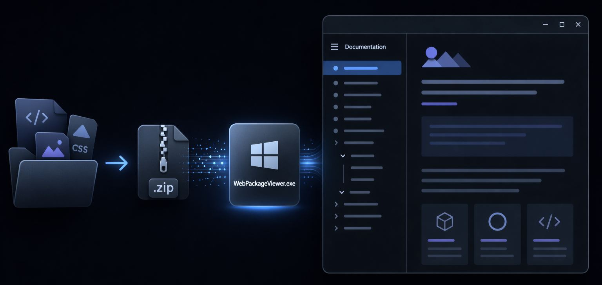

This post falls squarely into the stupid pet tricks category, but I'm going to post about it anyway, because it was an interesting experiment in dynamically creating a single file, self-contained Windows executable that contains the executable, data and a native dependency.

This is about as edge case as it gets, but let me give you my scenario and why I decided to tackle this, foolishly thinking that this would be a quick afternoon project (punchline: it wasn't). 

I have several Web based documentation solutions that I both publish publicly and also use for specific customer projects. Essentially these are Web site generator tools with a specific front end for creating the documentation that makes up the final documentation Web output. Because I deal quite a bit with legacy customers one issue that frequently comes up is the ability to take documentation offline while traveling or otherwise being disconnected from the Internet.

My documentation tools (and many others) generate base Html output for documentation in the form of a static Web site, and the online version of that is typically adequate for the majority of users. But a frequent option is for some form of offline output in some portable format like a PDF file or a self-contained Html document, that can be easily shared and used offline. While PDF or Html documents work and let you access the content in document form, it's more like a book - sequential and not very interactive. Web sites tend to offer a more interactive experience and in most cases a much more attractive reading experience due to richer layout and styling that isn't possible in PDF.

That got me to thinking: It would be nice to create a single file EXE package offline Web viewer, that can run the Web site locally instead. So kind of like a CHM file of old, but it's running the full documentation (or the way it's built - any dynamic Web site).

##AD##

## WebPackageViewer
What I came up with is WebPackageViewer, which you can find here:

* [WebPackageViewer on GitHub](https://github.com/RickStrahl/WebPackageViewer)

WebPackageViewer is essentially a dual purpose application: 

* An Exe Packer that can pack and unpack a Web Site as Zip file into an Exe and then run into a built-in viewer application.
* That same application can also run with content from disk directly as a Web Site Viewer without the packaging

In practice I use this tool as part of my [Documentation Monster](https://documentationmonster.com) documentation solution as one of the output options which packages the generated Documentation Web Site into an self-contained Exe package:

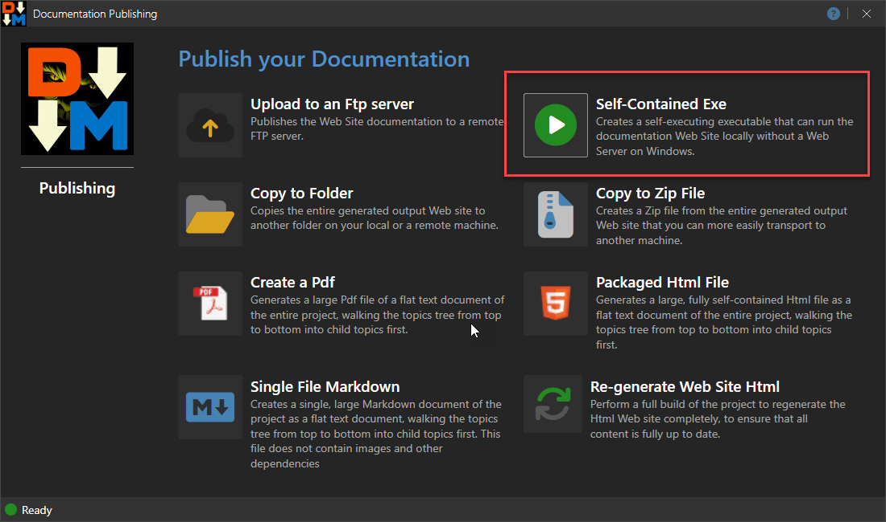
<small>**Figure 1** - Generating an Exe as part of  publishing options for a documentation solution.</small>

This generates a self-contained Windows Exe that essentially lets you run the Web site in an application locally. Here's what the Viewer looks like running a packaged Web site:

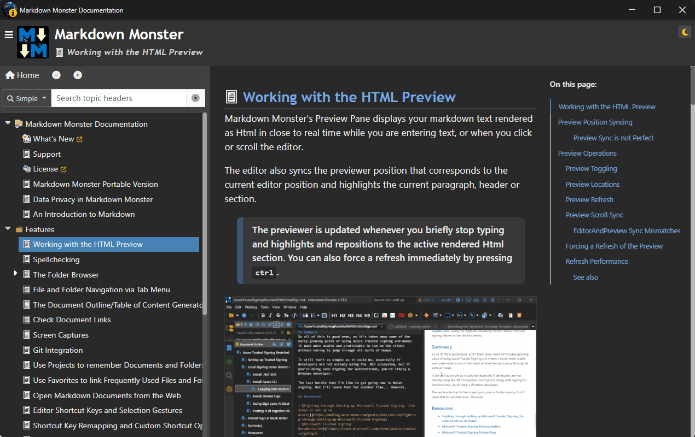
<small>**Figure 2** - The Documentation Monster Web Viewer packages the generated Html Web site into a single Exe that can be run offline.</small>

You can see what that looks like [here](https://markdownmonster.west-wind.com/docs/MarkdownMonster-Documentation-Viewer.exe).  
<small>*(you might get a SmartScreen warning - more on that in a minute)*</small>

> This tool isn't limited to documentation however. In theory you can use it for any static Html Web site that you want to publish. This can be some other document only Web site, it could be a React, Vue, Angular app, it could be a Blazor WASM app - anything that can run off static Html basically.
>
> For publishing a full application I actually think tools like [Photino](https://www.tryphotino.io/) or [InfiniFrame](https://github.com/InfiniLore/InfiniFrame) provide a more complete **application centric packaging solution** that also have cross-platform support. OTOH, these tools also require more setup and aren't a generic, 'just do it' tool like `WebPackageViewer.exe`, so they a target a different use case.

## How does the Web Packaging work?
What you're looking at in **Figure 2** is a Web site that's launched off a single file Exe shell: The large single file Exe bundles both the executable and the entire zipped up Web site. The packaged Exe then serves both as an unpackager and viewer, running the unpackager first and then launching the viewer using the same executable.

When it runs, the Exe unpackages the embedded Zip file data into a temporary folder, copies the Exe (*ie. itself!*) into that folder and then relaunches itself in that folder to run the Web Site from that folder. When the app shuts down the temp folder is deleted.

The Exe itself is implemented using a Windows WPF application with a full screen WebView control and uses **virtual folder hosting** rather than an actual Http server to 'run' the Web site in the internal WebView browser. Virtual folder hosting eliminates the potential security issues around local port assignment or exposing an Http endpoint locally. 

The Viewer application behaves just as it would inside of a browser, but there's no address bar, menus and widgets and so, it's only the raw Web browser.

Unlike a PDF or Html export, you get a fully interactive site that allows for search and navigation the same way as the online Web site but it works completely locally and offline if needed.

Cool! All of this works smoothly... but, and there's always a butt... 😂

## The Fly in the Oinment: Windows SmartScreen
This is where the stupid pet tricks part kicks in: When you download an arbitrary Exe from the Internet, Windows security gets real dodgy and wants to protect you:

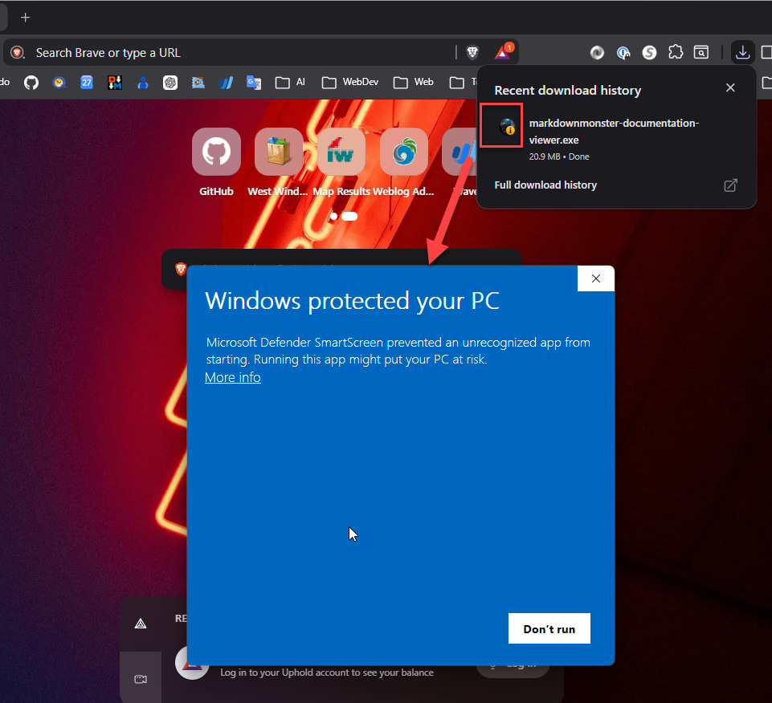 
<small>**Figure 3** - Downloading the Documentation Exe comes with warnings!</small>

This is not unexpected as **Windows Defender Smartscreen** essentially flags any unsigned, downloaded binary or a binary embedded in a downloaded archive as possibly suspect code. It is possible to bypass SmartScreen by clicking **More info** and then **Run anyway** but it's not exactly a smooth user experience to scare users with a blue screen of doom.

> You can help your chances of not getting a SmartScreen dialog by signing the final executable generated, but unless you're a software developer that already is publishing and signing binary distributions, it's unfortunately not a common thing to have available, nor is the process of setting up a certificate for signing especially simple. But, if you have a certificate and process to sign - you should definitely use it on any generated Exe.

The security problems are two-fold: 

* **The downloaded Exe is not signed**  
Unsigned downloaded or Zip file downloaded Exe's are **always** flagged by Windows SmartScreen. Because the file is generated generically signing is not an option, and...

* **Reputation is going to be low**  
SmartScreen works of install reputation, and a custom generated file is unlikely to gain real download and install traction to improve SmartScreen reputation. So even a signed executable - although better - is likely to still show the SmartScreen dialog.

Unfortunately there are no real solutions around this that I could find other than to warn users of the issue and prepare them for bypassing the SmartScreen dialog.

### Local Installs are Fine
Note that SmartScreen mostly affects **downloaded files** and does not kick in if you install an executable as part of an application install. SmartScreen triggers mostly of MOTW (Mark of the Web), so if you install the Exe via a local installer then there's no MOTW on the Exe and SmartScreen most likely won't be a problem (it can still be based on policy or many failures but that's more rare).

Bottom line: If you plan on downloading these generated packaged Web Viewers you'll likely have to deal with SmartScreen. 

## Exe Packaging in .NET
FWIW, I was aware of the SmartScreen issue before I started building the packager - mostly because I thought it would be easy to build the packager and for the few people that always pester about offline documentation they would probably be willing to deal with the SmartScreen issue.

What I ended up building is `WebPackageViewer.exe` which is a generic tool to package WebPackageViewer and a data package into a single Exe. The viewer includes a Web UI application that handles unpacking the data content and then running the Web site inside of the WebView.

There are two parts to this application:

* The Packager/Unpackager CLI Tool
* The WebViewer UI application

### CLI Mode
In CLI mode you can create a package by running `WebPackageViewer.exe` like this:

```ps
.\webPackageViewer.exe package  `
		--output .\MarkdownMonster-Docs-Viewer.exe `
		--zipfolder "c:\Web Sites\markdownmonster.west-wind.com" 
```

Here's what that looks like:

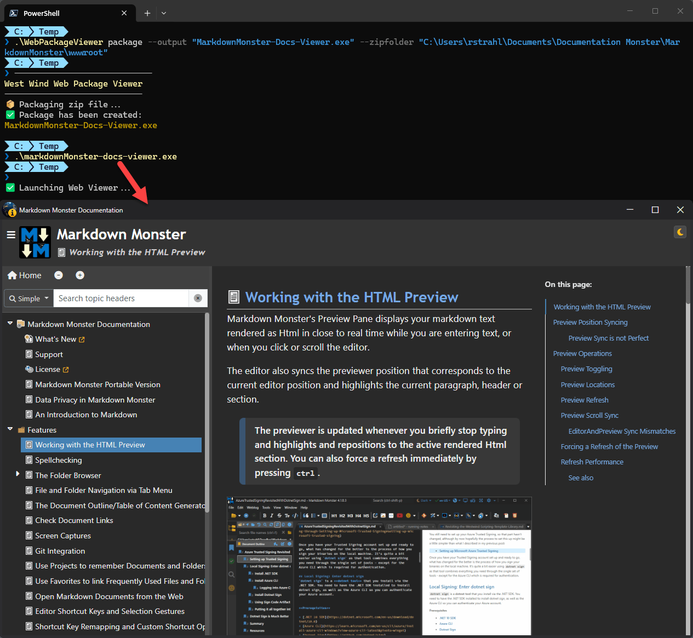  
<small>**Figure 4** - Using the Packager to create a self-contained Exe</small>

This generates a single file Exe:

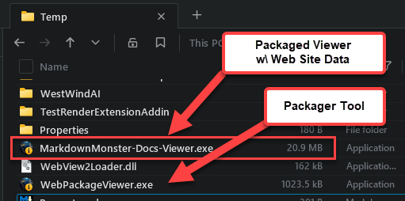  
<small>**Figure 5** - The generated output file can be fairly large as it contains all the Zipped up Web site Html and support assets. The packager is relatively small.</small>

The base executable `WebViewPackager.exe` can also be used as a standalone static Web site viewer by running the EXE out of a  folder with Html files. By default it looks for `index.html` and if it exists displays that in the internal browser.

There are a number of command line options that let you customize packaging and the viewer's behavior:

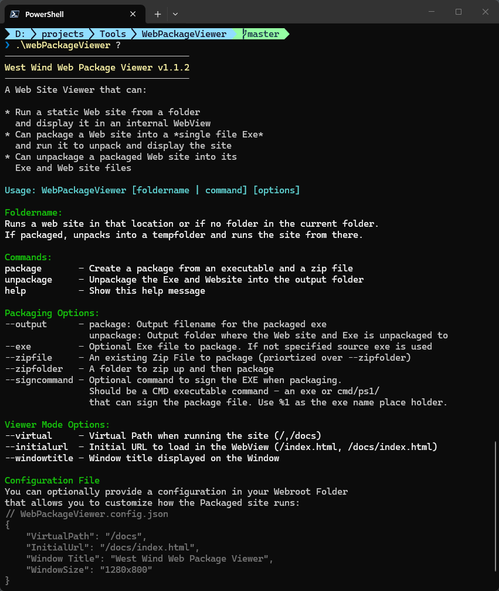
<small>**Figure 6** - Command line options for the packager, unpackager, and viewer</small>

##AD## 

## Implementation in .NET
At the outset I mentioned that I thought this would be a quickie project and the the first run of it ended up being pretty simple. But the devil is in the details and there are lot of little gotchas to watch out for that I didn't run into until I started publishing a few documentation sites.

### How it works
The main premise of this tool is the packaging of the Exe with both the main executable as well as the Web site data which lives in a zip file.

#### .NET Framework Executable
The first thing about this project is that it's a .NET Framework project rather than a .NET Core project. The reason for this is to create a tiny self-contained Executable for the application that has no framework dependence and - using Windows WPF in this case. .NET Core Single File AOT compilation produces large files when frameworks get involved and wouldn't work with WPF anyway - so in this case I specifically chose .NET framework since it's available on all semi-modern Windows versions in use.

#### Exe File Packaging
A Windows Exe file contains a PE header that describes the EXE and its length. When the Exe loads it loads the expected file size into memory. There's a lot more to this, but I'm simplifying to what's relevant here. You can however append more data to the end of the Exe file by simply writing more data after the Exe's data stream using standard file writing APIs. After you do this the Exe still works, but the Exe file now contains additional data that you can access.

> Note if an Exe is Authenticode signed, and you append data to it you'll break the validity of the signature. For this reason the original `WebPackagerViewer.exe` is provided in both signed and unsigned versions. `-unsigned.exe` for packaging, and the signed version for running as a drop in Web Site viewer.
s
To make this work, the trick is to write a marker into the binary data that separates the original binary Exe file data and the added content which in this case will be a zip file of the Web site.

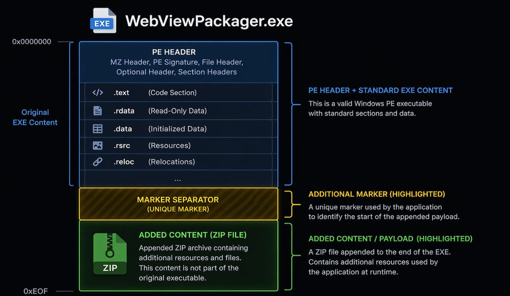  
<small>**Figure 7** - Packaging an Exe with an additional payload of a Zip file</small>

#### Build First using `package` Command
To build the package you use the CLI tooling I showed earlier using the `package` command. 

```ps
.\webPackageViewer.exe package  `
		--output .\MarkdownMonster-Docs-Viewer.exe `
		--zipfolder "c:\Web Sites\markdownmonster.west-wind.com" 
```

This creates a packaged Exe that contains the zip file data.

Alternately you can also explicitly create a Zip file using the `--zipfile` parameter and then attach it to the exe instead. The latter is what Documentation Monster does: It creates a custom zip file that includes a few additional files that don't exist in the original Web site folder that is packaged up. It then uses that zip file as input. 

#### Launching the Packaged Exe triggers unpacking
Once the packaged Exe has been created, launching it now unpacks the attached Zip file, and copies the Exe to a temporary folder. The original exe then launches the copied Exe in the now unpacked Web Folder and shuts itself down. 

#### The Exe is Re-Launched in the Web Folder
The Exe in the unpacked folder knows that it's running in an unpacked directory, and now fires up the UI interface to display the Webview control.

#### WebView uses Manual Handling for Https Urls
The WebView control then uses local Web resource request and navigation events to capture content load operations and serves images from the local folder using a form of virtual folder mapping.

This means the viewer application doesn't use a Web Server, but rather uses a form of virtual file mapping to execute requests locally. 

The WebView2 Control supports a built-in virtual folder mapping, but unfortunately I couldn't use that due to the requirement that previewer has to support virtual subfolders (ie. the base Url running out `/docs/` instead of root `/`). The WebView virtual hosting feature has no support for auto-routing to a sub-folder base Url and so the file translation in a virtual folder doesn't work right.
  
So instead, I ended up having to manually intercept the Navigation events to re-route virtual folder access, and then handle the resource loading manually. Sounds complicated but it turned out to be a surprisingly easy implementation.

You can take a look at how this works on in the source [code on GitHub](https://github.com/RickStrahl/WebPackageViewer/blob/50cde3b2705c46a945566bde0e27030cd7f2b7da/WebPackageViewer/MainWindow.xaml.cs#L57).

#### File Packaging and Unpackaging
The code to package a file and unpackage it is also relatively simple.


###### Creating the Exe and Zip Package
Assuming the Zip file has been created - either externally or letting the packager do it - to write out the packaged Exe, here's the logic that writes out the combined exe and data package executable:

```csharp
if (first == "package")
{
    ConsoleHelper.WriteWrappedHeader("West Wind Web Package Viewer");
    Console.WriteLine("📦 Packaging zip file...");

    string zipFile = ZipFilename;

    var pack = new FilePackager();
    if (!string.IsNullOrEmpty(ZipFolder))
    {
        zipFile = pack.ZipFolder(ZipFolder);
        if (zipFile == null)
        {
            Console.WriteLine("❌ Error creating Zip file for package: " + pack.ErrorMessage);
            return;
        }
    }

    if (!pack.PackageFile(Path.GetFullPath(OutputPath),
        Path.GetFullPath(ExeFile),
        Path.GetFullPath(zipFile)))
    {
        Console.WriteLine("❌ Error creating package: " + pack.ErrorMessage);
        return;
    }
    Console.WriteLine("✅ Package has been created:");
    ColorConsole.WriteLine(OutputPath, ConsoleColor.DarkYellow);
    return;
}
```

If you use the command like with the `package` command and the `--zipfolder` parameter, the given folder is directly written into a Zip file using the `ZipFile` class. Remember this is a .NET Framework executable so we have to stick to the older more limited implementation that doesn't have a lot of options, so I grab all files first, then add some additional files.

The actual packaging is also straight forward:

```csharp
public bool PackageFile(string packageFilename, string exeFilename, string dataFilename)
{  
	...
	
    if (File.Exists(packageFilename))           
        File.Delete(packageFilename);

    using (var outFs = new FileStream(packageFilename, FileMode.Create, FileAccess.Write))
    {
        using (var fs = new FileStream(exeFilename, FileMode.Open, FileAccess.Read, FileShare.Read))
        {
            fs.CopyTo(outFs);
            outFs.Flush();
            outFs.Write(SeparatorBytes, 0, SeparatorBytes.Length);
        };
        using (var fs = new FileStream(dataFilename, FileMode.Open, FileAccess.Read, FileShare.Read))
        {
            fs.CopyTo(outFs);
        }
    }
 
    // optionally sign the new exe
    if (!string.IsNullOrEmpty(App.CommandLine.SignCommand))
    {
        var cmd = App.CommandLine.SignCommand.Replace("%1", "\"" + packageFilename + "\"");
        try
        {
            ExecuteCommandLine(cmd, Path.GetDirectoryName(packageFilename), useShellExecute: false);
        }
        catch {}
    }
    return true;
}
```

The code creates a new binary file stream and then simple writes first the original Exe, then the marker string as bytes, and finally the zip file. 

If you have a certificate the `--signcommand` allows invoking of a .cmd script (I use a .cmd script that calls a Powershell script because invoking `pwsh` via string parameter arg values is insane!). Signing will help at least to some extent with SmartScreen.

The packager code is contained in a [self-contained FilePackager class](https://github.com/RickStrahl/WebPackageViewer/blob/50cde3b2705c46a945566bde0e27030cd7f2b7da/WebPackageViewer/FilePackager.cs#L17) that is easily re-usable in your own applications for similar tasking.

##### Unpackaging the Packaged Exe into Exe and Zipfile
Once the Exe has been created can then be unpackaged either by a packaged Exe 'running itself' and launching the Viewer, or explicitly unpacking the Exe into its components using the CLI:

```ps
.\WebPackageViewer unpackage `
      --package .\WebViewer-Packaged.exe 
      --output .\DocMonsterDocs
```

This creates the folder containing the entire Zip file of Html files unzipped along with the unpackaged `WebViewPackager.exe` file that you can run out of that folder to run the Web site.

> Note: If the folder already exists, the unpackaging fails to avoid overwriting or wiping out data accidentally. If you need to replace existing content, delete the target folder first.

#### Creating a Single Exe and 'Packaging' a Native Dependency
The `WebPackageViewer.exe` is compiled down into a single file exe. But the actual application does have a few dependencies, so the actual build output looks like this:

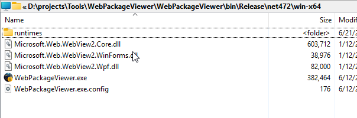  
<small>**Figure 8** - Build Output from WebView Packager - more than a single file.</small>

In order to package up the file into a single EXE a few things need to happen.

* Run an IL Merge tool to combined the external assemblies
* Package up CoreWebView2.dll as a Resource to manually extract at runtime

.NET has support for creating a single executable from many package using a tool called ILMerge. Unfortunately that particular tool doesn't work with WPF applications due to the way it packages resources. However, there's a replacement for ILMerge called [ILRepack](https://github.com/gluck/il-repack) that is updated to support a number of situations like WPF that ILMerge can't handle.

Using ILRepack, I take the built assembly output and package it down to a single Exe with this Powershell script:

```powershell
# uses IlRepack (dotnet tool)
Set-Location "$PSScriptRoot" 
$release = "$PSScriptRoot\..\WebPackageViewer\bin\Release\net472\win-x64"
Write-Host $release
remove-item $release\*.pdb

$windir = $env:windir
$platform = "v4,$windir\Microsoft.NET\Framework64\v4.0.30319"

$version = [System.Diagnostics.FileVersionInfo]::GetVersionInfo("$release\WebPackageViewer.exe").FileVersion
$version = $version.Trim()
$originalVersion = $version
"Initial Version: " + $version

# Remove last two .0 version tuples if it's 0
if($version.EndsWith(".0.0")) {
    $version = $version.SubString(0,$version.Length - 4);
}
else {
    if($version.EndsWith(".0")) {    
        $version = $version.SubString(0,$version.Length - 2);
    }
}
"Truncated Version: " + $version

# dotnet tool install --global dotnet-ilrepack
# Merge Dlls into single EXE - missing WebView2Loader.dll - has to be manually copied
$ilRepackArgs = @(
    '/target:winexe'
    "/targetplatform:$platform"
    "/ver:$originalVersion"
    '/lib:.'
    '/lib:C:\Windows\Microsoft.NET\Framework64\v4.0.30319'
    '/lib:C:\Windows\Microsoft.NET\Framework64\v4.0.30319\WPF'
    '/out:..\WebPackageViewer.exe'
    "$release\WebPackageViewer.exe"
    "$release\Microsoft.Web.WebView2.Core.dll"
    "$release\Microsoft.Web.WebView2.Wpf.dll"
)

Write-Host "------------- IL Repack Arguments -------------"
Write-Host ($ilRepackArgs -join ' ')
Write-Host "-----------------------------------------------"

& ilrepack @ilRepackArgs

remove-item ../WebPackageViewer.exe.config

# copy unsigned copy
copy ../WebPackageViewer.exe ../WebPackageViewer-Unsigned.exe
copy ../WebPackageViewer.exe "\projects\DocumentationMonster\DocumentationMonster\BinSupport\WebPackageViewer.exe"

# sign with my signing script
& ".\signfile.ps1" -file "..\WebPackageViewer.exe"

exit 0
```

This creates both a signed and unsigned version of the packager. The signed version can be used to run packager as Web Site viewer by dropping it into a Web site folder, or running with the folder as a parameter. 

```ps
# If in the Web site directory (or from Explorer in dir)
.\WebPackageViewer 

# with folder
.\WebPackageViewer "c:\Web Sites\markdownmonster.west-wind.com\docs"
```

ILRepack solves the issue of packaging the .NET assemblies. If you look back at **Figure 8** you'll see the `runtimes` folder which contains native dependencies for `CoreWebView2Loader.dll`. 

ILRepack **cannot package** any native dependencies so it's not included in the list of dependencies on the ILRepack arguments list.

Instead, the WebSitePackager project, embeds `CoreWebView2Loader.dll` as a project resource:

```xml
<ItemGroup>
	<Resource Include="WebPackageViewer.ico" />
	<Resource Include="webview2loader.dll" />
</ItemGroup>
```

which - in a WPF project - gets embedded into a special resource:

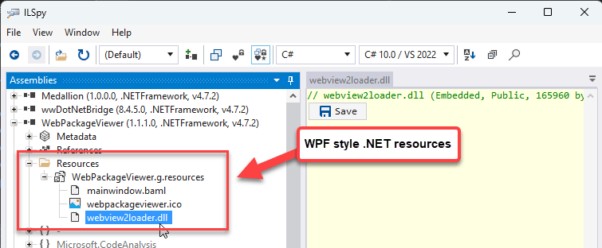  
<small>**Figure 9** - The native `CoreWebView2Loader.dll` is embedded as a .NET resource into the built exe so we can extract it at runtime.</small>

WPF resources are not quite like normal .NET resources and you can't simply retrieve resources by accessing the ResourceStream and querying for a value by name. Instead WPF stores all resources in a single resource dictionary that you have to iterate over.

Here's what that looks like:

```csharp
public static class ResourceHelper
{
    /// <summary>
    /// Retrieve WebView2Loader.dll which we can't embed into the exe
    /// directly with ILMerge.
    /// </summary>
    /// <returns></returns>
    /// <exception cref="FileNotFoundException"></exception>
    public static byte[] LoadWebView2LoaderBytes()
    {
        var asm = typeof(ResourceHelper).Assembly;

        using var resStream =
            asm.GetManifestResourceStream("WebPackageViewer.g.resources");

        if (resStream == null)
            throw new FileNotFoundException("WebPackageViewer.g.resources not found.");

        using var reader = new ResourceReader(resStream);

        foreach (DictionaryEntry entry in reader)
        {
            if ((string)entry.Key == "webview2loader.dll")
            {
                using var stream = (Stream)entry.Value;
                using var ms = new MemoryStream();
                stream.CopyTo(ms);
                return ms.ToArray();
            }
        }

        throw new FileNotFoundException("WebPackageViewer.g.resources not found.");
    }
}
```

So then when the app is running in Viewer mode, we extract the file and dump it out to disk in the same folder as the Exe. 

```csharp
if (!File.Exists("WebView2Loader.dll"))
{
    // If the loader is not present, we may be running from a single file bundle and need to unpack first
    try
    {
        var loaderBytes = ResourceHelper.LoadWebView2LoaderBytes();
        File.WriteAllBytes("WebView2Loader.dll", loaderBytes);
    }
    catch
    {
        MessageBox.Show(
            """
            An error occurred unpacking the WebView2Loader.dll resource.

            Make sure the application is not running from a read-only location and that you have permissions to write to the current directory.

            Alternately manually copy `WebView2Loader.dll` from the same folder as the WebPackageViewer.exe to the current directory and restart the application.`
            """,
            "Web Viewer Error", MessageBoxButton.OK, MessageBoxImage.Exclamation);
        Environment.Exit(1);
    }
}

MainWindow mainWindow = new MainWindow(config);
mainWindow.Show();
```

> ##### @icon-info-circle Runtime CoreWebView2Loader.dll Copy
> Doing this type of load and copy operation at runtime **requires file write permissions** in the same folder you're running `WebPackageViewer.exe` or the generated Packaged Exe file out of. If you don't have permissions the app will fail.
>
> Copying a DLL to disk at runtime is also something that Anti-Virus tends to frown upon, but because `CoreWebView2Loader.dll` is a well-known Dll I have not actually seen this causing problems. Hyper-sensitive 3rd party AV may think differently though than my base Defender setup. 
> Worst case scenario you can do this once running as Administrator - once the DLL exists it's not copied again.

### User Interface Creation
The user interface of the WebPackageViewer is very simple - it's a form with a WebView on it basically. Initially the form was a basic WPF form with literally nothing else on it.

But if you look closely at the image in **Figure 2** again you'll notice that the window is not actually a standard WPF window, but rather a dark mode Fluent UI type of window.

I was unaware that WPF actually has some built in support for creating self-drawn windows using `System.Windows.Shell` integration.

```xml
<shell:WindowChrome.WindowChrome>
    <shell:WindowChrome
        UseAeroCaptionButtons="False"
        CaptionHeight="32"
        ResizeBorderThickness="4"
        GlassFrameThickness="0"
        CornerRadius="12"/>
</shell:WindowChrome.WindowChrome>
```

With the help of CoPilot I managed to make the window theme aware supporting both light and dark mode frames. However, getting that all to work - even with CoPilot on some of the higher end models - took **a lot** of back and forth. Once you take over the Window rendering yourself a lot of functionality has to be reimplemented. You can see the end result in [MainWindow.xaml on GitHub](https://github.com/RickStrahl/WebPackageViewer/blob/master/WebPackageViewer/MainWindow.xaml). Normally I would use a framework library like [MahApps](https://mahapps.com/) or [ControlzEx](https://github.com/ControlzEx/ControlzEx) but that would have added yet another set of dependencies resulting in a larger base Exe yet, so this tedious Window implementation was worth the extra effort.

### Console and WPF UI from a single Exe
The app supports two modes:

* CLI Mode for packaging and manual unpacking
* WPF UI Mode for viewing the Help File

Windows doesn't have direct support for 'mixed mode' executables - they are either marked as Command line or Windows UI applications. In order to make the UI bit work the application is compiled as a Windows UI application.

However, you can still provide output to the Console but it requires some extra work, and the result is typically not very clean due to the way that the UI application handles termination and wait states.

A desktop application can attach to a Console **if the application is launched from a Console command line** using `AllocConsole()` and `FreeConsole()` PInvoke calls:

```csharp
[DllImport("kernel32.dll", SetLastError = true)]
    static extern bool FreeConsole();

[DllImport("kernel32.dll", SetLastError = true)]
static extern bool AttachConsole(int dwProcessId);
```

You can then attach to the 'default' console if one is available when the app starts and free the console when it's done.


```csharp
protected override void OnStartup(StartupEventArgs e)
{
    
    bool attached  = AttachConsole(-1);

	// Processes command line operations
	// which all output to CLI
    CommandLine.Parse();

    if (!CommandLine.Unhandled)
    {
        if (attached)
            FreeConsole();
            
        // If Command Line is handled, exit the application
        Environment.Exit(0);
    }

    // unhandled: unpackage Web site for Viewer mode
    var pack = new FilePackager();
    var exeFile = Assembly.GetExecutingAssembly().Location;
    
    if (pack.FindMarkerOffset(exeFile, pack.SeparatorBytes) > 0)
    {
        var outputPath = Path.Combine(Path.GetTempPath(), "dm_" + StringUtils.GenerateUniqueId(8));                
        TempUnpackDirectory = outputPath;
        
        if (!pack.UnpackageFile(exeFile, outputPath, true))
        {
            if (!attached)
            {
                MessageBox.Show("An error occurred unpacking the viewer app and Web site.\n" +
                                pack.ErrorMessage, "Web Viewer Error", MessageBoxButton.OK,
                    MessageBoxImage.Exclamation);
            }
            else
                Console.WriteLine("\n❌ Error:\n" + pack.ErrorMessage);

            Environment.Exit(1);
        }
        Environment.CurrentDirectory = outputPath;

        var exe = Path.Combine(outputPath, "WebPackageViewer.exe");
        var p = Process.Start(new ProcessStartInfo() { FileName = exe, WorkingDirectory = outputPath });

        Console.Write("\n✅ Launching Web Viewer...");

        if (attached)
            FreeConsole();

        Environment.Exit(0);
    }

    InitialStartDirectory = AppContext.BaseDirectory.TrimEnd('/');
    InitialUserStartedDirectory = Environment.CurrentDirectory;

    // Read configuration from Json and override with explicit values passed
    var config = WebViewerConfiguration.Read();
        
    if (attached)
        FreeConsole();
        
    MainWindow mainWindow = new MainWindow(config);
    mainWindow.Show();
    
   ...
```

The code attaches the console and if started from the Powershell or Command the `AttachConsole(-1)` call returns `true`. At that point `Console.Write()` now outputs to the existing console window instance.

Then when done `FreeConsole()` has to be called to release the Console and return control back to the console instance.

While this works, the Console behavior can be a bit quirky:

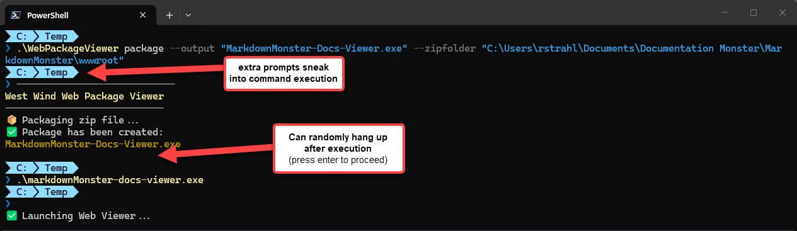  
<small>**Figure 9** - Console output in a UI compiled application can be a little awkward.</small>

Not really sure what causes this behavior of prompts popping up in the middle of output and on occasion the final operation 'hanging' without a prompt as if you were call ReadKey(). Often also the terminal completes not at the last prompt but the one above it.

I'm not sure what causes this but it seems its a timeout of some sort - new prompts appear when operations take a bit of time like the packager on a large project for example. 

It's not pretty, but for the most part it works and displays what you need to know. More often than not a `cls` is required to clean up the Console after the operation has completed.  It's not ideal, but still worth having compared to having to build a separate UI form to display the same information.

> I ended up implementing a fix for this by creating the application as a Console app and manually launching the WPF application. This allows Console access normally - including from the WPF interface. I'll have another post about that in the next days.

##AD## 

#### Woof: Simple but not Simple
At the end of the day I got what I was looking for packaging Web Content into a single executable as well as - as a side effect - getting a simple small executable that lets me also run static sites locally simply by dropping an exe into the folder.

While there are other more sophisticated tools to run Web sites locally - like my own [LiveReloadServer](https://github.com/RickStrahl/LiveReloadServer) - having a small and truly offline viewer is still something that quite a few people are asking for in documentation solutions. I guess some people are still dreaming of the old days of Help and CHM files. :smile:

Interestingly enough I started the original planning for this with CoPilot and the original Ask and Plan Mode interactions actually convinced me to even bother with this edge case tool, because it seemed pretty straight forward. But, as is usually the case, the initial AI implementation underwent nearly a complete re-write to work properly to fix the remain 20% that were missing or simply didn't work quite right.

This seems to echo my experience with AI - I have never had LLMs deliver something that is ready to put into production. It's awesome at building a skeleton and base functionality, but I always end up spending much more time cleaning up and fixing the edge cases that aren't obvious. This isn't a criticism BTW - it feels more like working with somebody interactively through the problem rather than letting them solve the problem entirely which is not a bad thing at all. This was certainly not one-shotting, and not even a half and half collaboration, but more like a hit or miss consultation :smile:

Creation of this tooling isn't rocket science obviously, but the road to creating something like this is paved with lots of paper cuts resulting in eating up a lot more time than planned!

As I mentioned - this tool serves an edge case that is highly useful to me for several use cases, but I think there are lots of parts to this implementation that can be applied to other scenarios. EXE packaging, ILMerging, Resource hosting of executable code offer some interesting possibilities for shipping self-contained code. Some of you may find value in this.

## Resources

* [WebPackageViewer on GitHub](https://github.com/RickStrahl/WebPackageViewer)
* [SmartScreen: Windows Protected your PC: Dealing with Windows SmartScreen on Installation](https://markdownmonster.west-wind.com/blog/posts/2026/Jun/01/Windows-Protected-your-PC-Dealing-with-Windows-SmartScreen-on-Installation)
* [InifiniFrame - Web Application Wrapper](https://github.com/InfiniLore/InfiniFrame) 


<div style="margin-top: 30px;font-size: 0.8em;
            border-top: 1px solid #eee;padding-top: 8px;">
    
    this post was created and published with the 
    <a href="https://markdownmonster.west-wind.com" 
       target="top">Markdown Monster Editor</a> 
</div>