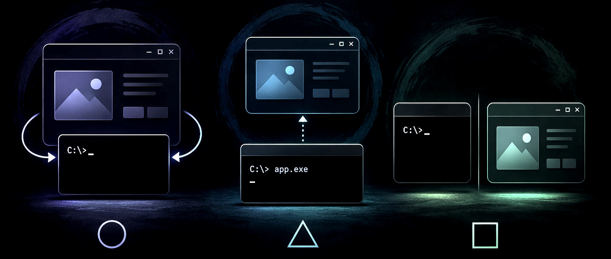
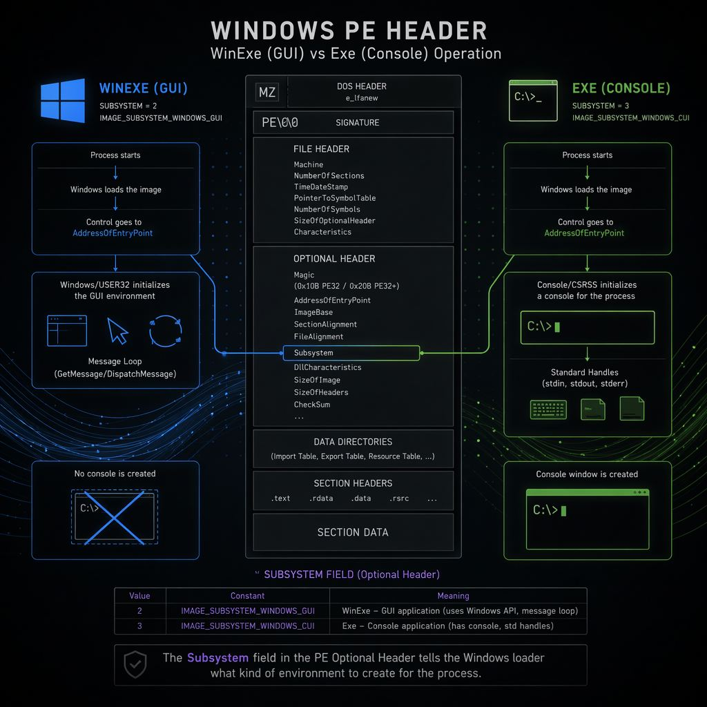
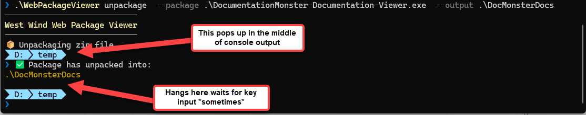
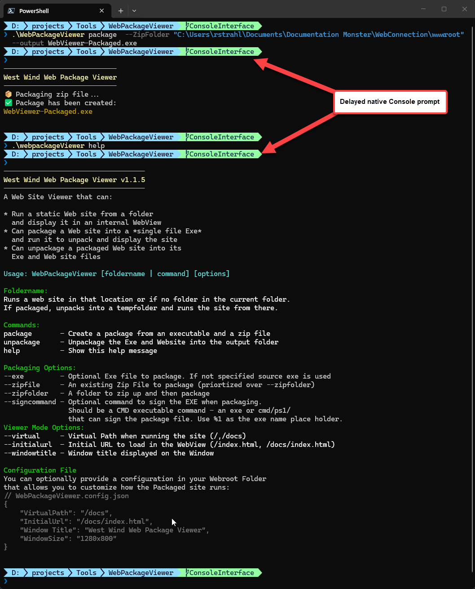
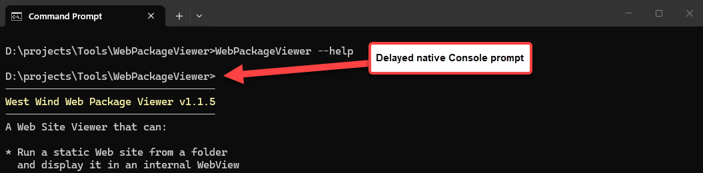
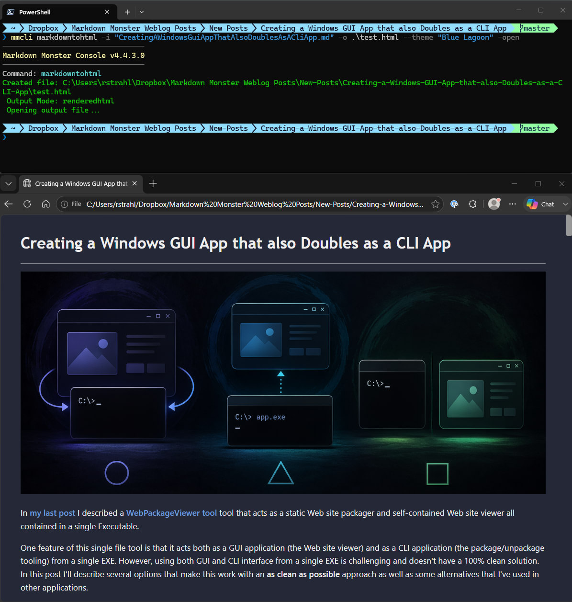
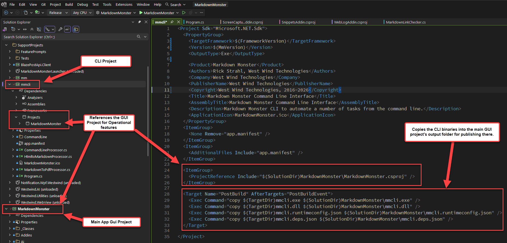

# Creating a Windows GUI App that also Doubles as a CLI App



In [my last post](https://weblog.west-wind.com/posts/2026/Jun/13/Creating-a-Packaged-Single-File-Web-Site-Viewer-Executable) I described a [WebPackageViewer tool](https://github.com/RickStrahl/WebPackageViewer) tool that acts as a static Web site packager and self-contained Web site viewer all contained in a single Executable.

One feature of this single file tool is that it acts both as a GUI application (the Web site viewer) and as a CLI application (the package/unpackage tooling) from a single EXE. However, using both GUI and CLI interface from a single EXE is challenging and doesn't have a 100% clean solution. In this post I'll describe several options that make this dual mode operation work with an **as clean as possible** approach, as well as some alternatives that I've used in other applications.

If you think this is an off the wall concept, all of my commercial desktop applications [Markdown Monster](https://markdownmonster.west-wind.com), [WebSurge](https://websurge.west-wind.com) and [Documentation Monster](https://documentationmonster.com) have a support CLI for exposing common functionality in a scriptable way. But... in all of these latter cases I actually chose a different approach of using separate EXEs for the GUI app and CLI app with the CLI app driving the GUI app features. It's a very different use case than the simple single Exe WebPackager tool and it works well for full fledged applications that expose a CLI. 

## CLI Interfaces
In this post I'll discuss 3 different approaches. None of them are what I would consider perfect, which would be if Windows simply supported some way to cleanly service both GUI and Console apps from a single Exe.

But alas, it's Windows so we have to live with trade-offs. Here are the three I'll discuss:

* Create a GUI application with a Console interface
* Create a Console Application and launch GUI from Console
* Create separate CLI and GUI applications with shared functionality

I've used all of these approaches now at some point or another, and it depends on the type of application or tool that you're building which makes the most sense.

##AD##

### GUI Application with CLI Interface Option
Mixed mode GUI app that also supports CLI output is the most tricky of these approaches, because Windows makes this sort of thing difficult with **choose-one-or-the-other** situation. It's also the most likely situation you're going to find yourself in when you build a GUI app and then later decide that it would be nice to add some CLI functionality. 

When you build a Windows .NET application (or any Windows application for that matter) you havet to specify whether it's a `WinExe` (GUI) or `Exe` (Console) application. The type of app is written into the PE header when the EXE is created.

In .NET you can specify this in the project's header:

```xml
<Project Sdk="Microsoft.NET.Sdk">
	<PropertyGroup>
		<!-- Windows GUI app - Exe for Console -->
		<OutputType>WinExe</OutputType>
		
		<TargetFramework>net472</TargetFramework>
		<UseWPF>true</UseWPF>
		<Version>1.1.5.2</Version>
```

This affects the **SubSystem** value of the Windows PE header that gets generated into Windows Exes:


<small>**Figure 1** - GUI and Console apps have different startup semantics in how they related to Consoles that are attached or loaded based on the SubSystem value in the PE header.</small>

When you launch as a Console application a new Console is started if none is active. That's when you invoke via the Windows shell or Explorer. If launched from an existing Console in the Terminal the Console app attaches to the existing Console and pipes output into it including all the Console streams (Input/Output/Error).

When you launch a GUI app from the shell, no Console is launched, so by default there's no Console - the Console points at a null console if you write to it and that output goes nowhere.

Where it gets weird is if you launch a GUI app from a Console, and you then write to the console which is the exact scenario that I'm using in **WebPackageViewer**.

By default the launching Console and the GUI exe are not connected and so by default Console input and output are still not going anywhere. However, it's possible to attach to an existing Console using  a native `AttachConsole()` call from a GUI application when the application starts up, which effectively allows your GUI application to send Console output and input to and from the console.

You can use the following two P/Invoke calls (on Windows) to attach and release the Console:

```cs     
[DllImport("kernel32.dll", SetLastError = true)]
static extern bool FreeConsole();

[DllImport("kernel32.dll", SetLastError = true)]
static extern bool AttachConsole(int dwProcessId);
```

Then as part of your application's startup code you can attach the Console:

```csharp
protected override void OnStartup(StartupEventArgs e)
{
    bool attached = AttachConsole(-1);  // -1 - active console
    ...
     
    if (attached)
		Console.Write("\n✅ Launching Web Viewer...");
	
	...
	
	// when done
	if(attached)
		FreeConsole();
```

This sorta works. 

The problem is that Console output goes into the active console that the application was started from, but if the application runs for any sort of duration, the console output gets mixed up with the existing prompt:

  
<small>**Figure 2** - Console Fail - In a GUI Application you can attach to a console, but the output gets very janky and the Console doesn't always return to the prompt after completion</small>

The reason for this is that a console launched GUI application **returns almost immediately to the console** while the GUI app continues running in the background. The end result is that you get a new prompt that appears to be mixed into your Console output.

Depending on where the prompt occurs, it looks like the existing console's prompt is now overwriting your  content, but really the prompt is left behind while your output continued into no-man's land. It displays but no longer related to the now active prompt.

Furthermore, once the native prompt has completed if you call `FreeConsole()` the console has now *lost the prompt* and essentially hangs until you press a key. While it looks like the prompt is lost, what's really happening is that the cursor appears to be at the end of the output, but the actual prompt is the prompt above in the middle of the Console output.

Yeah, it's bloody mess!

To fix this somewhat I use a helper to release the console rather than just calling `FreeConsole()`:

```csharp
[DllImport("user32.dll")] static extern void keybd_event(byte bVk, byte bScan, uint dwFlags, nuint dwExtraInfo);

const byte VK_RETURN = 0x0D;

static void ReleaseConsolePrompt()
{
    Console.WriteLine();  // force another line break so that the prompt is on a new line
    FreeConsole();
    
    // force a CR into the console
    keybd_event(VK_RETURN, 0, 0, 0);         // key down
    keybd_event(VK_RETURN, 0, 0x0002, 0);    // key up (KEYEVENTF_KEYUP)
}
```

which ends up showing a new prompt at the bottom with the cursor at the active new prompt!

#### Can you live with it?
In a pinch, this sort of funky output works for internal applications where you have a very short output, but for a commercial tool or something that has a lot of output that takes a bit to run, that's not really an option as it just looks like shit.

What's annoying is that the behavior of the prompt can vary. I can run the same command multiple times and sometimes it'll get interrupted by the prompt, sometimes not. If your app's CLI commands run very fast within a few milliseconds you can preempt the console prompt interference. If it's very slow you can be sure it'll show up in an unexpected location.

For some applications that only occasionally use the CLI or that are driven via automation this may not matter and is acceptable. It's the easiest path of providing a CLI interface to a GUI application and may just be **Good Enough**.

#### Hackery!
For slight performance trade off you can make this a little better by essentially **forcing the Console to show the new prompt immediately** by waiting for a brief period with `Thread.Sleep()`. The idle cycle in the app makes the Console show a new, second prompt immediately.

The idea is that you preemptively force the Console to show a new prompt so it doesn't overwrite your Console output in the middle of your content.

So in `WebPackageViewer` I do this:

```csharp
protected override void OnStartup(StartupEventArgs e)
{            
    IsConsoleApp =  AttachConsole(-1);
    if (IsConsoleApp)
    {
        // delay slightly to let existing prompt finish and then show our prompt
        System.Threading.Thread.Sleep(20);
        
        // Insert a line to clear the > prompt
        Console.WriteLine();
    }
```

Here's what that looks like in PowerShell with a custom OhMyPosh prompt:

  
 <small>**Figure 3** - A GUI app with Console output that delays slightly to force the completing existing Console prompt to display immediately, which avoids overwriting our Console output.</small>

Here's what it looks like in a plain Command prompt:

  
<small>**Figure 4** - Plain Command Prompt with the same delayed Console display. </small>


If you look close you see the original Console prompt finish, and **then** our actual Console output is displayed. I added an extra `Console.WriteLine()` into the code to skip down over the prompt line (`>`).

Is that perfect? No, but it looks a lot cleaner than having the prompt injected in the middle, or weird line breaks showing up in your Console output. While we still can't avoid the extra prompt, at least now it's in a predictable location at the very top where it's not interfering with our Console content. And if you don't pay close attention you may not even notice that it's happening... 😉 

If you want to see this all working together you can take a look in [`App.xaml.cs` in the  WebPackageViewer project](https://github.com/RickStrahl/WebPackageViewer).

#### Is Console Interface Important?
When building CLI tools, the use case is often about automation. For many CLI tools actual Console interaction may be rare anyway because the primary use case is automation.
  
For example, in Documentation Monster (a desktop application) I automate `WebPackageViewer` from the application via `Process.Start()`. I generate the Html Output in the application, package up the files explicitly into a Zip file, then use the packager to package the single file Exe. No Console interface accessed. I'm using the CLI interface, but I'm not ever actually looking at the Console so the output is not important - only the exit code.

In the end having a Console that doesn't behave 100% correctly may not be a big deal, especially when you can get it close enough as described above.

#### When to use this
If the primary application you are creating is a GUI app and the CLI functionality is secondary, then this approach can work very well for you.

For my use case in `WebPackageViewer` I used this approach as it was the best choice for this utility for the following reasons:

* I **absolutely** need a single Executable 
* The GUI interface is the primary feature users see
* The CLI interface is likely  automated and not actually visibly running from the command line
* The CLI output works well enough with the embellishments described in this post

This integration ticks all of these points and the only real downside is the slightly messy CLI interface with the duplicated prompt line. I can live with that! In this case.

##AD##

### Console Application that hosts a GUI Interface
As I've described above it's possible to create a GUI app that can interact with the Console, but you can also create the reverse: A Console application that can run a GUI application.

This might seem counter-intuitive and most likely this will come up **after** you've decided to build the entire application as a GUI app - as it did for me!

Realistically though the differences between a Windows GUI and Console application are relatively minor from an implementation perspective. Even for a WPF application it's possible to switch with a few lines of code. It comes down to specifying the Windows Subsystem used during build time and changing the startup code.

For .NET projects this means changing to `<OutputType>Exe</OutputType>`. The following is from the `WebPackageViewer` which deliberately builds a .NET Framework Executable to remove any runtime requirements so it works on any recent Windows machine:

```xml
<Project Sdk="Microsoft.NET.Sdk">
	<PropertyGroup>
		<!-- Exe: Console - WinExe: GUI -->
		<OutputType>Exe</OutputType>
		<TargetFramework>net472</TargetFramework>
		<UseWPF>true</UseWPF>
		...
	</PropertyGroup>		
</Project>	
```

> If you're using ILMerge or ILRepack to package a single file binary, the final EXE and its PE Header is actually determined by those tools, not your project. In ILRepack this is the `/target:exe` or `/target:winexe` parameter. This means if you use these tools, it doesn't matter what you set for `<OutputType>` in the .NET project as the assignment overrides that value in ILMerge/ILRepack scripting!

The other thing that has to change is that a Console application has to start with a `static int Main()` method, so **you have to** explicitly add this to your application, in this case for a WPF application that initializes and runs `app.xaml`:

```csharp
using System;
using System.IO;
using System.Runtime.InteropServices;
using WebPackageViewer;

class Program
{
    [STAThread]
    static int Main(string[] args)
    {
        var app = new App();
        app.InitializeComponent();
        app.Run();

        return 0;
    }
}
```

and you should explicitly specify the startup class in the `.csproj` file:

```xml
<Project Sdk="Microsoft.NET.Sdk">
	<PropertyGroup>
		<StartupObject>Program</StartupObject>
	</PropertyGroup>
</Project>
```

Incidentally this also works for GUI mode applications and in fact I launch all of my GUI apps this way as I generally have a few startup checks that I include before the app actually gets launched. Also a great location for a launch screen that pops quicker here than in XAML code for WPF, WinForms or WinUi frameworks startup.

If you go this route, you don't need to `AttachConsole()` and `FreeConsole()`. Any Console commands work as you'd expect including having all the Console Streams hooked up.

#### What's the Downside of a Console GUI Application?
Unfortunately, there is one downside to a Console application that doubles as a GUI application: A Console compiled application **always** displays a Console window and there's no good way to **completely** hide the window when the app starts up.

You can hide the Console window immediately after startup using code like this:

```csharp
class Program
{
    [STAThread]
    static int Main(string[] args)
    {         
        if (!StartedFromConsole())
        {
            // hide the Console window immediately
            ShowWindow(GetConsoleWindow(), 0); // hide console flash
        }

        var app = new App();
        app.InitializeComponent();
        app.Run();

        return 0;
    }

    [DllImport("kernel32.dll", SetLastError = true)]
    static extern bool AttachConsole(int dwProcessId);

    [DllImport("kernel32.dll")]
    static extern bool FreeConsole();

    [DllImport("kernel32.dll")] static extern IntPtr GetConsoleWindow();
    [DllImport("user32.dll")] static extern bool ShowWindow(IntPtr h, int cmd);


    static bool StartedFromConsole()
    {
        if (AttachConsole(-1))
        {
            FreeConsole();
            return true;
        }

        // Already attached to a console also means console-launched.
        return Marshal.GetLastWin32Error() == 5;
    }
}
```

But even with this code at the very earliest possible point of .NET code entry, you'll get a brief flash or worse a slow animation of the Console Window disappearing.

The code above is also a bit simplistic as it universally hides the Console window. In reality you want to hide it selectively only when you're actually going to display UI, and leave it when you're working with the Console, which may cause you to delay the hiding a little bit longer yet, making the window flash even more pronounced.

In WebPackageViewer when I was experimenting with this, I ended up sticking the window hiding right before the Main Window of the Viewer is created:

```csharp
// code in OnStartup that handles CommandLine Parsing and execution
// and UI operations

// check and hide only before actual GUI operation
if (!StartedFromConsole())
{
    // hide the Console window immediately
    ShowWindow(GetConsoleWindow(), 0); // hide console flash
}

MainWindow mainWindow = new MainWindow(config);
mainWindow.Show();
```

But even that may not be quite the right behavior because if you actually launch the UI application from the Console explicitly via keyboard, then you'd want the Console to stay active. There's no easy way to determine whether the Console was created by your application or an existing console in a Console app because a Console is always present.

#### When to use this
Functionally, a Console application with a GUI interface ticks all the boxes and gives you the best of both Console and GUI applications, except for the initial Console Window popup. 

If you can live with the Console popup and it isn't a distraction to you, or if your app is primarily a Console interface, then using a Console app is the way to go. 

But for me personally, I find the brief Console popup annoying and unprofessional for a GUI app, so other than for applications that are entirely CLI driven and use GUI only as adjunct, I would probably not opt for this choice.

### Separate CLI Application
Another option for creating both a GUI and Console interface is to create two completely separate applications. As I've shown above both GUI app with CLI and CLI with GUI apps have quirks that make them behave not quite right for the CLI or UI scenario. 

#### Avoiding Ambiguities
By separating out the GUI and CLI into completely separate applications you can avoid any of these ambiguities by giving each it's dedicated target Subsystem type.

This works particularly well if your CLI interface is fairly sophisticated and requires the full Console experience including the ability to be driven through Console IO. 

I'm using this approach of two separate EXE interface in Markdown Monster, WebSurge and Documentation Monster and it's a relatively simple set up in that the CLI project can simply import the GUI project (or 'business' project) as a reference and get all of the same functionality as the main GUI app without the overhead of all library requirements because it uses the same libraries as the main app.

#### How does this work?
So, using the [Markdown Monster CLI Example](https://markdownmonster.west-wind.com/docs/Startup-and-Command-Line-Options/Command-Line-Operations.html) I have two .NET projects:

* MarkdownMonster <small>*(GUI WPF app)*</small>
* mmcli  <small>*(Console App)*</small>

`mmcli` references `MarkdownMonster` which is a single assembly monolith. `mmcli` then calls into the `MarkdownMonster` and its internal libraries to use all of the built in operational logic to handle many system operations related to installation,  generate html and pdf output, start and stop the internal Web server and so on. In MM it's a single monolith that contains most of the logic, but in other tools like WebSurge, a separate business library that contains most of these operations is referenced. In either case, the CLI project references the 'parent' application's libraries that are effectively shared between both projects.

Here's an example of Markdown Monster's CLI generating Html output from Markdown:  

  
<small>**Figure 5** - Using the separate `mmCli` Console application in Markdown Monster to generate various types of Html output </small>

In the project the setup looks something like this:

  
<small>**Figure 6** - GUI and CLI projects are separate, with the small CLI project importing all operational functionality from the GUI project (or libraries)</small>

#### CLI Projects can have small Footprint
The bottom line here is that the CLI project itself is very small and only implements the command line parsing + the logic to drive the application logic to perform the operations that are defined in the main application code base (either the main EXE or some business library). When the project builds, only the CLI executables (.exe and .dll + the runtime config files) are copied into the main GUI executable's folder:

```xml
<Target Name="PostBuild" AfterTargets="PostBuildEvent">
  <Exec Command="copy $(TargetDir)mmcli.exe $(SolutionDir)MarkdownMonster\mmcli.exe" />
  <Exec Command="copy $(TargetDir)mmcli.dll $(SolutionDir)MarkdownMonster\mmcli.dll" />
  <Exec Command="copy $(TargetDir)mmcli.runtimeconfig.json $(SolutionDir)MarkdownMonster\mmcli.runtimeconfig.json" />
  <Exec Command="copy $(TargetDir)mmcli.deps.json $(SolutionDir)MarkdownMonster\mmcli.deps.json" />
</Target>
```

Because both projects share the exact same dependencies, the footprint of the CLI project is tiny - just the `.exe` and `.dll` file even though the CLI project's build output is huge - roughly the same as the main GUI project. So by simply copying the binaries into the main project folder, the CLI binaries have access to everything they need and can run just fine.

#### When to use
If you can live with multiple executables, separate CLI and GUI projects are the cleanest solution for dual interface applications. Each application can run in its intended environment without any hacks and workarounds.

The only downside is that it takes a little extra effort to set up two separate projects and ensure that the two binaries and runtime config files are available in the right places.

##AD##

## Summary
Mixed mode GUI and CLI applications are not very common. Most applications stick to a simple single interface and use that. GUI applications that have some command line switches typically don't use Console interfaces to display output but rather rely on GUI prompts or forms to display information, so those typically are not dual interface either.

But when you have true dual purpose use cases like I did with `WebPackageViewer` then a dual interface can be quite useful to provide both a nice GUI interface and a CLI to drive it.

In this post I've described various ways you can create dual interface GUI and CLI applications:

**1. GUI App with Console Interaction**

* use for UI primary application (ie. a Viewer)
* easy to build
* `AttachConsole()` and `FreeConsole()`
* CLI is least desirable but works for 'quick and dirty use'

**2. Console Application that Launches a GUI**

* use for Console centric applications that also have UI
* requires `program.cs` launch for GUI (ie. a little non-standard)
* easy to build but need to isolate GUI from Console commandlines
* for GUI apps shows or at least flashes the Terminal Window

**3. Separate GUI and CLI Application** 

* two Separate Exes
* no 'routing' required
* Separates concerns
* CLI can link in GUI app or library features
* no UI oddities for either GUI and CLI

For `WebPackageViewer` I opted for a GUI app as the Viewer is the primary interface that end-users see, and because the CLI automation most likely won't actually be done via a Console but through some sort of automation. Specifically in my case through I use a separate application. In that project the main reason is because of the single file requirement, so I had to choose between option 1 and 2, with 1 winning out because of the primarily GUI focus of the tool.

For most of my other much bigger application products I've chosen to use separate CLI and GUI projects because it's simply cleaner to separate out the CLI functionality into a separate binary. There are multiple reasons for this. For example, Markdown Monster already has a native command line interface that allows it to open files in various different ways, deal with single-instance limiting and other command line options that deal with application startup. In other words it already has a bunch of command line processing it has to do in various different modes. Adding CLI commands to that would actually be quite complicated. WebSurge and DocMonster have simpler command lines but there are still options to deal with and having separated, well-delineated CLI syntax is much easier to implement and also to use for users without ambiguities.

Beyond maintaining a separate project and setting up the initial build process to produce the binaries in the right place, there's virtually no downside to using separate projects as I get full access to all the functionality of the main application in the CLI project, with the clean separation of functionality. To me if this option is available, it's clearly the cleanest approach.

That leaves the Console Application with GUI launching (2), and although I was initially excited about it, the fact that the Console window pops up in GUI operation is major showstopper for me. If it weren't for that I think I would consider building every application using a Console application. It sure would be nice if Microsoft provided a way to initially hide the Console window on launch via a Manifest setting or something, but AFAIK no such thing exists - the best you can do is hide the window immediately and deal with the brief Console flash. For some situations that may not be a problem, but for me that's a non-starter. YMMV.

`WebPackageViewer` was an interesting experiment in that it forced me to explore several of these approaches and try to make them work 'perfectly'. In the end I managed to get several 'good enough' approaches to work, with the only near perfect solution being separate EXEs.

Ah, good enough 😂


<div style="margin-top: 30px;font-size: 0.8em;
            border-top: 1px solid #eee;padding-top: 8px;">
    
    this post was created and published with the 
    <a href="https://markdownmonster.west-wind.com" 
       target="top">Markdown Monster Editor</a> 
</div>