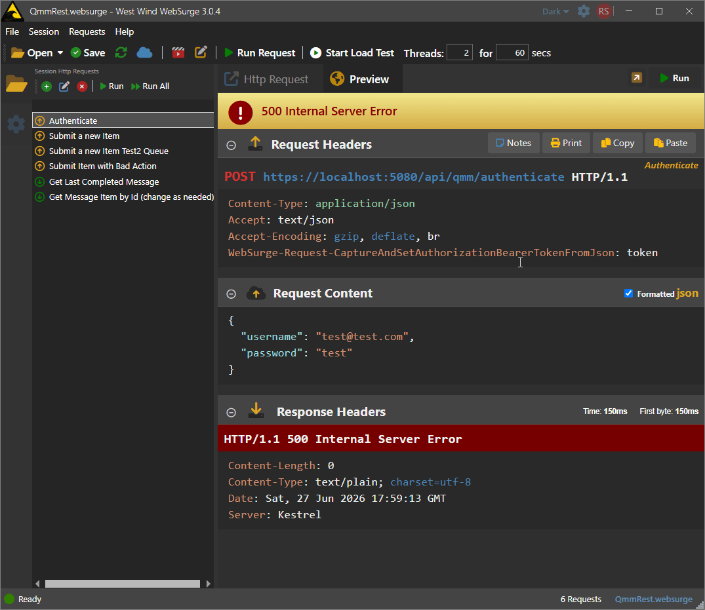
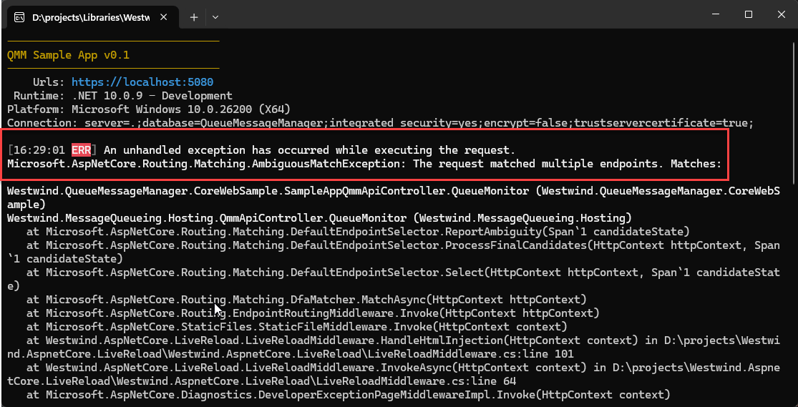
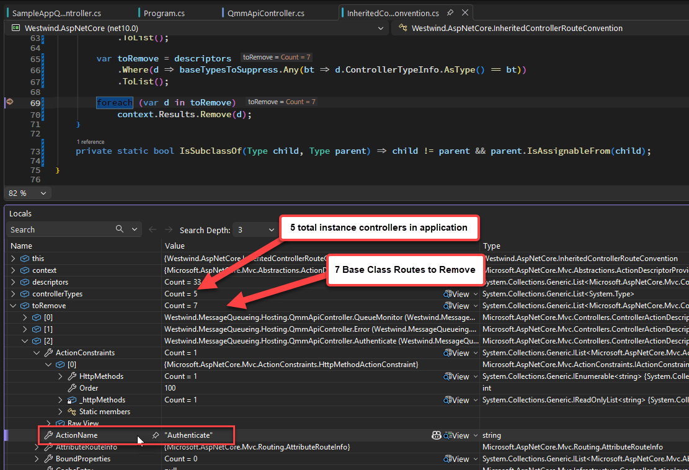

# Getting Inherited Controller Attributed Routes to work in ASP.NET Core


By default ASP.NET applies Controller Attribute Routes on concrete types. If you create a Controller class, the class and its routes are automatically recognized by ASP.NET during the startup process.

ASP.NET scans the startup assembly for any instance controllers and adds the routes it finds on them to the route table. If you have Controllers that live in another assembly you can get those to register as well, but you have to explicitly add the assembly to be scanned to the MVC startup configuration in your startup code:

```csharp
var mvcBuilder = services.AddControllersWithViews()
    // have to let MVC know we have an externally loaded controller
    .AddApplicationPart(typeof(QmmApiController).Assembly);
```
Things get more complicated when you want to **inherit** controllers as it's not always obvious how routed endpoints are making their routes available in an inherited class. 

In this post I discuss some of the issues you have to watch out for if your want to inherit controllers with routes from base classes either in the same project or an external library/project.

##AD##

## Controller Inheritance? 
Controller inheritance is not a common use case for most people, but yet I find myself frequently using it to provide default Admin APIs or default UI behavior for templating and error handling in various generic components and application templates. 
v
For example, in my [Westwind.AspNetCore.Markdown](https://github.com/RickStrahl/Westwind.AspNetCore.Markdown) library, a base Controller class provides the default template processing and styling for the default Markdown file rendering. In another project which is a messaging solution, a base controller provides an optional REST interface for the messaging APIs that otherwise use SignalR. In both of these cases,  Controllers are shipped as part of a separate library project that is referenced via NuGet in a top level project.

In both of these cases, you have the option of overriding both the functionality and in the case of the Markdown templating library provide a custom View to customize behavior and/or UI. 

### Controllers vs. Minimal APIs
I realize a lot of people will scoff at using Controllers as being old fashioned, but for packaged functionality like this, Controllers are way easier to manage and to extend than creating a slew of middleware related components along with complex configuration instructions to handle extensibility. Controllers provide a rich, extensive native interface, and you can easily subclass to extend functionality. All of that comes out of the box, so for components that need Http behavior **generically** provided for me Controllers are my go-to.

One additional reason very relevant for this post is that  using controllers it's possible to override routes. ASP.NET does not allow for duplicate routes to be defined and blows up one way or another if they are created, but with controllers there are ways that you can override this behavior,  that allow you to either inherit or override routes as I discuss in this post.

AFAIK, this is not really possible with `app.Map()` short of explicitly mucking with the route definitions.

## My Use Case and how I ended up here
As a result, I'm using Controllers for my generic API functionality in a messaging solution. As mentioned this is a REST API defined in a library class that is imported with:

```csharp
var mvcBuilder = services.AddControllersWithViews()
    // have to let MVC know we have an externally loaded controller
    .AddApplicationPart(typeof(QmmApiController).Assembly);
```
The scenario I'm working with is the following:

* I have a base controller class `public class QmmApiController : BaseApiController`    
in a separate assembly that provides a base admin interface. It has a bunch of `[Route()]` attributes attached to it provide base API functionality.
* I then inherit from this controller `public class SampleAppQmmApiController : QmmApiController`  
in the top level ASP.NET application

When I try to access the routes defined in the base class as defined I end up with a `500 Internal Server Error`:

  
 <small>**Figure 1** - Routes from inherited controllers will throw a 500 error. API Access here via [WebSurge](https://websurge.west-wind.com).</small>

Not a 404, but a 500... which is a **pretty harsh** result! 😄  

If I take a closer look at the issue in the Console, I can see this log error output on the server:

  
<small>**Figure 2** - After inheriting from a concrete base class, I ended up with AmbiguousRoute exceptions</small>

The **ambiguous** route exception is a clear hint that I - and also various LLMs - missed initially. Note that unfortunately it doesn't mention **which routes** are failing even though it looks like it's supposed to.

More on this failure a little bit later. But for now, realize that the routes defined on the base class are failing in the inherited class.

## Controller Attribute Routes and Inheritance
As it turns out using controllers with inherited Route definitions are tricky to work with. As you can see in Figure 1 and Figure 2, the routes defined on the base class are all failing. Any routes that are **explicitly**  defined on the concrete, top level controller work fine. Any routes defined on the concrete base class fail.

So what's going on here?

My initial thought was that ASP.NET **wasn't picking up the base class routes**. In fact, both I and various LLMs **completely misdiagnosed the problem** by assuming the **routes were missing** and trying to actually add the routes explicitly into the route table. That did not work!

After a lot of back and forth with various agents, and a lot of manual `Console.Writeline()` outputs trying to track down Routes and Endpoint mappings, it turns out that the problem is not missing routes but actually **Route Duplication**!

### The Problem: Route Duplication
When you subclass a Controller the Attribute Routes defined on it are inherited by the child class, you now effectively have two sets of Attribute Routes: One on the base class and one on the parent class! ASP.NET detects routes on the entire class inheritance structure (as it should), so for the concrete class it picks up any routes that are explicitly defined on the concrete class **and** the routes from the inherited class.

ASP.NET then also picks up the base class as a separate concrete class and maps the routes defined on it.  

**And Bingo: You now have route duplication!**

This is why we're seeing the **Ambiguous Route Error** shown in **Figure 2**.

### Controller Inheritance... It's complicated
So the problem is the inheritance, but it's not quite as cut and dried as that either. There's more nuance. 

In the example above - which was my original use case - the base class was a concrete instance class:

I define my top level application class like this:


```csharp
public class SampleQmmApiController : QmmApiController {}
```

And I'm inheriting from this base class:


```csharp
public class QmmApiController : BaseApiController {}
```

**That doesn't work** and gives the **Ambiguous Route** error.

But if I use an `abstract` base class to inherit from, Attribute Routes are not duplicated and an inherited controller can correctly see a single set of inherited routes projected by the inherited concrete instance:

```csharp
public abstract class QmmApiController : BaseApiController {}
```

If you inherit this abstract class **the routes now work**!

Here's a table that summarizes the various modes:

| Library Inheritance | Base Class Type | Result                                              |
|:--------------------|:----------------|:----------------------------------------------------|
| **No Inheritance**  | Concrete        | Works (Routes recognized on library class)          |
| **No Inheritance**  | Abstract        | not picked up by ASP.NET                            |
| **Inherited**       | Concrete        | **Doesn't work** (Routes on base class are ignored) |
| **Inherited**       | Abstract        | Works (Routes recognized on child class)            |


The **No Inheritance** scenario works both for project local or imported from an external library controllers as long as `.AddApplicationPart()` has imported the assembly. With an instance class the routes are **always-on**. Makes sense - this is how controller routes are discovered by default. But in the case of an external library that exposes a controller it might be a little unexpected  that any public instance controller you have in the library automatically is available for processing.

For an external library the better path most likely is to use an `abstract class`, which ASP.NET's parser will not automatically add to the route table. This effectively hides the routing interface and lets you explicitly enable the routes by subclassing the controller in your top level project. 

Which works best depends on the scenario. For example, in my Markdown template controller I want the routes to be always active so the Markdown processing can occur. As a result I use an instance class controller. But in my queue controller scenario I want the host application to decide whether the REST API is available to access, so I use an abstract class controller.

Subclassing in both of these use cases provides the abililty to override default behavior - for the Markdown component the template usage, for the API how authentication and tokens are handled - which are common customizations for these two.

### Preserving Base Class Routes
There are actually a couple of ways that you can subclass a controller and preserve the base class routes:

* **Define your base class as `abstract`**  
Abstract base classes are not picked up by ASP.NET when enumerating routes, so an abstract class when inherited can safely bring in the base class routes and you can use the endpoints as is, or override them. **It just works.**

* **Inheriting Non-Abstract Controllers requires custom Route Manipulation**  
If you decide you can't use an abstract class because you want routes to be **always-on** by default and still have the ability to inherit, there's a way to make this work by intercepting and modifying routes ASP.NET has auto-discovered.

### Abstract Classes are Easiest
If you build library components and you want to conditionally expose routes on controllers, using an abstract base class is the easiest way to do it. By marking the controller as `abstract` and creating a concrete implementation class you are delegating the routes explicitly to where they are required, bypassing potentially unintended conflicts.

The downside is that you have to explicitly implement a subclass and that requires some sort of documentation so that users know that this is necessary to enable the base behavior.

### Creating an IActionDescriptorProvider Route Interceptor
In order to deal with non-abstract instance Controlller base classes, we need to manipulate the ASP.NET route table **after**  ASP.NET has picked up all the routes. 

Recall that the issue is that routes get **duplicated** if you inherit and instance class that contains routes: You end up with the base class' routes added to the route table, and then again from the inherited class when ASP.NET scans for controller classes. 

So to detect and remove the duplicated routes we can:

* Implement `IActionDescriptorProvider` to intercept completed Routes after auto-detection
* Remove base class routes for all or specific classes

`IActionDescriptorProvider` lets you intercept the Controller route handling lifecycle, and it provides a `OnProvidersExecuted()` method that is fired after routes have been auto-detected.

We can implement that method like this, to remove inherited routes:

```csharp
namespace Westwind.AspNetCore;

/// <summary>
/// Runs after the full route table is built. Removes descriptors for base
/// controller actions when a subclass is also registered, eliminating the
/// ambiguous-route conflict (duplicate routes).
///
/// Register in Program.cs:
///   var convention = new InheritedControllerRouteConvention();
///   services.AddSingleton&lt;IActionDescriptorProvider&gt;(convention);
/// </summary>
public class InheritedControllerRouteConvention :  IActionDescriptorProvider
{
 
    /// <summary>
    /// Optionally restrict which inherited concrete controller base types 
    /// we want to allow base class routes to work on.
    /// If empty, all inherited concrete controller base types are processed.    
    /// </summary>
    public List<Type> ChildControllerTypes { get; set; } = [];

    public int Order => 0;
    public void OnProvidersExecuting(ActionDescriptorProviderContext context) { }

    /// <summary>
    /// This method finds all base controller types or those of the type(s)
    /// specified in <see cref="ChildControllerTypes"/>
    /// and removes any [Route()] attributes on the child controllers
    /// to fix the duplication of routes that break inherited controller routing.
    /// </summary>
    /// <param name="context"></param>
    public void OnProvidersExecuted(ActionDescriptorProviderContext context)
    {
        var descriptors = context.Results
            .OfType<ControllerActionDescriptor>()
            .ToList();

        var controllerTypes = descriptors
            .Select(d => d.ControllerTypeInfo.AsType())
            .Distinct()
            .ToList();

        // Find child types to process (all, or the restricted list)
        var childTypes = ChildControllerTypes.Count > 0
            ? controllerTypes.Where(t => ChildControllerTypes.Contains(t)).ToList()
            : controllerTypes;

        // Base types are those that a processed child inherits from and that are
        // also directly registered as controllers
        var baseTypesToSuppress = controllerTypes
            .Where(t => childTypes.Any(child => IsSubclassOf(child, t)))
            .ToList();

        var toRemove = descriptors
            .Where(d => baseTypesToSuppress.Any(bt => d.ControllerTypeInfo.AsType() == bt))
            .ToList();

        foreach (var d in toRemove)
            context.Results.Remove(d);
    }

    private static bool IsSubclassOf(Type child, Type parent) => child != parent && parent.IsAssignableFrom(child);

}
```

This code looks at all the route descriptors captured, and then looks for our matching top level controllers (or all of them if not specified). It then finds all the routes defined on inherited types of the filtered list and removes them.

When running the code you end up with a set of routes to remove - in **Figure 3** the 7 routes are the base class routes in `QmmApiController` which is my filtered controller type that I specify.

  
<small>**Figure 3** - Inherited routes to remove in the `IActionDescriptorProvider` processing </small>

The code to hook this up in the ASP.NET startup code in `program.cs` looks like this:

```csharp
var inheritedRouteConvention = new InheritedControllerRouteConvention
{
    ChildControllerTypes = [typeof(SampleAppQmmApiController)]
};
// Oddly this is what triggers the convention to be used!
services.AddSingleton<IActionDescriptorProvider>(inheritedRouteConvention);

var mvcBuilder = services.AddControllersWithViews()
    // the base controller comes from an external library
    .AddApplicationPart(typeof(QmmApiController).Assembly)
```


You can find this component and its functionality pre-built in the [Westwind.AspNetCore NuGet package](https://github.com/RickStrahl/Westwind.AspNetCore).

##AD##

## LLM Heaven and Hell?
As you might imagine, this is the kind of thing where I engaged with LLMs - specifically with [GitHub CoPilot](https://github.com/features/copilot) and [Claude Code](https://github.com/features/copilot) with various models. 

I say **and with various models** for a reason here, because in this case the LLMs really did an absolute shit job in a) trying to identify the problem correctly and b) providing a workable solution. So much so I switched between various tools and models several times, yet all of them came up with the same incorrect conclusion at first.
  
It took some extensive troubleshooting and **Console.WriteLineing** of routes and endpoints to properly diagnose the problem which was duplicate routes, not missing routes as the original LLM diagnoses was.

In the end, Claude Code (with Sonnet 4.6) ended up giving me a working solution but only after several very long troubleshooting loops and walking through spitting out route mappings and feeding them back into Claude and finally identifying that routes were duplicated.

Once the duplication issue was clearly established the final solution of the `IActionDescriptorProvider` class was adeptly created by Claude. 

I will plainly admit that I probably **would have not figured this out on my own**. ASP.NET is powerful in the extensibility it has built in but discovering that flexibility is nearly impossible. You would think LLMs help here, but apparently at the edges in scenarios that haven't been widely published even the LLMs can end up not being a big help without some serious hands-on nudging.

> Getting this done was a real slog and many, many false solutions were tried along the way trying to solve the wrong problem. 

I continue to marvel at people who claim that they are one-shotting solutions and fixing problems - that never, ever seems to happen to me. I can massage an LLM into providing a solution most times, but it's never just a matter of one or even a few prompts - it's always try something and then re-direct the LLM after it's made bad assumptions. This gets very tricky in situations like this where I often don't have the expertise to check the validity of the assumptions so the only way to check is to go with it and figure it out as I go along and hope for the best...

But in the end, the LLM did provide a working solution, which on my own I likely would not have found.

As it is I spent way too much time on this 😄.

##AD##

## Summary
ASP.NET Controller route inheritance is not a thing you commonly do, but if you do find a use case for it, there are a number of things to watch out for.

Here are the main points summed up:

* Routes cannot be duplicated
* Instance classes automatically publish their routes including in external libs if registered
* Inherited instance Controller classes will cause route errors due to route duplication on the child class
* Abstract Controller classes do not duplicate routes and can be safely subclassed with route inheritance
* For inheriting instance Controller class you can use `IActionDescriptorProvider` to remove base class routes


## Resources

* [Westwind.AspNetCore Library on GitHub](https://github.com/RickStrahl/Westwind.AspNetCore)


<div style="margin-top: 30px;font-size: 0.8em;
            border-top: 1px solid #eee;padding-top: 8px;">
    
    this post was created and published with the 
    <a href="https://markdownmonster.west-wind.com" 
       target="top">Markdown Monster Editor</a> 
</div>