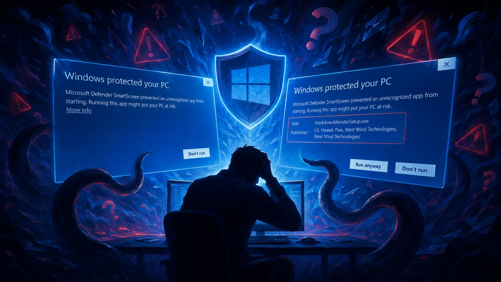
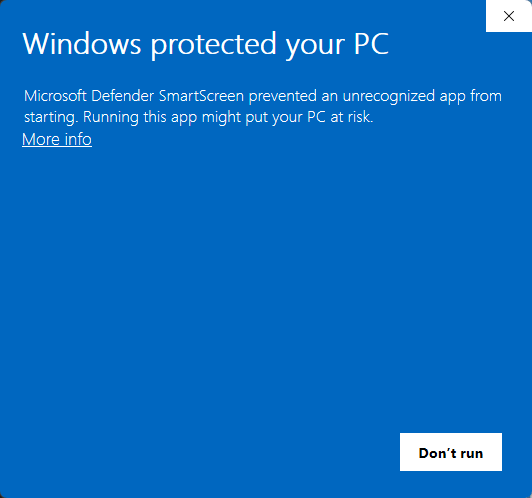
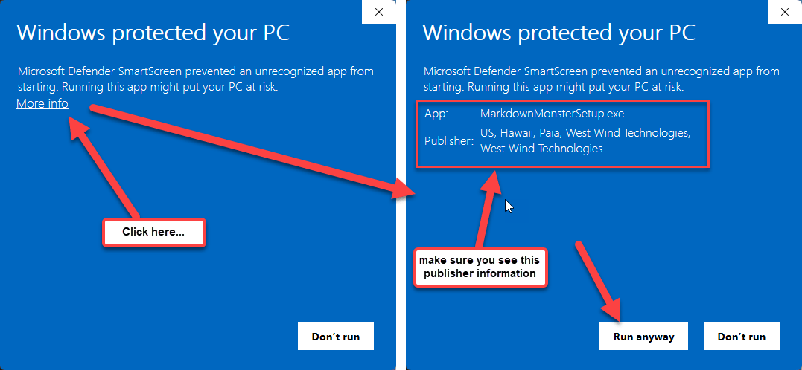

# Windows Protected your PC: Dealing with Windows SmartScreen  on Installation

Windows SmartScreen also known as the  **Windows protected your PC** screen, is a scourge on users and small software publishers as it is a reputation based mechanism that Windows uses to scare people from installing external software. 

The warning dialog is one thing as it is a valid concern to warn people about installing software from unknown locations. But using provocative colors (blue screen anybody?), scary language and making the step around procedure un-obvious is to essentially scare people out of installing external software, which is a age-old staple of Windows usage.

It's a pain to users who often get scared away from installing software that is legitimate and it's a pain to developers who have to deal with lost users and the support that comes from questions around why the application won't install. 

##AD## 

If you've run into the lovely Blue **Windows protected your PC** screen when installing software from a Web download:

  
<small>**Figure 1** - A scary SmartScreen dialog when you try to install an application</small>

you know what I mean.

As publisher of small software packages like [Markdown Monster](https://markdownmonster.west-wind.com),  [Documentation Monster](https://documentationmonster.com) and [West Wind WebSurge](https://websurge.west-wind.com) I run into this issue **every single time I upload a new release** for public downloads. These are small vendor software applications and because SmartScreen keys of downloaded files and successful installations, they are very negatively affected by 'scary' SmartScreen popups, scaring off customers when initial versions are posted or updated. If users get scared off they're not likely to return.

Eventually as reputation of the downloads improves due to successful installations, SmartScreen backs off, but the cycle repeats next time a new version is uploaded. In a couple of words: It sucks!

## Working around the Problem
Before I go into why SmartScreen pushes those prompts on users, let me give you the quick fix for SmartScreen in most scenarios, assuming you want to install the software regardless of the warning.

You can do the following:

  
<small>**Figure 2** - You can bypass SmartScreen by clicking the not so obvious **More info** link.</small>

SmartScreen in most scenarios gives you the option of bypassing the warning and installing anyway:

* Click on the **More info** Link
* Check and make sure the Installer Signature matches the vendor
* If you're sure you trust the vendor and signature
* Click on the **Run anyway** button

SmartScreen is meant to prevent you from doing a drive-by install of software by bringing up the blue warning screen, letting you know that you are installing **potentially** unsafe software. 

**Fair enough** - if you install software directly from the Internet, it's possible to install unsafe software that can do bad things to your computer and installed software.

I don't have an issue with popping up the warning screen because that's a legitimate concern. The way it's done - well, that's a different story as it's clearly designed to scare users out of installing apps not coming from the Windows Store.

> ##### @icon-warning Make sure you Trust the Vendor!
> You want to make absolutely sure you trust the vendor and the site of the software that you're trying to install. Bad things can happen if you install Malware and there's no vetting process if you download from the Web.
> 
> Make sure that if you do use the bypass described above you are familiar with the vendor and that the signature of the package matches the vendors contact information.
>
> It's good practice when installing software from an unknown vendor, to check reviews or online discussions around the product to ensure the software is legit and comes from a vendor approved download location!

### Better Vetting and Local Installs for Software: Use a Package Manager
One way to have a more secure experience is to install software from the Windows Store (if available) or from a Package Manager like WinGet or [Chocolatey](https://community.chocolatey.org/). These stores and platforms review software before it's published, run malware checks and run through automated tests that check for successful installations and side effects. It's not full proof - but you do get at least some vetting of software.

> ##### @icon-lightbulb UniGetUi - A Manager for Windows Store and Package Managers
> If you want to install from any of these sources check out [UniGetUi](https://devolutions.net/unigetui/), which is a free desktop application that lets you search for, install and update software from a number of different stores and package managers.

Package managers have an additional advantage over straight downloaded software in that they typically avoid SmartScreen due to Mark of the Web. Because these managers internally download software rather than pulling it down through a browser, installers are run as local executables that don't have a Mark of the Web.

This bypasses most of the SmartScreen security flags.
Here are a couple of examples you can run from the Windows Terminal:

```ps
winget install MarkdownMonster
choco install DocumentationMonster
```

All of the managers include commands to update and list already installed components.

Package Managers provide some basic curation for published packages, doing virus scanning  and associating publishers with products consistently and removing packages and publishers that are problematic. So there's some pre-validation happening by the provider that provides a better pre-requisite for security than you get directly downloading software.

For this to work, software publishers of Software have to ensure that their software is published on these package managers. Unlike Windows Store however, the process of publishing to package managers - while not exactly simple - is usually well defined and can be completely automated making it something that is a viable alternative for downloads for publishers. You often find way more software on the package managers than you will find in the Windows Store because of it's restrictive requirements.

All of the West Wind product download pages have links for Chocolatey and WinGet installers as alternatives to the direct download. Even so I'm always surprised that the vast majority of users are installing directly - I guess there's some trust there which is good :smile:

If you are a vendor linking the various package managers supported on the download page is a good idea as users that get SmartScreen'd can use it as an alternative that is likely to work better.

### Remove Mark-Of-The-Web
Another option is to download installers and explicitly remove the Mark-of-the-Web attached to downloaded binaries and installers.

SmartScreen is triggered among other things by Mark-of-the-Web which indicates that a file was downloaded from the Web. Any file downloaded through a browser interface gets marked and Windows detects this mark changing the security consideration of the file. 

The various package managers avoid Mark-of-the-Web by directly downloading package content and locally unpacking thereby bypassing the Mark-of-the-Web and thus usually get around SmartScreen.

You can also remove this mark yourself on any downloaded file that gives you security issues when downloaded off the Web.

> Unblock-File -Path '.\MarkdownMonsterSetup.exe'

This removes the Mark-Of-The-Web and likely will not trigger SmartScreen on install, even if the required reputation level has not been achieved.

### Windows Store
Microsoft suggests publishing apps through the Windows Store. Windows Store is a curated platform, and software has to go through a thourough vetting process. The problem is that this process is both slow and cumbersome and there are a million different rules that have to be followed including some restrictions the software can and can't do in some cases requiring that Windows Store versions have to be dumbed down to be eligible for Store publishing.

Developer and developer adjacent tools in particular have a hard time conforming to all the rules, and the lack of attention by reviewers to real-world concerns in the app publishing process make the Windows Store a time consuming pain in the ass.

I had gone through this process on multiple occasions only to be rejected due to a various shell features that are perfectly adequate for the application and just were rejected outright. Bottom line is that not every product can go into the Windows Store.

I don't have the time or resources to deal with Windows Store deployment, plus for commercial software the model going to the store adds additional complexity and fees again resulting in changes to the application to make the Store work.

In the case of West Wind products the effort is not worth the reward.

## SmartScreen Rant 
As you can tell I'm not a big fan of SmartScreen. Few people - even users - are. I'm not against warning users of the dangers of installing software from the Web or networks in general. But heavy handely and effectively scaring users into avoiding installing software that they might even trust, is something else. And that's really what SmartScreen does.

But what pisses me off though is that many users are sure they want to install, and perhaps have even installed a previous version of same software from the same site, and they are still warned away the same as everyone else. Often users don't know how to navigate past the scary blue dialog to install - most casual users are simply scared off. 

The way that SmartScreen does this seems particularly nasty, clearly trying to scare users into not installing externally downloaded apps, and trying to push people to Windows Store installed apps which never are forced through this rigmarole.
  
The issue I have with SmartScreen and its UI are many:

* It doesn't tell you anything other than *"Big Scary Warning, Don't Do it!"*
* The Bypass operation is obscured and totally un-obvious
* Conversely at first glance the only option appears to be **Don't run**
* There's no continuity for the vendor publishing updates -   
  the more frequently you publish, the more painful SmartScreen is

Essentially SmartScreen is designed to scare users, without giving any useful information and worse using a limited and flawed algorithm that doesn't take into account actual usage or continuity using forced certificates. At this point it even seems that having an Authenticode Certificate on the installer has no retention value for reputation whatsoever, even or maybe especially when using Microsoft's own Trusted Signing support. 

Having no certificate is still worse though, because unsigned installers automatically throw up SmartScreen regardless of reputation.

## How does SmartScreen Work
The actual semantics behind how SmartScreen are not officially disclosed by Microsoft, but based on observation I can make some guesses. At the end of the day SmartScreen is a reputation based system.

When updating Markdown Monster to a new Version and immediately downloading and installing it after the new version is live - I always get a SmartScreen dialog when running the installer. After a few hours - and presumably some users that fought their way past SmartScreen, SmartScreen stops showing up. However, your mileage may vary based on your machine or company security policy.

Things that affect SmartScreen popups:

* **Unsigned Binaries and Installers**  
Unsigned installer always trigger Windows SmartScreen. If the publisher has not signed their binary that's usually not a good sign, but it's not uncommon for open source tools, and small utilities. Be extra careful with these types of installations and make sure triple sure you trust the publisher. Do your research!

* **No or few successful Installations**  
SmartScreen is reputation based and as such even a signed binary, that has just been uploaded for download is likely to trigger SmartScreen. As more people download and successfully install the software, SmartScreen stops being so aggressive and allows installation. It appears SmartScreen uses Windows statistics for installations, crashes and uninstalls to determine whether an app is 'stable' and doesn't cause problems.

The problem with the latter Installation counting is that every time an update is shipped, the reputation cycle starts over. There's no continuity over the name of the binary or the certificate used - nothing. Even a vendor like me shipping typically weekly updates of the same software with the same cert for 10 years - same shit each and every time.

For Markdown Monster this is not a huge problem, because the reputation turnaround comes quickly enough due to a fair number of downloads. It also helps that it's geared to a tech savvy audience that presumably knows how to bypass SmartScreen.
  
However, for a new product like Documentation Monster that is relatively unknown and gets only a few downloads, it may never clear the SmartScreen Reputation hurdle between updates because the download count is low. In the meantime SmartScreen's scary warning ensure that many users may never actually install.

New software with a scary blue screen pop up, is simply not a great recipe for getting new users to try out the software for the first time.


##AD##

## Summary
At the end of the day SmartScreen is just something developers and end users have to put up with. It's frustrating that Microsoft has taken such an aggressive approach with SmartScreen rather than providing a more productive approach of providing a Warning Screen with more information and a clearer way to allow for bypassing the warnings.

But alas here we are...

<div style="margin-top: 30px;font-size: 0.8em;
            border-top: 1px solid #eee;padding-top: 8px;">
    
    this post created and published with the 
    <a href="https://markdownmonster.west-wind.com" 
       target="top">Markdown Monster Editor</a> 
</div>