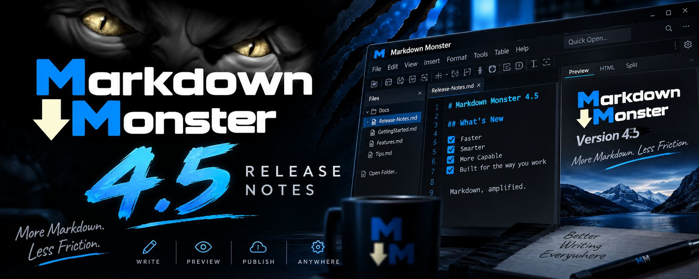
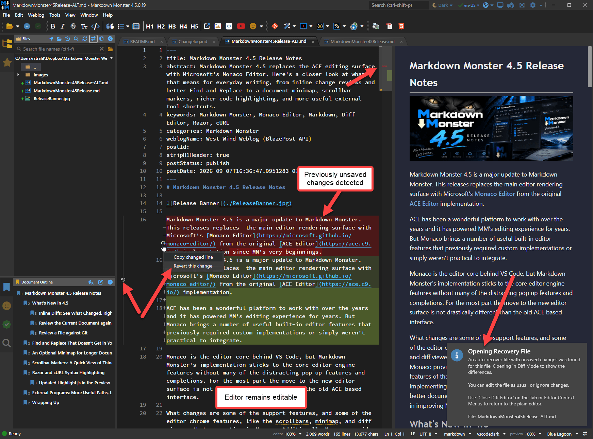
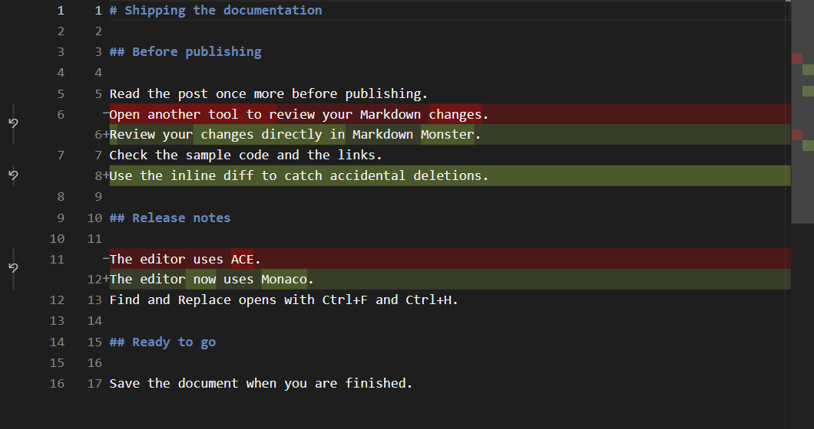
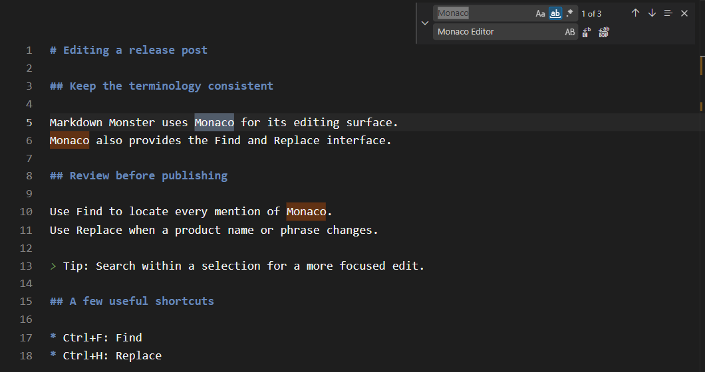
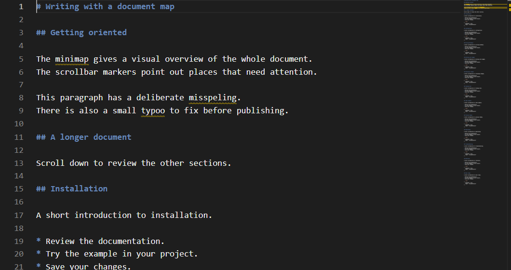
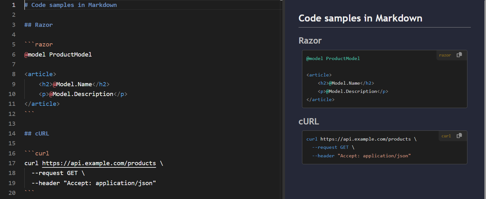

# Markdown Monster 4.5 Release Notes



Markdown Monster 4.5 is a major update to Markdown Monster. This releases replaces  the main editor rendering surface with Microsoft's [Monaco Editor](https://microsoft.github.io/monaco-editor/) from the original [ACE Editor](https://ace.c9.io/) implementation.

ACE has been a wonderful platform to work with over the years and it has powered MM's editing experience for years. But Monaco brings a number of useful built-in editor features that previously required custom implementations or simply weren't practical to integrate.

Monaco is the editor core behind VS Code, but Markdown Monster's implementation sticks to the core editor engine features without many of the distracting pop up features and completions. For the most part the move to the new editor surface is not drastically different than the old ACE based interface.

What changes are some of the support features, and some of the editor chrome features, like the scrollbars, minimap, and diff viewers that are native in Monaco. Additionally Monaco provides a more complete API to access internal features of the editor which allow more control over implementing custom features in the editor along with better documentation and better support for agents to help in improving Markdown Monster's feature set.

## What's New in 4.5
So let's dive in and take a look what's new and improved.


### Inline Diffs: See What Changed, Right Where You're Working
One of the primary reasons for the switch to Monaco was support for inline Diff editing. Markdown Monster internally uses several different operations for diff tracking:

* Startup Document Changes vs Backup files (ie. hard exits or shutdowns before save)
* Showing live diffs of the document from when it was opened
* Showing differences between edited and Git files

Startup Document Change Detection is based on Backup files that show changes that were not saved for some reason. This could be a system or app crash, or any reason that caused the application to not finish a normal shutdown.  
  
When you start back up you'd see something like this now in v4.5:  
  
  
<small>**Figure 1** - Showing an inline Diff for non-saved changes from a previous run. You can edit the document in the Diff view. </small>


These operations in the past brought an optionally configured external diff editor to view the differences. 

With this update Markdown Monster now opens the changes in a live viewer that shows both the 

You can now do that inside Markdown Monster. The new inline diff view puts the original and modified text together in the editor, with removed text in red and added text in green. Unchanged content stays in place, so you can read a change in context rather than trying to mentally reconstruct the surrounding paragraph.



*A documentation edit, with the old wording, its replacement, and a newly added sentence visible together.*

For Markdown and prose, this stacked view is particularly useful. You don't have to divide your available width between two copies of a document, and a changed sentence appears immediately next to the wording it replaces.

There are two ways into this view, depending on what you want to compare.

### Review the Current Document against the Saved File

When a saved document has unsaved changes, right-click its tab or open the editor context menu and choose **Open as Diff Editor**. MM compares the current editor contents with the version on disk.

For example, open a saved post, rewrite a paragraph, and then switch to the diff editor. You'll see both the paragraph you started with and the new version, without having to save the change first or use Git at all.

You can continue editing in this view. When you're ready to get back to plain Markdown editing, choose **Close Diff Editor** from the tab or editor context menu.

There's an important detail here: **Saving does not reset the comparison baseline while the diff editor is open.** The comparison continues against the original text captured when you entered diff mode. That lets you save your work without losing the change review you're in the middle of.

This is a comparison session, not a permanent document history. Closing and reopening diff mode starts a new comparison using the file state at that point.

### Review a File against Git

The Folder Browser provides the other entry point. For a changed file in a Git repository, use its context menu to open the diff editor. Here the comparison is against the file's last committed version, rather than just the saved copy on disk.

That distinction matters: Saving a document removes its unsaved-editor changes, but it doesn't make it identical to the version in Git. The Git comparison lets you review the edits you've already saved before you commit them.

An external diff tool is still useful for more involved repository work. But for a quick "what did I change in this post?" review, staying in the editor is a lot more convenient.

## Find and Replace That Doesn't Get in Your Way

Find and Replace isn't a flashy release feature. It's also something you use often enough that small annoyances become very noticeable.

With ACE, getting the search UI to fit into MM required custom styling and fixes for keyboard combinations and focus handling. Monaco supplies a more complete Find and Replace interface without that extra layer of workarounds.

The familiar shortcuts still apply: **Ctrl+F** opens Find and **Ctrl+H** opens Replace.



*Search matches are highlighted in the document, while the search and replacement text stay together at the top of the editor.*

Suppose you're cleaning up terminology in a post. Search for `Monaco`, enter `Monaco Editor` as the replacement, and review the occurrences before changing them. The dialog includes controls for matching case, matching whole words, and using regular expressions, along with individual and replace-all operations.

The practical improvement is less about having a search box and more about having one that feels like part of the editor: consistent keyboard behavior, visible matches, and fewer surprises when moving between the search fields and the document.

## An Optional Minimap for Longer Documents

Some people love an editor minimap. Others see it as a small, unreadable copy of the document taking up perfectly good screen space. Fair enough! It's optional, and **off by default**.

If you like that visual overview, enable **ShowMiniMap** in the Options dialog. You can also enable it through the `Editor.showMiniMap` setting.



*The minimap shows the shape of the entire document. Deliberate spelling mistakes in this example also illustrate the marker indicators.*

The point isn't to read the tiny text. It's to recognize the shape of a document: a series of short sections, a long code sample, or that large block of content near the bottom. Click in the minimap to move to that part of the file instead of scrolling through it a screen at a time.

The Document Outline remains the better choice when you know the heading you're looking for. The minimap is a complementary view for those times when you remember roughly where something was, but not what the section was called.

## Scrollbar Markers: A Quick View of Things to Review

Another benefit of Monaco is that information from inside the document can also appear as markers along the scrollbar.

Spelling issues are a good example. Rather than only noticing an underline when the word is on screen, you can see a marker indicating an issue elsewhere in the document and navigate to that area. In diff mode, change markers give you a similar overview of where edits are located.

You can see the spelling markers at the right edge of the minimap screenshot above, and the change markers in the diff screenshot. These are separate from the minimap itself; you don't have to enable the minimap to get scrollbar indicators.

It's a small improvement, but a useful one when reviewing a long post: You get an indication of where to look instead of having to scan every screenful just to find the next marked location.

## Razor and cURL Syntax Highlighting
This v4.5 release adds support for ASP.NET Razor and cURL syntax highlighting both inline in the editor **and** in the rendered preview output. Use `razor` or `curl` after the opening code fence to identify the language:

  
<small>**Figure** - Razor and cUrl syntax coloring both in the editor and previewer</small>


> @icon-warning Make sure your Hosting Platform Supports these formats
> Markdown Monster's preview uses [highlightJs](https://highlightjs.org/) to produce highlighted syntax blocks, along with a custom extension to provide a toolbox with the syntax type and copy option.
>
> One caveat is worth keeping in mind when publishing: **The Markdown file doesn't carry its syntax highlighter with it.** The language name on a code fence tells the receiving renderer what the block contains, but the website still needs a highlighter that supports that language. If your hosting platform doesn't support the syntax you may see generic code rendering.
>
> You can incorporate MM's syntax coloring extensions in your own custom HTML. [More info here...](https://markdownmonster.west-wind.com/docs/Recipes/Source-Code-Syntax-Highlighting-in-exported-HTML.html)

### Updated Highlight.js in the Preview
Speaking of **highlighJs** Markdown Monster now uses the latest version of this great JavaScript library. Due to some legacy code in the previous versions of Markdown Monster, we were using a quite old versions of highlightJs until this release. The new version adds a few additional syntaxes (see previous) and the highlighter runs more efficiently on the page for rendering, especially in very large documents.

## External Programs: More Useful Paths, Less Placeholder Guesswork
External Programs let you add your own **Open...** commands for tools outside Markdown Monster. They're handy for opening a file in another editor or launching a terminal where you're working.

Previously, these definitions used numeric placeholders such as `{0}` and `{1}`. They work, but looking at a command months later and remembering which number means which value isn't especially intuitive.

You can now use descriptive names instead:

| Placeholder | Expands to |
| --- | --- |
| `{CurrentFile}` | The selected file's path |
| `{CurrentFolder}` | The current file's containing folder |
| `{CurrentRow}` | The current editor row |
| `{CurrentColumn}` | The current editor column |
| `{ProjectFolder}` | The project base folder, or the current folder when no project base is found |

For an editor that accepts a file, row, and column, an argument string is much easier to understand when written as:

```text
--goto "{CurrentFile}:{CurrentRow}:{CurrentColumn}"
```

The named placeholders also make it easier to distinguish the current document's folder from the project root. If you're editing `docs\guides\publishing.md`, you may want a terminal at the project root, not inside `docs\guides`.

For example, an External Program definition that launches Windows Terminal (`wt.exe`) can use its starting-directory argument:

```text
-d "{ProjectFolder}"
```

MM expands the project path, and Windows Terminal uses that path as its working directory. Other tools can use the same placeholder with their own directory options.

The project folder comes from MM's [project base-path and marker-file configuration](https://markdownmonster.west-wind.com/docs/Recipes/Configuring-Site-Relative-Base-Paths.html#site-relative-path-overrides), so it can point above the current document's folder. Quote path placeholders, as in these examples, to handle folders and filenames that contain spaces.

You can reach the definitions through **Open... > Edit External Programs...** on the document tab's context menu. Existing numeric placeholders are still recognized, so the named versions improve readability without requiring you to rewrite every working command.

## Wrapping Up

Replacing the editor is a substantial change under the hood. But the reason to do it isn't simply to say that MM now uses the same component as VS Code. It's to make everyday editing tools fit together better.

The inline diff editor is the biggest visible addition for reviewing changes. The improved search UI, minimap, and scrollbar markers are smaller conveniences that help while you're actually working in a document. Add the syntax and external-tool improvements, and there's quite a bit here beyond a different editing engine.

You can find builds on the [Markdown Monster download page](https://markdownmonster.west-wind.com/download) and the full release history in the [changelog](https://github.com/RickStrahl/MarkdownMonster/blob/main/Changelog.md).