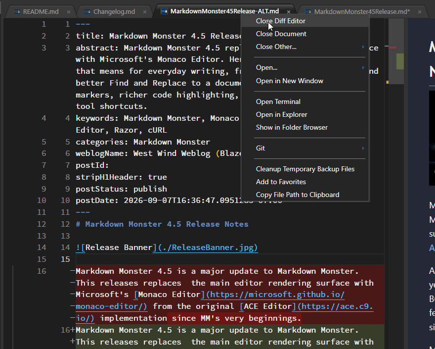
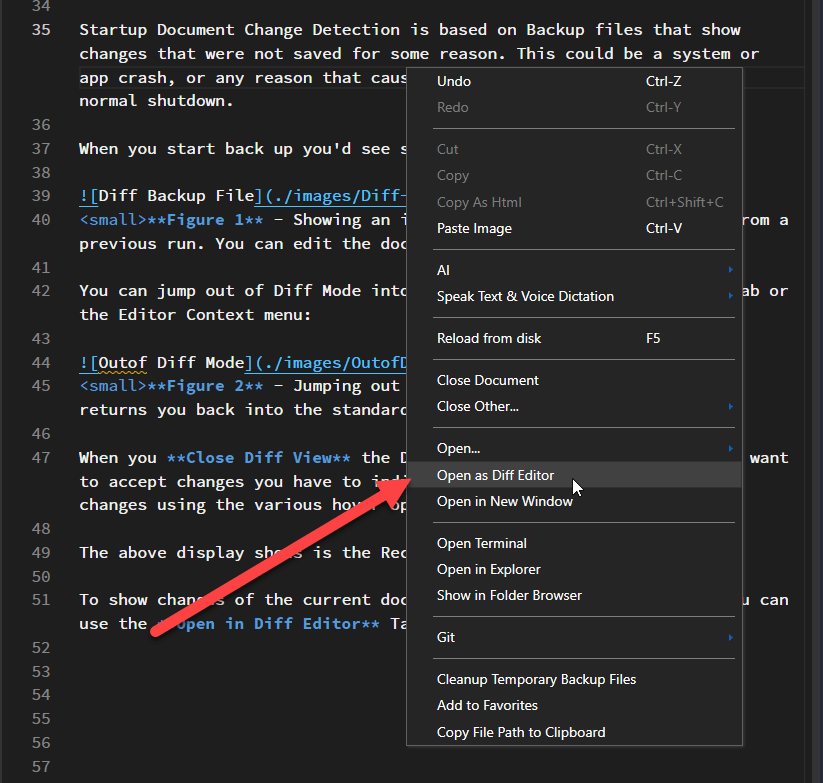
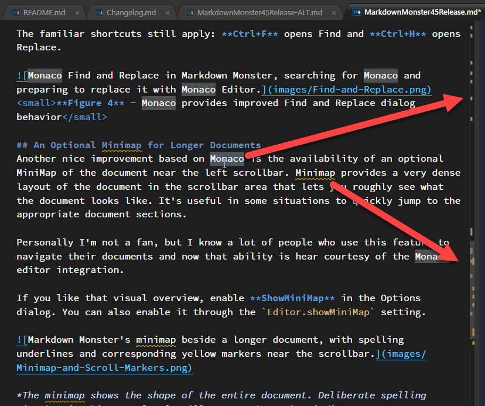

# Markdown Monster 4.5 Release Notes


Markdown Monster 4.5 - although a point release - is a major update to Markdown Monster. This releases replaces the main editor rendering surface with Microsoft's [Monaco Editor](https://microsoft.github.io/monaco-editor/) from the original [ACE Editor](https://ace.c9.io/) implementation.

ACE has been a wonderful platform to work with over the years and it has powered MM's editing experience for years. But Monaco brings a number of useful built-in editor features that previously required custom implementations or simply weren't practical to integrate.

Monaco is the editor core behind VS Code, but Markdown Monster's implementation sticks to the core editor engine features without many of the distracting pop up features and completions. For the most part the move to the new editor surface is not drastically different than the old ACE based interface and it most definitely doesn't make Markdown Monster just another VS Code variation.

What changes are some of the editor chrome features, like the scrollbars, minimap, find and replace and diff viewer that are native in Monaco. Additionally Monaco provides a more complete API to access internal features of the editor which allow more control over implementing custom features in the editor along with better documentation and better support for agents to help in improving Markdown Monster's feature set.

## What's New in 4.5
So let's dive in and take a look what's new and improved.

### Inline Diff Editing: See What Changed, Right Where You're Working
One of the primary reasons for the switch to Monaco was support for inline Diff editing. Diff editing is becoming increasingly more important in this age of agents where we often need to see changes to documents to compare old and changed text.

Markdown Monster internally uses several different operations for diff viewing:

* Startup Recovery Files (ie. hard exits or shutdowns before files were saved)
* Showing live diffs between the editor document and what was on disk when opened
* Showing Git Commit differences 

Recovery File Detection is based on Backup files that show changes that were not saved for some reason. This could be a system or app crash, or any reason that caused the application to not finish a normal shutdown.  
  
When you start back up you'd see something like this now in v4.5:  
  
  
<small>**Figure 1** - Showing an inline Diff for non-saved changes from a previous run. You can edit the document in the Diff view. </small>

You can jump out of Diff Mode into the regular editor view via the Tab or the Editor Context menu:

  
<small>**Figure 2** - Jumping out of Diff mode via Close Diff View returns you back into the standard editor without Diff</small>

When you **Close Diff View** the Diff is effectively aborted. If you want to accept changes you have to individually accept the changes or all changes using the various hover options on the diff items.

To show changes of the current document vs. what's stored on disk you can use the **Open in Diff Editor** Tab or Editor Context menu option:

  
<small>**Figure 3** - Open in Diff Editor shows file differences between the edited file and what's on disk</small>

Finally you can also open the Diff Editor on any file from the Folder Browser if it is managed by Git. When you open the file as Diff Editor from the Folder Browser the file then shows the uncommitted differences of the file.

These operations in the past brought an optionally configured external diff editor to view the differences, but this integrated view 

### Find and Replace That Doesn't Get in Your Way
The old ACE Editor find and replace dialog has always been clunky as it used very old school design that didn't fit into a desktop style UI. In the old version we ended up using custom CSS to restyle the Find and Replace popup, but due to the way ACE has this designed not everything was easy to style. In addition there were keyboard navigation with the original implementation that would in some scenarios transfer key operations pointing at the find dialog getting pushed into the editor.

With the adoption of Monaco we've inherited a much cleaner Find and Replace dialog that works correctly out of the box with navigation keystrokes. Monaco's finder also automatically highlights matches in the document (as did ACE) **and** also on the scrollbar so you can see at a glance where in the document matches live.

The familiar shortcuts still apply: **Ctrl+F** opens Find and **Ctrl+H** opens Replace.


<small>**Figure 4** - Monaco provides improved Find and Replace dialog behavior</small>

### An Optional Minimap for Longer Documents
Another nice improvement based on Monaco is the availability of an optional MiniMap of the document near the left scrollbar. Minimap provides a very dense layout of the document in the scrollbar area that lets you roughly see what the document looks like. It's useful in some situations to quickly jump to the appropriate document sections.

Personally I'm not a fan, but I know a lot of people who use this feature to navigate their documents and now that ability is here courtesy of the Monaco editor integration.

If you like that visual overview, enable **ShowMiniMap** in the Options dialog. You can also enable it through the `Editor.showMiniMap` setting.


 <small>**Figure 5** - Minimap gives you a compressed visual view of your document for navigation purposes</small>

The Minimap is optional, and **it's off by default**, so you have to explicitly enable it in the settings.

### Scrollbar Markers: A Quick View of Things to Review
Another benefit of Monaco is that information from inside the document can also appear as markers along the scrollbar.

The scrollbar highlights:

* Spelling Errors
* Current Selection Matches
* In Diff Mode, document changes

  
<small>**Figure 6** - Scrollbar markers show selection matches, spelling errors and document changes when in Diff mode</small>

This feature is a subtle one, but it's useful when reviewing a long post. You can quickly get a feel where relevant text or spell errors live.

### Razor and cURL Syntax Highlighting
This release also adds support for ASP.NET Razor and cURL syntax highlighting both inline in the editor **and** in the rendered preview output. Use `razor` or `curl` after the opening code fence to identify the language:

  
<small>**Figure 7** - Razor and cUrl syntax coloring both in the editor and previewer</small>


> @icon-warning Make sure your Hosting Platform Supports these formats
> Markdown Monster's preview uses [highlightJs](https://highlightjs.org/) to produce highlighted syntax blocks, along with a custom extension to provide a toolbox with the syntax type and copy option.
>
> One caveat is worth keeping in mind when publishing: **The Markdown file doesn't carry its syntax highlighter with it.** The language name on a code fence tells the receiving renderer what the block contains, but the website still needs a highlighter that supports that language. If your hosting platform doesn't support the syntax you may see generic code rendering.
>
> You can incorporate MM's syntax coloring extensions in your own custom HTML. [More info here...](https://markdownmonster.west-wind.com/docs/Recipes/Source-Code-Syntax-Highlighting-in-exported-HTML.html)

### Updated Highlight.js in the Preview
Speaking of **highlighJs** Markdown Monster now uses the latest version of this great JavaScript library. Due to some legacy code in the previous versions of Markdown Monster, we were using a quite old versions of highlightJs until this release. The new version adds a few additional syntaxes (see previous) and the highlighter runs more efficiently on the page for rendering, especially in very large documents.

### Window Resizing now preserves Editor/Preview Size Ratio
This update also changes the Window resizing behavior for editor and preview panes. Previously the Preview pane was fixed in size and any Window resizing would only resize the Editor pane. In the new release the editor preview size ratio is preserved when the Window is resized so both editor and preview adjust size to stay in roughly the same layout ratio.


### External Programs: More Useful Paths, Less Placeholder Guesswork
External Programs let you add your own **Open...** commands for tools outside Markdown Monster. They're handy for opening a file in another editor or launching a terminal where you're working.

Previously, these definitions used numeric placeholders such as `{0}` and `{1}`. Those continue to work, but looking at a command months later and remembering which number means which value isn't especially intuitive.

You can now use descriptive names instead:

| Placeholder | Expands to |
| --- | --- |
| `{CurrentFile}` | The selected file's path |
| `{CurrentFolder}` | The current file's containing folder |
| `{CurrentRow}` | The current editor row |
| `{CurrentColumn}` | The current editor column |
| `{ProjectFolder}` | The project base folder, or the current folder when no project base is found |

<small>*([full docs here](https://markdownmonster.west-wind.com/docs/Configuration-Settings/Run-External-Programs-via-Open-With.html#configuring-external-programs))*</small>

For an editor that accepts a file, row, and column, an argument string is much easier to understand when written as:

```json
"ExternalPrograms": [
{
    "Name": "Open in VS Code",
    "Executable": "C:\\Program Files\\Microsoft VS Code\\Code.exe",
    "Args": "\"{CurrentFile}:{CurrentRow}:{CurrentColumn}\" -g \"{ProjectFolder}\"",
    "SaveBeforeActivation": false,
    "Extensions": "TEXT,FOLDER",
    "EditorKeyboardShortcut": null
}
```

The named placeholders also make it easier to distinguish the current document's folder from the project root. If you're editing `docs\guides\publishing.md`, you may want a terminal at the project root, not inside `docs\guides`.

For example, an External Program definition that launches Windows Terminal (`wt.exe`) can use its starting-directory argument:

```text
-d "{ProjectFolder}"
```

MM expands the project path, and Windows Terminal uses that path as its working directory. Other tools can use the same placeholder with their own directory options.

The project folder comes from MM's [project base-path and marker-file configuration](https://markdownmonster.west-wind.com/docs/Recipes/Configuring-Site-Relative-Base-Paths.html#site-relative-path-overrides), so it can point above the current document's folder. Quote path placeholders, as in these examples, to handle folders and filenames that contain spaces.

You can reach the definitions through **Open... > Edit External Programs...** on the document tab's context menu. Existing numeric placeholders are still recognized, so the named versions improve readability without requiring you to rewrite every working command.


## And that's a Wrap!
Although on the surface this release is only a point release, behind the scenes this release is a major update due to the complexities of replacing the internal editor engine from ACE editor to Microsoft's Monaco editor. The reason for this major change has been that Monaco is better supported than ACE and includes a number of useful features that are useful to Markdown Monster that were not easily achievable using ACE editor. Many of these features come courtesy of the editor and come basically for free out of the box, without any special customizations which has removed a bunch of code and simplified the editor interface used by Markdown Monster.

The inline diff editor is the biggest visible addition, but the various editor chrome improvements like the scrollbar markers for spell errors, matched text and document changes, the way that Find and Replace works more naturally with selections and navigation are all great if subtle additions to MM.

You can find the latest release download on the [Markdown Monster download page](https://markdownmonster.west-wind.com/download) and the full release history is available in the [changelog](https://github.com/RickStrahl/MarkdownMonster/blob/main/Changelog.md).

<div style="margin-top: 30px;font-size: 0.8em;
            border-top: 1px solid #eee;padding-top: 8px;">
    
    this post was created and published with the 
    <a href="https://markdownmonster.west-wind.com" 
       target="top">Markdown Monster Editor</a> 
</div>