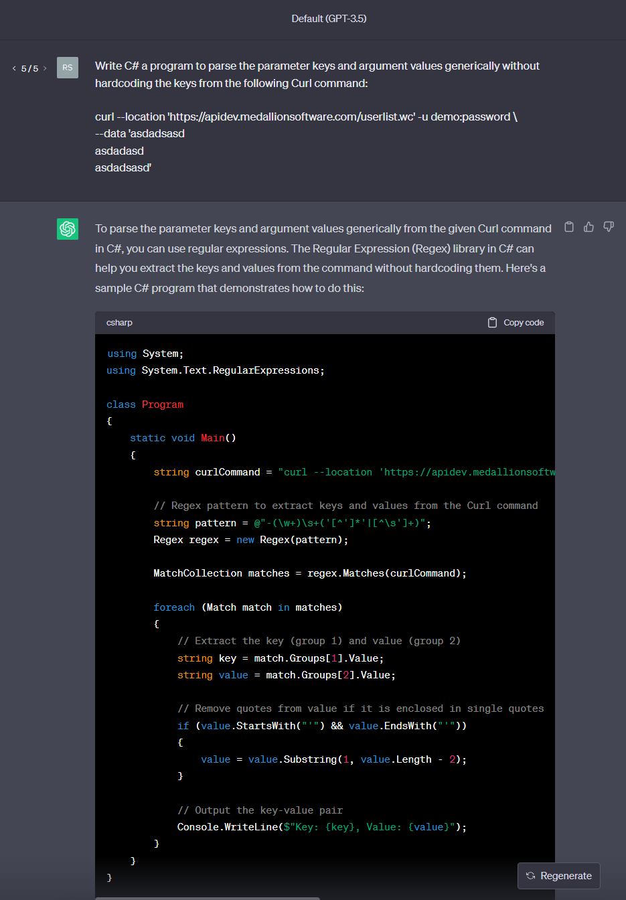
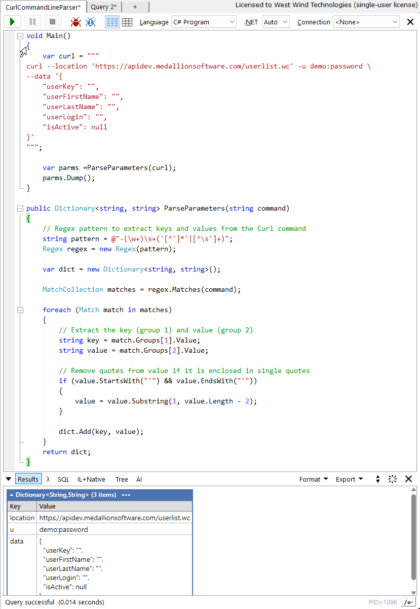
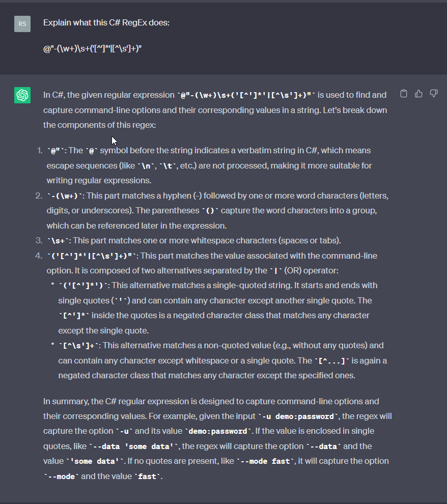

# AI for an Eye

### Examples

#### Writing small helpers

To run the code more generically I generally tend to tweak it a little. In this case I want a reusable function to do the parsing and then run it in LinqPad to test and tweak the code:

### Explaining what Code does
Another very good use of ChatGpt is to explain what a piece of code does. One thing that will always warp my brain is RegEx expressions. The code in the previous example spit out a RegEx to parse the command parameters. But what does it do?

Well it can tell 'ya:

While this isn't exactly getting the entire purpose, it's still very helpful. For example, the code generated only works with single quote parameter values. Using the above analysis it's easy to see what does the single quoting and add another expression to support double quoting which I did manually.

### Knowing when to quit
This is actually a good point to understand: You should know when an AI generated result is **close enough** and you go ahead and manually make the final touch ups, rather than keep refining the AI query to get the absolute correct response. 

If you keep on the latter path you may run into diminishing time returns: It can send you down rabbit holes where one change to the query completely changes the implementation which then requires a mental reset on your part.

Don't underestimate the ability to understand the code generated - you want to be able to use AI generated code with some confidence that a) it works and b) that you understand how it works to the point that you can modify it and fix issues.

So in the simple example above, rather than requerying the AI for also pulling both single and double quoted values, I made the change manually, because I decided that the code generated in the last query was **close enough** and I could understand what it's doing.

## Danger, Danger Will Robinson
