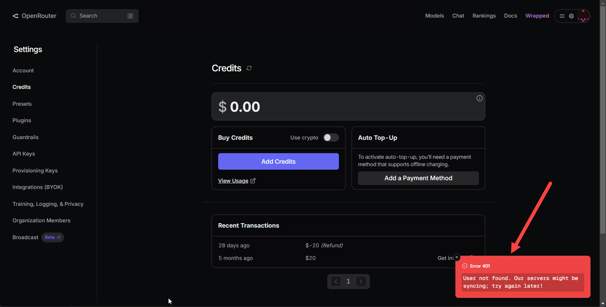

# An OpenRouter.AI Horror Story

OpenRouter.ai is an LLM hosting site that lets you use a huge variety of models using a single point OpenAI Endpoint to work with many models using a single account and single account billing. Switching between models of various different LLM providers is as easy as switching the model on the API request. OpenRouter has most big box models available and for the the frontier model providers pricing is mostly passthrough meaning the pricing is the same as you'd get from the OpenAI, Anthropic etc. 

As far as what OpenRouter provides as a service, it's a great setup and in fact I've recommended it to our Markdown Monster users as the easiest and cheapest way to get into Bring your own Key (BYOK) setups that Markdown Monster supports for various AI integrations. 

## Account Failure
As much as I like how OpenRouter works, I ran into some serious issues with their backend account management that is making me reconsider using them in the future. Essentially my account was somehow **disabled without warning and from one day to the next my API access stopped working**. Worse when I tried to find out what happened I found nearly non-existent and well un-supportive support, who immediately dismissed my request and 'closed' the matter without further follow up.

Here's how I got there:

I opened an account with OpenRouter several months back, primarily for my testing various models with Markdown Monster AI integration features. I've also used OpenRouter for a few BYOK integrations in LinqPad and Rider.

I originally set up a $20 balance.

For me usage was light for testing various models, mostly free or very cheap model requests. Over the next couple of months ran maybe 50 or so requests mostly for testing with the balance barely scraping over a few cents not because it wasn't useful, but because I test with many different providers.

Then out of the blue late last month API requests start failing with 401 - User not Found errors. 

Checked the account on the Web site, and I can log in no problem and see my activity. However, if I go to my account page I can't do anything - no adding of funds or a payment method - all generating a 401 - User Not Found error

And I see that my original $20 balance has been refunded.  The account balance  was very low (a few cents) so figured maybe this was because of lack of use, but that doesn't explain the User Not Found errors on any account operation.

So I sent off a support ticket (not easy to find). This was two weeks before x-mas explaining the situation. I get an immediate obviously AI generated response that mentions completely unrelated balance refunds.  I reply that this is not relevant. Then...

No response. A few days later posted here to OpenRouter.ai on Twitter. No response. At least one person responded and requested clarification from OR. No response. 

Finally on the 29th an actual human responds. "You still have a problem?"  along with another canned response. I reply whether they even read the ticket which has all the detail that answers the question asked in the response.

Then I get another very snotty reply that my account  was closed due to multiple accounts. 

Uh say what? Yes I created another account way *after* the original account was inaccessible for nearly 3 weeks and the support request was filed.

I reply that I didn't have multiple accounts at the time of the error and ticket. Then...

No response.

So fuck you OpenRouter! This is 

In the meantime I now have two accounts with one that is open and may or may not have billing associated with it that I can't access. I can't remove the billing (if it's enabled) and I can't close the account. In fact I don't see any way you can close an OpenRouter account on their Web site which is another big fat red flag.

And yes, this post is to shame OpenRouter, because this kind of shit should  be called out and hopefully result in this ship getting righted. 

It's one thing to have problems with your back end. But it's another to ignore requests to get some resolution or at least an explanation WTF is going on. Support provided neither of these.

So at this point I sure as hell won't be recommending OpenRouter to anybody else. 