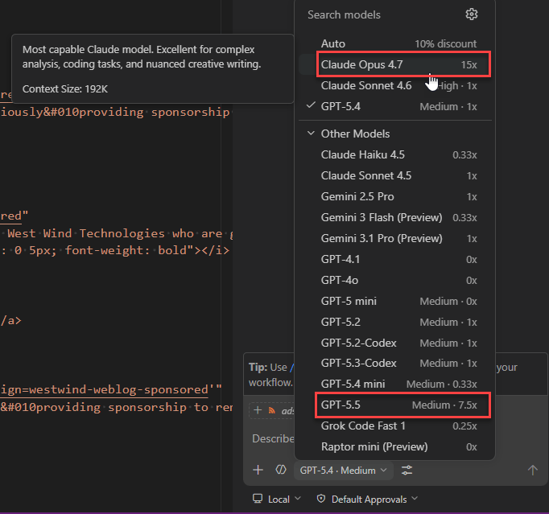

# Are you ready to gamble (on your AI Tokens)

It looks like the good times in AI development are about to be over with new - more realistic - pricing hitting all providers just about now.

Well it was fun while it lasted blowing tokens on toy projects and thought experiments, but with token pricing actually reflecting more of a reality of what it actually costs to build and run the frontier LLMs, the reality comes crushing down like Lucifer's Hammer quickly.

## Where we've been
There is no doubt that software development with AI has completely upended the industry. For some it's made existing tasks incredibly more productive, for others whole new worlds of parallelism and multi-tasking for projects that were unthinkable before are being implemented. Even if you are a skeptic or like me - somewhat skeptic (of the trust but verify kind perhaps) - of AI's coding abilities, at minimum you've likely used AI at least interactively to help with programming questions or providing simple quick and dirty algos. If you're not, you're just willfully ignorant of at least the basic benefits.

Since the start of the coding LLMs, pricing for the tokens involved had been fairly lenient, with some providers like GitHub CoPilot in particular allowing ridiculous amounts of usage for relatively low priced accounts. Even with a basic Pro account you could run the top models and unless you were going all out not hit any limits. For those that were going full bore the higher end plan usually would suffice.

## Where we're going
But the lenient token budgeting has now come to a screeching halt, first with Claude deciding to limit use outside of its own tools and requiring different pricing or token weighing when not using their own tools. 

In addition CoPilot in particular changed their pricing scheme from per request pricing to actual token usage pricing, which is way less consumer friendly - by fucking county mile.

Where you could previous use Claude for just about anything, you now go for 15 minutes and run into the rate limiter and request for squiring more tokens.

## What is it worth to you?
In other words - reality is coming to crash the party.

And that brings up an important question: What is an AI Agent work for you, when you actually have to somewhat realistically budget for the work that it's doing? 

If you're working in some large enterprise organization, this is likely not going to matter much at least at first. The bill will be fronted to some department manager that hasn't gotten the memo yet that pricing has gone through the roof and their probably seeing this as hey finally our devs are using AI and getting shit done. Kidding aside for large enterprises the costs - even at full price - is probably just a blip on their balance sheet.

But for smaller organizations and individual developers like myself - you get priced out of the sandbox quite quickly.

It's all fun and games watching people like Burke Holland and James Montenago create crazy agent setups and build lots of funky toys, but you have to remember these guys and most other 'developer advocates'  work at or for big corporations that provide unlimited token budgets to their minions. They also have access to the people building these tools so I'm probably not alone in often feeling like I have no idea what they are actually talking about when talking about their complex agent setups that sound mighty cool but are short on actual detail.

What I'm trying to get at is that for many of us, there's a real good chance that we get priced out of this market. 

Over time that $20 ChatGPT or Claude  subscription isn't going to do shit, so you go for the $100 dev plans eventually and then you find out - oops that doesn't get you very far either.

There's a serious disconnect as to the expectations that have been built up in the last couple of years, vs. the likely reality of how this technology is going to be gatekept and made available.

Imagine that pricing is **not** essentially free - that you can't do anything very useful with a $20 subscription, but instead have to pay as you go, or pay a much more substantial fee each month. 

How much is that really worth to you? 

If you're billed on token usage - either directly or indirectly via a strict token budget in a subscription - how much spoilage do you have from requests that produce utter garbage that is unusable? Where is the returns department for that? 😄

And when you 

