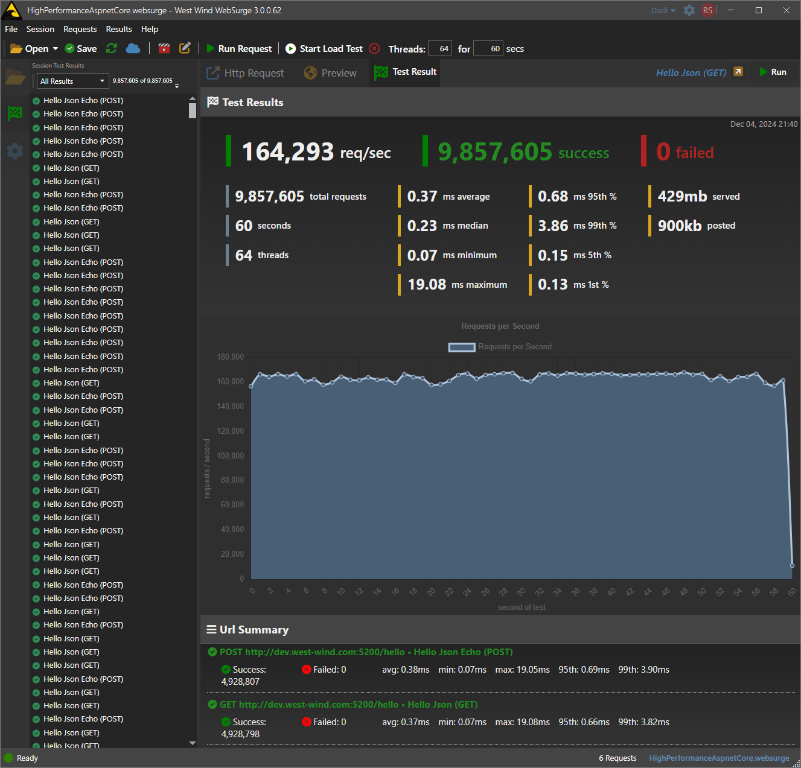
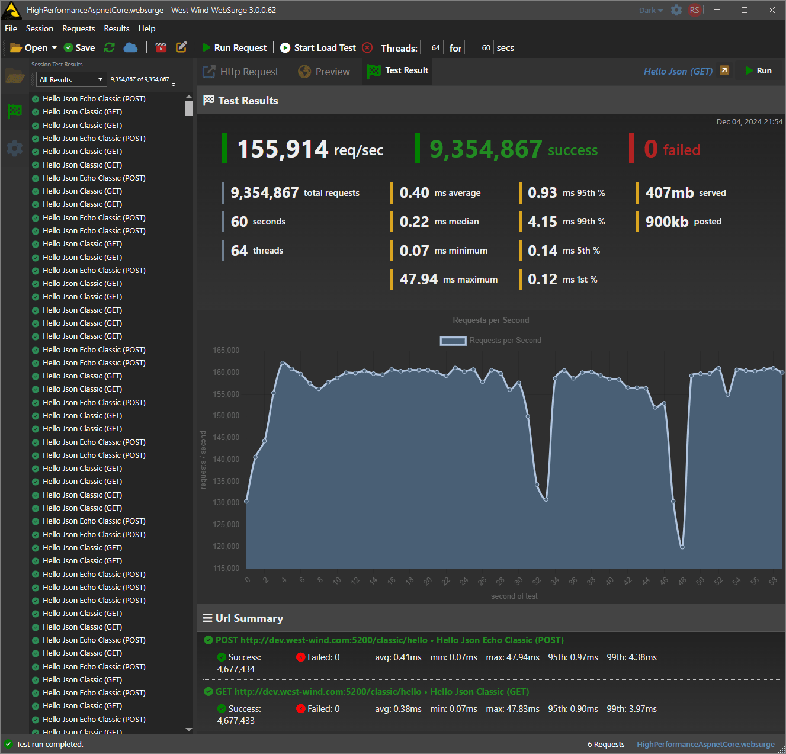
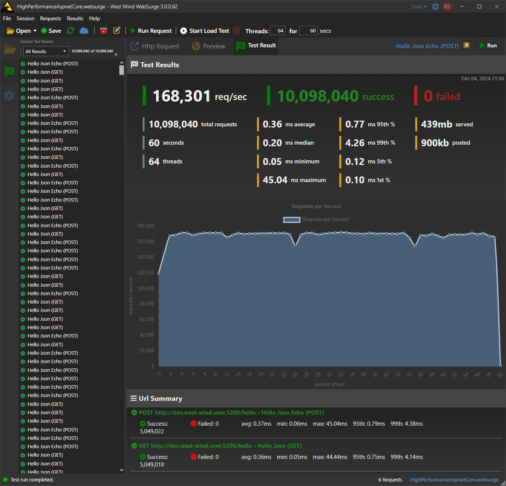
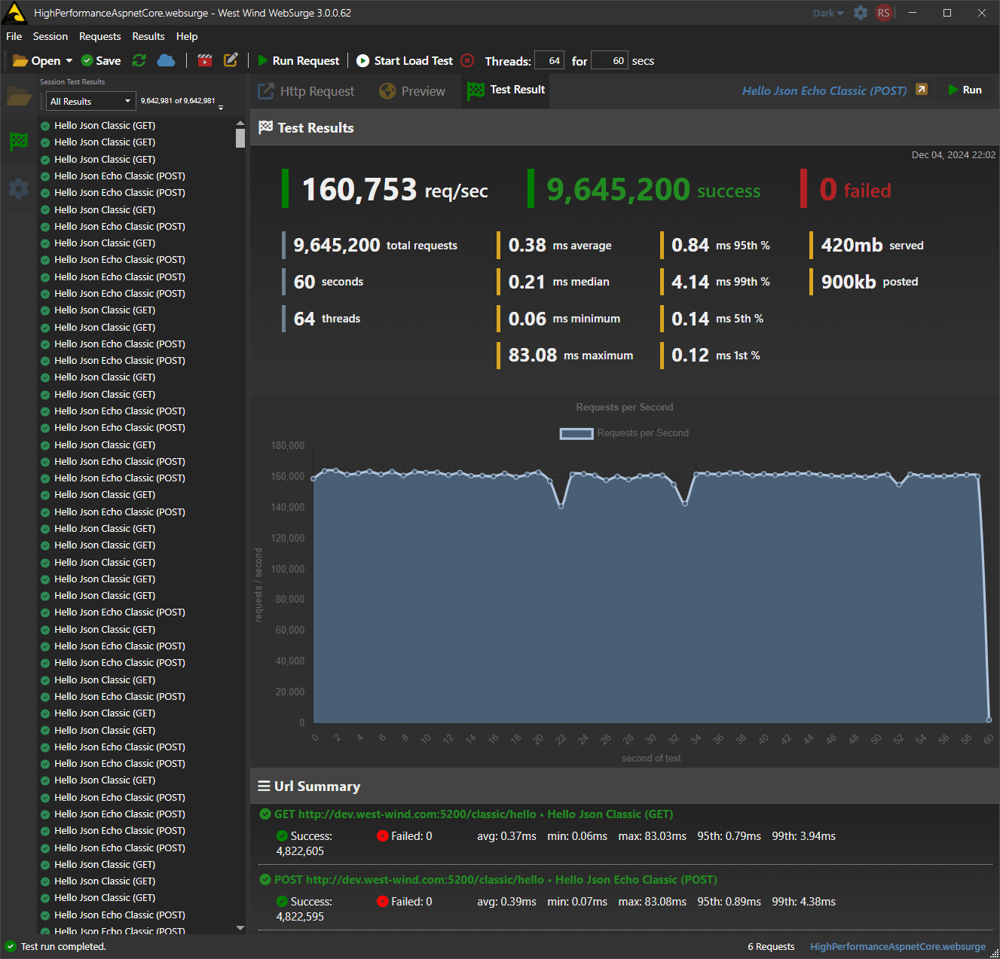

# Comparing Raw ASP.NET Request Throughput across Versions: 8.0 to 9.0 Edition

[[_TOC_]]

Whenever a new release of .NET comes out I run a comparison test of versions using some of my own tools. The iteration of this was from .NET 7.0 to 8.0:

[Comparing Raw ASP.NET Request Throughput across Versions](https://weblog.west-wind.com/posts/2024/Mar/08/Comparing-Raw-ASPNET-Request-Throughput-across-Versions)

In these posts I use a couple of simple ASP.NET JSON endpoints - both for minimal APIs and ASP.NET Controllers - and fire local Web load test against it. 

This is by no means a very scientific process and these tests certainly don't reflect any real world scenarios. But they actually serves a couple of useful purposes to me at least:

* Shows performance throughput of .NET high load ASP.NET app
* Shows performance throughput of a high load .NET client 
* Shows them relative to previous .NET versions on the same hardware

Ideally you'd want to test these independently on their own hardware, but in my case I'm running it all on a decently powered high midrange laptop (I9 13th gen, 32gb, fast disks).

The goal isn't to do per se benchmarks on .NET, but rather to do a high level comparison of running the same applications on the same hardware on different versions of .NET. It doesn't give deep insight on what things work better, but it gives me a rough idea of how the new version of .NET performs across two important scenarios for me.

Since the stack is end to end .NET that gives a pretty good idea what can be expected in best case scenarios in terms of performance improvements.

## Some general .NET 9.0 Notes coming from 8.0
As a side note I will say that .NET 9.0 'feels' more snappy in general for two reasons:

* Startup speed seems noticeably improved for both Web and Desktop apps
* Overall performance feels more snappy especially in my desktop apps

As it turns out there might be something wrong with my 'feelings' :smile: as the results show that performance is actually slightly slower in .NET 9.0 for these tests. We'll get to that in a minute.

## Tests
If you're interested what the server side tests look like you can look at the previous post in this section:

[Testing with ASP.NET - Code](https://weblog.west-wind.com/posts/2024/Mar/08/Comparing-Raw-ASPNET-Request-Throughput-across-Versions#testing-with-aspnet)

This year I only used a single machine the same I9 laptop I used last year:

* MSI GE68HX 
* I9
* 32gb, Fast 7,000mb/sec drive

## How I run the Server
To run the server I compile the Web application, publish it and then run out of the publish folder. 

  
## API Code
The code for these is extremely simplistic and literally meant to return the simplest API responses possible. I use one GET and one POST request for both of these.

**Minimal APIs**

```csharp
app.MapGet("/hello", () =>
{
    return new { name = "Rick", message = "Hello World" };
});
app.MapPost("/hello", (RequestMessage model) =>
{
    return new { name = model.Name, message = model.Message };
});
```

**Controller**

```csharp
[ApiController]
[Route("[controller]")]
public class ClassicController : ControllerBase
{

    [HttpGet("hello")]
    public object Hello()
    {
        return new { name = "Rick", message = "Hello World" };
    }

    [HttpPost("hello")]
    public object Hello(RequestMessage model)
    {
        return new { name = model.Name, message = model.Message };
    }

}
```

Obviously this **is not a real-world scenario**. Any application that hits a database will run infinitely slower than this - the goal of this is to excercise the raw ASPNET framework throughput for close to do-nothing requests that still return a response. For me APIs is what I mostly do so that's what I use here. This obviously also adds JSON serialization into the mix.

## Running the Server
For these simple tests I run Kestrel directly from the command line by publishing the project and then running the generated executable.

This is done to make sure the app is running in fully deployed mode and by default runs in production:

```ps
dotnet publish HighPerformanceAspNet.csproj -o ../Publish -c Release
../publish/HighPerformanceAspNet --urls http://dev.west-wind.com:5200
```

> #### Using `http:/` for better Throughput
> Note I'm running the `http://` url rather than the default `https://` url (I did initially). Turns out running `http://` can generate ~13% more requests on the local machine as this affects both the client and server apps for encoding and decoding the TLS requests.


## Test Runs
As said the results of these test runs are surprising:

### .NET 9.0 Minimal APIs



### .NET 9.0 Controllers



### .NET 8.0 Minimal APIs



### .NET 8.0 Controllers




Yup - it actually looks like .NET 9.0 is slightly **slower** than .NET 8.0.

Here are the summarized results running through the UI:

**WebSurge UI**

| Framework    | .NET 9.0 | .NET 8.0 | .NET 7.0 |
|--------------|---------:|---------:|---------:|
| Minimal APIs | 164,250  | 168,250  | 160,250  |
| Controllers  | 156,000  | 160,750  | 150,500  |

Here are the same sessions run through the command line which improves these scores a bit more but with roughly the same ratios between .NET versions:

**WebSurge CLI**

| Framework    | .NET 9.0 | .NET 8.0 | .NET 7.0 |
|--------------|---------:|---------:|---------:|
| Minimal APIs | 181,000  | 189,000  | 161,200  |
| Controllers  | 178,000  | 183,250  | 150,500  |

### UI vs. CLI Client: More difference than expected
It's interesting here that the differences between UI and CLI are quite substantial. The desktop application does minimal UI updates during test runs: once a second it writes out fairly static string for the running counter displayed as a status on the window. The code divides the running number of requests by the number of seconds the test has run which should have next to no processing overhead and minimal UI interaction. Yet... there's nearly a 10% difference in the performance numbers.

### 9.0 UI vs 8.0 UI
For kicks I also re-ran these tests with the last version of WebSurge that runs on .NET 8.0. Performance of the .NET 9.0 client improved by about 7% on repeated runs. 

This seems to suggest that there's more improvement that occured for client side applications, and that matches up with my experience.

For my desktop applications I've noticed:

* Much improved startup speed
* Slightly snappier UI interactions
* 

These things are hard to quantify because they are touchy feely, but I run my apps a lot and so I have a pretty good feel for when things speed up... or slow down. Here .NET 9.0 seems to have more of an impact than on server operations. 

For WebSurge I also wonder if improvements with the UTF-8 string handling and in HttpClient have an effect on the improved performance since that's the meat of usage.

With the 7% improvement it's worth mentioning that  **the ratio between the .NET 8.0 and 9.0 applications stayed roughly the same** as shown with the main test shown earlier.


This seems to suggest the following:

* ASP.NET is roughly the same or slightly **slower** than .NET 8.0 in these tests
* The WPF .NET 9.0 client is nearly 10% **faster** than the 8.0 client

### Improvement over last year's tests - WebSurge Improvements
Also interesting from my developer perspective is that this year's results process  nearly 20% more requests than last year's results on the same hardware.

Here are last year's results for the same I9 laptop:


| Framework    | .NET 8.0 Requests/Second | .NET 7.0 Requests/Second |
|--------------|--------------------------|--------------------------|
| Minimal APIs | 168,000                  | 91,555              |
| Controllers  | 160,750                 | 84,784                  |

I've made some improvements to the HTTP processing in WebSurge which probably accounts for most of this gain between last year's .NET 8.0 runs and this year's .NET 8.0 run as well as perhaps some improvements in .NET 9.0 that benefit from improvements in the client HTTP stack (like improved UTF-8 handling and lower memory usage in general)

