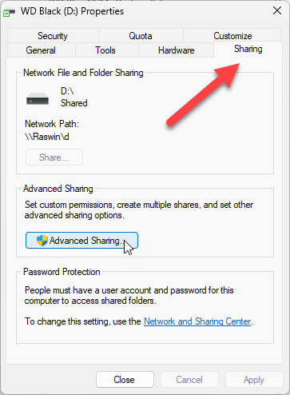

# Sharing Tab Missing in Windows Folder Properties

[Click](Readme.md) 

Leaving this here for my own reference as I keep running into this on new Windows 11 installations. 

For unfathomable reasons it seems that Windows 11 is actively discouraging the sharing tab in Windows and is not displaying it.

I'm talking about this tab:

## Enabling Folder/Drive Sharing in the Registry
If this Tab is not showing in your Explorer Properties the easiest way is via a registry update:

* Check HKEY_LOCAL_MACHINE\SOFTWARE\Microsoft\Windows\CurrentVersion\Shell  * Extensions\Blocked
* Check for {f81e9010-6ea4-11ce-a7ff-00aa003ca9f6}
* Remove if present
* Reboot or Kill and Restart Explorer

As the name suggests this feature is actively **blocked** and it appears that this is the new default in Windows 11.

## Ensuring File Sharing works
If you want external machines to access your machine you need to additionally ensure that you have Windows File sharing enabled in your network configuration for the adapter that you are using.

## A few Other Network File Sharing Items
I don't know about you but I don't often share drives and files over the network these days as file sharing services like DropBox handle the brunt of that for me.

But occasionally I do need to share a drive or folders to resources and everytime I have to set this up it seems it's non-trivial, with something going wrong for machine or drive discovery. 

You can use one of these two configuration settings:

* **Set Network Adapter Network Profile to **Private****  
This makes the computer discoverable on the network and allows for folder and file sharing. 

* **Set Advanced Network Adapter Settings**  
Alternately you can go to **Advanced Network Adapter settings** -> **Advanced Settings**  and turn on Network discovery and File and Printer Sharing explicitly.

In combination with the ability to actually expose drives and folders via the Sharing Tab that's usually what it takes to share resources across the network.

