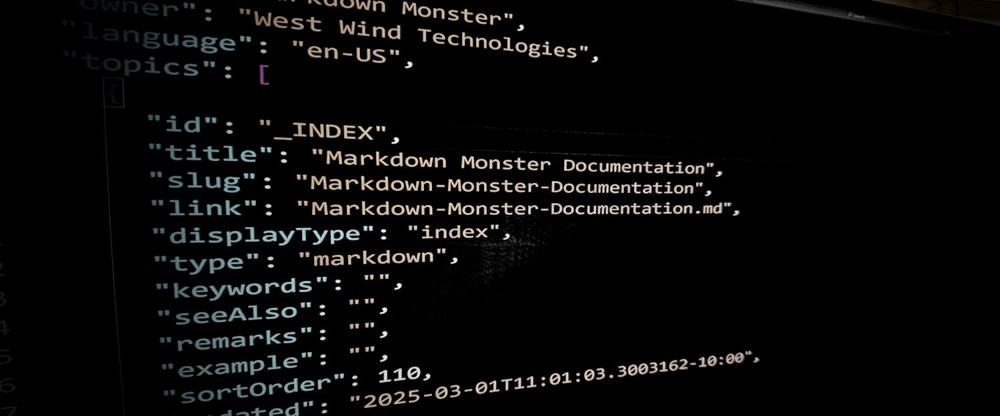
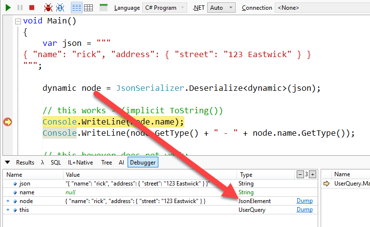

# System.Text.Json Manual Object Traversal



Every few years it seems I'm tempted to move my JSON parsing code to use the new `System.Text.Json` APIs from the older Newtonsoft Json.NET library. Json.NET works fine of course - it's been super reliable and it works with a wide variety of JSON formats and provides a host of features not supported by `System.Text.Json`. But there are advantages to using the newer library which is faster, less resource intensive and - as a library author - can remove an external NuGet dependency.

One of the sticking points with `System.Text.Json` is that the 'dynamic parsing interface' - ie. parsing into an object manually without full object deserialization, is not as nice as the JSON.NET version which has support for dynamic features that allow for more dynamic object traversal. Although the `System.Text.Json.JsonSerializer` has some support for dynamic parsing, unfortunately that feature is pretty much unusable. More on that later.

In this post I go over how you can use the `JsonObject`/`JsonValue`/`JsonArray` interfaces to read arbitrary values from the JSON Hierarchy without having to deserialize an entire object's structure into .NET. It's not particularly complicated, but more verbose than the dynamic JSON.NET syntax.

As is often the case I'm writing this down for my own reference so I can come back to it later and quickly find the nuance of some of the operations related to missing values and type casting. Especially since they are different to what I'm more familiar with JSON.NET.

## JsonSerializer Full Object Deserialization
Let's start briefly by reviewing full object deserialization.

The most common way Json deserialization is done is typically with `System.Text.Json` using the  `JsonSerializer` class to deserialize a JSON string directly into a full object structure with `JsonSerializer.Deserialize<T>()` where T is a .NET type that has to exist.

You would do something like this:  

```csharp
var json = """
{
    "error": {
        "message": "Incorrect API key provided: sk-wp****************************************fKnX.",
        "type": "invalid_request_error",
        "param": null,
        "code": "invalid_api_key"
    }
}
""";

var argh = JsonSerializer.Deserialize<OpenAiErrorResponse>(json);
message = argh.error.message;
```

That works splendidly, except you have to define a C# class hierarchy that maps the Json for this to work first. In this case two objects are needed.

```cs
public class OpenAiErrorResponse        
{
    public OpenAiError error { get; set; }
}

public class OpenAiError
{
    public string message { get; set; }    
    public string code { get; set; }
    // you can skip and add additional props if necessary
}
```

You can of course skip things that you're not interested in, so that's somewhat helpful in keeping the object density to a minimum if you don't need the entire structure.

> ##### Json to C# Classes in Visual Studio
> In case you haven't found this neat Visual Studio feature: Edit -> Paste Special -> Paste as JSON can convert JSON from the clipboard and turn it into C# classes for you:  
> 
> 
> 
> There is a similar feature available in Rider as well.

This works fine for many applications especially if you are consuming APIs where the structure is well known. But there are many use cases where:

* The object structure is not well-known
* The objects are very dense but you only need one or a few values
* The object hierarchy is super deep and you only need a bottom layer

In those situations you likely don't want to create the entire object structure in .NET, just to pull out a few values. Instead you'd want to parse out the values individually using some sort of object traversal API.

## Using the JsonObject/JsonValue APIs to traverse Object Hierarchy
For those scenarios where you just want to pull out a few values, or grab an object far down the hierarchy manual JSON parsing is what you want. You basically just want to point at the elements you're interested in and retrieve those, without deserializing everything along the hierarchy just to get there.

There are a number of ways you can parse objects without full deserialization including a streaming API which I won't discuss here. 

The path of least resistance is to use `JsonObject`/`JsonValue`/`JsonArray` which provides an indexer based API to traverse an object without deserializing it into a .NET type first.

Given the following JSON, here is how you can access properties and nested objects directly:

```csharp
var json ="""
      { 
        "name": "rick", 
        "count": 2,
        "address": { "street": "123 Eastwick" },
        "items": [
         { "id": "1234", "name": "Item 1" },
         { "id": "2345", "name": "Item 2" }
        ]
      }         
      """;

// At the top level use JsonObject
var jRoot = JsonSerializer.Deserialize<JsonObject>(json);   
      
// Get a value via GetValue() 
var name = jRoot["name"]?.GetValue<string>();
Console.WriteLine(name);

int? count = jRoot["count"]?.GetValue<int>();
Console.WriteLine(count);

// Missing elements come up as null (don't throw!)
name = jRoot["namex"]?.GetValue<string>();

// Important: has to be a nullable value in order to 
//            capture missing properties! (ie. int?)
count = jRoot["countx"]?.GetValue<int>();
Console.WriteLine(count);

// Get a nested object and property
var jAddress = jRoot["address"];
var street = jAddress["street"].GetValue<string>();
Console.WriteLine(street);

// Compound Object Hierarchy Syntax
street = jRoot["address"]?["street"]?.GetValue<string>();
Console.WriteLine(street);

// Array Traversal    
var id = jRoot["items"]?[0]?["id"].GetValue<string>();
Console.WriteLine(id);
name = jRoot["items"]?[1]?["name"].GetValue<string>();
Console.WriteLine(name);

// does a property exist?
bool exists = jRoot["name"] != null;
bool exists2 = jRoot["nameX"] != null;   
Console.WriteLine(exists + " " + exists2);
```

The syntax is noisy mainly because you have to explicitly cast each and every value you retrieve. 

Objects and arrays are returned as `JsonObject` and `JsonArray` respectively and *leaf nodes* are returned a `JsonValue` objects. You can retrieve the actual Json value with `GetValue<T>()`.  Because all indexers return either `JsonObject`, `JsonArray` or `JsonValue`  you can continue to chain them together to traverse even very complex hierarchies.

### Null Checking required Everywhere!
However, it's vital that you make sure to check for nulls every step of the way, as any missing value effectively terminates the traversal. The null for missing values also means that all leaf level values returned (ie. `GetValue<T>`) **have to be nullable**, so if you're assigning values to some other structure there is additional logic required to ensure the values are mapped properly to non-nullable properties/fields.

```cs
int? count = jRoot["count"]?.GetValue<int>();

// don't update on null
if (count != null)
   lineItem.Quantity = count.Value;

// alternately assign a default
lineItem.Quantity = count ?? 0;   
```

### Object Deserialization on Individual JsonObject/JsonArray Instances
It's also possible to deserialize individual `JsonObject` or `JsonArray` instances into .NET types, which is useful if you have a complex hierarchy, and only need one or two sub-objects that you're interested in. You can grab individual values or simply deserialize the single child object:

So in the code above I can navigate to address `JsonObject` instance and then deserialize just the address into an `Address` object instance. 

```cs
var address = jAddress.Deserialize<Address>();
Console.WriteLine("Address object: " + address.street + " " + address.city);
```

This can drastically reduce the amount of objects you may have to create just to deserialize data in some cases where the data is not all used.

You can do the same with `JsonArray` instances - you just have to pass in the appropriate enumerated type like `List<Address>` or `Address[]` type.

## What about Dynamic Results in System.Text.Json?
One really nice feature of JSON.NET is that it has a 

So `System.Text.Json` now has *very limited* support for dynamic parsing and in fact it really shouldn't even be available. But there are 
But the syntax to do so is a bit verbose. Here's what this looks like:

```csharp
var json = """
{
  "name": "rick", 
  "address": 
  { 
     "street": "123 Eastwick",
   "streetNumber": 123
  }
}
""";

JsonObject jobj = JsonSerializer.Deserialize<JsonObject>(json);

// Explicit type conversion
string name = jobj["name"].GetValue<string>();
Console.WriteLine(name);

// ToString() works for string values
name = jobj["name"].ToString();
Console.WriteLine(name);

// AsXXX() methods give you specific Json type
JsonObject jaddress = jobj["address"].AsObject();

// GetXXX methods return .NET values
string street = jaddress["street"].GetValue<string>();
Console.WriteLine(street);

int sno = jaddress["streetNumber"].GetValue<int>();
Console.WriteLine(sno);
```

This functionality was introduced with .NET Core 3.0 so it's been around for some time. I'm glad to see that this now works but the syntax for this is... awkward. 

### System.Json.Text has some 'dynamic' Features: Sort of
If you've worked with the Newtonsoft library you probably know that it has a cool feature that lets you [parse Json objects into dynamic types](https://weblog.west-wind.com/posts/2012/Aug/30/Using-JSONNET-for-dynamic-JSON-parsing), which allow you to use natural class syntax to drill into even complex object structures without having to deserialize into a fixed type hierarchy.

To give you an idea why System.Text.Json is awkard.

First off the following using `dynamic` as a serialization result does not work:



You can get a little better with `<ExpandObject>` which sort of works:

```csharp
var json = """
{ "name": "rick", "address": { "street": "123 Eastwick" }, "count": 2 }
""";

dynamic node = JsonSerializer.Deserialize<ExpandoObject>(json);

// this works - (implicit ToString())
Console.WriteLine(node.name);

// types are: ExpandoObject and JsonElement
Console.WriteLine(node.GetType() + " - " + node.name.GetType());

// this however does not work:
string name = node.name;   // BOOM

// this works explicit .ToString()
name = node.name.ToString();
```

This returns an ExpandoObject but the individual nodes return the appropriate 

It gets even more awkward once you start trying to retrieve non string values as you can't just use `ToString()`:

```csharp
// this also doesn't work
//var int = node.count;

// This does: But... AWKWARD!
var el = node.count as JsonElement?;
int count = el.Value.GetInt32();

Console.WriteLine(count);
```

Using `node.count` does not work because the dynamic value that is being retrieved from the ExpandoObject is actually the `JsonElement?` instance. So the only way to retrieve the value is to cast it to `JsonElement?` and then retrieve the proper type using one of the provided interfaces (GetXXX() and TryGetXXX()).

Long story short - there really isn't what qualifies as a reliable 'dynamic' implementation in `System.Json.Text`.

## Setting up JsonSerializerOptions to maximize Json.NET Compatibilty

```cs
var options = new JsonSerializerOptions
	{
#if DEBUG
		WriteIndented = true,
#endif		
		AllowTrailingCommas = true,
		Converters = { new JsonStringEnumConverter() }
	};		
	string json1 = JsonSerializer.Serialize(tobj,options);
	Console.WriteLine(json1);
```	