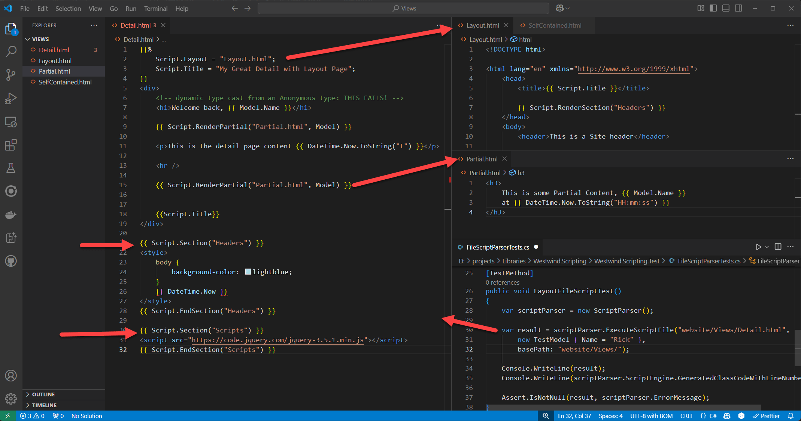

# Updated Scripting Support For Layouts and Sections in Westwind.Scripting

I'm finally breaking down and updating the C# scripting engine in [Westwind.Scripting](https://github.com/RickStrahl/Westwind.Scripting) to support layout pages. I got fed up with trying to shoehorn other script engines (Razor and Liquid Templates) into my templating solutions - Razor especially (both hosted and internal) - after having gone down the wrong path several times now, and running into complications that were a pain to resolve and hack around.

I like the idea of having a fully self-contained solution that is easily portable and not dependent on the whims of some big scripting environment or engine like Razor that also doesn't edit very well outside of anything but . NET dev IDEs. I've been through this shit one to many times :smile:

I created Westwind.Scripting originally 20 years ago, and it's gone through many iterations as the compiler technology in .NET has changed. A few years back I updated the library to support the latest Roslyn compilation APIs and at the time also added a new `ScriptParser` class for script template parsing and execution.

If you want more information on Westwind.Scripting and some detailed background on how it works and how Roslyn compilation in general can be integrated into applications, here are a few links:

* [Westwind.Scripting on GitHub](https://github.com/RickStrahl/Westwind.Scripting)
* [Template Script Expansion in Westwind.Scripting](https://github.com/RickStrahl/Westwind.Scripting/blob/master/ScriptAndTemplates.md)
* [Deep Dive on Westwind Scripting inner Workings](https://weblog.west-wind.com/posts/2022/Jun/07/Runtime-CSharp-Code-Compilation-Revisited-for-Roslyn)  <small>*(original release blog post)*</small>

## What is Westwind.Scripting and what do I use it for?
Westwind.Scripting is a C# runtime compilation and execution library to support relatively simple runtime code execution and scripting in .NET applications. It's gone through several major iterations as the .NET compiler technologies and platforms have changed, with the latest iteration running on Roslyn. One nice thing about this library is that it has over the years mostly abstracted the underlying technology so the engine's API has not changed much (other than dependencies) resulting in much smoother update paths as the underlying technology invariably changes.

The library also includes a [Template Scripting parser](https://github.com/RickStrahl/Westwind.Scripting/blob/master/ScriptAndTemplates.md) in the form of the `ScriptParser` class that uses Handlebars like syntax (`{{ expr}}` and `{{% code block }}`) to expands C# code into templates that are compiled into .NET code and executed. 

I specifically use the dynamic execution feature in Markdown Monster for the Snippet Template Expansions and Commander Scripting Addins which both allow users to extend the functionality of Markdown Monster with [dynamic text expansions in Snippets addin](https://markdownmonster.west-wind.com/docs/_5gs0uc49h.htm), and [application automation via the Commander addin](https://github.com/RickStrahl/Commander-MarkdownMonster-Addin). The Snippets expansion uses the `ScriptParser` template expansion to mix text with expressions and code to produce embeddable text. The latter use pure code snippet execution to perform automation tasks.

##AD##

## Add a Missing Feature: Layout/Master Pages
The original version of scripting library only supported single template execution meaning you could provide a string or file as a template to execute. The code in the template would be parsed and executed. In addition there was also support for `{{ Script.RenderPartial("partial.html") }}` to pull in additional scripts that are separately executed.

What's missing - compared to classic ASP.NET and Razor - has been Layout or Master pages that serve as a top level container into which content pages can render. While it's possible to achieve something similar with heavy use of partials, it's a lot easier to create a top level site layout and then render specific content into it. This is especially useful for any sort of documentation where the 'site' chrome never changes between pages except for the content and perhaps a few headers on the page. Layout pages make these types of layouts much simpler.

So the latest version of Westwind.Scripting now has support for this feature. Here's a screen cap that tries to put it all into a single shot:

  
<small>**Figure 1** - Content, Layout, Sections and Partials using Handlebars syntax</small>

Of course this is nothing new and the concepts are borrowed from Razor or ASP.NET classic pages (and probably other template engines). 

### Not meant to replace Razor!
I want be clear: I'm not pitching this as a replacement for Razor or any other Web script engine. For pure Web applications that need scripting Razor is a great solution, especially when you pair it with editor tooling that provides the complex syntax coloring and auto-complete.

But Razor falls short for me is when building non-Web applications that need templating or even HTML output generation. When it comes to running outside of ASP.NET - you end up with a dependency on the ASP.NET Runtimes, and hosting Razor outside of ASP.NET is a pain in the ass. It's possible and there are libraries that do this, but there are limitations and differences from how Razor works,  and requirements to keep the library up to date. Been there done that with my `Westwind.RazorEngine` pre-.NET Core. The hoops that had to be jumped through to keep that thing up to date was horrible. .NET Core is better, but there are still many potential pitfalls and yak shaving shit you have to deal with with Razor externally hosted. It's a shame Microsoft didn't do a better job with providing this functionality in an easier way that's not so tightly integrated with ASP.NET Core's infrastrucure (although I can understand why since this is an more of an edge case).

The Westwind.Scripting ScriptParser is primarily meant for offline applications rather than Web applications although it also works for Web applications, but unless you need to share the scriping between an offline and online application, for pure Web applications Razor is the better choice.

### What do you use it for?
So the Script Parser tends to be used for offline applications. Here are some usecases that I use it for:

* Documentation Html Generation - templates with doc content mixed in
* String Template expansion in the Markdown Monster editor
* Mail Merge for software releases (offline)
* Non UI Text Merging in Web apps (think confirmations, emails etc.)  
<small>*(doable with Razor but it's a PITA)*</small>