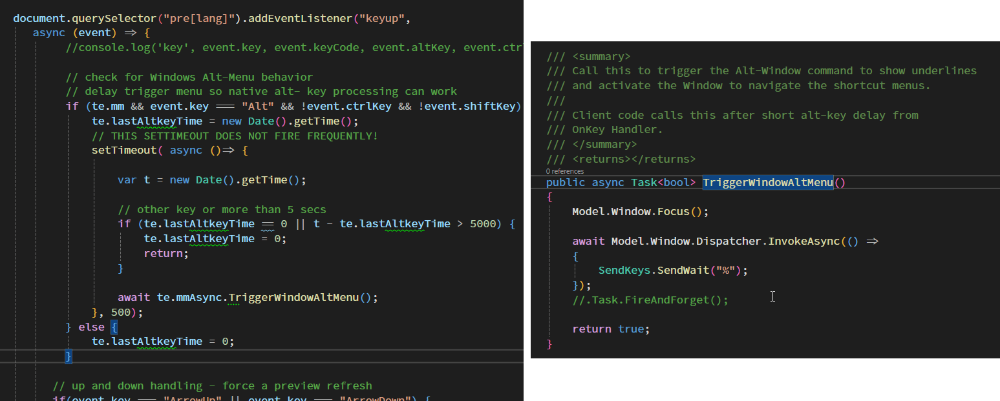

# Using the new WebView2 Input To Host Mapping Feature

The WebView2 control is a complex beast and when you're building hybrid to Desktop/Web applications that do serious interaction between a WebView2 control and a Desktop application, you're going to find that there are a lot of areas where the keyboard and focus behavior is not as natural as you want it to be. Probably the most glaring example of this for me in [Markdown Monster](https://markdownmonster.west-wind.com) has been key forwarding and specifically in handling the main menu accelerators.

Markdown Monster is a Markdown editor that uses a JavaScript based editor control, running in a WebView.  The editor control that interacts in a million ways with the WPF desktop interface primarily from .NET into the JavaScript editor, but also with some operations in the JS code triggering the WPF .NET UI and content updates from the editor. There are tons of operations like popping up context menus, hot keys that trigger operations in the WPF app and so on. 

For the most part this all works fine with most editor operations handled internally in the editor. So navigation keys and plain text input is all managed in the JS code. The WebView natively also supports forwarding many keyboard operations albeit after the WebView has a go at it, which may or may not be the behavior you want. But it's tricky - some key events don't forward to WPF because the browser overrides them or in some cases they are not triggered quite in the same way as 'native' keys would trigger in WPF controls. 

What this means is that there's a lot of custom key handling to override default key behavior and some trial and error to figure whether keys need to be handled in JavaScript or in WPF.  😏 

Regardless it mostly all works, but it's been a journey. Wven with all the trial and error and intricacies there have always been a few things that didn't work very well.

One thing in particular up until now: I hadn't been able to correctly handle the **main window menu accelerator keys** in the WPF Window host. Accelerators are those 'highlighted' keys on buttons or the main application menu, which based on Windows conventions should activate when you press the `Alt` key. In any 'normal' Windows application pressing `Alt` forces focus into the main menu bar, which in turn shows these accelerators like this:


<small>**Figure 1** - Accelerator keys show as underlines in menus and buttons and are typically triggered by pressing `alt` in the related context. Here `alt-t` brings up the Tools menu. Note the underlines in the main menu and submenu.</small>

## The old Hack
Prior to the `AllowInputToHostMapping` feature, that didn't work by default and I had to resort to some ugly work arounds that try to intercept alt-key presses and then use specific timing in code to determine whether it's a key combo or whether it's treated like an accelerator key and then manipulate focus explicitly and forward keys into WPF. It worked - but very badly. Alt-key combos often failed to activate the menu, or the menu would activate but required another hit of Alt to actually activate properly. 

It's some nasty code:



... and even with all of that it doesn't even work very well.

## WebView Focus Context is Internal
The reason for all of this is that by default **the WebView control by default handles key events internally** and maintains focus internally. By default focus in the WebView control stays inside of the control unless you explicitly click outside of it into another control. For a lot of scenarios that is actually the behavior you want - you don't want all events or even keystrokes bleed outside of the WebView. Focusing out adds overhead and also can easily cause weird side effects where common browser operations trigger both in the browser and then also in the host.

Instead the WebView lets you handle events in JavaScript code, the WebView Shell (ie. things like Ctrl-F Find, Ctrl-R Refresh etc.) and then the .NET Wrapper exposes some of the events into the WPF host via the control wrapper. This works reasonably well for most things although it does mean if you need specific key sequences and shortcuts to work, you're likely going to have to build handlers both in JavaScript and in WPF. 

For example, in Markdown Monster I have a ton of keyboard shortcuts that are user customizable, and those are configured through a KeyBindingManager which is configurable and has options to define where a particular key is handled:

* In JavaScript Code via Command Name
* In .NET Via an Command object
* In some rare cases both

If this sounds extreme - it is due to the nature of this application which is highly customizable and because it's an editor it explicitly deals with many custom key combinations. Figuring out what to handle where is a bit of trial and error. 
  
Generally speaking if you control the Html page, handling events in JavaScript is preferable as that's the fastest way to handle events. Calling into .NET is not exactly slow, but it does have more overhead than just running native JavaScript code and in my case calling editor APIs directly, rather than round tripping into .NET to something similar. So raw text operations are handled in the JS code typically while complex or UI or input output related operations typically run in .NET handlers.

For most hybrid applications this isn't a huge issue because you likely just have a few keyboard operations - if any - that need to be explicitly handled.

But one thing that almost every hybrid app has to deal with is the Main Menu handling, which is as described above is definitely not well behaved from within a WebView.

## Enter CoreWebView2ControllerOptions.AllowHostInputProcessing
As of WebView .NET SDK `1.0.3351` and WebView runtime `1.0.1901.177` you can now have more of keyboard and mouse events bleed into WPF. This specifically fixes the default behavior of the Main Menu accelerator keys in Windows.

But it doesn't come without caveats, especially if you've been handling keys the way that it has been working. Specifically `AllowHostInputProcessing` intercepts keys **before they hit the WebView Control**, which means that some Windows/WPF default behaviors now end up overriding keys in the WebView. I'll have more on that a little bit later. Suffice it to say there are 'issues' you'll likely have to deal with, especially if you've handled keys based on the old behavior with WebView first key processing as was necessary before.

To enable the new `AllowHostInputProcessing` behavior, requires that you configure the `CoreWebView2ControllerOptions.AllowHostInputProcessing` which needs to be set up during the WebView environment setup. It's not very obvious as it's part of the WebView Environment setup which is optional - most applications probably don't do this by default.

I'm going to demonstrate this as part of a helper function (part of the [Westwind.WebView library](https://github.com/RickStrahl/Westwind.WebView)) as that shows the entire process and is probably a good way in general to instantiate an interactive .NET/JS based WebView control. This helper uses a shared WebView environment so that multiple controls in the same application all share the same WebView environment without having to explicit configure each one. 

The helper method does the following:

* Sets up a new WebView Environment in a specified (shared) path
  <small>*(important because deploy folders often don't allow writing which breaks initialization)*</small>
* Reuses a previously created environment
* If `allowHostInputProcessing` is passed sets it on the environment
* Calls and awaits the WebView Initialization (ensure that CoreWebView2 is available)

Here's this that wraps all this busy work into an easy to use function (part of [Westwind.Webview](https://github.com/RickStrahl/Westwind.WebView) source [on GitHub](https://github.com/RickStrahl/Westwind.WebView/blob/master/Westwind.WebView/Wpf/CachedWebViewEnvironment.cs))

```csharp
public async Task InitializeWebViewEnvironment(WebView2 webBrowser,
            CoreWebView2Environment environment = null, 
            string webViewEnvironmentPath = null, 
            bool allowHostInputProcessing = false)
{
    try
    {
        if (environment == null)
            environment = Environment;

        if (environment == null)
        {
            // lock
            await _EnvironmentLoadLock.WaitAsync();

            if (environment == null)
            {
                var envPath = webViewEnvironmentPath ?? Current.EnvironmentFolderName;
                if (string.IsNullOrEmpty(envPath))
                    Current.EnvironmentFolderName = Path.Combine(Path.GetTempPath(),
                        Path.GetFileNameWithoutExtension(Assembly.GetEntryAssembly().Location) + "_WebView");

                // must create a data folder if running out of a secured folder that can't write like Program Files
                environment = await CoreWebView2Environment.CreateAsync(userDataFolder:  EnvironmentFolderName,
                    options: EnvironmentOptions);

                Environment = environment;
            }

            _EnvironmentLoadLock.Release();
        }

        // *** THIS HERE ***
        if (allowHostInputProcessing)
        {
            var opts = Environment.CreateCoreWebView2ControllerOptions();
            opts.AllowHostInputProcessing = true;                    
            await webBrowser.EnsureCoreWebView2Async(environment, opts);
        }
        else
            await webBrowser.EnsureCoreWebView2Async(environment);
    }
    catch (Exception ex)
    {
        throw new WebViewInitializationException($"WebView EnsureCoreWebView2AsyncCall failed.\nFolder: {EnvironmentFolderName}", ex);
    }
}
```


